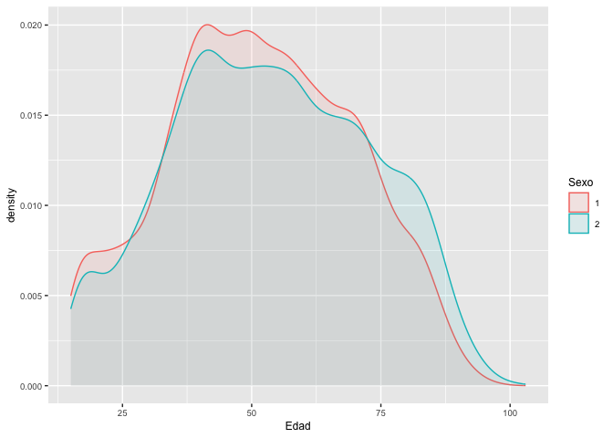
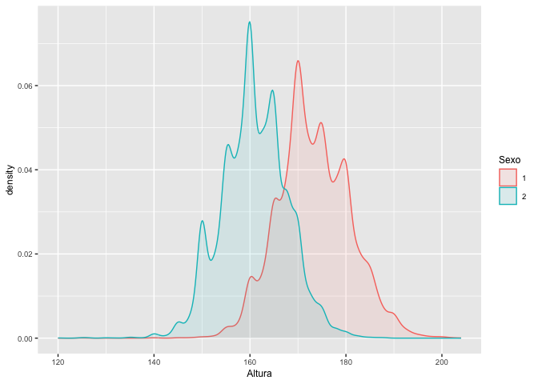
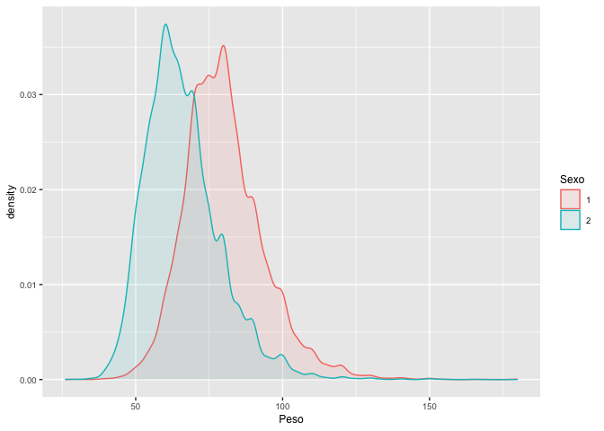
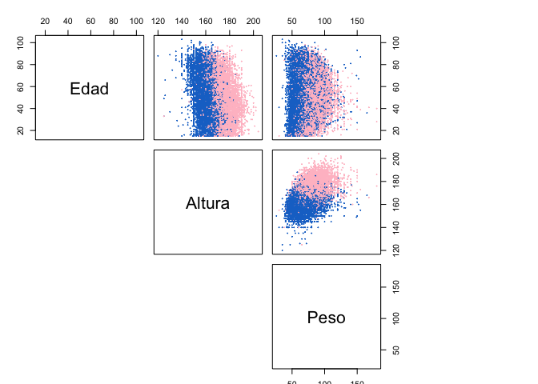
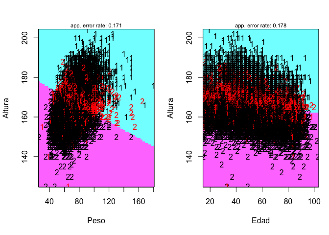
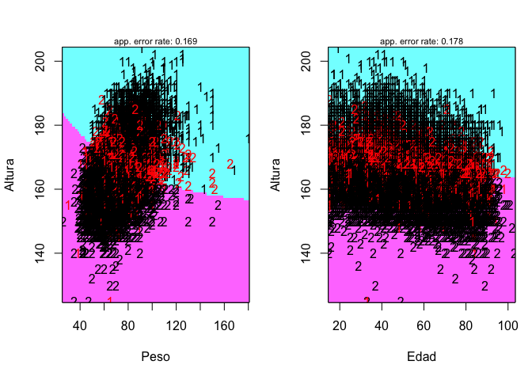
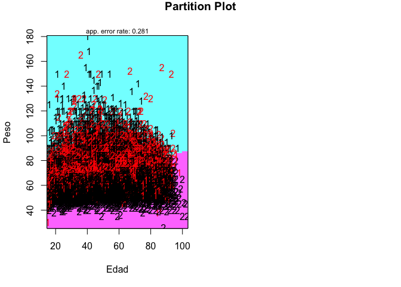

# Introducción

## dataset

En este cuaderno vamos a analizar el dataset llamado
[*salud.xlsx*](https://github.com/davidperezros/ine_sg_difusion_explica_datasets/blob/22dae354d6584ce610fe2ea3ed6d19f25206581f/Datasets/salud.xlsx).
Este contiene microdatos relativos a la **Encuesta Nacional de Salud.
Resultados**. Concretamente, datos correspondientes al año 2017. Las
variables de interés son las siguientes:

-   **EDAD**: Identificación del adulto seleccionado: Edad.
-   **SEXO**: Identificación del adulto seleccionado: Sexo.
-   **Altura**: Altura en cm.
-   **Peso**: Peso en kg.

El objetivo de este estudio será aplicar un Análisis **Discriminante**
para intentar clasificar el sexo de la población a partir del resto de
variables.

``` r
# Librerias
library(readxl) # Para leer los excels
library(dplyr) # Para tratamiento de dataframes
library(ggplot2) # Nice plots
library(caret) # For data paratition
library(MASS) # funciones lda() y qda()
library(klaR) # partimat
```

Cargamos entonces el conjunto de datos:

``` r
datos <- read_excel("/Users/davpero/ine_sg_difusion_explica_datasets/Datasets/salud.xlsx", sheet = "Datos")
```

## Descripción del trabajo a realizar

**(Esto irá en la web de explica)** Se pretende hacer un Análisis de
Discriminante empleando los procedimientos de LDA (Análsis de
Discriminante Lineal) y QDA (Análisis de Discriminante Cuadrático).

-   Hacer un análisis exploratorio. Ver si las variables separan bien
    las clases.
-   Convertir a factor la variable respuesta.
-   Realizar una partición de datos Train/Test.
-   Fijar semilla cuando se usen números aleatorios (para la
    reproductividad).
-   Ejecutar algoritmos lda/qda y evaluar su bondad.

# Análisis de Discrminante: LDA y QDA

## Introducción

El análisis discriminante es una técnica estadística utilizada para
clasificar observaciones en grupos o categorías predefinidas en función
de un conjunto de variables predictoras.

El objetivo principal es identificar las características o variables que
mejor distinguen entre diferentes grupos conocidos. Es una técnica de
**aprendizaje supervisado**, lo que significa que requiere un conjunto
de datos etiquetado con información sobre las categorías o grupos a los
que pertenecen las observaciones.

El análisis discriminante se puede dividir en dos tipos principales:

-   **Análisis Discriminante Lineal (LDA)**: LDA asume que las variables
    predictoras tienen una distribución normal y que las matrices de
    covarianza de las variables predictoras son iguales para todos los
    grupos. LDA busca un hiperplano (o límite de decisión) que maximice
    la distancia entre las medias de los grupos y minimice la varianza
    dentro de cada grupo. Debido a la asunción de igual covarianzas, los
    **hiperplanos que separan las clases son lineales**.

-   **Análisis Discriminante Cuadrático (QDA)**: QDA relaja la
    suposición de igualdad de matrices de covarianza y permite que cada
    grupo tenga su propia matriz de covarianza. Esto hace que QDA sea
    más flexible pero también requiere más datos para estimar las
    matrices de covarianza para cada grupo. Los hiperplanos que separan
    las clases son **cuadráticos**.

## Análisis Exploratorio (EDA[1])

Veamos un resumen de los datos y si hay algún NA para
quitarlo/imputarlo.

``` r
datos$Edad  <- as.numeric(datos$Edad)
datos$Altura  <- as.numeric(datos$Altura )
datos$Peso  <- as.numeric(datos$Peso)
summary(datos)
```

    ##       Edad            Sexo               Altura           Peso       
    ##  Min.   : 15.00   Length:23089       Min.   :120.0   Min.   : 26.00  
    ##  1st Qu.: 39.00   Class :character   1st Qu.:160.0   1st Qu.: 62.00  
    ##  Median : 52.00   Mode  :character   Median :166.0   Median : 71.00  
    ##  Mean   : 52.84                      Mean   :166.7   Mean   : 72.66  
    ##  3rd Qu.: 67.00                      3rd Qu.:173.0   3rd Qu.: 81.00  
    ##  Max.   :103.00                      Max.   :204.0   Max.   :180.00  
    ##  NA's   :1070                        NA's   :1070    NA's   :1070

``` r
sum(is.na(datos))
```

    ## [1] 4280

Ahora grafiquemos los histogramas de las variables distinguiendo entre
variable respuesta a ver si alguno de ellos parece separar bien las
variables y por tanto es susceptible de que funcione luego bien en
LDA/QDA.

Vamos a dibujar las denisdades de las variables distinguiendo entre las
clases de la variable respuesta para ver si alguna de las variables
permite una clara separación entre variables.

``` r
library(ggplot2)
ggplot(datos, aes(Edad)) +
  geom_density(aes(group = Sexo, colour = Sexo, fill = Sexo), alpha = 0.1)  +
  theme(text = element_text(size = 9))
```



``` r
library(ggplot2)
ggplot(datos, aes(Altura)) +
  geom_density(aes(group = Sexo, colour = Sexo, fill = Sexo), alpha = 0.1)  +
  theme(text = element_text(size = 9))
```



``` r
library(ggplot2)
ggplot(datos, aes(Peso)) +
  geom_density(aes(group = Sexo, colour = Sexo, fill = Sexo), alpha = 0.1)  +
  theme(text = element_text(size = 9))
```



Como cabía esperar, la variable edad no discrimina bien el sexo de una
persona debido a que no hay una relación directa. Sin embargo, tanto en
las variables peso como altura se observa como la clase 1 (hombres)
muestran valores más altos que las mujeres en ambas variables. Esto
puede ser un buen indicador a la hora de discriminar.

Veamos ahora en 2D las clasificaciones y observamos que hay buenas
discriminaciones, luego todo nos hace pensar que los métodos de después
funcionarán bastante bien.

``` r
datos$Sexo <- as.factor(datos$Sexo)
Label <- datos$Sexo
colo <- c("pink", "#1874CD")[Label]
X <- datos[, c(1,3:4)]
pairs(X, main = "Diabetes data set", pch = 20, col = colo, lower.panel = NULL, cex = 0.2, oma = c(1, 3, 3, 15))
```



**MUY IMPORTANTE CONVERTIR LA VARIABLE RESPUESTA A FACTOR** ya que
representa dos clases, es decir, es una variable cualitativa.

``` r
datos$Sexo <- as.factor(datos$Sexo)
```

## Partición de datos

Para evitar el **overffiting** debido a que el modelo se ha entrenado
demasiado con los datos proporcionados, vamos a realizar una partición
de datos y una vez entrenado el modelo, lo evaluaremos con la partición
segunda.

Para ello usamos la función `caret::createDataPartition()` que nos
permite mantener la proporción de la variable binaria respuesta. En caso
de no usar esta función podriamos estar dejando en la partición de
entreno observaciones con la misma variable respueta y dejar la clase
minoritaria infrarepresnetada, lo que podría incurrir en un mal ajsute
del modelo para dicha clase.

``` r
set.seed(785248) # For Reproducibility
spl <- createDataPartition(datos$Sexo, p = 0.75, list = FALSE) # 75% for training
saludTrain <- datos[spl, ]
saludTest <- datos[-spl, ]
```

## Análisis de Discriminante Lineal (LDA)

Como se ha comentado previamente:

-   Se supone que la distribución de los datos es una **normal
    multivariante.**
-   Supone que todas las **matrices de covarianzas son iguales** ( y por
    tanto el clasificador es lineal).

``` r
set.seed(785248) # For Reproducibility

lda.class.salud <- lda(Sexo ~ Altura + Peso + Edad , data = saludTrain)
# qda.class.diabetes

plot <- partimat(Sexo ~ Altura + Peso + Edad , data = saludTrain, method = "lda")
```



``` r
set.seed(785248)

# predict with the lda model and test data
pred.lda <- predict(lda.class.salud, saludTest)$class

# confusion matrix
confusionMatrix(pred.lda, saludTest$Sexo)
```

    ## Confusion Matrix and Statistics
    ## 
    ##           Reference
    ## Prediction    1    2
    ##          1 2072  411
    ##          2  507 2514
    ##                                          
    ##                Accuracy : 0.8332         
    ##                  95% CI : (0.8231, 0.843)
    ##     No Information Rate : 0.5314         
    ##     P-Value [Acc > NIR] : < 2.2e-16      
    ##                                          
    ##                   Kappa : 0.6644         
    ##                                          
    ##  Mcnemar's Test P-Value : 0.001716       
    ##                                          
    ##             Sensitivity : 0.8034         
    ##             Specificity : 0.8595         
    ##          Pos Pred Value : 0.8345         
    ##          Neg Pred Value : 0.8322         
    ##              Prevalence : 0.4686         
    ##          Detection Rate : 0.3765         
    ##    Detection Prevalence : 0.4511         
    ##       Balanced Accuracy : 0.8314         
    ##                                          
    ##        'Positive' Class : 1              
    ## 

-   **Exactitud (Accuracy)**: La exactitud del modelo es del 83%, lo que
    significa que el modelo clasificó correctamente aproximadamente el
    83% de las instancias en el conjunto de prueba.

-   **Sensibilidad (Sensitivity o Recall)**: La sensibilidad del modelo
    para la clase 0 es del 80%, lo que indica que el modelo identificó
    correctamente alrededor del 80% de las instancias de la clase 0 en
    el conjunto de prueba.

-   **Especificidad (Specificity)**: La especificidad del modelo para la
    clase 1 es del 85%, lo que significa que el modelo identificó
    correctamente alrededor del 85% de las instancias de la clase 1 en
    el conjunto de prueba.

En general, estos resultados muestran que el modelo LDA tiene un
rendimiento bueno en la clasificación de las instancias en el conjunto
de prueba, con una exactitud y un kappa significativos.

## Análisis de Discriminante Cuadrático

Como se ha comentado previamente:

-   Se supone que la distribución de los datos es una **normal
    multivariante**.
-   **NO** supone que todas las **matrices de covarianzas son iguales**
    ( y por tanto el clasificador es cuadrático y no lineal).
-   Método **muy inestable a menos que** tengamos muestras muy grandes y
    de dimensiones bajas.

Es más inestable debido a que al permitir que cada grupo tenga su propia
matriz de covarianza, aunque lo que lo hace más flexible, requiere
muchos más datos para estimar las matrices de covarianza para cada
grupo.

``` r
set.seed(785248) # For Reproducibility

qda.class.salud <- qda(Sexo ~ Altura + Peso + Edad , data = saludTrain)
# qda.class.diabetes

plot <- partimat(Sexo ~ Altura + Peso + Edad , data = saludTrain, method = "qda")
```



``` r
set.seed(785248)

# predict with the lda model and test data
pred.qda <- predict(qda.class.salud, saludTest)$class

# confusion matrix
confusionMatrix(pred.qda, saludTest$Sexo)
```

    ## Confusion Matrix and Statistics
    ## 
    ##           Reference
    ## Prediction    1    2
    ##          1 2068  412
    ##          2  511 2513
    ##                                           
    ##                Accuracy : 0.8323          
    ##                  95% CI : (0.8222, 0.8421)
    ##     No Information Rate : 0.5314          
    ##     P-Value [Acc > NIR] : < 2.2e-16       
    ##                                           
    ##                   Kappa : 0.6625          
    ##                                           
    ##  Mcnemar's Test P-Value : 0.001257        
    ##                                           
    ##             Sensitivity : 0.8019          
    ##             Specificity : 0.8591          
    ##          Pos Pred Value : 0.8339          
    ##          Neg Pred Value : 0.8310          
    ##              Prevalence : 0.4686          
    ##          Detection Rate : 0.3757          
    ##    Detection Prevalence : 0.4506          
    ##       Balanced Accuracy : 0.8305          
    ##                                           
    ##        'Positive' Class : 1               
    ## 

-   **Exactitud (Accuracy)**: La exactitud del modelo es del 83%, lo que
    significa que el modelo clasificó correctamente aproximadamente el
    83% de las instancias en el conjunto de prueba.

-   **Sensibilidad (Sensitivity o Recall)**: La sensibilidad del modelo
    para la clase 0 es del 80%, lo que indica que el modelo identificó
    correctamente alrededor del 80% de las instancias de la clase 0 en
    el conjunto de prueba.

-   **Especificidad (Specificity)**: La especificidad del modelo para la
    clase 1 es del 85%, lo que significa que el modelo identificó
    correctamente alrededor del 85% de las instancias de la clase 1 en
    el conjunto de prueba.

**Comparando** estos resultados con los del modelo LDA, observamos ambos
modelos tienen una exactitud, sensibilidad y valor predictivo negativo
parecidos.

# Conclusiones

En el presente estudio se ha visto como poder clasificar el Sexo de
individuos en sus respectivas clases, de acuerdo a variables de edad,
altura y peso. Se ha certificado que esto es posible y que la variable
Edad no tiene sentido incluirla ya que en función de la Edad de una
persona no es posible clasificar su sexo.Estos hechos han permitido
discriminar bastante bien la variable respuesta mediante modelos de
Análisis de Discriminante Lineal y Cuadrático.

[1] EDA viene del Inglés *Exploratory Data Analysis* y son los pasos
relativos en los que se exploran las variables para tener una idea de
que forma toma el dataset.
