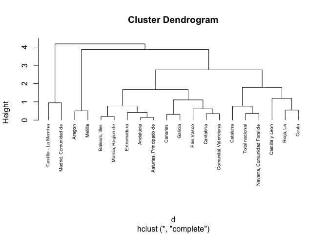
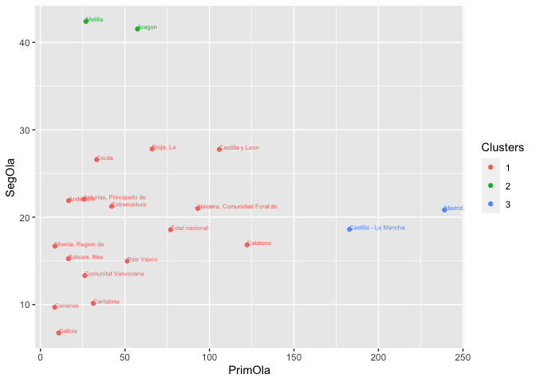

# Introducción

## dataset

En este cuaderno vamos a analizar el dataset llamado
[*VarCovid*](https://github.com/davidperezros/ine_sg_difusion_explica_datasets/blob/0c24c4e30aaeab265e937150d1470102c61e62ac/Datasets/VarCovid.xlsx).
Este contiene datos relativos a las Tasas de Variación de fallecidos en
el año 2020 (Año Covid) respecto al año anterior. Los datos han sido
extraidos de la **Operación** 30324 Estimación de Defunciones Semanales
(EDeS), que se encuentra dentro de la temática Salud (Sociedad).
Concretamente en este dataset tenemos las siguientes variables:

-   **ccaa**: Comunidades Autónomas
-   **2020SM20**: Tasa de variación del acumulado hasta la semana 20
    incluida del año 2020 respecto al año anterior en ese mismo periodo.
-   **2020SM53**: Tasa de variación del acumulado hasta la semana 53
    incluida del año 2020 respecto al año anterior en ese mismo periodo.
-   **1Ola**: Tasa de variación entre el acumulado entre la semana 11 de
    2020 y la semana 18, ambas incluidas, respecto a las mismas semanas
    del año anterior. Tiempo correspondiente a la primera ola
-   **2Ola**: Tasa de variación entre el acumulado entre la semana 32 de
    2020 y la semana 49, ambas incluidas, respecto a las mismas semanas
    del año anterior. Tiempo correspondiente a la segunda ola.
-   **3Ola**: Tasa de variación entre el acumulado entre la semana 51 de
    2020 y la semana 10 de 2021, ambas incluidas, respecto a las mismas
    semanas del año anterior. Tiempo correspondiente a la tercera ola.

El objetivo de este estudio será aplicar un Análisis **Cluster** para
hacer grupos de comunidades autónomas en función de las variables
**1Ola** y **2Ola**. Concretamente usaremos un cluster jerárquico.

``` r
# Librerias
library(readxl) # Para leer los excels
```

Cargamos entonces el conjunto de datos:

``` r
datos <- read_excel("/Users/davpero/ine_sg_difusion_explica_datasets/Datasets/VarCovid.xlsx", sheet = "Datos")
```

``` r
# Carga de librerías y datos
library(dendextend)

# Lectura de datos

# Preparación de los datos
resultado <- datos[, c("1Ola", "2Ola")]
comunidades <- datos$ccaa

# Dendrograma
W <- hclust(dist(resultado), method = "single")
dendrograma <- as.dendrogram(W)
dendrograma <- set(dendrograma, "labels", comunidades)

plot(dendrograma, horiz = TRUE)
abline(v = 30, col = "red", lty = 2)
title("Dendrograma")
```



``` r
# Matriz de distancias
distancias <- dist(resultado)
matriz_distancias <- as.matrix(distancias)
df <- as.data.frame(matriz_distancias)
rownames(df) <- comunidades
colnames(df) <- comunidades
print(df)
```

    ##                             Total nacional  Andalucia    Aragon
    ## Total nacional                     0.00000  60.392967  30.13617
    ## Andalucia                         60.39297   0.000000  45.27665
    ## Aragon                            30.13617  45.276654   0.00000
    ## Asturias, Principado de           51.46443   8.956215  37.32888
    ## Balears, Illes                    60.49376   6.652060  48.61873
    ## Canarias                          69.10521  14.720323  58.46101
    ## Cantabria                         46.49430  18.723003  40.90141
    ## Castilla y Leon                   30.27120  89.335304  50.27326
    ## Castilla - La Mancha             105.92620 166.259641 127.50989
    ## Cataluna                          45.29941 105.688672  69.32363
    ## Comunitat Valenciana              50.99026  12.860988  42.07870
    ## Extremadura                       34.94977  25.462408  25.43930
    ## Galicia                           67.22371  16.250030  58.21126
    ## Madrid, Comunidad de             162.09562 222.383523 182.76373
    ## Murcia, Region de                 68.40886   9.617691  54.83318
    ## Navarra, Comunidad Foral de       16.27645  76.400296  41.10120
    ## Pais Vasco                        25.92184  35.316878  27.27651
    ## Rioja, La                         14.34048  49.690557  16.16873
    ## Ceuta                             44.37380  17.307882  28.38877
    ## Melilla                           55.44023  22.928204  30.55837
    ##                             Asturias, Principado de Balears, Illes   Canarias
    ## Total nacional                            51.464430      60.493758  69.105214
    ## Andalucia                                  8.956215       6.652060  14.720323
    ## Aragon                                    37.328875      48.618729  58.461008
    ## Asturias, Principado de                    0.000000      11.329372  21.169364
    ## Balears, Illes                            11.329372       0.000000   9.845429
    ## Canarias                                  21.169364       9.845429   0.000000
    ## Cantabria                                 13.167417      15.538122  22.812382
    ## Castilla y Leon                           80.390678      90.117245  99.036520
    ## Castilla - La Mancha                     157.309955     166.362865 174.687407
    ## Cataluna                                  96.753326     105.680773 114.023339
    ## Comunitat Valenciana                       8.757223       9.873109  18.178770
    ## Extremadura                               16.518977      26.250172  35.611566
    ## Galicia                                   21.312560      10.275082   3.773931
    ## Madrid, Comunidad de                     213.429613     222.552376 230.881621
    ## Murcia, Region de                         17.862898       8.108826   6.991091
    ## Navarra, Comunidad Foral de               67.448401      76.712385  85.378719
    ## Pais Vasco                                26.635253      34.732922  43.185681
    ## Rioja, La                                 40.790956      51.010562  60.352898
    ## Ceuta                                      8.941756      20.239707  30.085082
    ## Melilla                                   20.395376      29.066657  37.572724
    ##                              Cantabria Castilla y Leon Castilla - La Mancha
    ## Total nacional               46.494299        30.27120            105.92620
    ## Andalucia                    18.723003        89.33530            166.25964
    ## Aragon                       40.901415        50.27326            127.50989
    ## Asturias, Principado de      13.167417        80.39068            157.30995
    ## Balears, Illes               15.538122        90.11724            166.36287
    ## Canarias                     22.812382        99.03652            174.68741
    ## Cantabria                     0.000000        76.61905            151.88787
    ## Castilla y Leon              76.619049         0.00000             77.62487
    ## Castilla - La Mancha        151.887870        77.62487              0.00000
    ## Cataluna                     91.237147        19.72592             60.68604
    ## Comunitat Valenciana          5.916654        80.86107            156.73517
    ## Extremadura                  15.541191        64.02102            140.79775
    ## Galicia                      20.731588        97.31374            172.51134
    ## Madrid, Comunidad de        208.079468       133.41845             56.19715
    ## Murcia, Region de            23.581972        97.85347            174.31983
    ## Navarra, Comunidad Foral de  62.764488        14.43009             89.86382
    ## Pais Vasco                   20.626092        55.99318            131.64749
    ## Rioja, La                    38.992627        39.80536            117.25089
    ## Ceuta                        16.577694        72.49317            149.78078
    ## Melilla                      32.550602        80.24244            157.78263
    ##                              Cataluna Comunitat Valenciana Extremadura
    ## Total nacional               45.29941            50.990258    34.94977
    ## Andalucia                   105.68867            12.860988    25.46241
    ## Aragon                       69.32363            42.078704    25.43930
    ## Asturias, Principado de      96.75333             8.757223    16.51898
    ## Balears, Illes              105.68077             9.873109    26.25017
    ## Canarias                    114.02334            18.178770    35.61157
    ## Cantabria                    91.23715             5.916654    15.54119
    ## Castilla y Leon              19.72592            80.861074    64.02102
    ## Castilla - La Mancha         60.68604           156.735170   140.79775
    ## Cataluna                      0.00000            96.050107    80.23460
    ## Comunitat Valenciana         96.05011             0.000000    17.74156
    ## Extremadura                  80.23460            17.741555     0.00000
    ## Galicia                     111.89832            16.795992    34.52142
    ## Madrid, Comunidad de        116.88174           212.931692   196.92734
    ## Murcia, Region de           113.64932            17.981191    33.84470
    ## Navarra, Comunidad Foral de  29.46786            67.253207    50.94155
    ## Pais Vasco                   70.96160            25.102919    11.11800
    ## Rioja, La                    57.29112            42.314888    24.76945
    ## Ceuta                        89.44216            15.042544    10.29295
    ## Melilla                      98.68948            29.096709    26.05874
    ##                                Galicia Madrid, Comunidad de Murcia, Region de
    ## Total nacional               67.223711            162.09562         68.408859
    ## Andalucia                    16.250030            222.38352          9.617691
    ## Aragon                       58.211261            182.76373         54.833176
    ## Asturias, Principado de      21.312560            213.42961         17.862898
    ## Balears, Illes               10.275082            222.55238          8.108826
    ## Canarias                      3.773931            230.88162          6.991091
    ## Cantabria                    20.731588            208.07947         23.581972
    ## Castilla y Leon              97.313743            133.41845         97.853475
    ## Castilla - La Mancha        172.511343             56.19715        174.319831
    ## Cataluna                    111.898315            116.88174        113.649320
    ## Comunitat Valenciana         16.795992            212.93169         17.981191
    ## Extremadura                  34.521422            196.92734         33.844700
    ## Galicia                       0.000000            228.69002         10.179001
    ## Madrid, Comunidad de        228.690025              0.00000        230.500030
    ## Murcia, Region de            10.179001            230.50003          0.000000
    ## Navarra, Comunidad Foral de  83.495436            145.98605         84.586942
    ## Pais Vasco                   41.331441            187.84199         42.746653
    ## Rioja, La                    59.094341            173.18441         58.487524
    ## Ceuta                        30.027257            205.80274         26.651246
    ## Melilla                      39.136706            213.22727         31.586866
    ##                             Navarra, Comunidad Foral de Pais Vasco Rioja, La
    ## Total nacional                                 16.27645   25.92184  14.34048
    ## Andalucia                                      76.40030   35.31688  49.69056
    ## Aragon                                         41.10120   27.27651  16.16873
    ## Asturias, Principado de                        67.44840   26.63525  40.79096
    ## Balears, Illes                                 76.71239   34.73292  51.01056
    ## Canarias                                       85.37872   43.18568  60.35290
    ## Cantabria                                      62.76449   20.62609  38.99263
    ## Castilla y Leon                                14.43009   55.99318  39.80536
    ## Castilla - La Mancha                           89.86382  131.64749 117.25089
    ## Cataluna                                       29.46786   70.96160  57.29112
    ## Comunitat Valenciana                           67.25321   25.10292  42.31489
    ## Extremadura                                    50.94155   11.11800  24.76945
    ## Galicia                                        83.49544   41.33144  59.09434
    ## Madrid, Comunidad de                          145.98605  187.84199 173.18441
    ## Murcia, Region de                              84.58694   42.74665  58.48752
    ## Navarra, Comunidad Foral de                     0.00000   42.19773  27.90215
    ## Pais Vasco                                     42.19773    0.00000  19.52553
    ## Rioja, La                                      27.90215   19.52553   0.00000
    ## Ceuta                                          59.99740   21.40324  32.70116
    ## Melilla                                        69.52498   36.70719  41.72529
    ##                                  Ceuta   Melilla
    ## Total nacional               44.373798  55.44023
    ## Andalucia                    17.307882  22.92820
    ## Aragon                       28.388773  30.55837
    ## Asturias, Principado de       8.941756  20.39538
    ## Balears, Illes               20.239707  29.06666
    ## Canarias                     30.085082  37.57272
    ## Cantabria                    16.577694  32.55060
    ## Castilla y Leon              72.493171  80.24244
    ## Castilla - La Mancha        149.780782 157.78263
    ## Cataluna                     89.442159  98.68948
    ## Comunitat Valenciana         15.042544  29.09671
    ## Extremadura                  10.292946  26.05874
    ## Galicia                      30.027257  39.13671
    ## Madrid, Comunidad de        205.802740 213.22727
    ## Murcia, Region de            26.651246  31.58687
    ## Navarra, Comunidad Foral de  59.997403  69.52498
    ## Pais Vasco                   21.403240  36.70719
    ## Rioja, La                    32.701163  41.72529
    ## Ceuta                         0.000000  17.06518
    ## Melilla                      17.065181   0.00000

``` r
# Clustering jerárquico
library(stats)
resultado_escalado <- scale(resultado)


clusters <- hclust(dist(resultado), method = "ward.D2")
grupos <- cutree(clusters, k = 3)

# Asignación de clusters a las comunidades
clusters_asignados <- data.frame("Comunidades Autónomas" = comunidades, "Cluster" = grupos)
print(clusters_asignados)
```

    ##          Comunidades.Autónomas Cluster
    ## 1               Total nacional       1
    ## 2                    Andalucia       2
    ## 3                       Aragon       1
    ## 4      Asturias, Principado de       2
    ## 5               Balears, Illes       2
    ## 6                     Canarias       2
    ## 7                    Cantabria       2
    ## 8              Castilla y Leon       1
    ## 9         Castilla - La Mancha       3
    ## 10                    Cataluna       1
    ## 11        Comunitat Valenciana       2
    ## 12                 Extremadura       2
    ## 13                     Galicia       2
    ## 14        Madrid, Comunidad de       3
    ## 15           Murcia, Region de       2
    ## 16 Navarra, Comunidad Foral de       1
    ## 17                  Pais Vasco       2
    ## 18                   Rioja, La       1
    ## 19                       Ceuta       2
    ## 20                     Melilla       2

``` r
# Representación gráfica
plot(resultado_escalado[,1], resultado_escalado[,2], xlab = "Variación interanual durante la primera ola de COVID", ylab = "Variación interanual durante la segunda ola de COVID", main = "Variación interanual de defunciones")

text(resultado_escalado[,1], resultado_escalado[,2], labels = comunidades, pos = 3, col = "black")

points(resultado_escalado[grupos == 1, 1], resultado_escalado[grupos == 1, 2], col = "purple", pch = 19)
points(resultado_escalado[grupos == 2, 1], resultado_escalado[grupos == 2, 2], col = "blue", pch = 19)
points(resultado_escalado[grupos == 3, 1], resultado_escalado[grupos == 3, 2], col = "green", pch = 19)
legend("bottomright", legend = c("Cluster 1", "Cluster 2", "Cluster 3"), col = c("purple", "blue", "green"), pch = 19)
```


## Descripción del trabajo a realizar

**(Esto irá en la web de explica)** Se pretende hacer un Análisis
Cluster empleando el procedimiento Cluster Jerárquico de las **ccaa** en
función a las variables **1Ola** y **2Ola**.

-   Hacer un análisis exploratorio.
-   Plantear diversos modelos según variables incluidas.
-   Compararlos con ANOVA y ROC CURVE.
-   Para el modelo seleccionado, explicar los coeficientes, odds ratio,…

# Análisis Exploratorio (EDA[1])

Lo primero de todo vamos a cargar las librearias necesarias para
ejecutar el resto del código del trabajo:

# Clustering: Cluster Jerárquico

## Introducción

El **Análisis de clúster** es una técnica de aprendizaje no supervisado
que agrupa datos similares en conjuntos, llamados clústeres. El objetivo
es dividir un conjunto de datos en grupos homogéneos, donde los miembros
de cada grupo son más similares entre sí que con los miembros de otros
grupos, según algún criterio de similitud predefinido.

Concretamente, el **Cluster Jerárquico** realiza estos grupos -o
clusters- de manera jerárquica y ascendente, es decir que sucesivamente
van fusionando grupos desde el elemento individual (mayor nivel de
grupos, uno por individuo) hacia arriba.

La **representación** de la jerarquía de clúster se representa por medio
de un **dendograma**, en el que las sucesivas fusiones de las ramas a
los distintos niveles nos informan de las sucesivas fusiones de los
grupos en grupos de superior nivel (mayor tamaño, menor homogeneidad)
sucesivamente:

Los **pasos** conretos del Cluster Jerárquico son:

1.  **Matriz de distancia o similitud**: Se calcula una matriz que mide
    la distancia o similitud entre cada par de observaciones. Algunas de
    las medidas comunes son:
    -   **Euclidiana**: Mide la distancia más corta entre dos puntos en
        un espacio euclidiano. Es útil cuando las dimensiones tienen una
        **escala similar** y se desea tener en cuenta la magnitud
        absoluta de las diferencias.
    -   **Manhattan (o Cityblock)**: Calcula la suma de las diferencias
        absolutas entre las coordenadas de dos puntos. Es útil cuando
        las dimensiones **no están en la misma escala** y se quiere una
        medida robusta a los valores atípicos.
    -   **Gower**: métrica de distancia utilizada específicamente para
        conjuntos de **datos mixtos** que contienen variables numéricas
        y categóricas. Esta distancia tiene en cuenta diferentes tipos
        de variables al calcular la similitud entre dos observaciones.
        Se define como una combinación ponderada de las distancias entre
        variables.
2.  **Fusión de clústeres**: En el enfoque aglomerativo, se fusionan
    gradualmente los clústeres más cercanos según la medida de distancia
    o similitud elegida. Esto nos lleva a la pregunta, ¿Cómo se calcula
    la distancia entre Clusters calcular la distancia o similitud entre
    clústeres en el proceso de agrupamiento jerárquico?. Existen varios
    **métodos de enlace**, destacando:
    -   **Enlace Simple (Single Linkage)**: Calcula la distancia entre
        clústeres como la distancia más corta entre cualquier punto de
        un clúster y cualquier punto del otro clúster. Es sensible a la
        presencia de valores atípicos y al fenómeno del encadenamiento.
    -   **Enlace Completo (Complete Linkage)**: Mide la distancia entre
        clústeres como la distancia más larga entre cualquier punto de
        un clúster y cualquier punto del otro clúster. Menos sensible a
        valores atípicos, pero puede generar clústeres de tamaño
        desigual.
    -   **Enlace Promedio (Average Linkage)**: Calcula la distancia
        entre clústeres como la media de todas las distancias entre
        pares de puntos, uno de cada clúster. Más robusto frente a
        valores atípicos que el enlace simple y menos propenso al
        encadenamiento que el enlace completo.
    -   **Enlace de Ward**: Minimiza la varianza dentro de los clústeres
        al fusionarlos. Intenta minimizar la suma de cuadrados dentro de
        cada clúster después de la fusión.
3.  **Representación jerárquica**: Esto resulta en un dendrograma que
    muestra la jerarquía de agrupamiento, donde la altura en el
    dendrograma indica la distancia o disimilitud en la que se unen los
    clústeres.

El clustering jerárquico permite explorar diferentes niveles de
granularidad en los datos, pero puede ser computacionalmente costoso
para grandes conjuntos de datos. Es **crucial** elegir la medida de
similitud adecuada y el método de enlace (criterio para unir clústeres,
single linkage, complete linkage, average linkage,…) para obtener
resultados significativos.

# Modelo

## Formulación

**IMPORTANTE**: Ver que no hay ningún NA en el dataset.

``` r
ifelse(sum(is.na(data))==0, print("There is no NA in the dataset."), print("There is some NA in the dataset."))
```

    ## [1] "There is no NA in the dataset."

    ## [1] "There is no NA in the dataset."

Notar que la distancia más apropiada para usar es la Euclidea ya que
ambas variables *1Ola* y *2Ola* son del mismo tipo y corresponden a
meses consecutivos, es decir, representan el mismo fenómeno demográfico
y en la misma escala. Además como estamos interesados en la diferencia
de estas variables a la hora de hacer cluster, esta es la distancia más
adecuada.

En cuanto al método para hacer los clusters, vamos a dejar el que viene
por defecto, el complete. Este se basa en medir la distancia entre
clústeres como la distancia más larga entre cualquier punto de un
clúster y cualquier punto del otro clúster. Menos sensible a valores
atípicos, pero puede generar clústeres de tamaño desigual.

``` r
# Preparación de los datos
resultado <- datos[, c("1Ola", "2Ola")]
rownames(resultado)<-datos$ccaa # Para que nos salgan luego los nombres
comunidades <- datos$ccaa

# Matriz de distancias
d <- dist(resultado, method = "euclidean")

# Hierarchical clustering using Complete Linkage
hc1 <- hclust(d, method = "complete" )

# Plot the obtained dendrogram
plot(hc1, cex = 0.6, hang = -1)
```



ChatGPT En el dendrograma mostrado arriba, cada hoja corresponde a una
observación. A medida que avanzamos en el árbol, las observaciones
similares se combinan en ramas, las cuales a su vez se fusionan a una
altura mayor.

La altura de la fusión, representada en el eje vertical, indica la (des)
similitud entre dos observaciones. Cuanto mayor sea la altura de la
fusión, menos similares son las observaciones. Es importante destacar
que las conclusiones sobre la proximidad de dos observaciones solo se
pueden inferir en función de la altura donde las ramas que contienen
esas dos observaciones se fusionan inicialmente. No podemos usar la
proximidad de dos observaciones a lo largo del eje horizontal como
criterio de su similitud.

La altura del corte en el dendrograma controla el número de clusters
obtenidos. **Cumple el mismo papel que ‘k’** en la agrupación
**k-means**. Para identificar subgrupos (es decir, clusters), podemos
cortar el dendrograma con la función `cutree`. Suponer que queremos 3
clusteres:

``` r
# Cut tree into 4 groups
sub1 <- cutree(hc1, k = 3)

# Number of members in each cluster
table(sub1)
```

    ## sub1
    ##  1  2  3 
    ## 15  3  2

Podemos mostrar los grupos junto al dataframe con la función mutate.

``` r
datos %>%
  mutate(cluster = sub1) %>%
  head
```

    ## # A tibble: 6 × 7
    ##   ccaa                    `2020SM20` `2020SM53` `1Ola` `2Ola` `3Ola` cluster
    ##   <chr>                        <dbl>      <dbl>  <dbl>  <dbl>  <dbl>   <int>
    ## 1 Total nacional               26.0       20.0   77.0   18.6   25.3        1
    ## 2 Andalucia                     4.49      12.8   16.7   21.9   27.8        1
    ## 3 Aragon                       22.3       24.0   57.5   41.5   21.9        1
    ## 4 Asturias, Principado de       9.84      14.7   25.6   22.1   20.9        1
    ## 5 Balears, Illes                1.88       9.06  16.6   15.2   23.1        1
    ## 6 Canarias                      2.22       5.83   8.44   9.69   6.24       1

``` r
hc2 <- hclust(d, method = "ward.D" )
hc3 <- hclust(d, method = "average" )
hc4 <- hclust(d, method = "single" )
```

``` r
plot(hc1, cex = 0.6, sub="")
rect.hclust(hc1, k = 3, border = 2:5)
```


``` r
plot(hc2, cex = 0.6, sub="")
rect.hclust(hc2, k = 3, border = 2:5)
```


``` r
plot(hc3, cex = 0.6, sub="")
rect.hclust(hc3, k = 3, border = 2:5)
```


``` r
plot(hc4, cex = 0.6, sub="")
rect.hclust(hc4, k = 3, border = 2:5)
```


# Conclusiones

Este modelo de regresión logística parece haber pasado todos los
supuestos de dicha regresión, con una tasa de acierto buena.

[1] EDA viene del Inglés *Exploratory Data Analysis* y son los pasos
relativos en los que se exploran las variables para tener una idea de
que forma toma el dataset.
