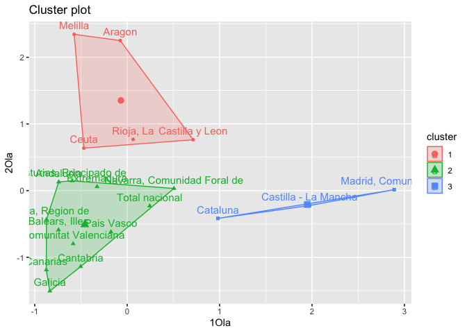
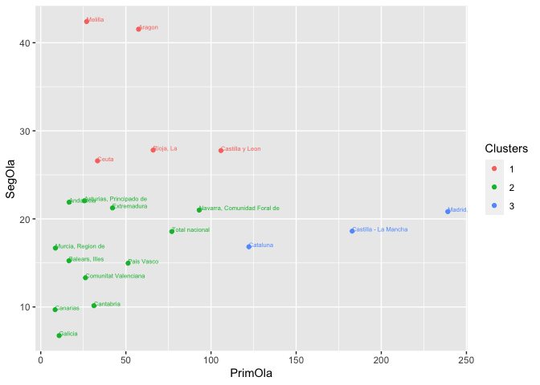
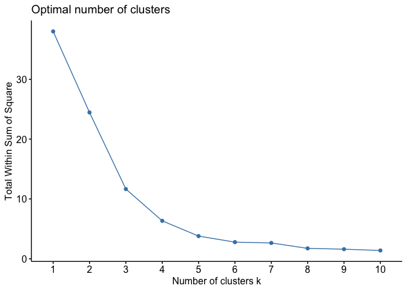
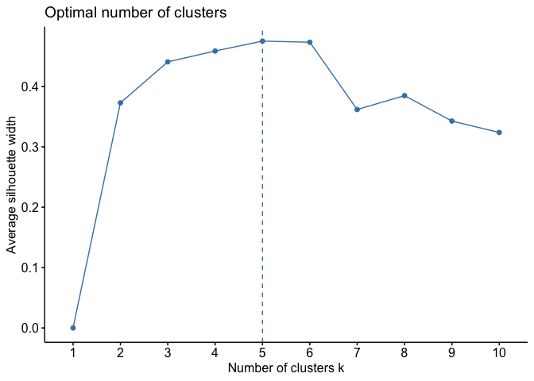

# Introducción

## dataset

En este cuaderno vamos a analizar el dataset llamado
[*VarCovid*](https://github.com/davidperezros/ine_sg_difusion_explica_datasets/blob/0c24c4e30aaeab265e937150d1470102c61e62ac/Datasets/VarCovid.xlsx).
Este contiene datos relativos a las Tasas de Variación de fallecidos en
el año 2020 (Año Covid) respecto al año anterior. Los datos han sido
extraidos de la **Operación** 30324 Estimación de Defunciones Semanales
(EDeS), que se encuentra dentro de la temática Salud (Sociedad).
Concretamente en este dataset tenemos las siguientes variables:

-   **ccaa**: Comunidades Autónomas
-   **2020SM20**: Tasa de variación del acumulado hasta la semana 20
    incluida del año 2020 respecto al año anterior en ese mismo periodo.
-   **2020SM53**: Tasa de variación del acumulado hasta la semana 53
    incluida del año 2020 respecto al año anterior en ese mismo periodo.
-   **1Ola**: Tasa de variación entre el acumulado entre la semana 11 de
    2020 y la semana 18, ambas incluidas, respecto a las mismas semanas
    del año anterior. Tiempo correspondiente a la primera ola
-   **2Ola**: Tasa de variación entre el acumulado entre la semana 32 de
    2020 y la semana 49, ambas incluidas, respecto a las mismas semanas
    del año anterior. Tiempo correspondiente a la segunda ola.
-   **3Ola**: Tasa de variación entre el acumulado entre la semana 51 de
    2020 y la semana 10 de 2021, ambas incluidas, respecto a las mismas
    semanas del año anterior. Tiempo correspondiente a la tercera ola.

El objetivo de este estudio será aplicar un Análisis **Cluster** para
hacer grupos de comunidades autónomas en función de las variables
**1Ola** y **2Ola**. Concretamente usaremos un cluster jerárquico.

``` r
# Librerias
library(readxl) # Para leer los excels
library(dplyr) # Para tratamiento de dataframes
library(ggplot2) # Nice plots
library(factoextra) # fviz_cluster function
```

Cargamos entonces el conjunto de datos:

``` r
datos <- read_excel("/Users/davpero/ine_sg_difusion_explica_datasets/Datasets/VarCovid.xlsx", sheet = "Datos")
```

## Descripción del trabajo a realizar

**(Esto irá en la web de explica)** Se pretende hacer un Análisis
Cluster empleando el procedimiento Cluster K-Means de las **ccaa** en
función a las variables **1Ola** y **2Ola**.

-   Hacer un análisis exploratorio.
-   Ver si hay NA’s y si es necesario escalar los datos.
-   Emplear algoritmo kmeans().
-   Interpretar resultados.

# Análisis Exploratorio (EDA[1])

Lo primero de todo vamos a cargar las librearias necesarias para
ejecutar el resto del código del trabajo:

# Clustering: Cluster K-means

## Introducción

El **Análisis de clúster** es una técnica de aprendizaje no supervisado
que agrupa datos similares en conjuntos, llamados clústeres. El objetivo
es dividir un conjunto de datos en grupos homogéneos, donde los miembros
de cada grupo son más similares entre sí que con los miembros de otros
grupos, según algún criterio de similitud predefinido.

Concretamente, el **Cluster K-Means** define clusters de modo que se
**minimice la variación total dentro del grupo** de acuerdo con el
algoritmo Hartigan-Wong (Hartigan y Wong 1979), que define la variación
total dentro del grupo como la suma de las distancias al cuadrado de las
distancias euclidianas entre elementos y el centroide correspondiente.
Se describe a continuación.

Los pasos generales de este algoritmo son:

1.  **Especificar** el número de clusters (K) que se se desean obtener.

2.  **Seleccionar aleatoriamente k** objetos del conjunto de datos como
    centros del grupo (centroides) Asigna cada observación a su
    centroide más cercano, según la distancia euclidiana entre el objeto
    y el centroide.

3.  Para cada uno de los k grupos, **actualizar el centroide** del grupo
    calculando los nuevos valores medios de todos los puntos de datos
    del grupo. El centoide de un grupo K-ésimo es un vector de longitud
    p que contiene las medias de todas las variables para las
    observaciones en el grupo K-ésimo; p es el número de variables.

4.  **Minimizar iterativamente** el total dentro de la suma del
    cuadrado. Es decir, repetir los pasos 3 y 4 hasta que las
    asignaciones del clúster dejen de cambiar o se alcance el número
    máximo de iteraciones. De forma predeterminada, el software R
    utiliza 10 como valor predeterminado para el número máximo de
    iteraciones.

*Véase funciones de R stats::kmeans(x, centers, iter.max, nstart) que
realizan los pasos 2-5 automáticamente.*

# Modelo

## Formulación

**IMPORTANTE**:

-   Ver que no hay ningún **NA** en el dataset.
-   El **escalado** es un paso esencial en la fase de preprocesamiento
    de datos para los algoritmos de agrupación. Garantiza que cada
    característica contribuya por igual al proceso de decisión del
    algoritmo, lo que lleva a resultados de agrupación más precisos e
    interpretables.

``` r
ifelse(sum(is.na(data)) == 0, print("There is no NA in the dataset."), print("There is some NA in the dataset."))
```

    ## [1] "There is no NA in the dataset."

    ## [1] "There is no NA in the dataset."

En cuanto al método para hacer los clusters, vamos a dejar el que viene
por defecto, el complete. Este se basa en medir la distancia entre
clústeres como la distancia más larga entre cualquier punto de un
clúster y cualquier punto del otro clúster. Menos sensible a valores
atípicos, pero puede generar clústeres de tamaño desigual.

``` r
# Preparación de los datos
resultado <- datos[, c("1Ola", "2Ola")]

resultado <- scale(resultado) #scaling/standardizing
rownames(resultado) <- datos$ccaa # Para que nos salgan luego los nombres
comunidades <- datos$ccaa

# Matriz de distancias
d <- dist(resultado, method = "euclidean")


set.seed(785248)
k1<- kmeans(resultado, centers = 3, nstart = 25)

fviz_cluster(k1, data = resultado)
```



Podemos mostrar los grupos junto al dataframe con la función mutate.

``` r
colnames(datos)<-c( "ccaa","2020SM20","2020SM53","PrimOla","SegOla","TercOla" )


# Gráfico de puntos
ggplot(datos, aes(PrimOla, SegOla, label=ccaa))+ geom_point(aes(colour = factor(k1$cluster)))+geom_text(hjust=0, vjust=0, size = 2,aes(colour = factor(k1$cluster)))+labs(colour="Clusters")
```



``` r
set.seed(123)
fviz_nbclust(resultado, kmeans, method = "wss")
```



``` r
fviz_nbclust(resultado, kmeans, method = "silhouette")
```



# Conclusiones

Aquí se han explicado los supuestos del hierarchical clustering.

[1] EDA viene del Inglés *Exploratory Data Analysis* y son los pasos
relativos en los que se exploran las variables para tener una idea de
que forma toma el dataset.
