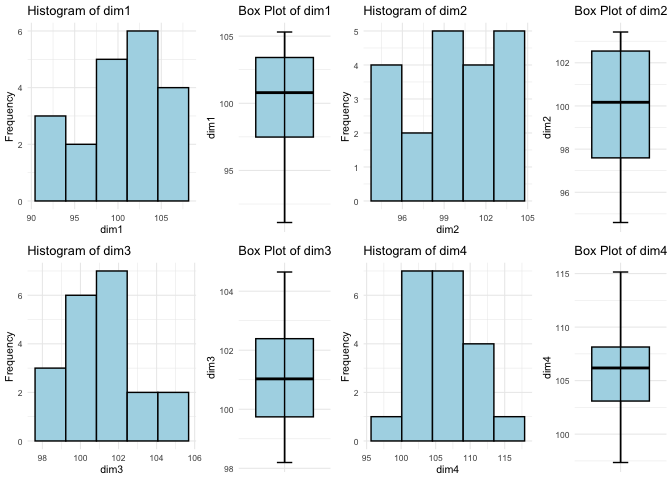
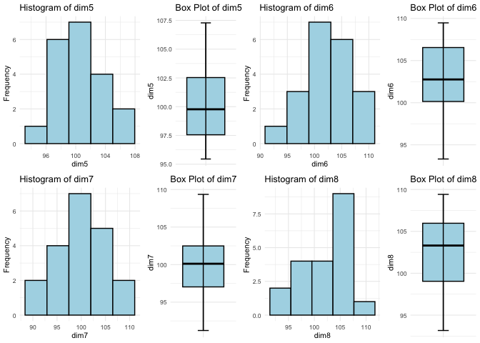
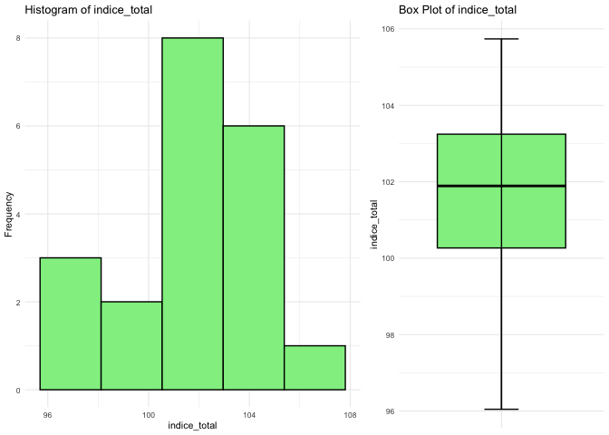
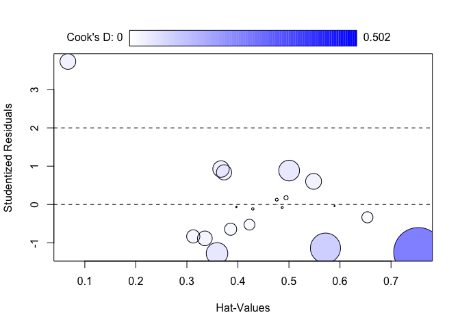

# Introducción

## dataset

En el siguiente dataset disponemos de datos por Comunidades Autónomas de
las nueve **dimensiones relativas a la calidad de vida que componen el
Índice Multidimensional de Calidad de Vida (IMCV)**, una estadística con
carácter experimental. Datos correspondientes al año 2020.

Concretamente tenemos las siguietnes variables:

-   **indice_total**: Índice multidimensional de calidad de vida
    teniendo en cuenta las nueve dimensiones.
-   **dim1** : Indicador sobre las condiciones materiales de vida.
-   **dim2** : Indicador sobre el trabajo.
-   **dim3** : Indicador sobre la salud.
-   **dim4** : Indicador sobre la eduación.
-   **dim5** : Indicador sobre el ocio y relaciones sociales.  
-   **dim6** : Indicador sobre la seguridad física y personal.  
-   **dim7** : Indicador sobre la gobernanza y los derechos básicos.  
-   **dim8** : Indicador sobre el entorno y el medioambiente.
-   **CCAA**: Comunidades Autónomas.

Los datos relativos a este estudio corresponden, como ya se ha
comentado, a la estadística experimental sobre el
**ÍndiceMultidimensional de Calidad de Vida (IMCV)**. Se construye a
partir de los indicadores de calidad del INE, que ofrecen una visión
panorámica (multidimensional) de la calidad de vida en España, mediante
la elección de un conjunto amplio pero limitado de indicadores
(actualmente 60) que cubren nueve dimensiones usadas para describir la
calidad de vida.

**Nota**: Notar que en este dataset no se tiene la variable **dim9** ya
que en ese caso el ajuste de la regresión sería prefecto puesto que la
variable **indice_total** es la media artimética de las 9 dimensiones.

## Descripción del trabajo a realizar

**(Esto irá en la web de explica)** Se pretende hacer una regresión
lineal que explique el índice total en función de las dimensiones (sin
tener en centa la var. comunidad autónoma).

-   Hacer un análisis exploratorio.
-   Plantear las hipótesis de una regresión (incluyendo todas
    variables).
-   Analizar el modelo planteado y su ajuste de bondad.
-   Comprobar hipótesis de regresión.
-   Hacer una conclusión.

# Análisis Exploratorio (EDA[1])

Lo primero de todo vamos a cargar las librearias necesarias para
ejecutar el resto del código del trabajo:

``` r
library(readxl)  # Para leer los excels
library(kableExtra) # Para dar formato a las tablas html
library(knitr)
library(gridExtra)  # Para cargar bien las tab
library(car)   # for bonfferroni test
```

Ahora leemos los datos del excel correspondientes a la pestaña *“Datos”*
y vemos si hay algún NA o algún valor igual a 0 en nuestro dataset.
Vemos que no han ningún NA (missing value) en el dataset luego no será
necesario realizar ninguna técnica para imputar los missing values o
borrar observaciones.

``` r
IMCV <- read_excel("/Users/davpero/ine_sg_difusion_explica_datasets/Datasets/IMCV_reg.xlsx",sheet = "Datos")
```

``` r
c(anyNA(IMCV) ,   #Any missing data 
  any(IMCV==0) )  # Any value equal to 0
```

    ## [1] FALSE FALSE

Realizando un **resumen numérico** vemos que todas las dimensiones toman
valores en torno a \[90,110\]. Recordar que estas representan índices.
Para ninguna de ellas parece haber valores atípicos en relación a los
demas luego no parece necesario hacer ningún tipo de ajuste a los datos.
Además las medias y medianas son muy parecidas. Junto con los
**histogramas y los boxplots** se podría concluir que no parece haber
ningún dato atípico/outlier y tampoco parece haber mucha asímetria,
hecho que se puede ver en los histogramas y en los boxplots (mirando las
distancias entre máximo/tercer cuartil y mínimo/1er cuartil son
parecidas).

| variable     | Min   | Q1     | Mean   | Median | Q3     | Max    |
|:-------------|:------|:-------|:-------|:-------|:-------|:-------|
| dim1         | 91.00 | 97.00  | 100.00 | 101.00 | 103.00 | 105.00 |
| dim2         | 95.00 | 98.00  | 100.00 | 100.00 | 103.00 | 103.00 |
| dim3         | 98.00 | 100.00 | 101.00 | 101.00 | 102.00 | 105.00 |
| dim4         | 97.00 | 103.00 | 106.00 | 106.00 | 108.00 | 115.00 |
| dim5         | 95.00 | 98.00  | 100.00 | 100.00 | 103.00 | 107.00 |
| dim6         | 93.00 | 100.00 | 103.00 | 103.00 | 107.00 | 109.00 |
| dim7         | 91.00 | 97.00  | 100.00 | 100.00 | 102.00 | 109.00 |
| dim8         | 93.00 | 99.00  | 103.00 | 103.00 | 106.00 | 109.00 |
| indice_total | 96.00 | 100.00 | 102.00 | 102.00 | 103.00 | 106.00 |

Table showing the measures of interest.


<p class="caption">
Plots de todas las dimensiones.
</p>


<p class="caption">
Plots de todas las dimensiones.
</p>


<p class="caption">
Plots para la dimensión total.
</p>

# Regresión Lineal

## Hipótesis y indicadores de bondad

Para que una regresión lineal proporcione un buen ajsute a los datos
debe cumplir una serie de requisitos que por tanto deben ser verificados
al llevar a cabo el estudio. Recordar que la regresión lineal se expresa
como:
**Y** = **X****β** + **ε**
donde **Y** es la variable respuesta, **X** los predictores, **β** los
coeficientes de la regresión y **ε** el error.
$$
\mathbf{Y}=\left\[\begin{array}{c}
y_1 \\
y_2 \\
\vdots \\
y_n
\end{array}\right\] \quad \mathbf{X}=\left\[\begin{array}{cccc}
1 & x\_{11} & \ldots & x\_{1 k} \\
1 & x\_{21} & \ldots & x\_{2 k} \\
\vdots & \ddots & \vdots & \\
1 & x\_{n 1} & \ldots & x\_{n k}
\end{array}\right\] \quad \boldsymbol{\beta}=\left\[\begin{array}{c}
\beta_0 \\
\beta_1 \\
\vdots \\
\beta_k
\end{array}\right\] \quad \boldsymbol{\varepsilon}=\left\[\begin{array}{c}
\varepsilon_1 \\
\varepsilon_2 \\
\vdots \\
\varepsilon_n
\end{array}\right\]
$$
Las hipótesis que se deben cumplir son:

-   **Linealidad**: La media de la respuesta es función lineal de los
    predictores. En términos matemáticos:
    *E*\[**Y**∣**X**<sub>1</sub>=*x*<sub>1</sub>,…,**X**<sub>*k*</sub>=*x*<sub>*k*</sub>\] = *β*<sub>0</sub> + *β*<sub>1</sub>*x*<sub>1</sub> + … + *β*<sub>*k*</sub>*x*<sub>*k*</sub>

-   **Independencia de errores**: Los errores *ε*<sub>*i*</sub> deben
    ser independientes, es decir,
    *C**o**v*\[*ε*<sub>*i*</sub>,*ε*<sub>*j*</sub>\] = 0, ∀*i* ≠ *j*.

-   **Homocedasticidad**: Cuando la varianza del error es constante,
    condicionada a los predictores.

Var \[*ε*<sub>*i*</sub>∣**X**<sub>1</sub>=*x*<sub>1</sub>,…,**X**<sub>*k*</sub>=*x*<sub>*k*</sub>\] = *σ*<sup>2</sup>

-   **Normalidad** : Los errores deben estar distribuidos normalmente,
    es decir, *ε*<sub>*i*</sub> ∼ *N*(0,*σ*<sup>2</sup>) ∀*i*.

Además hay algunas medidas indicadores como el
*R*<sup>2</sup>\_*a**d**j* que indican la variabiliad de la variable
respueta que es eescplicada por el modelo, siendo mejor el modelo cuanto
más grande sea este valor.

## Modelo

Inicialmente vamos a considerar un modelo con todas variables
predictoras para intentar predecir el
*i**n**d**i**c**e*\_*t**o**t**a**l* y veremos si este modelo cumple las
hipótesis necesarias y cuan bueno es.

``` r
#Modelo inicial
lm1<-lm(indice_total~dim1+dim2+dim3+dim4+dim5+dim6+dim7+dim8,IMCV)

summary(lm1)
```

    ## 
    ## Call:
    ## lm(formula = indice_total ~ dim1 + dim2 + dim3 + dim4 + dim5 + 
    ##     dim6 + dim7 + dim8, data = IMCV)
    ## 
    ## Residuals:
    ##        Min         1Q     Median         3Q        Max 
    ## -1.461e-14 -7.943e-15 -8.440e-16  2.969e-15  3.591e-14 
    ## 
    ## Coefficients:
    ##               Estimate Std. Error    t value Pr(>|t|)    
    ## (Intercept) -1.879e-13  2.666e-13 -7.050e-01    0.496    
    ## dim1         1.250e-01  3.234e-15  3.866e+13   <2e-16 ***
    ## dim2         1.250e-01  3.484e-15  3.588e+13   <2e-16 ***
    ## dim3         1.250e-01  3.619e-15  3.454e+13   <2e-16 ***
    ## dim4         1.250e-01  1.434e-15  8.716e+13   <2e-16 ***
    ## dim5         1.250e-01  1.463e-15  8.541e+13   <2e-16 ***
    ## dim6         1.250e-01  1.764e-15  7.087e+13   <2e-16 ***
    ## dim7         1.250e-01  8.104e-16  1.543e+14   <2e-16 ***
    ## dim8         1.250e-01  2.300e-15  5.435e+13   <2e-16 ***
    ## ---
    ## Signif. codes:  0 '***' 0.001 '**' 0.01 '*' 0.05 '.' 0.1 ' ' 1
    ## 
    ## Residual standard error: 1.469e-14 on 11 degrees of freedom
    ## Multiple R-squared:      1,  Adjusted R-squared:      1 
    ## F-statistic: 6.8e+28 on 8 and 11 DF,  p-value: < 2.2e-16

A primera vista vemos un valor de **Multiple R-squared: 0.9812,**, lo
cual es bastante alto y por tanto nuestro modelo parece capturar bien la
variabilidad de la variable respuesta, concretamente un 98%. Sin
embargo, en los sucesivos modelos que planteemos no podemos usar como
criterio de comparación el *R* − *s**q**u**a**r**e**d* pues aumenta a la
vez que lo hace el número de variables, y por tanto para comparar
modelos entre si se debe usar el **Adjusted R-squared** (que tiene en
cuenta el número de variables).

En la línea de los residuos no parece haber contraindicaciones a que
estos sigan una distribución normal centrada en cero puesto que tenemos
unas medidas de dispersión bastante simétricas. No osbtante, más
adelante se procederán a hacer los test pertinentes.

En la última linea el *F* − *t**e**s**t* lo que considera es la
hipótesis nula de *H*0 : *β*<sub>*i*</sub> = 0 ∀*i* y
*H*1 : *a**l* *m**e**n**o**s* *u**n* *β*<sub>*i*</sub> ≠ 0. Para un
nivel de significancia de 0.05 podemos rechazar la hipótesis nula y por
tanto aceptar la alternativa, lo cual es buena señal.

No obstante es necesario analizar que se cumplan las hipótesis iniciales
para poder asegurar que estamos ante un buen modelo.

## Test de Bonferroni (datos atípicos)

La idea principal es verificar si los residuos de las observaciones son
significativamente diferentes de cero. Si un residuo tiene un valor
studentizado grande en comparación con una distribución t, puede
considerarse como un posible valor atípico. En este caso parece no haber
indiacción de valores atípicos.

``` r
outlierTest(lm1)
```

    ## No Studentized residuals with Bonferroni p < 0.05
    ## Largest |rstudent|:
    ##   rstudent unadjusted p-value Bonferroni p
    ## 1  3.73407          0.0038843     0.077685

## Test homocedasticidad

En términos sencillos, la prueba de Breusch-Pagan evalúa si la varianza
de los errores en un modelo de regresión es constante o si varía a lo
largo de los valores de las variables predictoras. Una violación de la
homocedasticidad puede afectar la validez de las inferencias realizadas
a partir del modelo.

El test funciona de la siguiente manera: se obtienen los residuos al
cuadrado y se realiza una regresión auxiliar para determinar si hay una
relación significativa entre los residuos al cuadrado y las variables
predictoras. Si se encuentra evidencia significativa, puede indicar la
presencia de heterocedasticidad.

``` r
library(lmtest)

bptest(indice_total~dim1+dim2+dim3+dim4+dim5+dim6+dim7+dim8 ,data=IMCV, varformula = ~fitted.values(lm1), studentize=FALSE)
```

    ## 
    ##  Breusch-Pagan test
    ## 
    ## data:  indice_total ~ dim1 + dim2 + dim3 + dim4 + dim5 + dim6 + dim7 +     dim8
    ## BP = 0.0047152, df = 1, p-value = 0.9453

Si el valor p obtenido de la prueba de Breusch-Pagan es 0.7,
interpretaríamos esto como evidencia insuficiente para rechazar la
hipótesis nula de homocedasticidad (a nivel de significancia de 0.05).
En otras palabras, no tendríamos suficiente evidencia estadística para
decir que hay heterocedasticidad en los errores del modelo de regresión.

En términos prácticos, esto sugiere que la varianza de los errores
parece ser constante a lo largo de los valores de las variables
predictoras.

## Normalidad de residuos

El test de Shapiro es una prueba de normalidad que se utiliza para
evaluar si una muestra proviene de una población con una distribución
normal. La hipótesis nula del test es que la muestra sigue una
distribución normal. Si el valor p obtenido en la prueba es menor que el
nivel de significancia (comúnmente establecido en 0.05), se rechaza la
hipótesis nula, indicando que la muestra no sigue una distribución
normal.

``` r
shapiro.test(lm1$residuals)
```

    ## 
    ##  Shapiro-Wilk normality test
    ## 
    ## data:  lm1$residuals
    ## W = 0.85587, p-value = 0.006695

Aceptamos la normalidad de los residuos puesto que el
*p* − *v**a**l**u**e* \> 0.05.

## Test linealidad

La hipótesis alternativa analiza si la inclusión de términos cuadráticos
(potencia 2) de las variables predictoras mejora significativamente el
modelo en comparación con un modelo que solo incluye términos lineales.

``` r
resettest(indice_total~dim1+dim2+dim3+dim4+dim5+dim6+dim7+dim8 ,data=IMCV, power=2, type="regressor")
```

    ## 
    ##  RESET test
    ## 
    ## data:  indice_total ~ dim1 + dim2 + dim3 + dim4 + dim5 + dim6 + dim7 +     dim8
    ## RESET = 26.638, df1 = 8, df2 = 3, p-value = 0.01047

Aceptamos la linealidad puesto que el *p* − *v**a**l**u**e* \> 0.05, a
un nivel de significancia de *α* = 0.05.

## Gráfico de influencia del modelo porpuesto

En el siguiente gráfico se muestran los residuos studentizados, es
decir, los residuos transofmrados a una *N*(0,1). Es por ello, que
debido a el cuantil *z*<sub>*α*/2</sub> =  − 1.96 *c**o**n* *α* = 0.05
de una normal, sabemos que el 95% de elementos deben estar contenidos en
(−1,96,1.96) que son las rayas verticales del gráfico.

``` r
influencePlot(lm1,id=list(method="noteworth",n=2))
```



-   Los **residuos** bajo hipótesis de RLM siguen una N(0,sigma) y los
    studentizados un N(0,1), es decir el 95% de datos están entre
    (−1.96,1.96), las líneas horizontales. Tenemos 20 obs. y 2 datos
    fuera de la línea lo que a priori podría ser correcto.
-   Las **líneas verticales** indican los datos con apalancamiento en el
    modelo. Es decir los datos fuera de la línea vertical dcha. No vemos
    ni siquiera las lineas entonces no parece haber apalancamiento.
-   El **área de las burbujas** es proporcional a la dist. de cook (mide
    cómo cambian los parámetros del modelo cuando se excluye una
    observación específic)., vemos que hay uno con una gran distancia de
    cook (tienen residuo grande), luego esto nos indica que epodría
    considerarse en cierto modo atípico. Como no hemos encontrado más
    evidencias de que fuera atípicio lo vamos a dejar así.

## Colinealidad

``` r
anova(lm1)
```

    ## Analysis of Variance Table
    ## 
    ## Response: indice_total
    ##           Df Sum Sq Mean Sq    F value    Pr(>F)    
    ## dim1       1 95.538  95.538 4.4283e+29 < 2.2e-16 ***
    ## dim2       1  4.243   4.243 1.9667e+28 < 2.2e-16 ***
    ## dim3       1  2.406   2.406 1.1154e+28 < 2.2e-16 ***
    ## dim4       1  0.037   0.037 1.6982e+26 < 2.2e-16 ***
    ## dim5       1  5.457   5.457 2.5296e+28 < 2.2e-16 ***
    ## dim6       1  3.862   3.862 1.7902e+28 < 2.2e-16 ***
    ## dim7       1  5.192   5.192 2.4066e+28 < 2.2e-16 ***
    ## dim8       1  0.637   0.637 2.9540e+27 < 2.2e-16 ***
    ## Residuals 11  0.000   0.000                         
    ## ---
    ## Signif. codes:  0 '***' 0.001 '**' 0.01 '*' 0.05 '.' 0.1 ' ' 1

``` r
vif(lm1)
```

    ##      dim1      dim2      dim3      dim4      dim5      dim6      dim7      dim8 
    ## 16.546922  9.314436  4.223408  3.656965  2.205475  5.296284  1.390370 10.197988

``` r
round(cov2cor(vcov(lm1)),1)
```

    ##             (Intercept) dim1 dim2 dim3 dim4 dim5 dim6 dim7 dim8
    ## (Intercept)         1.0  0.0 -0.1 -0.8  0.3  0.3 -0.7 -0.1  0.4
    ## dim1                0.0  1.0 -0.8  0.2  0.0  0.4 -0.2  0.2 -0.7
    ## dim2               -0.1 -0.8  1.0 -0.1 -0.4 -0.5  0.3 -0.4  0.3
    ## dim3               -0.8  0.2 -0.1  1.0 -0.4 -0.4  0.6 -0.2 -0.5
    ## dim4                0.3  0.0 -0.4 -0.4  1.0  0.4 -0.3  0.4  0.2
    ## dim5                0.3  0.4 -0.5 -0.4  0.4  1.0 -0.6  0.3  0.0
    ## dim6               -0.7 -0.2  0.3  0.6 -0.3 -0.6  1.0 -0.1 -0.5
    ## dim7               -0.1  0.2 -0.4 -0.2  0.4  0.3 -0.1  1.0  0.0
    ## dim8                0.4 -0.7  0.3 -0.5  0.2  0.0 -0.5  0.0  1.0

# Otras Consideraciones

Vamos a realizar un método de Stepwise que lo que hace es
irncluyendo/sacando variables sobre el modelo inicial hasta encontrar el
mejor AIC(el más bajo).

``` r
library(Rcmdr)
stepwise(lm1,direction='backward/forward',criterion='AIC')
```

    ## 
    ## Direction:  backward/forward
    ## Criterion:  AIC 
    ## 
    ## Start:  AIC=-1268.03
    ## indice_total ~ dim1 + dim2 + dim3 + dim4 + dim5 + dim6 + dim7 + 
    ##     dim8
    ## 
    ##        Df Sum of Sq    RSS      AIC
    ## <none>              0.0000 -1268.03
    ## - dim3  1    0.2573 0.2573   -71.06
    ## - dim2  1    0.2777 0.2777   -69.54
    ## - dim1  1    0.3224 0.3224   -66.55
    ## - dim8  1    0.6373 0.6373   -52.92
    ## - dim6  1    1.0836 1.0836   -42.31
    ## - dim5  1    1.5740 1.5740   -34.84
    ## - dim4  1    1.6391 1.6391   -34.03
    ## - dim7  1    5.1334 5.1334   -11.20

    ## 
    ## Call:
    ## lm(formula = indice_total ~ dim1 + dim2 + dim3 + dim4 + dim5 + 
    ##     dim6 + dim7 + dim8, data = IMCV)
    ## 
    ## Coefficients:
    ## (Intercept)         dim1         dim2         dim3         dim4         dim5  
    ##  -1.879e-13    1.250e-01    1.250e-01    1.250e-01    1.250e-01    1.250e-01  
    ##        dim6         dim7         dim8  
    ##   1.250e-01    1.250e-01    1.250e-01

Destacar que la realidad es que:

*i**n**d**i**c**e*\_*t**o**t**a**l* = *d**i**m*1 + *d**i**m*2 + *d**i**m*3 + *d**i**m*4 + *d**i**m*5 + *d**i**m*6 + *d**i**m*7 + *d**i**m*8 + *d**i**m*9
. En este caso no disponemos de *d**i**m*9. No obstante parece obvio que
la mejor estimación se da usando todas las variables, incluso aun
habiendo inidicios de no hacerlo.

# Conclusion

El modelo inicial considerado tiene buenos inidcadores de bondad de
ajuste y además pasa toas las hipótesis requeridas para una regresión
lineal. Es por ello que parece razonable tomarlo como bueno.

[1] EDA viene del Inglés *Exploratory Data Analysis* y son los pasos
relativos en los que se exploran las variables para tener una idea de
que forma toma el dataset.
