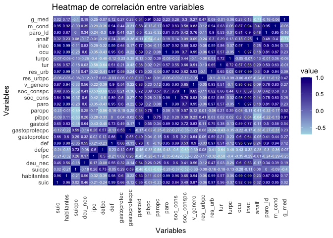
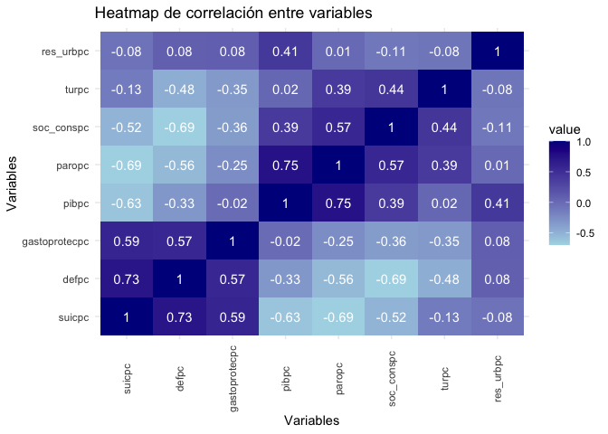
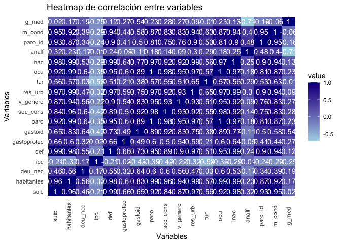
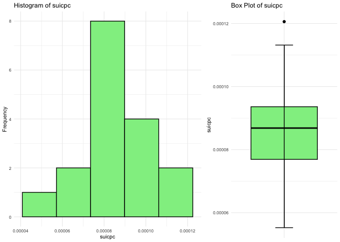
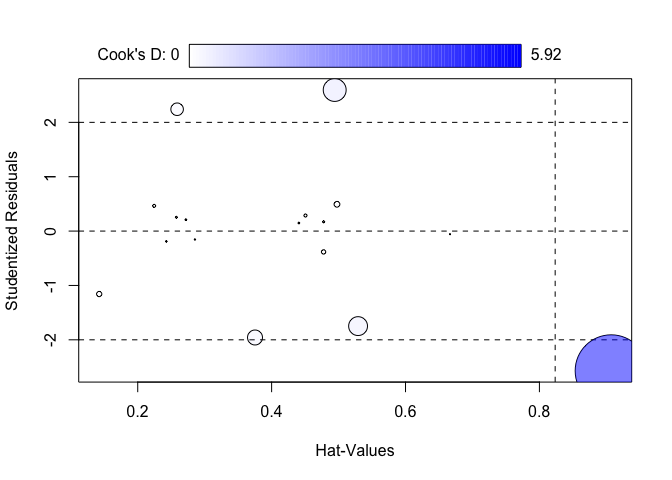

# Introducción

## dataset

En el siguiente dataset presenta la **tasa de suicidios que ocurre en
España con distintas variables demográficas y económicas que pueden
llegar a influir o no**, por Comunidades Autónomas.Concretamente tenemos
las siguietnes variables:

-   **analf**: Población de 16 años o más analfabeta.
-   **ccaa**: Comunidades Autónomas de España.
-   **def**: Número de defunciones.
-   **defpc**: Número de defunciones per cápita.
-   **deu_nec**: Deudores concursados necesarios
-   **gastoid **: Gastos internos totales y personal en I+D
-   **gastomed**: Gasto Medio por Persona.
-   **gastoprotec**: Gasto en protección ambiental.
-   **gastoprotecpc**: Gasto en protección ambiental per cápita.
-   **habitantes**: Número de habitantes por CCAA.
-   **inac**: Inactivos.
-   **ipc**: Índice de Precios de Consumo.
-   **m_cond**: Menores condenados.
-   **ocu**: Ocupados.
-   **paro**: Número de personas en paro.
-   **paro_ld**: Parados que llevan 2 años o más buscando empleo (larga
    duración).
-   **paropc**: Número de parados per cápita.
-   **pibpc**: PIB per cápita.
-   **res_urb**: Cantidad de residuos urbanos recogidos
-   **res_urbpc**: Número de residuos urbanos per cápita.
-   **soc_cons**: Sociedades constituidas
-   **soc_conspc**: Número de sociedades constituidas per cápita.
-   **suic**: Suicidios.
-   **suicpc**: Número de suicidios per cápita.
-   **tur**: Número de Turistas.
-   **turpc**: Número de turistas per cápita.
-   **v_genero**: Víctimas mortales por violencia de género.
-   **indice_total**: Índice multidimensional de calidad de vida
    teniendo en cuenta las nueve dimensiones.
-   **suic** : Indicador sobre las condiciones materiales de vida.
-   **habitantes** : Indicador sobre el trabajo.
-   **deu_nec** : Indicador sobre la salud.
-   **ipc** : Indicador sobre la eduación.
-   **defpc** : Indicador sobre el ocio y relaciones sociales.  
-   **gastoprotecpc** : Indicador sobre la seguridad física y
    personal.  
-   **pibpc** : Indicador sobre la gobernanza y los derechos básicos.  
-   **paropc** : Indicador sobre el entorno y el medioambiente.
-   **CCAA**: Comunidades Autónomas.

En este caso de uso, vamos a intentar explicar qué variables
$(x1,x2,…,xk) $ pueden afectar al número de suicidios (*y*) que ocurren
en España.

## Descripción del trabajo a realizar

**(Esto irá en la web de explica)** Se pretende hacer una regresión
ineal que explique el índice total en función de las dimensiones (sin
tener en centa la var. comunidad autónoma).

-   Hacer un análisis exploratorio. Ver que las variables que no son per
    cápita tienen una correlación muy altas y por tanto, no
    considerarlas.
-   Plantear las hipótesis de una regresión (incluyendo todas
    variables).
-   Analizar el modelo planteado y su ajuste de bondad.
-   Comprobar hipótesis de regresión.
-   Selección de variables.
-   Hacer una conclusión.

## Técncnica Estadística

El objetivo es realizar una regresión lineal múltiple para predecir los
suicidios en función de las demás variables.

# Análisis Exploratorio (EDA[1])

Lo primero de todo vamos a cargar las librearias necesarias para
ejecutar el resto del código del trabajo:

``` r
library(readxl)  # Para leer los excels
library(kableExtra) # Para dar formato a las tablas html
library(knitr)
library(gridExtra)  # Para cargar bien las tab
library(car)   # for bonfferroni test
```

Ahora leemos los datos del excel correspondientes a la pestaña *“Datos”*
y vemos si hay algún NA en nuestro dataset. Vemos que no han ningún NA
(missing value) en el dataset luego no será necesario realizar ninguna
técnica para imputar los missing values o borrar observaciones.

``` r
suicidios <- read_excel("/Users/davpero/Library/CloudStorage/GoogleDrive-davidperez202223@gmail.com/Mi unidad/4th Quarter/INE/2Datasets/Datos/David/Nuevos/suicidios2019CCAA.xlsx",sheet = "Datos")
```

``` r
anyNA(suicidios)    #Any missing data 
```

    ## [1] FALSE

Realizando un **resumen numérico** vemos que todas las dimensiones toman
valores en torno a \[90,110\]. Recordar que estas representan índices.
Para ninguna de ellas parece haber valores atípicos en relación a los
demas luego no parece necesario hacer ningún tipo de ajuste a los datos.
Además las medias y medianas son muy parecidas. Junto con los
**histogramas y los boxplots** se podría concluir que no parece haber
ningún dato atípico/outlier y tampoco parece haber mucha asímetria,
hecho que se puede ver en los histogramas y en los boxplots (mirando las
distancias entre máximo/tercer cuartil y mínimo/1er cuartil son
parecidas).

| variable      | Min       | Q1         | Mean       | Median     | Q3         | Max          |
|:------------|:---------|:---------|:---------|:---------|:---------|:----------|
| suic          | 29.0      | 92.0       | 230.0      | 179.0      | 305.0      | 793.0        |
| habitantes    | 319796.0  | 1059501.0  | 2777372.0  | 2049562.0  | 2695645.0  | 8472407.0    |
| suicpc        | 0.0       | 0.0        | 0.0        | 0.0        | 0.0        | 0.0          |
| deu_nec       | 0.0       | 1.0        | 6.0        | 4.0        | 8.0        | 20.0         |
| ipc           | 109.0     | 110.0      | 110.0      | 110.0      | 111.0      | 112.0        |
| defpc         | 0.0       | 0.0        | 0.0        | 0.0        | 0.0        | 0.0          |
| def           | 3409.0    | 12333.0    | 25766.0    | 17178.0    | 32841.0    | 79498.0      |
| gastoprotec   | 3000599.0 | 11428710.0 | 43314589.0 | 34075312.0 | 56016655.0 | 148771215\.0 |
| gastoprotecpc | 1.0       | 9.0        | 19.0       | 14.0       | 22.0       | 55.0         |
| gastoid       | 64412.0   | 193658.0   | 927305.0   | 341157.0   | 1236012.0  | 4252947.0    |
| pibpc         | 19454.0   | 21642.0    | 25946.0    | 24383.0    | 28727.0    | 35913.0      |
| paropc        | 0.0       | 0.0        | 0.0        | 0.0        | 0.0        | 0.0          |
| paro          | 140.0     | 396.0      | 1160.0     | 847.0      | 1085.0     | 3442.0       |
| soc_cons      | 351.0     | 1035.0     | 4650.0     | 2263.0     | 3212.0     | 17965.0      |
| soc_conspc    | 0.0       | 0.0        | 0.0        | 0.0        | 0.0        | 0.0          |
| v_genero      | 0.0       | 1.0        | 3.0        | 1.0        | 3.0        | 9.0          |
| res_urbpc     | 0.0       | 0.0        | 81.0       | 1.0        | 1.0        | 1368.0       |
| res_urb       | 133764.0  | 507580.0   | 1334382.0  | 883808.0   | 1282486.0  | 4310649.0    |
| tur           | 47913.0   | 161462.0   | 1833408.0  | 499370.0   | 4019766.0  | 6324711.0    |
| turpc         | 0.0       | 0.0        | 1.0        | 0.0        | 1.0        | 5.0          |
| ocu           | 140.0     | 396.0      | 1160.0     | 847.0      | 1085.0     | 3442.0       |
| inac          | 106.0     | 400.0      | 965.0      | 693.0      | 1113.0     | 3032.0       |
| analf         | 0.0       | 1.0        | 1.0        | 1.0        | 2.0        | 2.0          |
| paro_ld       | 4.0       | 17.0       | 54.0       | 31.0       | 75.0       | 271.0        |
| m_cond        | 77.0      | 214.0      | 652.0      | 440.0      | 750.0      | 2382.0       |
| g_med         | 9587.0    | 10480.0    | 11607.0    | 11806.0    | 12022.0    | 13982.0      |

Table showing the measures of interest for each variable.

Lo primero vamos a ver correlaciones para ver si podemos reducir la
dimensionalidad ya que tenemos un número muy alto de variables. En el
siguiente gráfico se muestra la correlación entre distintas variables,
que puede ser positiva o negativa. Concretamente, la **matriz de
coeficientes de correlación** es una tabla de doble entrada que muestra
una lista multivariable horizontalmente y la misma lista verticalmente,
con el correspondiente coeficiente de correlación “r” expresada con un
número que va desde  − 1 a 1. La diagonal es siempre 1 pues es trivial
que una variable esta 100% correlada con si misma. Además, se dice que
dos variables están **altamente correlacionadas** si su valor  ≥ 0, 7.


<p class="caption">
Correlaciones entre variables
</p>

Podemos observar que las variables que no son *per cápita* presentan una
correlación bastante alta. Esto es debido al “efecto tamaño”[2] que
produce dependientes del tamaño de la población considerada. Es por ello
que se van a usar medidas **per cápita** que eliminan esta correlación.


<p class="caption">
Correlaciones entre variables per cápita
</p>


<p class="caption">
Correlaciones entre variables que no son per cápita
</p>

Como se comentaba, debido a que las medidas per cápita tienen una
correlación mucho menor, serán estas las que intentemos usar para la
regresión lineal con objetivo de explicar el número de suicidios per
cápita. En las siguientes Figuras podemos observar que no parece haber
datos atípicos en cuanto a esta magnitud, aunque para ser precisos se
tienen un número muy bajo de observaciones.


<p class="caption">
Suicidios per cápita.
</p>

# Regresión Lineal

## Hipótesis y indicadores de bondad

Para que una regresión lineal proporcione un buen ajsute a los datos
debe cumplir una serie de requisitos que por tanto deben ser verificados
al llevar a cabo el estudio. Recordar que la regresión lineal se expresa
como:
**Y** = **X****β** + **ε**
donde **Y** es la variable respuesta, **X** los predictores, **β** los
coeficientes de la regresión y **ε** el error.
$$
\mathbf{Y}=\left\[\begin{array}{c}
y_1 \\
y_2 \\
\vdots \\
y_n
\end{array}\right\] \quad \mathbf{X}=\left\[\begin{array}{cccc}
1 & x\_{11} & \ldots & x\_{1 k} \\
1 & x\_{21} & \ldots & x\_{2 k} \\
\vdots & \ddots & \vdots & \\
1 & x\_{n 1} & \ldots & x\_{n k}
\end{array}\right\] \quad \boldsymbol{\beta}=\left\[\begin{array}{c}
\beta_0 \\
\beta_1 \\
\vdots \\
\beta_k
\end{array}\right\] \quad \boldsymbol{\varepsilon}=\left\[\begin{array}{c}
\varepsilon_1 \\
\varepsilon_2 \\
\vdots \\
\varepsilon_n
\end{array}\right\]
$$
Las hipótesis que se deben cumplir son:

-   **Linealidad**: La media de la respuesta es función lineal de los
    predictores. En términos matemáticos:
    *E*\[**Y**∣**X**<sub>1</sub>=*x*<sub>1</sub>,…,**X**<sub>*k*</sub>=*x*<sub>*k*</sub>\] = *β*<sub>0</sub> + *β*<sub>1</sub>*x*<sub>1</sub> + … + *β*<sub>*k*</sub>*x*<sub>*k*</sub>

-   **Independencia de errores**: Los errores *ε*<sub>*i*</sub> deben
    ser independientes, es decir,
    *C**o**v*\[*ε*<sub>*i*</sub>,*ε*<sub>*j*</sub>\] = 0, ∀*i* ≠ *j*.

-   **Homocedasticidad**: Cuando la varianza del error es constante,
    condicionada a los predictores.

Var \[*ε*<sub>*i*</sub>∣**X**<sub>1</sub>=*x*<sub>1</sub>,…,**X**<sub>*k*</sub>=*x*<sub>*k*</sub>\] = *σ*<sup>2</sup>

-   **Normalidad** : Los errores deben estar distribuidos normalmente,
    es decir, *ε*<sub>*i*</sub> ∼ *N*(0,*σ*<sup>2</sup>) ∀*i*.

Además hay algunas medidas indicadores como el
*R*<sup>2</sup>\_*a**d**j* que indican la variabiliad de la variable
respueta que es eescplicada por el modelo, siendo mejor el modelo cuanto
más grande sea este valor.

## Modelo

Inicialmente vamos a considerar un modelo con todas variables
predictoras para intentar predecir el
*i**n**d**i**c**e*\_*t**o**t**a**l* y veremos si este modelo cumple las
hipótesis necesarias y cuan bueno es.

``` r
#Modelo inicial
lm1<-lm(suicpc~defpc+gastoprotecpc+pibpc+paropc+soc_conspc+turpc,suicidios)

summary(lm1)
```

    ## 
    ## Call:
    ## lm(formula = suicpc ~ defpc + gastoprotecpc + pibpc + paropc + 
    ##     soc_conspc + turpc, data = suicidios)
    ## 
    ## Residuals:
    ##        Min         1Q     Median         3Q        Max 
    ## -1.042e-05 -2.210e-06  8.922e-07  1.754e-06  1.243e-05 
    ## 
    ## Coefficients:
    ##                 Estimate Std. Error t value Pr(>|t|)  
    ## (Intercept)    1.234e-04  5.045e-05   2.445   0.0345 *
    ## defpc          3.908e-03  1.753e-03   2.230   0.0498 *
    ## gastoprotecpc  3.982e-07  1.526e-07   2.610   0.0260 *
    ## pibpc         -9.398e-10  6.414e-10  -1.465   0.1735  
    ## paropc        -1.556e-01  1.322e-01  -1.177   0.2664  
    ## soc_conspc     2.118e-03  5.549e-03   0.382   0.7106  
    ## turpc          3.602e-06  1.850e-06   1.947   0.0802 .
    ## ---
    ## Signif. codes:  0 '***' 0.001 '**' 0.01 '*' 0.05 '.' 0.1 ' ' 1
    ## 
    ## Residual standard error: 7.63e-06 on 10 degrees of freedom
    ## Multiple R-squared:  0.8569, Adjusted R-squared:  0.7711 
    ## F-statistic: 9.984 on 6 and 10 DF,  p-value: 0.0009766

A primera vista vemos un valor de **Multiple R-squared: 0.7711,**, lo
cual es bastante alto y por tanto nuestro modelo parece capturar bien la
variabilidad de la variable respuesta, concretamente un 77%. Sin
embargo, en los sucesivos modelos que planteemos no podemos usar como
criterio de comparación el *R* − *s**q**u**a**r**e**d* pues aumenta a la
vez que lo hace el número de variables, y por tanto para comparar
modelos entre si se debe usar el **Adjusted R-squared** (que tiene en
cuenta el número de variables).

En la línea de los residuos no parece haber contraindicaciones a que
estos sigan una distribución normal centrada en cero puesto que tenemos
unas medidas de dispersión bastante simétricas. No osbtante, más
adelante se procederán a hacer los test pertinentes.

En la última linea el *F* − *t**e**s**t* lo que considera es la
hipótesis nula de *H*0 : *β*<sub>*i*</sub> = 0 ∀*i* y
*H*1 : *a**l* *m**e**n**o**s* *u**n* *β*<sub>*i*</sub> ≠ 0. Para un
nivel de significancia de 0.05 podemos rechazar la hipótesis nula y por
tanto aceptar la alternativa, lo cual es buena señal.

No obstante es necesario analizar que se cumplan las hipótesis iniciales
para poder asegurar que estamos ante un buen modelo.

## Test de Bonferroni (datos atípicos)

La idea principal es verificar si los residuos de las observaciones son
significativamente diferentes de cero. Si un residuo tiene un valor
studentizado grande en comparación con una distribución t, puede
considerarse como un posible valor atípico. En este caso parece no haber
indiacción de valores atípicos.

``` r
outlierTest(lm1)
```

    ## No Studentized residuals with Bonferroni p < 0.05
    ## Largest |rstudent|:
    ##   rstudent unadjusted p-value Bonferroni p
    ## 5 2.595927           0.028931      0.49182

## Test homocedasticidad

En términos sencillos, la prueba de Breusch-Pagan evalúa si la varianza
de los errores en un modelo de regresión es constante o si varía a lo
largo de los valores de las variables predictoras. Una violación de la
homocedasticidad puede afectar la validez de las inferencias realizadas
a partir del modelo.

El test funciona de la siguiente manera: se obtienen los residuos al
cuadrado y se realiza una regresión auxiliar para determinar si hay una
relación significativa entre los residuos al cuadrado y las variables
predictoras. Si se encuentra evidencia significativa, puede indicar la
presencia de heterocedasticidad.

``` r
library(lmtest)

bptest(suicpc~defpc+gastoprotecpc+pibpc+paropc+soc_conspc+turpc,suicidios, varformula = ~fitted.values(lm1), studentize=FALSE)
```

    ## 
    ##  Breusch-Pagan test
    ## 
    ## data:  suicpc ~ defpc + gastoprotecpc + pibpc + paropc + soc_conspc +     turpc
    ## BP = 0.058831, df = 1, p-value = 0.8084

Si el valor p obtenido de la prueba de Breusch-Pagan es 0.8,
interpretaríamos esto como evidencia insuficiente para rechazar la
hipótesis nula de homocedasticidad (a nivel de significancia de 0.05).
En otras palabras, no tendríamos suficiente evidencia estadística para
decir que hay heterocedasticidad en los errores del modelo de regresión.

En términos prácticos, esto sugiere que la varianza de los errores
parece ser constante a lo largo de los valores de las variables
predictoras.

## Normalidad de residuos

El test de Shapiro es una prueba de normalidad que se utiliza para
evaluar si una muestra proviene de una población con una distribución
normal. La hipótesis nula del test es que la muestra sigue una
distribución normal. Si el valor p obtenido en la prueba es menor que el
nivel de significancia (comúnmente establecido en 0.05), se rechaza la
hipótesis nula, indicando que la muestra no sigue una distribución
normal.

``` r
shapiro.test(lm1$residuals)
```

    ## 
    ##  Shapiro-Wilk normality test
    ## 
    ## data:  lm1$residuals
    ## W = 0.93194, p-value = 0.2345

Aceptamos la normalidad de los residuos puesto que el
*p* − *v**a**l**u**e* \> 0.05.

## Test linealidad

La hipótesis alternativa analiza si la inclusión de términos cuadráticos
(potencia 2) de las variables predictoras mejora significativamente el
modelo en comparación con un modelo que solo incluye términos lineales.

``` r
resettest(suicpc~defpc+gastoprotecpc+pibpc+paropc+soc_conspc+turpc,suicidios, power=2, type="regressor")
```

    ## 
    ##  RESET test
    ## 
    ## data:  suicpc ~ defpc + gastoprotecpc + pibpc + paropc + soc_conspc +     turpc
    ## RESET = 0.72339, df1 = 6, df2 = 4, p-value = 0.6563

Aceptamos la linealidad puesto que el *p* − *v**a**l**u**e* \> 0.05, a
un nivel de significancia de *α* = 0.05.

## Gráfico de influencia del modelo porpuesto

En el siguiente gráfico se muestran los residuos studentizados, es
decir, los residuos transofmrados a una *N*(0,1). Es por ello, que
debido a el cuantil *z*<sub>*α*/2</sub> =  − 1.96 *c**o**n* *α* = 0.05
de una normal, sabemos que el 95% de elementos deben estar contenidos en
(−1,96,1.96) que son las rayas verticales del gráfico.

``` r
influencePlot(lm1,id=list(method="noteworth",n=2))
```



-   Los **residuos** bajo hipótesis de RLM siguen una N(0,sigma) y los
    studentizados un N(0,1), es decir el 95% de datos están entre
    (−1.96,1.96), las líneas horizontales. Tenemos 20 obs. y 2 datos
    fuera de la línea lo que a priori podría ser correcto.
-   Las **líneas verticales** indican los datos con apalancamiento en el
    modelo. Es decir los datos fuera de la línea vertical dcha. No vemos
    ni siquiera las lineas entonces no parece haber apalancamiento.
-   El **área de las burbujas** es proporcional a la dist. de cook (mide
    cómo cambian los parámetros del modelo cuando se excluye una
    observación específic)., vemos que hay uno con una gran distancia de
    cook (tienen residuo grande), luego esto nos indica que epodría
    considerarse en cierto modo atípico. Como no hemos encontrado más
    evidencias de que fuera atípicio lo vamos a dejar así.

## Colinealidad

``` r
# Descomposición ANOVA
anova(lm1)
```

    ## Analysis of Variance Table
    ## 
    ## Response: suicpc
    ##               Df     Sum Sq    Mean Sq F value    Pr(>F)    
    ## defpc          1 2.1579e-09 2.1579e-09 37.0672 0.0001175 ***
    ## gastoprotecpc  1 1.8570e-10 1.8570e-10  3.1898 0.1044025    
    ## pibpc          1 8.8961e-10 8.8961e-10 15.2815 0.0029173 ** 
    ## paropc         1 7.1800e-12 7.1800e-12  0.1233 0.7327303    
    ## soc_conspc     1 2.6270e-11 2.6270e-11  0.4512 0.5169913    
    ## turpc          1 2.2064e-10 2.2064e-10  3.7901 0.0801688 .  
    ## Residuals     10 5.8215e-10 5.8220e-11                      
    ## ---
    ## Signif. codes:  0 '***' 0.001 '**' 0.01 '*' 0.05 '.' 0.1 ' ' 1

``` r
# Inflación de la varianza
vif(lm1)
```

    ##         defpc gastoprotecpc         pibpc        paropc    soc_conspc 
    ##      2.767328      1.568304      2.961025      3.757949      2.151474 
    ##         turpc 
    ##      1.641132

Vemos en la descomposición ANOVA que todas las variables aportan
significativamente a la **variabilidad explicada** por el modelo luego
parece razonable retenerlas ahí. Nuestro objetivo es que esa
Variabilidad Explicada (Sum of Squares) sea lo mas grande posible, pues
eso indica que nuestro modelo es capaz de explicar muy bien esa
variabilidad o dispersión de los datos.

El **factor de inflación de la varianza (FIV)** detecta si una variable
independiente es colineal con el resto. Hablando en plata, mira cuanto
se infla la varianza de los estimadores por culpa de la colinealidad de
unas variables respecto a otras. **Decisión**: Un Valor del FIV mayor de
10 requiere actuación, incluso varios por encima de 5 pueden ser un
problema.

Posibles soluciones:

-   Eliminar una de las variables, p.ej. la de mayor FIV.
-   Utilizar regresión sobre componentes principales (esto es una
    transformación lineal de las variables independientes de forma que
    las nuevas variables sean incorreladas entre sí y de varianza
    decreciente) o bien
-   Disponer de algún método de selección de las variables dentro del
    modelo.

En nuestro caso no hay ninguna grande lo cual no tenemos ningún indicio
para alarmarnos.

### Selección de variables

Vamos a realizar un método de Stepwise que lo que hace es
irncluyendo/sacando variables sobre el modelo inicial hasta encontrar el
mejor AIC(el más bajo).

``` r
library(Rcmdr)
stepwise(lm1,direction='backward/forward',criterion='AIC')
```

    ## 
    ## Direction:  backward/forward
    ## Criterion:  AIC 
    ## 
    ## Start:  AIC=-395.66
    ## suicpc ~ defpc + gastoprotecpc + pibpc + paropc + soc_conspc + 
    ##     turpc
    ## 
    ##                 Df  Sum of Sq        RSS     AIC
    ## - soc_conspc     1 8.4800e-12 5.9063e-10 -397.41
    ## <none>                        5.8215e-10 -395.66
    ## - paropc         1 8.0670e-11 6.6282e-10 -395.45
    ## - pibpc          1 1.2500e-10 7.0716e-10 -394.35
    ## - turpc          1 2.2064e-10 8.0279e-10 -392.19
    ## - defpc          1 2.8951e-10 8.7166e-10 -390.80
    ## - gastoprotecpc  1 3.9656e-10 9.7871e-10 -388.83
    ## 
    ## Step:  AIC=-397.41
    ## suicpc ~ defpc + gastoprotecpc + pibpc + paropc + turpc
    ## 
    ##                 Df  Sum of Sq        RSS     AIC
    ## <none>                        5.9063e-10 -397.41
    ## - paropc         1 7.5430e-11 6.6606e-10 -397.37
    ## - pibpc          1 1.2094e-10 7.1157e-10 -396.24
    ## + soc_conspc     1 8.4800e-12 5.8215e-10 -395.66
    ## - turpc          1 2.3843e-10 8.2906e-10 -393.65
    ## - defpc          1 3.1216e-10 9.0280e-10 -392.20
    ## - gastoprotecpc  1 4.0054e-10 9.9118e-10 -390.61

    ## 
    ## Call:
    ## lm(formula = suicpc ~ defpc + gastoprotecpc + pibpc + paropc + 
    ##     turpc, data = suicidios)
    ## 
    ## Coefficients:
    ##   (Intercept)          defpc  gastoprotecpc          pibpc         paropc  
    ##     1.261e-04      3.599e-03      4.000e-07     -9.220e-10     -1.492e-01  
    ##         turpc  
    ##     3.704e-06

Nos ha quitado una variable pero el AIC tampoco ha bajado tanto por lo
que podríamos considerar ambos modelos como buenos.

# Conclusion

El modelo inicial considerado tiene buenos inidcadores de bondad de
ajuste y además pasa toas las hipótesis requeridas para una regresión
lineal. Es por ello que parece razonable tomarlo como bueno. Destacar
que se han eliminado las variables que dependian de la estructura
poblacional ya que había una alta correlación entre ellas (debido al
tamaño de la población considerada).

[1] EDA viene del Inglés *Exploratory Data Analysis* y son los pasos
relativos en los que se exploran las variables para tener una idea de
que forma toma el dataset.

[2] Ejemplo: La Comunidad de Madrid que tiene muchos más habitantes que
Navarra, es trivial que va a tener número de muertes, de suicidios, de
ipc,.. más alto que Navarra. Es por ello que nos interesa tener una
medida invariante ante la estructura poblacional y para ello dividimos
los valores obtenidos entre la población total.
