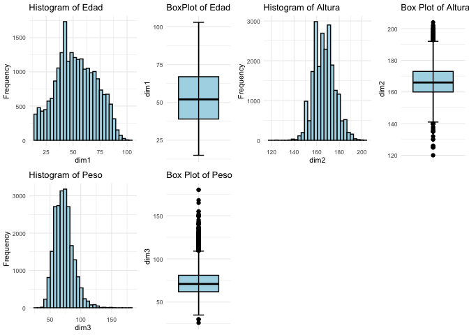

# Introducción

## dataset

En este cuaderno vamos a analizar el dataset llamado
[*salud_reg.xlsx*](https://github.com/davidperezros/ine_sg_difusion_explica_datasets/blob/b0b3860a88992099e5136b0ddf790731ce44114d/Datasets/salud_reg.xlsx).
Este contiene **microdatos** relativos a la [**Encuesta Nacional de
Salud**](https://www.ine.es/dyngs/INEbase/es/operacion.htm?c=Estadistica_C&cid=1254736176783&menu=resultados&secc=1254736195295&idp=1254735573175#!tabs-1254736195295)
a personas en 2017. Altura, Peso, Edad, Sexo e IMC del encuestado con el
fin de hacer una regresión del Peso en función del resto de variables y
explicar por qué es interesante este estudio.

Concretamente tenemos las siguietnes variables:

-   **Edad**: Edad en años cumplidos del encuestado.

-   **Sexo** : Sexo del encuestado (1=Hombre, 0=Mujer).

-   **Altura** : Edad en cm del encuestado.

-   **Peso** : Peso en kg del encuestado.

-   **IMC** : “Clasificación del IMC de la persona.

    -   1: Peso insuficiente
    -   2: Normopeso
    -   3: Sobrepeso
    -   4: Obesidad

**Nota**: Notar que el Índice de Masa Corporal (IMC) es un indicador que
pone en relación el peso (en kg) de la persona, con su altura en metros
(al cuadrado). Informalmente, esta medida se toma como un indicador
básico del estado de salud de la persona.

Si conocieramos el IMC exacto, no tendría sentido efectuar el Análisis
de Regresión puesto que el Peso se podría calcular directamente
despejando IMC y Altura. Sin embarago, tenemos categorías para el IMC,
que son: Peso Insuficiente, Nomal, Sobrepeso y Obesidad. Bajo este
paradigma tiene sentido plantear la regresión para ver si somos
capacedes de recuperar el Peso de una persona, sin conocer directamente
su IMC, sino la clase en la que cae, junto con su Altura. Además se verá
si el resto de variables ayudan a estimar el Peso.

## Descripción del trabajo a realizar

**(Esto irá en la web de explica)** Se pretende hacer una regresión
lineal que explique el Peso en función del resto de las variables.

-   Hacer un análisis exploratorio.
-   Analizar el modelo planteado y su ajuste de bondad.
-   Hacer una conclusión.

# Análisis Exploratorio (EDA[1])

Lo primero de todo vamos a cargar las librearias necesarias para
ejecutar el resto del código del trabajo:

``` r
library(readxl)  # Para leer los excels
#library(kableExtra) # Para dar formato a las tablas html
library(knitr)
library(gridExtra)  # Para cargar bien las tab
library(car)   # for bonfferroni test
```

Ahora leemos los datos del excel correspondientes a la pestaña *“Datos”*
y vemos si hay algún NA o algún valor igual a 0 en nuestro dataset.
Vemos que no han ningún NA (missing value) en el dataset luego no será
necesario realizar ninguna técnica para imputar los missing values o
borrar observaciones.

``` r
salud <- read_excel("/Users/davpero/ine_sg_difusion_explica_datasets/Datasets/salud_reg.xlsx",sheet = "Datos")
```

``` r
anyNA(salud)   #Any missing data 
```

    ## [1] FALSE

``` r
summary(salud)
```

    ##       EDAD            SEXO               Altura           Peso       
    ##  Min.   : 15.00   Length:22019       Min.   :120.0   Min.   : 26.00  
    ##  1st Qu.: 39.00   Class :character   1st Qu.:160.0   1st Qu.: 62.00  
    ##  Median : 52.00   Mode  :character   Median :166.0   Median : 71.00  
    ##  Mean   : 52.84                      Mean   :166.7   Mean   : 72.66  
    ##  3rd Qu.: 67.00                      3rd Qu.:173.0   3rd Qu.: 81.00  
    ##  Max.   :103.00                      Max.   :204.0   Max.   :180.00  
    ##      IMC           
    ##  Length:22019      
    ##  Class :character  
    ##  Mode  :character  
    ##                    
    ##                    
    ## 

``` r
table(salud$SEXO)
```

    ## 
    ##     0     1 
    ## 11701 10318

``` r
table(salud$IMC)
```

    ## 
    ##    1    2    3    4 
    ##  475 9301 8333 3910

**Resumen de la variable EDAD:**

-   La edad varía entre 15 y 103 años.

-   La mediana (50º percentil) de la edad es 52 años.

-   La media de la edad es aproximadamente 52.84 años.

-   El rango intercuartílico (IQR) de la edad va desde el primer cuartil
    (Q1) a Q3 (39 a 67 años).

-   Tabla de frecuencia para la variable SEXO:

-   **Hay dos categorías de sexo representadas como “0” y “1”.**

-   Hay 11,701 individuos clasificados como “0” ( mujeres).

-   Hay 10,318 individuos clasificados como “1” ( hombres).

**Tabla de frecuencia para la variable IMC:** Hay cuatro categorías de
índice de masa corporal (IMC) representadas como “1”, “2”, “3” y “4”. -
La frecuencia de la categoría “1” es 475. - La frecuencia de la
categoría “2” es 9,301. - La frecuencia de la categoría “3” es 8,333. -
La frecuencia de la categoría “4” es 3,910.


<p class="caption">
Plots de todas las dimensiones.
</p>

    ## [1] 812

En los histogramas vemos la forma de cada distribucion las cuales
parecen razonables con la idea que podemos tener preconcebida acerca de
dichas variables. En la gráfica de la altura se observamos que es
bastante más simétrica que el peso, que presenta asimetría postiva. Esto
se puede deber a que sobre nuestra altura nosotros no jugamos ningún
papel directo, suele venir influencia por la genética y factores fuera
del alcance de nuestra mano, de ahí que sea muy simétrica. Sin embargo,
el peso es muy fácil aumentarlo disminuirlo. Generalmente en una
sociedad desarollada es normal tener más facilidad para comer por exceso
que por deceso, luego parece razonable que esté sesgada hacia la
derecha.

# Regresión Lineal

## Hipótesis y indicadores de bondad

Para que una regresión lineal proporcione un buen ajsute a los datos
debe cumplir una serie de requisitos que por tanto deben ser verificados
al llevar a cabo el estudio. Recordar que la regresión lineal se expresa
como:

**Y** = **X****β** + **ε**
donde **Y** es la variable respuesta, **X** los predictores, **β** los
coeficientes de la regresión y **ε** el error.
$$
\mathbf{Y}=\left\[\begin{array}{c}
y_1 \\
y_2 \\
\vdots \\
y_n
\end{array}\right\] \quad \mathbf{X}=\left\[\begin{array}{cccc}
1 & x\_{11} & \ldots & x\_{1 k} \\
1 & x\_{21} & \ldots & x\_{2 k} \\
\vdots & \ddots & \vdots & \\
1 & x\_{n 1} & \ldots & x\_{n k}
\end{array}\right\] \quad \boldsymbol{\beta}=\left\[\begin{array}{c}
\beta_0 \\
\beta_1 \\
\vdots \\
\beta_k
\end{array}\right\] \quad \boldsymbol{\varepsilon}=\left\[\begin{array}{c}
\varepsilon_1 \\
\varepsilon_2 \\
\vdots \\
\varepsilon_n
\end{array}\right\]
$$

## Modelo

Inicialmente vamos a considerar un modelo con todas variables
predictoras para intentar predecir el
*i**n**d**i**c**e*\_*t**o**t**a**l* y veremos si este modelo cumple las
hipótesis necesarias y cuan bueno es.

``` r
#Convertir a factor las que toquen

salud$SEXO<-as.factor(salud$SEXO)
salud$IMC<-as.factor(salud$IMC)

#Modelo inicial
lm1<-lm(Peso~EDAD+Altura+IMC+SEXO,salud)

summary(lm1)
```

    ## 
    ## Call:
    ## lm(formula = Peso ~ EDAD + Altura + IMC + SEXO, data = salud)
    ## 
    ## Residuals:
    ##     Min      1Q  Median      3Q     Max 
    ## -16.945  -3.845  -0.136   3.511  79.106 
    ## 
    ## Coefficients:
    ##               Estimate Std. Error t value Pr(>|t|)    
    ## (Intercept) -94.973099   1.026730 -92.501   <2e-16 ***
    ## EDAD          0.027834   0.002286  12.174   <2e-16 ***
    ## Altura        0.854325   0.005845 146.163   <2e-16 ***
    ## IMC2         13.427830   0.270835  49.579   <2e-16 ***
    ## IMC3         26.165190   0.274682  95.256   <2e-16 ***
    ## IMC4         43.389736   0.282822 153.417   <2e-16 ***
    ## SEXO1         1.002444   0.106483   9.414   <2e-16 ***
    ## ---
    ## Signif. codes:  0 '***' 0.001 '**' 0.01 '*' 0.05 '.' 0.1 ' ' 1
    ## 
    ## Residual standard error: 5.734 on 22012 degrees of freedom
    ## Multiple R-squared:  0.8521, Adjusted R-squared:  0.852 
    ## F-statistic: 2.113e+04 on 6 and 22012 DF,  p-value: < 2.2e-16

A primera vista vemos un valor de **Multiple R-squared: 0.8521,**, lo
cual es bastante alto y por tanto nuestro modelo parece capturar bien la
variabilidad de la variable respuesta, concretamente un 85%. Sin
embargo, en los sucesivos modelos que plantemos no podemos usar como
criterio de comparación el *R* − *s**q**u**a**r**e**d* pues aumenta a la
vez que lo hace el número de variables, y por tanto para comparar
modelos entre si se debe usar el **Adjusted R-squared** (que tiene en
cuenta el número de variables).

En la línea de los residuos no parece haber contraindicaciones a que
estos sigan una distribución normal centrada en cero puesto que tenemos
unas medidas de dispersión bastante simétricas. No osbtante, más
adelante se procederán a hacer los test pertinentes.

Vamos a quitarle alguna variable a ver que obtenemos:

``` r
# Sin Sexo 
lm2<-lm(Peso~EDAD+Altura+IMC,salud)
summary(lm2)
```

    ## 
    ## Call:
    ## lm(formula = Peso ~ EDAD + Altura + IMC, data = salud)
    ## 
    ## Residuals:
    ##     Min      1Q  Median      3Q     Max 
    ## -16.894  -3.890  -0.128   3.542  79.269 
    ## 
    ## Coefficients:
    ##               Estimate Std. Error t value Pr(>|t|)    
    ## (Intercept) -1.010e+02  8.013e-01 -126.09   <2e-16 ***
    ## EDAD         3.110e-02  2.264e-03   13.73   <2e-16 ***
    ## Altura       8.912e-01  4.349e-03  204.90   <2e-16 ***
    ## IMC2         1.358e+01  2.709e-01   50.11   <2e-16 ***
    ## IMC3         2.644e+01  2.737e-01   96.61   <2e-16 ***
    ## IMC4         4.368e+01  2.817e-01  155.02   <2e-16 ***
    ## ---
    ## Signif. codes:  0 '***' 0.001 '**' 0.01 '*' 0.05 '.' 0.1 ' ' 1
    ## 
    ## Residual standard error: 5.746 on 22013 degrees of freedom
    ## Multiple R-squared:  0.8515, Adjusted R-squared:  0.8514 
    ## F-statistic: 2.524e+04 on 5 and 22013 DF,  p-value: < 2.2e-16

``` r
# Sin IMC
lm3<-lm(Peso~EDAD+Altura,salud)
```

Vemos que el Sexo no parece tener mucha importancia, no así el IMC que
cuando lo sustraemos del modelo experimenta una bajada grande de bondad.
Vamos a interpretar ahora los parámetros del modelo 1:

``` r
summary(lm1)
```

    ## 
    ## Call:
    ## lm(formula = Peso ~ EDAD + Altura + IMC + SEXO, data = salud)
    ## 
    ## Residuals:
    ##     Min      1Q  Median      3Q     Max 
    ## -16.945  -3.845  -0.136   3.511  79.106 
    ## 
    ## Coefficients:
    ##               Estimate Std. Error t value Pr(>|t|)    
    ## (Intercept) -94.973099   1.026730 -92.501   <2e-16 ***
    ## EDAD          0.027834   0.002286  12.174   <2e-16 ***
    ## Altura        0.854325   0.005845 146.163   <2e-16 ***
    ## IMC2         13.427830   0.270835  49.579   <2e-16 ***
    ## IMC3         26.165190   0.274682  95.256   <2e-16 ***
    ## IMC4         43.389736   0.282822 153.417   <2e-16 ***
    ## SEXO1         1.002444   0.106483   9.414   <2e-16 ***
    ## ---
    ## Signif. codes:  0 '***' 0.001 '**' 0.01 '*' 0.05 '.' 0.1 ' ' 1
    ## 
    ## Residual standard error: 5.734 on 22012 degrees of freedom
    ## Multiple R-squared:  0.8521, Adjusted R-squared:  0.852 
    ## F-statistic: 2.113e+04 on 6 and 22012 DF,  p-value: < 2.2e-16

Vemos los siguientes coeficientes:

-   *β*(*E**D**A**D*): tiene un valor muy bajo (0.02), siendo positivo.
    Esto indica que no parece tener mucho peso en el modelo y que
    conforme aumente la edad, aumenta el Peso de la persona muy
    ligeramente, lo cual podría parecer razonable.

-   *β*(*A**l**t**u**r**a*): tiene un valor de (0.85), siendo positivo.
    Parece razonable que sea mayor que el del beta relativo a la edad
    puesto que a más altura, más posibilidad de tener mas masa y por
    tanto más peso. De ahí que además sea positivo.

Destacar que ahora los siguientes betas se refieren a la variable IMC
que es categórica. Es por ello que se toma como referencia la primera
categoría (IMC=1) y los coeficientes representan el cambio de pasar de
una categoría a otra.

-   *β*(*I**M**C*2): tiene un valor bastante alto (13.42), siendo
    positivo. Esto indica que al pasar de la clase IMC=1 A IMC=2, el
    peso aumenta en 13.42 puntos. Esto parece muy razonable puesto que
    en IMC=1 se representaba la gente con peso insuficiente y en IMC=2
    la gente con peso normal.

-   *β*(*I**M**C*3): tiene un valor bastante alto (26), siendo positivo.
    Esto indica que al pasar de la clase IMC=1 A IMC=3, el peso aumenta
    en 13.42 puntos. Esto parece muy razonable puesto que en IMC=1 se
    representaba la gente con peso insuficiente y en IMC=3 la gente con
    sobrepeso. Además también es más grande que el beta anterior,
    indicando que es mas grande el cambio de peso entre gente con peso
    insuficiente y sobrepeso que entre las personas con peso
    insuficiente y peso normal.

-   *β*(*I**M**C*4): tiene un valor bastante alto (43), siendo positivo.
    Esto indica que al pasar de la clase IMC=1 A IMC=4, el peso aumenta
    en 13.42 puntos. Esto parece muy razonable puesto que en IMC=1 se
    representaba la gente con peso insuficiente y en IMC=4 la gente con
    obesidad. Además también es más grande que los betas anteriores,
    indicando que es mas grande el cambio de peso entre gente con peso
    insuficiente y obesidad que entre el resto de clases.

-   *β*(*S**E**X**O*1): tiene un valor igual a 1 (+1), siendo positivo.
    Puesto que es una variable factor, esto indica que pasar de la
    categoría base, mujer, a hombre, aumenta el peso. Esto también
    parece razonable puesto que manteniendo el resto de variables
    constantes, los hombres suelen tender a estar más musculados y por
    tanto tienden a pesar más.

# Conclusion

El modelo inicial considerado tiene buenos inidcadores de bondad de
ajuste. Además interpretando los resultados parece razonable todos los
coeficientes e indicadores obtenidos.

[1] EDA viene del Inglés *Exploratory Data Analysis* y son los pasos
relativos en los que se exploran las variables para tener una idea de
que forma toma el dataset.
