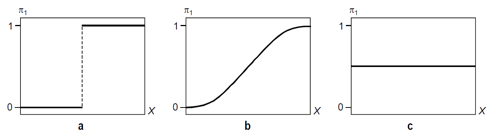

```{r setup, include=FALSE}
knitr::opts_chunk$set(echo = TRUE,fig.align='center',warning=FALSE,message=FALSE)


# fig.align= 'center para que nos centre todas figuras que se muestran
# warning = FALSE para que no muestre mensajes de warning
# message = FALSE para que no muestre mensajes automáticos cuando carga paquetes y demás en el output

```

# Introducción

## dataset

En este cuaderno vamos a analizar la existencia del llamado *"ascensor
social"* en España a partir de los microdatos de la Encuesta de
Condiciones de Vida (ECV) del año 2019. Dicho análisis nos sirve como
excusa para tratar de mostrar en qué consiste una regresión logística y
cómo llevarla a cabo en R.

En primer lugar, debemos definir qué es eso del "ascensor social" y cómo
vamos a tratar de analizarlo nosostros. Éste **se define como** la
posibilidad de ascender o descender de clase social. Aunque podemos
considerar que la pertenencia a una determinada clase social - si es que
éstas existen de forma estanca y perfectamente distinguible - se explica
por una combinación de aspectos: nivel económico, cultural, de estudios,
etc, nosotros nos vamos a centrar simplemente en el nivel económico.

Ver fichero
[*Dataset_cleaning.rmd*](https://github.com/davidperezros/ine_sg_difusion_explica_datasets/blob/8afaee7bf19634c1d7a0676c81d63ffeaef3def7/Notebooks/Logistic%20Regression/ECV/Dataset_cleaning.md)
para ver cómo se han tratado dichos microdatos hasta obtener un conjunto
de datos adecuado para la regresión logística, y que tomaremos aquí como
punto de partida.

```{r librerias}
# Librerias
library(readxl)  # Para leer los excels

```

Cargamos entonces el conjunto de datos:

```{r cargar_datos}
datos1 <- read_excel("/Users/davpero/ine_sg_difusion_explica_datasets/Datasets/ECV_microdatos.xlsx",sheet = "Datos")
```

Concretamente tenemos las siguientes variables:

-   **MSE** (Mejora Situación Económica): Variable binaria, 1= ha
    mejorado la calidad de vida del encuesado respecto a su infancia,
    0=no ha mejorado. teniendo en cuenta las nueve dimensiones.
-   **Factor_de_elevacion** : Factor de elevación para cada observación
    respecto a la población total.
-   **Estado_civil** : Estado civil del encuestado. 0=No casado,
    1=Casado
-   **Nivel_Estudios** : Nivel estudios del encuestado. 0=Nivel bajo,
    1=Nivel superior
-   **Ano_Nacimiento** : Año de nacimiento del encuestado.

## Descripción del trabajo a realizar

**(Esto irá en la web de explica)** Se pretende hacer una regresión
logística que clasifique la variable respuesta *MSE* - Mejora de la Situación Ecnonómica del encuestado respecto a su adolescencia en casa- en función de varios predictores, tanto continuos (*Ano_Nacimiento*) como categóricos (*Estado_civil*, *Nivel_Estudios*).

  - Hacer un análisis exploratorio.
  - **IMPORTANTE**: Convertir a factor las variables que lo sean.
  - Plantear diversos modelos según variables incluidas.
  - Compararlos con ANOVA y ROC CURVE.
  - Para el modelo seleccionado, explicar los coeficientes, odds ratio,... 


# Análisis Exploratorio (EDA[^1])

[^1]: EDA viene del Inglés *Exploratory Data Analysis* y son los pasos
    relativos en los que se exploran las variables para tener una idea
    de que forma toma el dataset.

Lo primero de todo vamos a cargar las librearias necesarias para
ejecutar el resto del código del trabajo:

```{r librerias2 }
library(dplyr)      # Para tratamiento de dataframes


```

```{r porcentaje,out.width="50%",echo=FALSE}
# Creamos un gráfico de quesito o de sectores para ver qué proporción de personas ha mejorado su situación económica:

datos_quesito <- c(nrow(filter(datos1, MSE == 1)), nrow(filter(datos1, MSE == 0)))
etiquetas <- c("Ha mejorado su situación", "No ha mejorado")

porcentajes <- paste0(round(datos_quesito / sum(datos_quesito) * 100, 1), "%")
colores <- c("lightgreen", "lightcoral")

pie(datos_quesito, labels = porcentajes, col = colores, radius = 1.05, cex = 1)
legend("topleft", etiquetas, cex = 0.7, fill = colores)
```

# Clasificación: Regresión Logística

## Introducción 
Un análisis de regresión logística es una técnica estadística
multivariante que tiene como finalidad pronosticar o explicar los
valores de una variable dependiente categórica a partir de una
(regresión logística simple) o más (regresión logística múltiple)
variables independientes categóricas o continuas. Dichas variables
independientes reciben el nombre de covariables. **Asimismo, a diferencia de lo que suele hacerse cuando tenemos una variable dependiente continua, cuando ésta es categórica, no interesa describir o pronosticar los valores concretos de dicha variable, sino la probabilidad de pertenecer a cada una de las categorías de la misma.**

Aunque matemáticamente se pueda ajustar un modelo de regresión lineal
clásico a la relación entre una variable dependiente categórica y una o
varias covariables, cuando la variable dependiente es dicotómica
(regresión logística binaria, caso más sencillo de regresión logística)
no es apropiado utilizar un modelo de regresión lineal porque una
variable dicotómica no se ajusta a una distribución normal, sino a una
binomial. Ignorar esta cuestión podría llevar a obtener probabilidades
imposibles: menores que cero o mayores que uno.

Para evitar este problema, es preferible utilizar funciones que realicen
predicciones comprendidas entre un máximo y un mínimo. Una de estas
funciones - posiblemente la más empleada - es la curva logística o
función sigmoide:

$$\begin{align}
\sigma(Y) = \frac{1}{1+e^{-(Y)}} =  \frac{1}{1+e^{-(\beta_0 + \beta_1X_1 + \beta_2X_2 + ... + \beta_nX_n + ϵ)}} = P(Y=1)
\end{align}$$

De esta forma, para valores positivos muy grandes de $Y$, $e^{-Y}$ es
aproximadamente cero, por lo que el valor de la función es 1; mientras
que para valores negativos muy grandes de Y, $e^{-Y}$ tiende a infinito,
haciendo que el valor de la función sea 0.

A continuación, para simplificar un poco las cosas, consideremos el
modelo de regresión logística más sencillo: regresión logística binaria
simple (una sola covariable):

\[ \begin{align}
P(Y=1)=\frac{1}{1+e^{-(\beta_0 + \beta_1X_1 + ϵ)}}
\end{align}
\]


La interpretación de esta función es muy similar a la de una regresión
lineal: el coeficiente $\beta_0$ representa la posición de la curva
sobre el eje horizontal o de abscisas (más hacia la izquierda o más
hacia la derecha); mientras que $\beta_1$ representa la pendiente de la
curva, es decir, cuán inclinada está en su parte central (cuanto más
inclinada, mayor capacidad de discriminar entre los dos valores de la
variable dependiente).


```{r,echo=FALSE,out.width="50%"}

```


Esta imagen, sacada del libro *Análisis de datos en Ciencias Sociales y
de la Salud III (Pardo et al., 2012)* muestra tres regresiones logísticas
con el mismo coeficiente , pero distinto poder discriminante (diferente
): la curva de la izquierda tendría un poder de discriminación perfecto,
mientras que la de la derecha no discrimina nada (la del medio sería un
caso intermedio entre los dos extremos). Por lo tanto, podemos decir que
una covariable será mejor predictora cuanto mayor sea el coeficiente $\beta$ que
genere. [Aclaración: en la imagen, $\pi_1 = P(Y=1)$]

Si estuviésemos ante una regresión logística múltiple, cada variable
independiente recibiría una ponderación proporcional a su capacidad para
predecir Y.


# Modelo

# Modelo práctico

**IMPORTANTE**: Convertir a factor las variables que tengan que ser tratadas como tal, de lo contrario R las tratará como numéricas. Además, la variable respuesta debe tener los niveles codificados como $0$ y $1$ para poder usar la funcion `glm`.
```{r factor}
datos1$Estado_civil <- as.factor(datos1$Estado_civil)
datos1$Nivel_Estudios <- as.factor(datos1$Nivel_Estudios)
datos1$MSE <- as.factor(datos1$MSE)
```


A continuación presentamos tres posibles modelos y posteriormente elegiremos uno de ellos.
  - **lmod1** : Queremos clasificar la MSE en función del Año de Nacimiento de la persona (numérica).
  - **lmod2** : Queremos clasificar la MSE en función del Año de Nacimiento de la persona (numérica) y el Estado_civil (categórica).
  - **lmod3** : Queremos clasificar la MSE en función del Año de Nacimiento de la persona (numérica), el Estado_civil (categórica) y el Nivel de Estudios (categórica) y .

```{r modelos}
# lmod1
lmod1 <- glm(formula = MSE ~ Ano_Nacimiento, family = binomial(link = logit), data = datos1)
summary(lmod1)

# lmod2
lmod2 <- glm(formula = MSE ~ Ano_Nacimiento + Estado_civil, family = binomial(link = logit), data = datos1)
summary(lmod2)

# lmod3
lmod3 <- glm(formula = MSE ~ Ano_Nacimiento + Estado_civil + Nivel_Estudios, family = binomial(link = logit), data = datos1)
summary(lmod3)


```


```{r}
anova(lmod2, lmod3, test = "Chisq")

library(Epi)
# The ROC function
ROC(form = MSE ~ Estado_civil + Ano_Nacimiento + Nivel_Estudios, data = datos1, plot = "ROC", lwd = 3, cex = 1.5)


table(datos1$Ano_Nacimiento)
```


```{r}
library("MASS")
lda.class.Iris <- lda(MSE ~ Ano_Nacimiento, datos1)
library("klaR")
partimat(MSE ~ Ano_Nacimiento+Factor_de_elevacion, datos1,method="lda")

datos1 %>% ggplot(aes(x = Ano_Nacimiento)) +  
  geom_density(aes(group = MSE, 
                   colour = MSE, 
                   fill = MSE),
               alpha = 0.2)


```

```{r}
datos2 <- read_excel("/Users/davpero/ine_sg_difusion_explica_datasets/Datasets/ECV_microdatos copia.xlsx",sheet = "Datos")
```
```{r}
datos2<-na.omit(datos2)
datos2 %>% ggplot(aes(x = Ano_Nacimiento)) +  
  geom_density(aes(group = MSE, 
                   colour = MSE, 
                   fill = MSE),
               alpha = 0.2)
```

# Conclusiones


