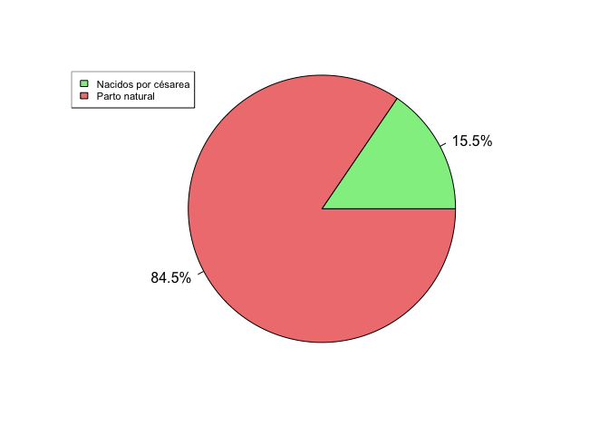
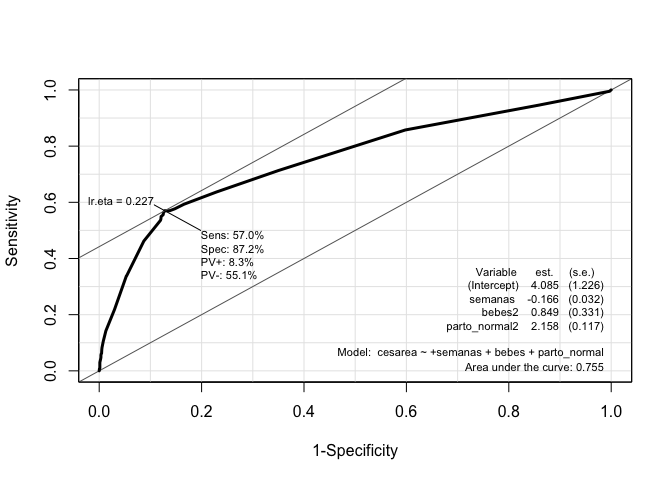

# Introducción

## dataset

En este cuaderno vamos a analizar la presencia de una cesárea en un
parto a partir de los microdatos de la **Estadística de nacimientos.
Movimiento natural de la población.** Concretamente, se han tomado los
datos relativos a **partos, 2022** y los relativos a la Comunidad
Autónoma de **Navarra**.. Dicho análisis nos sirve como excusa para
tratar de mostrar en qué consiste una regresión logística y cómo
llevarla a cabo en R.

Ver fichero
[*Dataset_cleaning.rmd*](https://github.com/davidperezros/ine_sg_difusion_explica_datasets/blob/546d12c723434e97ea605ed45e153680f7be834a/Notebooks/Logistic%20Regression/Partos/Dataset_cleaning.md)
para ver cómo se han tratado dichos microdatos hasta obtener un conjunto
de datos adecuado para la regresión logística, y que tomaremos aquí como
punto de partida.

``` r
# Librerias
library(readxl) # Para leer los excels
```

Cargamos entonces el conjunto de datos:

``` r
datos1 <- read_excel("/Users/davpero/ine_sg_difusion_explica_datasets/Datasets/Partos.xlsx", sheet = "Datos")
```

Concretamente tenemos las siguientes variables:

-   **bebes**: Número de bebés nacidos en el parto. (categórica)
-   **semanas**: Número de semanas del embarazo.
-   **edad_madre**: Edad de la madre en años cumplidos.
-   **cesarea**: Si se ha llevado a cabo una césarea en el parto
    (Categórica. 0=no, 1=si).
-   **parto_normal**: Si el parto transcurrió con normalidad.
    (Categórica. 1=normal, 2=complicaciones)

## Descripción del trabajo a realizar

**(Esto irá en la web de explica)** Se pretende hacer una regresión
logística que clasifique la variable respuesta *cesarea* - si en el
parto se efectuo una césarea - en función de varios predictores, tanto
continuos (*semanas, edad_madre*) como categóricos (*bebes*).

-   Hacer un análisis exploratorio.
-   **IMPORTANTE**: Convertir a factor las variables que lo sean.
-   Plantear diversos modelos según variables incluidas.
-   Compararlos con ANOVA y ROC CURVE.
-   Para el modelo seleccionado, explicar los coeficientes, odds ratio,…

# Análisis Exploratorio (EDA[1])

Lo primero de todo vamos a cargar las librearias necesarias para
ejecutar el resto del código del trabajo:

``` r
library(dplyr) # Para tratamiento de dataframes
library(ggplot2) # Nice plots
```



# Clasificación: Regresión Logística

## Introducción

Un análisis de regresión logística es una técnica estadística
multivariante que tiene como finalidad pronosticar o explicar los
valores de una variable dependiente categórica a partir de una
(regresión logística simple) o más (regresión logística múltiple)
variables independientes categóricas o continuas. Dichas variables
independientes reciben el nombre de covariables. **Asimismo, a
diferencia de lo que suele hacerse cuando tenemos una variable
dependiente continua, cuando ésta es categórica, no interesa describir o
pronosticar los valores concretos de dicha variable, sino la
probabilidad de pertenecer a cada una de las categorías de la misma.**

Aunque matemáticamente se pueda ajustar un modelo de regresión lineal
clásico a la relación entre una variable dependiente categórica y una o
varias covariables, cuando la variable dependiente es dicotómica
(regresión logística binaria, caso más sencillo de regresión logística)
no es apropiado utilizar un modelo de regresión lineal porque una
variable dicotómica no se ajusta a una distribución normal, sino a una
binomial. Ignorar esta cuestión podría llevar a obtener probabilidades
imposibles: menores que cero o mayores que uno.

Para evitar este problema, es preferible utilizar funciones que realicen
predicciones comprendidas entre un máximo y un mínimo. Una de estas
funciones - posiblemente la más empleada - es la curva logística o
función sigmoide:

$$\begin{align}
\eta=\log \left(\frac{p}{1-p}\right)= \beta_0 + \beta_1 X_1 + \beta_2 X_2 + \ldots , \quad \text{with } \quad p=P(Y=1)
\end{align}$$

Es decir, **estamos estimando con una regresión lineal el valor de *η*,
que sí es una v.a. continua - a diferencia de Y que es binaria-**.

Esto es, $p=\frac{e^\eta}{1+e^\eta}=\frac{1}{1+e^{-\eta}}$. De esta
forma, para valores positivos muy grandes de *η* llamado **odds**,
*e*<sup>*η*</sup> es aproximadamente cero, por lo que el valor de la
función es 1; mientras que para valores negativos muy grandes de *η*,
*e*<sup>−*η*</sup> tiende a infinito, haciendo que el valor de la
función sea 0.

A continuación, para simplificar un poco las cosas, consideremos el
modelo de regresión logística más sencillo: regresión logística binaria
simple (una sola covariable):

$$ 
\begin{align}
P(Y=1)=\frac{1}{1+e^{-(\beta_0 + \beta_1X_1 + ϵ)}}
\end{align}
$$

La interpretación de esta función es muy similar a la de una regresión
lineal: el coeficiente *β*<sub>0</sub> representa la posición de la
curva sobre el eje horizontal o de abscisas (más hacia la izquierda o
más hacia la derecha); mientras que *β*<sub>1</sub> representa la
pendiente de la curva, es decir, cuán inclinada está en su parte central
(cuanto más inclinada, mayor capacidad de discriminar entre los dos
valores de la variable dependiente).

Si estuviésemos ante una regresión logística múltiple, cada variable
independiente recibiría una ponderación proporcional a su capacidad para
predecir Y.

## Bondad de Ajuste e Interpretación Modelo

### Interpretación Modelo

Recordar que el modelo tomaba la forma
$$\eta=\log \left(\frac{p}{1-p}\right)= \beta_0 + \beta_1 X_1 + \beta_2 X_2 + \ldots , \quad \text{with } \quad p=P(Y=1)$$
, es decir, estamos estimando el **log(odds)**. Esto nos lleva a las
siguientes apreciaciones:

Aunque tanto *P*(*Y*=1), como *O**d**d**s*(*Y*=1), como logit (*Y*=1)
expresan la misma idea, están en distinta escala:

-   La **probabilidad** toma valores comprendidos entre 0 y 1.
-   La **odds** tiene un valor mínimo de cero y no tiene máximo.
-   La **logit** o **log(odds)** no tiene ni mínimo ni máximo.

Por ejemplo, a una probabilidad de 0,5, le corresponde una odds de 1 y
un logit de 0. Ahora bien, es cierto que razonar en términos de cambios
en los logaritmos resulta poco intuitivo. Por ello, es preferible
interpretar el cambio en las odds o en la razón de ventajas (también
llamada odds ratio, razón de probabilidades o razón de momios).

La interpretación más frecuente es interpretar los signos de los
coeficientes del modelo, es decir, los signos de
*β*<sub>1</sub>, …, *β*<sub>*k*</sub>.

-   Si *β*<sub>*i*</sub> \> 0 , se traduce en que un aumento de una
    unidad en la variable *x*<sub>*i*</sub> -si es continua- o un cambio
    de categoría -si *x*<sub>*i*</sub> es categórica- se traduce en un
    **aumento** de *β*<sub>*i*</sub> unidades el valor de **logit**. Es
    decir, **la probabilidad *p* **(que Y=1) aumenta, en función de
    $$p=\frac{e^\eta}{1+e^\eta}$$
    .

    -   Si *β*<sub>*i*</sub> \< 0 , se traduce en que un aumento de una
        unidad en la variable *x*<sub>*i*</sub> -si es continua- o un
        cambio de categoría -si *x*<sub>*i*</sub> es categórica- se
        traduce en una **disminución** de *β*<sub>*i*</sub> unidades el
        valor de **logit**. Es decir, **la probabilidad *p*** (que Y=1)
        disminuye, en función de
        $$p=\frac{e^\eta}{1+e^\eta}$$
        .

Una pregunta importante en cualquier análisis de regresión es si el
modelo propuesto se ajusta adecuadamente a los datos, lo que conduce
naturalmente a la noción de una prueba formal para la falta de ajuste (o
bondad de ajuste).

### Medidas Especifidad y Sensibilidad

La **especificidad** y la **sensibilidad** son medidas utilizadas para
evaluar el rendimiento de un modelo predictivo, especialmente en
problemas de clasificación binaria (donde solo hay dos clases). Las
definimos como:

-   **Sensibilidad** (Sensitivity): Es la proporción de verdaderos
    positivos (casos positivos correctamente identificados) respecto al
    total de casos positivos reales. Es la capacidad del modelo para
    identificar correctamente los casos positivos.
-   **Especificidad** (Specificity): Es la proporción de verdaderos
    negativos (casos negativos correctamente identificados) respecto al
    total de casos negativos reales. Representa la capacidad del modelo
    para identificar correctamente los casos negativos.

Un equilibrio entre ambas es deseable, pero depende del contexto
específico del problema y de las consecuencias de los falsos positivos y
falsos negativos. En el caso, por ejemplo, de detectar si un paciente
tiene cáncer o no, parece más razonable centrarse en los Falsos
Negativos, ya que un paciente que tiene cáncer no lo estamos detectando,
lo que lleva un riesgo ímplicito muy alto.

|                        | **Clasificado como Positivo** | **Clasificado como Negativo** | **Total** |
|--------------|-------------------------|-------------------------|---------|
| **Realmente Positivo** | Verdadero Positivo (VP)       | Falso Negativo (FN)           | VP + FN   |
| **Realmente Negativo** | Falso Positivo (FP)           | Verdadero Negativo (VN)       | FP + VN   |
| **Total**              | VP + FP                       | FN + VN                       |           |

**Sensibilidad** $\frac{{VP}}{{VP + FN}}$

**Especificidad:** $\frac{{VN}}{{FP + VN}}$

### Curva ROC

La **curva ROC** es una representación gráfica de la sensibilidad frente
a la tasa de falsos positivos a varios umbrales de clasificación. Se
utiliza comúnmente en análisis de clasificación para evaluar el
rendimiento de un modelo.

Para calcular el área bajo la curva ROC (AUC-ROC), se utiliza el área
debajo de la curva generada por la representación de la sensibilidad y
la tasa de falsos positivos. **Cuanto más cerca esté el AUC-ROC de 1,
mejor será el rendimiento del modelo**, ya que indica una mayor
capacidad de distinguir entre clases.

Es una medida de bondad porque evalúa qué tan bien puede discriminar un
modelo entre las clases positivas y negativas. Cuanto más se acerque el
AUC a 1, mejor será la capacidad del modelo para distinguir entre las
clases. Se utiliza para comparar y seleccionar modelos, donde un AUC
mayor indica un mejor rendimiento predictivo.

# Modelo

## Formulación

**IMPORTANTE**: Convertir a factor las variables que tengan que ser
tratadas como tal, de lo contrario R las tratará como numéricas. Además,
la variable respuesta debe tener los niveles codificados como 0 y 1 para
poder usar la funcion `glm`.

``` r
datos1$cesarea<-as.factor(datos1$cesarea)
datos1$bebes<-as.factor(datos1$bebes)
datos1$parto_normal<-as.factor(datos1$parto_normal)
```

A continuación presentamos tres posibles modelos y posteriormente
elegiremos uno de ellos.

-   **lmod1** : Queremos clasificar si hay césarea en el parto en
    función de edad_madre, semanas de gestación.
-   **lmod2** : Queremos clasificar si hay césarea en el parto en
    función de edad_madre, semanas de gestación, número de nacimientos
    en el parto.
-   **lmod3** : Queremos clasificar si hay césarea en el parto en
    función de edad_madre, semanas de gestación, número de nacimientos
    en el parto y si hubo complicaciones en el parto.

``` r
# lmod1
lmod1 <- glm(formula = cesarea ~ edad_madre+semanas, family = binomial(link = logit), data = datos1)
summary(lmod1)
```

    ## 
    ## Call:
    ## glm(formula = cesarea ~ edad_madre + semanas, family = binomial(link = logit), 
    ##     data = datos1)
    ## 
    ## Coefficients:
    ##             Estimate Std. Error z value Pr(>|z|)    
    ## (Intercept)  3.67592    1.15715   3.177  0.00149 ** 
    ## edad_madre   0.05222    0.01162   4.493 7.01e-06 ***
    ## semanas     -0.18442    0.02758  -6.688 2.27e-11 ***
    ## ---
    ## Signif. codes:  0 '***' 0.001 '**' 0.01 '*' 0.05 '.' 0.1 ' ' 1
    ## 
    ## (Dispersion parameter for binomial family taken to be 1)
    ## 
    ##     Null deviance: 2421.6  on 2808  degrees of freedom
    ## Residual deviance: 2353.4  on 2806  degrees of freedom
    ## AIC: 2359.4
    ## 
    ## Number of Fisher Scoring iterations: 4

``` r
# lmod2
lmod2 <- glm(formula = cesarea ~ edad_madre+semanas+bebes,family = binomial(link = logit),data=datos1)
summary(lmod2)
```

    ## 
    ## Call:
    ## glm(formula = cesarea ~ edad_madre + semanas + bebes, family = binomial(link = logit), 
    ##     data = datos1)
    ## 
    ## Coefficients:
    ##             Estimate Std. Error z value Pr(>|z|)    
    ## (Intercept)  2.71472    1.19260   2.276 0.022828 *  
    ## edad_madre   0.04917    0.01167   4.213 2.52e-05 ***
    ## semanas     -0.15782    0.02860  -5.518 3.44e-08 ***
    ## bebes2       1.11969    0.29308   3.820 0.000133 ***
    ## ---
    ## Signif. codes:  0 '***' 0.001 '**' 0.01 '*' 0.05 '.' 0.1 ' ' 1
    ## 
    ## (Dispersion parameter for binomial family taken to be 1)
    ## 
    ##     Null deviance: 2421.6  on 2808  degrees of freedom
    ## Residual deviance: 2339.5  on 2805  degrees of freedom
    ## AIC: 2347.5
    ## 
    ## Number of Fisher Scoring iterations: 4

``` r
# lmod3
lmod3 <- glm(formula = cesarea ~ edad_madre+semanas+bebes+parto_normal, family = binomial(link = logit), data = datos1)
summary(lmod3)
```

    ## 
    ## Call:
    ## glm(formula = cesarea ~ edad_madre + semanas + bebes + parto_normal, 
    ##     family = binomial(link = logit), data = datos1)
    ## 
    ## Coefficients:
    ##               Estimate Std. Error z value Pr(>|z|)    
    ## (Intercept)    2.65290    1.30581   2.032  0.04219 *  
    ## edad_madre     0.03975    0.01246   3.189  0.00143 ** 
    ## semanas       -0.16412    0.03164  -5.188 2.13e-07 ***
    ## bebes2         0.76749    0.33415   2.297  0.02163 *  
    ## parto_normal2  2.13934    0.11780  18.160  < 2e-16 ***
    ## ---
    ## Signif. codes:  0 '***' 0.001 '**' 0.01 '*' 0.05 '.' 0.1 ' ' 1
    ## 
    ## (Dispersion parameter for binomial family taken to be 1)
    ## 
    ##     Null deviance: 2421.6  on 2808  degrees of freedom
    ## Residual deviance: 2010.4  on 2804  degrees of freedom
    ## AIC: 2020.4
    ## 
    ## Number of Fisher Scoring iterations: 5

El tercer modelo tiene el valor más bajo de la **deviance residual**, lo
que indica un mejor ajuste del modelo a los datos en comparación con los
dos modelos anteriores. Esto sugiere que la inclusión de “parto_normal”
mejora la capacidad del modelo para explicar la variabilidad observada
en la variable de respuesta. Además, también es el modelo con el valor
más bajo para **AIC** luego parece razonable quedarnos con el.

Para este modelo vamos a calcular la matriz de confusión y el área ROC.
Como punto de corte para clasificar la osbervación como césarea o no,
tomamos *p=0.227* (obtenido más abajo al ver la ROC). Es decir, si bajo
el modelo una obsaervación presenta una predice una probabildiad de
césarea mayor de *0.227*, entonces lo clasificaremos como tal.

``` r
# confusion matrices
predicted3 <- predict(lmod3, data.frame(edad_madre = datos1$edad_madre, semanas = datos1$semanas, bebes = datos1$bebes, parto_normal=datos1$parto_normal), type = "response")
library(caret)
confusionMatrix(data = as.factor(ifelse(predicted3 > 0.227, 1, 0)), reference = datos1$cesarea, positive="1")
```

``` r
library(Epi)
# The ROC function

# lmod3
ROC(form = cesarea ~ +semanas+bebes+parto_normal, data = datos1, plot = "ROC", lwd = 3, cex = 1.5)
```


Observamos una Especifidad del 62% y una Sensibilidad del 50%. Esto
quiere decir que nuestro modelo es mejor evitando falsos positivos, que
falsos negativos. Es decir, que es mejor evitando que digamos que la
calidad de vida de una persona ha mejorado cuando realmente no lo ha
hecho, que al revés. Lo cual es deseable.

Destacar que el elemtno **Ir.eta** que aparece arriba, es el punto de
corte de la probabilidad. Es decir, si nuestra regresión logística
predice que hay una probabilidad mayor de 0.179 de que haya mejorado la
calidad de vida, nosotros lo clasificamos como que efectivamente ha
mejorado y si es menor, lo clasificamos como que no.

## Otras consideraciones

Podemos usar el presente modelo para predecir la probabilidad de cesárea
en función de las variables predictoras de nuevas observaciones.

## Interpretación coeficientes

Vamos a volver a sacar el summary del modelo para proceder a explicar
todo bien de nuevo.

``` r
summary(lmod2)
```

    ## 
    ## Call:
    ## glm(formula = cesarea ~ edad_madre + semanas + bebes, family = binomial(link = logit), 
    ##     data = datos1)
    ## 
    ## Coefficients:
    ##             Estimate Std. Error z value Pr(>|z|)    
    ## (Intercept)  2.71472    1.19260   2.276 0.022828 *  
    ## edad_madre   0.04917    0.01167   4.213 2.52e-05 ***
    ## semanas     -0.15782    0.02860  -5.518 3.44e-08 ***
    ## bebes2       1.11969    0.29308   3.820 0.000133 ***
    ## ---
    ## Signif. codes:  0 '***' 0.001 '**' 0.01 '*' 0.05 '.' 0.1 ' ' 1
    ## 
    ## (Dispersion parameter for binomial family taken to be 1)
    ## 
    ##     Null deviance: 2421.6  on 2808  degrees of freedom
    ## Residual deviance: 2339.5  on 2805  degrees of freedom
    ## AIC: 2347.5
    ## 
    ## Number of Fisher Scoring iterations: 4

-   **Ano_Nacimiento**: Por cada incremento unitario en el año de
    nacimiento, el logaritmo de odds de éxito en MSE disminuye
    aproximadamente en 0.026, manteniendo constante el Estado Civil.

-   **Estado_civil1**: Cuando el estado civil cambia de 0 (soltero) a 1
    (casado), el logaritmo de odds de éxito en MSE aumenta
    aproximadamente en 0.265, manteniendo constante el año de
    nacimiento.

**Interpretación coeficiente Año Nacimiento**

El rango del año de nacimiento abarca desde 1960 hasta 1993. La
disminución en el logaritmo de odds de éxito en la mejora de la
situación económica por cada año de aumento en el año de nacimiento,
implica una **disminución en la probabilidad de asociar esa persona a
una mejroa de la calidad de vida**. Esto puede asociarse con el contexto
histórico y socioeconómico de esas generaciones.

Las **personas nacidas en la década de 1960** provienen de un contexto
en el que sus padres experimentaron condiciones económicas precarias,
con la transición al estado de bienestar en esa época. A medida que
avanzaron en su vida adulta, se beneficiaron considerablemente de ese
cambio y disfrutaron de una mejor calidad de vida en comparación con su
infancia.

Sin embargo, para las **generaciones más recientes**, nacidas en los
años 80 y 90, ya crecieron en un entorno más establecido de bienestar.
Es probable que no hayan experimentado cambios tan significativos en su
calidad de vida a medida que envejecían. De hecho, es posible que en los
últimos años, hayan presenciado un deterioro en las condiciones
económicas, lo que explicaría la **tendencia a una disminución en el
logaritmo de odds de éxito en la mejora de la situación económica.**

**Interpretación coeficiente Estado Civil**

El **coeficiente positivo para el estado civil**, donde 0 representa
soltero y 1 casado, sugiere que las personas casadas tienen una
tendencia más positiva hacia la mejora de su situación económica en
comparación con las personas solteras. Esto puede deberse a varios
factores.

En contextos culturales y económicos, las personas casadas pueden tener
una mayor estabilidad financiera y apoyo mutuo, lo que les permite tener
un respaldo emocional y económico más sólido para enfrentar desafíos
financieros. Además, el matrimonio suele implicar compartir
responsabilidades financieras y planificación conjunta, lo que puede
conducir a decisiones más estables y a largo plazo en términos
económicos.

No obstante, esto es algo muy generalizado que puede que no sea así ya
que la situación económica depende de muchos factores.

# Conclusiones

Este modelo de regresión logística parece haber pasado todos los
supuestos de dicha regresión, con una tasa de acierto buena.

[1] EDA viene del Inglés *Exploratory Data Analysis* y son los pasos
relativos en los que se exploran las variables para tener una idea de
que forma toma el dataset.
