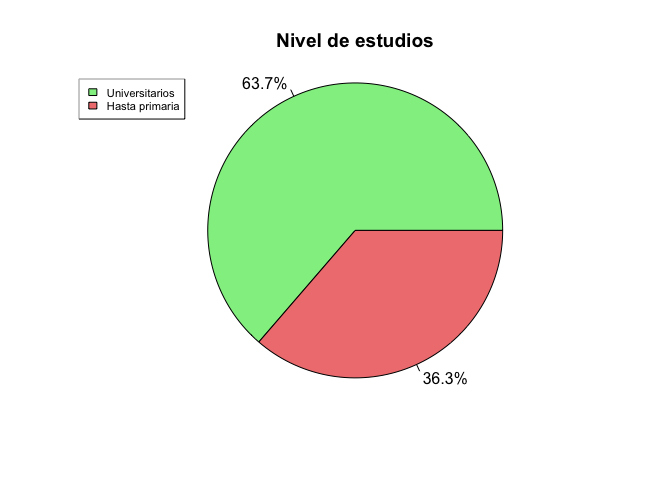
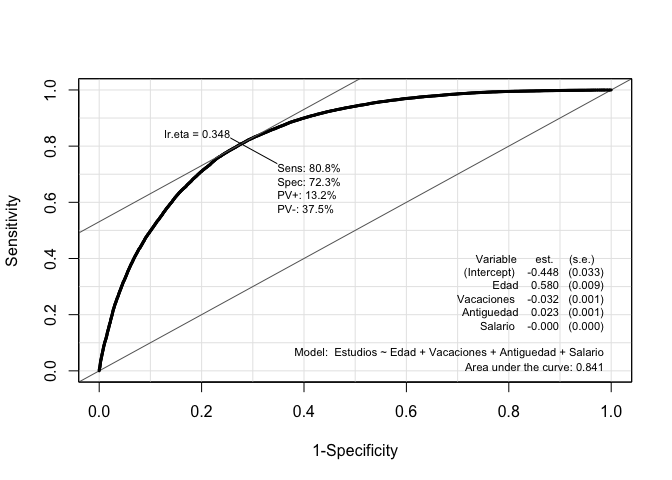
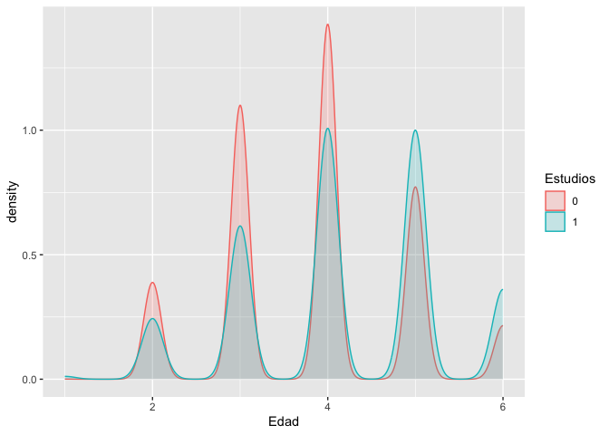
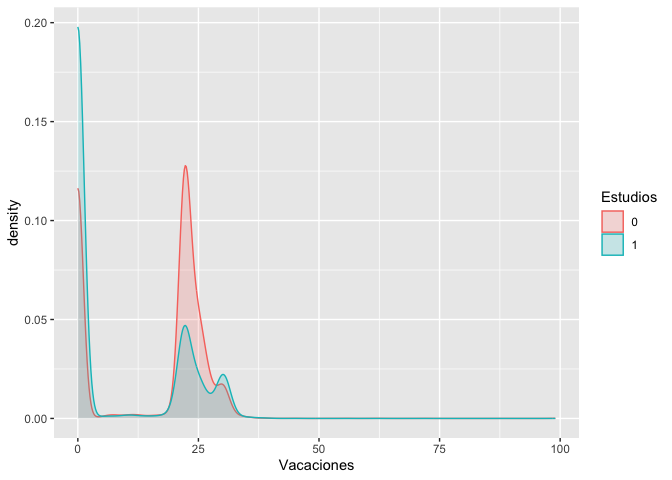
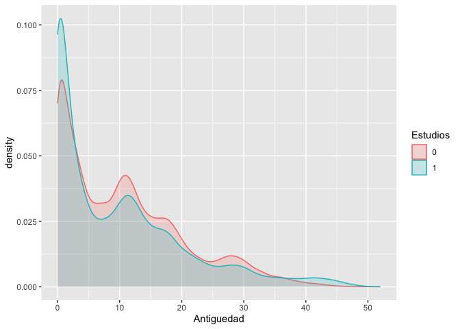

# Introducción

## dataset

En este cuaderno vamos a analizar el dataset llamado
[*laboral.xlsx*](https://github.com/davidperezros/ine_sg_difusion_explica_datasets/blob/42eef8692d340449b7cb7555b35f38ada190138a/Datasets/laboral.xlsx).
Este contiene microdatos relativos a la **Encuestas de estructura
salarial. Resultados**. Concretamente, datos correspondientes al año
2018. Las variables de interés son las siguientes:

-   **Estudios**: Nivel de estudios del encuestado. Valor 1 corresponde
    a individuos con muy bajo nivel académico (hasta primaria), y 0 a
    individuos con al menos nivel académico universitario.

-   **Salario**: Sueldo bruto anual.

-   **Edad**: Grupo de Edad del encuestado. Puesto que las clases tienen
    un orden intrínseco, la variable la vamos a tratar como
    cuantitativa.

    -   01 MENOS 19 AÑOS
    -   02 DE 20 A 29  
    -   03 DE 30 A 39  
    -   04 DE 40 A 49  
    -   05 DE 50 A 59  
    -   06 MÁS DE 59

-   **Antiguedad**: Años de antigüedad.

-   **Vacaciones**: Días de vacaciones al año.

El objetivo es mostrar en qué consiste una regresión logística y cómo
llevarla a cabo en R.

``` r
# Librerias
library(readxl) # Para leer los excels
library(dplyr) # Para tratamiento de dataframes
library(ggplot2) # Nice plots
library(Epi) # Para la ROC curve
```

Cargamos entonces el conjunto de datos:

``` r
datos <- read_excel("/Users/davpero/ine_sg_difusion_explica_datasets/Datasets/laboral.xlsx", sheet = "Datos")
```

## Descripción del trabajo a realizar

**(Esto irá en la web de explica)** Se pretende hacer una regresión
logística que clasifique la variable respuesta *Estudios* en función de
varios predictores, todos ellos continuos: *Edad*, *Vacaciones*,
*Antiguedad* y *Salario*.

-   Hacer un análisis exploratorio.
-   **IMPORTANTE**: Convertir a factor las variables que lo sean.
-   Plantear diversos modelos según variables incluidas.
-   Compararlos con ANOVA y ROC CURVE.
-   Para el modelo seleccionado, explicar los coeficientes, odds ratio,…

# Análisis Exploratorio (EDA[1])

Lo primero de todo vamos a cargar las librearias necesarias para
ejecutar el resto del código del trabajo:



Vemos que tenemos un porcentaje más grandae de gente con estudios
universitarios en la muestra que gente con estudios hasta primaria. De
datos con gente con estudios entre primaria y universitarios no
disponemos en esta muestra.

# Clasificación: Regresión Logística

## Introducción

Un análisis de regresión logística es una técnica estadística
multivariante que tiene como finalidad pronosticar o explicar los
valores de una variable dependiente categórica a partir de una
(regresión logística simple) o más (regresión logística múltiple)
variables independientes categóricas o continuas. Dichas variables
independientes reciben el nombre de covariables. **Asimismo, a
diferencia de lo que suele hacerse cuando tenemos una variable
dependiente continua, cuando ésta es categórica, no interesa describir o
pronosticar los valores concretos de dicha variable, sino la
probabilidad de pertenecer a cada una de las categorías de la misma.**

Aunque matemáticamente se pueda ajustar un modelo de regresión lineal
clásico a la relación entre una variable dependiente categórica y una o
varias covariables, cuando la variable dependiente es dicotómica
(regresión logística binaria, caso más sencillo de regresión logística)
no es apropiado utilizar un modelo de regresión lineal porque una
variable dicotómica no se ajusta a una distribución normal, sino a una
binomial. Ignorar esta cuestión podría llevar a obtener probabilidades
imposibles: menores que cero o mayores que uno.

Para evitar este problema, es preferible utilizar funciones que realicen
predicciones comprendidas entre un máximo y un mínimo. Una de estas
funciones - posiblemente la más empleada - es la curva logística o
función sigmoide:

$$
\eta=\log \left(\frac{p}{1-p}\right)= \beta_0 + \beta_1 X_1 + \beta_2 X_2 + \ldots , \quad \text{with } \quad p=P(Y=1)
$$

Es decir, **estamos estimando con una regresión lineal el valor de *η*,
que sí es una v.a. continua - a diferencia de Y que es binaria-**.

Esto es, $p=\frac{e^\eta}{1+e^\eta}=\frac{1}{1+e^{-\eta}}$. De esta
forma, para valores positivos muy grandes de *η* llamado **odds**,
*e*<sup>*η*</sup> es aproximadamente cero, por lo que el valor de la
función es 1; mientras que para valores negativos muy grandes de *η*,
*e*<sup>−*η*</sup> tiende a infinito, haciendo que el valor de la
función sea 0.

A continuación, para simplificar un poco las cosas, consideremos el
modelo de regresión logística más sencillo: regresión logística binaria
simple (una sola covariable):

$$
P(Y=1)=\frac{1}{1+e^{-(\beta_0 + \beta_1X_1 + ϵ)}}
$$

La interpretación de esta función es muy similar a la de una regresión
lineal: el coeficiente *β*<sub>0</sub> representa la posición de la
curva sobre el eje horizontal o de abscisas (más hacia la izquierda o
más hacia la derecha); mientras que *β*<sub>1</sub> representa la
pendiente de la curva, es decir, cuán inclinada está en su parte central
(cuanto más inclinada, mayor capacidad de discriminar entre los dos
valores de la variable dependiente).

## Bondad de Ajuste e Interpretación Modelo

### Interpretación Modelo

Recordar que el modelo tomaba la forma
$$\eta=\log \left(\frac{p}{1-p}\right)= \beta_0 + \beta_1 X_1 + \beta_2 X_2 + \ldots , \quad \text{with } \quad p=P(Y=1)$$
, es decir, estamos estimando el **log(odds)**. Esto nos lleva a las
siguientes apreciaciones:

Aunque tanto *P*(*Y*=1), como *O**d**d**s*(*Y*=1), como logit (*Y*=1)
expresan la misma idea, están en distinta escala:

-   La **probabilidad** toma valores comprendidos entre 0 y 1.
-   La **odds** tiene un valor mínimo de cero y no tiene máximo.
-   La **logit** o **log(odds)** no tiene ni mínimo ni máximo.

Por ejemplo, a una probabilidad de 0,5, le corresponde una odds de 1 y
un logit de 0. Ahora bien, es cierto que razonar en términos de cambios
en los logaritmos resulta poco intuitivo. Por ello, es preferible
interpretar el cambio en las odds o en la razón de ventajas (también
llamada odds ratio, razón de probabilidades o razón de momios).

La interpretación más frecuente es interpretar los signos de los
coeficientes del modelo, es decir, los signos de
*β*<sub>1</sub>, …, *β*<sub>*k*</sub>.

-   Si *β*<sub>*i*</sub> \> 0 , se traduce en que un aumento de una
    unidad en la variable *x*<sub>*i*</sub> -si es continua- o un cambio
    de categoría -si *x*<sub>*i*</sub> es categórica- se traduce en un
    **aumento** de *β*<sub>*i*</sub> unidades el valor de **logit**. Es
    decir, **la probabilidad *p* **(que Y=1) aumenta, en función de
    $$p=\frac{e^\eta}{1+e^\eta}$$
    .

    -   Si *β*<sub>*i*</sub> \< 0 , se traduce en que un aumento de una
        unidad en la variable *x*<sub>*i*</sub> -si es continua- o un
        cambio de categoría -si *x*<sub>*i*</sub> es categórica- se
        traduce en una **disminución** de *β*<sub>*i*</sub> unidades el
        valor de **logit**. Es decir, **la probabilidad *p*** (que Y=1)
        disminuye, en función de
        $$p=\frac{e^\eta}{1+e^\eta}$$
        .

Una pregunta importante en cualquier análisis de regresión es si el
modelo propuesto se ajusta adecuadamente a los datos, lo que conduce
naturalmente a la noción de una prueba formal para la falta de ajuste (o
bondad de ajuste).

### Medidas Especifidad y Sensibilidad

La **especificidad** y la **sensibilidad** son medidas utilizadas para
evaluar el rendimiento de un modelo predictivo, especialmente en
problemas de clasificación binaria (donde solo hay dos clases). Las
definimos como:

-   **Sensibilidad** (Sensitivity): Es la proporción de verdaderos
    positivos (casos positivos correctamente identificados) respecto al
    total de casos positivos reales. Es la capacidad del modelo para
    identificar correctamente los casos positivos.
-   **Especificidad** (Specificity): Es la proporción de verdaderos
    negativos (casos negativos correctamente identificados) respecto al
    total de casos negativos reales. Representa la capacidad del modelo
    para identificar correctamente los casos negativos.

Un equilibrio entre ambas es deseable, pero depende del contexto
específico del problema y de las consecuencias de los falsos positivos y
falsos negativos. En el caso, por ejemplo, de detectar si un paciente
tiene cáncer o no, parece más razonable centrarse en los Falsos
Negativos, ya que un paciente que tiene cáncer no lo estamos detectando,
lo que lleva un riesgo ímplicito muy alto.

|                        | **Clasificado como Positivo** | **Clasificado como Negativo** | **Total** |
|--------------|-------------------------|-------------------------|---------|
| **Realmente Positivo** | Verdadero Positivo (VP)       | Falso Negativo (FN)           | VP + FN   |
| **Realmente Negativo** | Falso Positivo (FP)           | Verdadero Negativo (VN)       | FP + VN   |
| **Total**              | VP + FP                       | FN + VN                       |           |

**Sensibilidad** $\frac{{VP}}{{VP + FN}}$

**Especificidad:** $\frac{{VN}}{{FP + VN}}$

### Curva ROC

La **curva ROC** es una representación gráfica de la sensibilidad frente
a la tasa de falsos positivos a varios umbrales de clasificación. Se
utiliza comúnmente en análisis de clasificación para evaluar el
rendimiento de un modelo.

Para calcular el área bajo la curva ROC (AUC-ROC), se utiliza el área
debajo de la curva generada por la representación de la sensibilidad y
la tasa de falsos positivos. **Cuanto más cerca esté el AUC-ROC de 1,
mejor será el rendimiento del modelo**, ya que indica una mayor
capacidad de distinguir entre clases.

Es una medida de bondad porque evalúa qué tan bien puede discriminar un
modelo entre las clases positivas y negativas. Cuanto más se acerque el
AUC a 1, mejor será la capacidad del modelo para distinguir entre las
clases. Se utiliza para comparar y seleccionar modelos, donde un AUC
mayor indica un mejor rendimiento predictivo.

# Modelo

## Formulación

**IMPORTANTE**: Convertir a factor las variables que tengan que ser
tratadas como tal, de lo contrario R las tratará como numéricas. Además,
la variable respuesta debe tener los niveles codificados como 0 y 1 para
poder usar la funcion `glm`. El resto de variables convertirlas a
numéricas en caso de que aplique.

``` r
datos$Edad  <- as.numeric(datos$Edad)
datos$Vacaciones  <- as.numeric(datos$Vacaciones )
datos$Antiguedad  <- as.numeric(datos$Antiguedad)
datos$Salario  <- as.numeric(datos$Salario)


# Pasar factores a 0=Universitarios y 1=Hasta Primaria
datos$Estudios <- as.factor(datos$Estudios)

# Ver resumen de datos y ver si hay NA
summary(datos)
```

    ##  Estudios       Edad         Vacaciones      Antiguedad      Salario      
    ##  0:63527   Min.   :1.000   Min.   : 0.00   Min.   : 0.0   Min.   :    63  
    ##  1:36255   1st Qu.:3.000   1st Qu.: 0.00   1st Qu.: 2.0   1st Qu.: 15200  
    ##            Median :4.000   Median :22.00   Median : 9.0   Median : 24959  
    ##            Mean   :3.955   Mean   :12.99   Mean   :10.5   Mean   : 30106  
    ##            3rd Qu.:5.000   3rd Qu.:23.00   3rd Qu.:16.0   3rd Qu.: 39228  
    ##            Max.   :6.000   Max.   :99.00   Max.   :52.0   Max.   :100000

``` r
sum(is.na(datos))
```

    ## [1] 0

A continuación presentamos tres posibles modelos y posteriormente
elegiremos uno de ellos.

-   **lmod1** : Queremos clasificar los Estudios en función de la edad
    de la persona (numérica).
-   **lmod2** : Queremos clasificar los Estudios en función de la edad
    de la persona (numérica) y las vacaciones (numérica).
-   **lmod3** : Queremos clasificar los Estudios en función de la edad
    de la persona (numérica), las vacaciones (numérica) y la Antigüedad
    (numérica).
-   **lmod4** : Queremos clasificar los Estudios en función de la edad
    de la persona (numérica), las vacaciones (numérica), la Antigüedad
    (numérica) y el Salario (numérica).

``` r
# lmod1
lmod1 <- glm(formula = Estudios ~ Edad, family = binomial(link = logit), data = datos)
summary(lmod1)
```

    ## 
    ## Call:
    ## glm(formula = Estudios ~ Edad, family = binomial(link = logit), 
    ##     data = datos)
    ## 
    ## Coefficients:
    ##              Estimate Std. Error z value Pr(>|z|)    
    ## (Intercept) -1.806239   0.026400  -68.42   <2e-16 ***
    ## Edad         0.311042   0.006306   49.33   <2e-16 ***
    ## ---
    ## Signif. codes:  0 '***' 0.001 '**' 0.01 '*' 0.05 '.' 0.1 ' ' 1
    ## 
    ## (Dispersion parameter for binomial family taken to be 1)
    ## 
    ##     Null deviance: 130778  on 99781  degrees of freedom
    ## Residual deviance: 128266  on 99780  degrees of freedom
    ## AIC: 128270
    ## 
    ## Number of Fisher Scoring iterations: 4

``` r
# lmod2
lmod2 <- glm(formula = Estudios ~ Edad+ Vacaciones, family = binomial(link = logit), data = datos)
summary(lmod2)
```

    ## 
    ## Call:
    ## glm(formula = Estudios ~ Edad + Vacaciones, family = binomial(link = logit), 
    ##     data = datos)
    ## 
    ## Coefficients:
    ##               Estimate Std. Error z value Pr(>|z|)    
    ## (Intercept) -1.3429591  0.0275630  -48.72   <2e-16 ***
    ## Edad         0.3542012  0.0066062   53.62   <2e-16 ***
    ## Vacaciones  -0.0530736  0.0005864  -90.50   <2e-16 ***
    ## ---
    ## Signif. codes:  0 '***' 0.001 '**' 0.01 '*' 0.05 '.' 0.1 ' ' 1
    ## 
    ## (Dispersion parameter for binomial family taken to be 1)
    ## 
    ##     Null deviance: 130778  on 99781  degrees of freedom
    ## Residual deviance: 119481  on 99779  degrees of freedom
    ## AIC: 119487
    ## 
    ## Number of Fisher Scoring iterations: 4

``` r
# lmod3
lmod3 <- glm(formula = Estudios ~ Edad+Vacaciones+Antiguedad, family = binomial(link = logit), data = datos)
summary(lmod3)
```

    ## 
    ## Call:
    ## glm(formula = Estudios ~ Edad + Vacaciones + Antiguedad, family = binomial(link = logit), 
    ##     data = datos)
    ## 
    ## Coefficients:
    ##               Estimate Std. Error z value Pr(>|z|)    
    ## (Intercept) -1.7050721  0.0294638  -57.87   <2e-16 ***
    ## Edad         0.5204287  0.0080291   64.82   <2e-16 ***
    ## Vacaciones  -0.0501357  0.0005933  -84.51   <2e-16 ***
    ## Antiguedad  -0.0321310  0.0008546  -37.60   <2e-16 ***
    ## ---
    ## Signif. codes:  0 '***' 0.001 '**' 0.01 '*' 0.05 '.' 0.1 ' ' 1
    ## 
    ## (Dispersion parameter for binomial family taken to be 1)
    ## 
    ##     Null deviance: 130778  on 99781  degrees of freedom
    ## Residual deviance: 118034  on 99778  degrees of freedom
    ## AIC: 118042
    ## 
    ## Number of Fisher Scoring iterations: 4

``` r
# lmod4
lmod4 <- glm(formula = Estudios ~ Edad+Vacaciones+Antiguedad+Salario, family = binomial(link = logit), data = datos)
summary(lmod3)
```

    ## 
    ## Call:
    ## glm(formula = Estudios ~ Edad + Vacaciones + Antiguedad, family = binomial(link = logit), 
    ##     data = datos)
    ## 
    ## Coefficients:
    ##               Estimate Std. Error z value Pr(>|z|)    
    ## (Intercept) -1.7050721  0.0294638  -57.87   <2e-16 ***
    ## Edad         0.5204287  0.0080291   64.82   <2e-16 ***
    ## Vacaciones  -0.0501357  0.0005933  -84.51   <2e-16 ***
    ## Antiguedad  -0.0321310  0.0008546  -37.60   <2e-16 ***
    ## ---
    ## Signif. codes:  0 '***' 0.001 '**' 0.01 '*' 0.05 '.' 0.1 ' ' 1
    ## 
    ## (Dispersion parameter for binomial family taken to be 1)
    ## 
    ##     Null deviance: 130778  on 99781  degrees of freedom
    ## Residual deviance: 118034  on 99778  degrees of freedom
    ## AIC: 118042
    ## 
    ## Number of Fisher Scoring iterations: 4

En este caso, el Modelo 4 tiene el **AIC** más bajo, lo que sugiere que
podría ser el mejor ajuste entre los tres modelos. Además es el que
mayor bajada de AIC ha experimentado conforme al modelo anterior,
incluyendo este la variable **Salario**. Es por ello que esta variable
parece de vital importancia a la hora de clasificar el nivel de
estudios. Sin embargo, es importante considerar otros aspectos y
realizar pruebas adicionales si es necesario para validar el modelo
seleccionado. Por otro lado, en términos de la **Deviance** podemos ver
cosas parecidas.

Para este modelo vamos a calcular la matriz de confusión y el área ROC.
Hemos calculado la matriz de confusión utilizando un **threshold** de
0.51. Es decir, si hay mas de un 0.51 de probabilidad de que una
observación pertenezca a la clase 1 (estudios hasta primaria), entonces
lo clasficamos como tal.

Luego veremos el valor óptimo para este threshold.

``` r
# confusion matrices
predicted2 <- predict(lmod4, data.frame(Edad = datos$Edad, Vacaciones = datos$Vacaciones, Antiguedad=datos$Antiguedad, Salario=datos$Salario), type = "response")
library(caret)
confusionMatrix(data = as.factor(ifelse(predicted2 > 0.5, 1, 0)), reference = datos$Estudios,positive = "1")
```

Realicemos ahora la curva ROC con la función ROC del paquete `Epi`. Esa
función nos va a devolver la ROC curve con la información pertinente
para la regresión logística, encontrando el **threshold óptimo** para el
que se obtienen mejores resultados en las métricas.

``` r
ROC(form = Estudios ~ Edad+Vacaciones+Antiguedad+Salario, data = datos, plot = "ROC", lwd = 3, cex = 1.5)
```


Observamos una Especifidad del 72% y una Sensibilidad del 80%. Esto
quiere decir que nuestro modelo es mejor evitando falsos negativos, que
falsos positivos Es decir, que es mejor evitando clasficar a alguien
como que tiene estudios cuando verdaderamente no los tiene, que al
revés.

Destacar que el elemtno **Ir.eta** que aparece arriba, es el punto de
corte óptimo (**threshold óptimo**) de la probabilidad. Es decir, si
nuestra regresión logística predice que hay una probabilidad mayor de
0.348 de que una observación sea mujer, entonces la clasificaremos como
tal.

## Otras consideraciones

Podemos usar el presente modelo para predecir la probabilidad de no
tener estudios (máximo nivel primaria) en función de las variables
predictoras de nuevas observaciones.

## Interpretación coeficientes

Vamos a volver a sacar el summary del modelo para proceder a explicar
todo bien de nuevo.

``` r
summary(lmod4)
```

    ## 
    ## Call:
    ## glm(formula = Estudios ~ Edad + Vacaciones + Antiguedad + Salario, 
    ##     family = binomial(link = logit), data = datos)
    ## 
    ## Coefficients:
    ##               Estimate Std. Error z value Pr(>|z|)    
    ## (Intercept) -4.485e-01  3.340e-02  -13.43   <2e-16 ***
    ## Edad         5.803e-01  9.029e-03   64.27   <2e-16 ***
    ## Vacaciones  -3.232e-02  6.752e-04  -47.86   <2e-16 ***
    ## Antiguedad   2.324e-02  1.088e-03   21.36   <2e-16 ***
    ## Salario     -8.936e-05  7.716e-07 -115.81   <2e-16 ***
    ## ---
    ## Signif. codes:  0 '***' 0.001 '**' 0.01 '*' 0.05 '.' 0.1 ' ' 1
    ## 
    ## (Dispersion parameter for binomial family taken to be 1)
    ## 
    ##     Null deviance: 130778  on 99781  degrees of freedom
    ## Residual deviance:  94200  on 99777  degrees of freedom
    ## AIC: 94210
    ## 
    ## Number of Fisher Scoring iterations: 5

-   **Edad**: Por cada incremento unitario en la edad, el logaritmo de
    odds de éxito en Nivel de Estudios= Hasta primaria, aumenta
    aproximadamente en 0.58, manteniendo constante el resto de
    variables. Esto implica que a mayor edad es menor la incidencia de
    gente con estudios, lo cual se puede corrobar ya que conforme nos
    alejamos en el tiempo menos gente estudiaba.

-   **Vacaciones**: Por cada incremento unitario en la altura, el
    logaritmo de odds de éxito en Estudios disminuye aproximadamente en
    0.023, manteniendo constante el resto de variables.

    -   **Antiguedad**: Por cada incremento unitario en el peso, el
        logaritmo de odds de éxito en Estudios aumenta aproximadamente
        en 0.023, manteniendo constante el resto de variables.

    -   **salario**: Por cada incremento unitario en el peso, el
        logaritmo de odds de éxito en Estudios disminuye aproximadamente
        en 0.000089, manteniendo constante el resto de variables.

``` r
datos <- na.omit(datos)
datos %>% ggplot(aes(x = Edad)) +
  geom_density(
    aes(
      group = Estudios,
      colour = Estudios,
      fill = Estudios
    ),
    alpha = 0.2
  )
```



``` r
datos <- na.omit(datos)
datos %>% ggplot(aes(x = Vacaciones)) +
  geom_density(
    aes(
      group = Estudios,
      colour = Estudios,
      fill = Estudios
    ),
    alpha = 0.2
  )
```



``` r
datos <- na.omit(datos)
datos %>% ggplot(aes(x = Antiguedad)) +
  geom_density(
    aes(
      group = Estudios,
      colour = Estudios,
      fill = Estudios
    ),
    alpha = 0.2
  )
```



``` r
datos <- na.omit(datos)
datos %>% ggplot(aes(x = Salario)) +
  geom_density(
    aes(
      group = Estudios,
      colour = Estudios,
      fill = Estudios
    ),
    alpha = 0.2
  )
```


# Conclusiones

Este modelo de regresión logística parece haber pasado todos los
supuestos de dicha regresión, no obstante, con muy buenos valores en las
métricas. Sería posible usarlo para clasificar en la vida real.

[1] EDA viene del Inglés *Exploratory Data Analysis* y son los pasos
relativos en los que se exploran las variables para tener una idea de
que forma toma el dataset.
