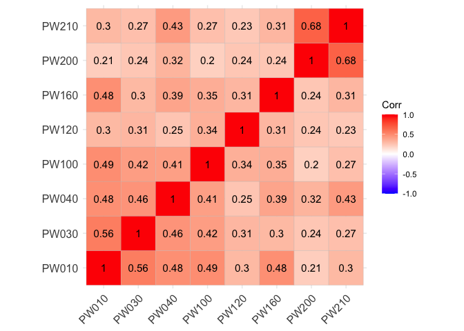
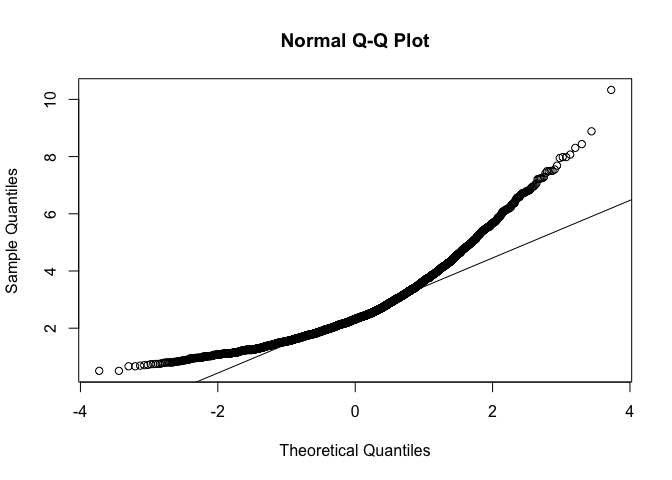
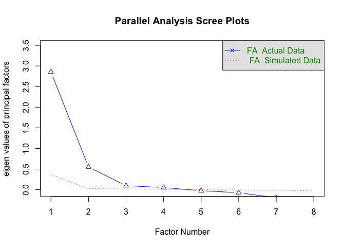
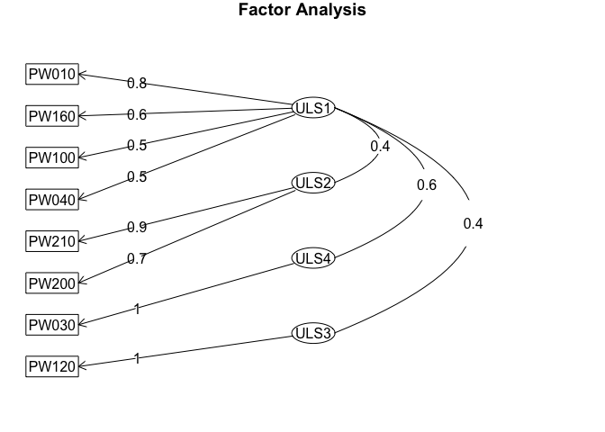
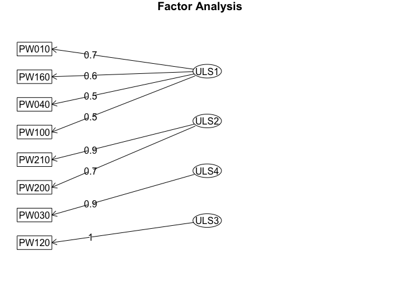
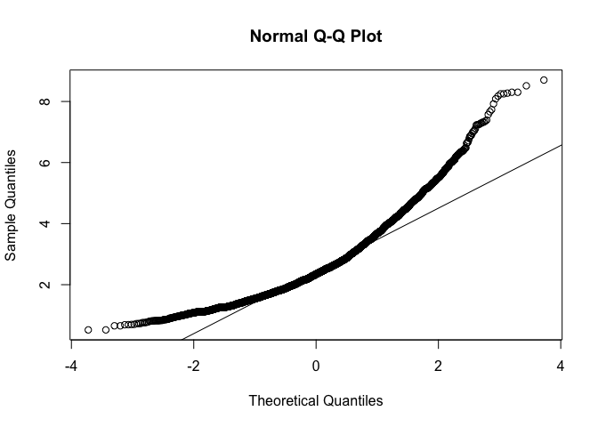

# Introducción

## dataset

En este cuaderno vamos a analizar el dataset llamado
[*ECV_factorial*](https://github.com/davidperezros/ine_sg_difusion_explica_datasets/blob/bc2e5e3300085436c3dbd63e59a06f74721cb98f/Datasets/ECV_factorial.xlsx).
Este dataset presenta un conjunto de microdatos relativos a la ECV donde
se puntua el nivel de satisfacción en determinados ámbitos de la vida
(laboral, económico, relaciones personales..). El objetivo es llevar a
cabo un análisis factorial.

Concretamente en este dataset tenemos las siguientes variables:

-   **PB030**: Identificación transversal de la persona.
-   **PW010**: Grado de satisfacción con su vida en la actualidad.
-   **PW030**: Grado de satisfacción con la situación económica en su
    hogar.
-   **PW040**: Grado de satisfacción con su vivienda.
-   **PW100**: Grado de satisfacción con su trabajo actual.
-   **PW120**: Grado de satisfacción con el tiempo que dispone para
    hacer lo que le gusta.
-   **PW160**: Grado de satisfacción con sus relaciones personales.
-   **PW200**: Grado de satisfacción con las áreas recreativas o verdes
    de la zona en la que vive.
-   **PW210**: Grado de satisfacción con la calidad de la zona en la que
    vive.

Excepto la primera vaiable, todas ellas están codificadas desde 0 (Nada
satisfecho) hasta 10 (Plenamente satisfecho) y 99 NO sabe.

``` r
# Librerias
library(readxl) # Para leer los excels
library(dplyr) # Para tratamiento de dataframes
library(skimr) # Para funcion skim

 # Para llevar a cabo la división de la muestra en dos mitades mediante muestreo de las observaciones
library(caret)

 # Para realizar el AFE, el Análisis Paralelo y otras operaciones como el test de Mardia o el KMO
library(psych)

# Para graficar las correlaciones obtenidas mediante un mapa de calor
library(ggcorrplot)

 # Para poder rotar los factores
library(GPArotation)

 # Para realizar el AFC
library(lavaan)
```

Cargamos entonces el conjunto de datos:

``` r
datos <- read_excel("/Users/davpero/ine_sg_difusion_explica_datasets/Datasets/ECV_factorial.xlsx", sheet = "Datos")
```

## Descripción del trabajo a realizar

**(Esto irá en la web de explica)** Se pretende hacer un Análisis de
Reducción de la Dimensionalidad empleando el procedimiento de Análisis
Factorial.

-   Hacer un análisis exploratorio explorando matriz de correlaciones.
-   Ver si es necesario escalar/centrar los datos antes de aplicar pca y
    decidir si hacerlo con matriz de correlaciones o covarianzas.
-   Seleccionar un determinado número de componentes y ver como influyen
    las variables en estas.
-   Interpretar componentes y resultados.

# Análisis Exploratorio (EDA[1])

En primer lugar, cargamos los datos que vamos a utilizar. En este caso,
se trata de un conjunto de datos compuesto por 26883 filas y 9 columnas.
Las filas corresponden a individuos concertos y las 14 columnas a
variables mencionadas previamente.

Antes de comenzar a aplicar la técnica, comprobamos si hay valores
perdidos, por si fuera necesario realizar algún preproceso. En este
caso, y como vemos a continuación vemos que si hay valores NA, y por
ello los imputaremos con el algoritmo que usemos después.

``` r
sum(is.na(datos))
```

    ## [1] 26341

Por otra parte, para tener una noción general que nos permita describir
el conjunto con el que vamos a trabajar, podemos extraer su dimensión,
el tipo de variables que contiene o qué valores toma cada una.

``` r
# Dimensión del conjunto de datos
dim(datos)
```

    ## [1] 26883     9

``` r
# Tipo de variables que contiene
str(datos)
```

    ## tibble [26,883 × 9] (S3: tbl_df/tbl/data.frame)
    ##  $ PB030: num [1:26883] 101 102 103 201 202 301 302 401 402 501 ...
    ##  $ PW010: num [1:26883] 8 8 7 10 10 5 5 8 8 6 ...
    ##  $ PW030: num [1:26883] 8 8 7 4 4 5 8 0 0 6 ...
    ##  $ PW040: num [1:26883] 8 8 7 8 7 6 8 8 8 8 ...
    ##  $ PW100: num [1:26883] 8 NA 7 10 9 NA NA NA NA NA ...
    ##  $ PW120: num [1:26883] 8 8 5 10 6 8 NA 8 5 10 ...
    ##  $ PW160: num [1:26883] 8 8 7 10 10 8 8 8 8 8 ...
    ##  $ PW200: num [1:26883] 8 8 7 5 8 8 8 8 10 8 ...
    ##  $ PW210: num [1:26883] 8 8 7 5 8 7 7 8 8 8 ...

``` r
# Descripción de las variables
skim(datos)
```

|                                                  |       |
|:-------------------------------------------------|:------|
| Name                                             | datos |
| Number of rows                                   | 26883 |
| Number of columns                                | 9     |
| \_\_\_\_\_\_\_\_\_\_\_\_\_\_\_\_\_\_\_\_\_\_\_   |       |
| Column type frequency:                           |       |
| numeric                                          | 9     |
| \_\_\_\_\_\_\_\_\_\_\_\_\_\_\_\_\_\_\_\_\_\_\_\_ |       |
| Group variables                                  | None  |

Data summary

**Variable type: numeric**

| skim_variable | n_missing | complete_rate |      mean |        sd |  p0 |    p25 |    p50 |     p75 |    p100 | hist  |
|:---------|-------:|---------:|-------:|-------:|---:|-----:|-----:|-----:|-----:|:----|
| PB030         |         0 |          1.00 | 783590.75 | 483645.37 | 101 | 369651 | 748903 | 1180002 | 1711204 | ▇▇▇▆▆ |
| PW010         |      1377 |          0.95 |      6.90 |      1.99 |   0 |      6 |      7 |       8 |      10 | ▁▁▅▇▃ |
| PW030         |      1386 |          0.95 |      5.80 |      2.19 |   0 |      5 |      6 |       7 |      10 | ▂▃▇▇▂ |
| PW040         |      1396 |          0.95 |      7.35 |      1.82 |   0 |      6 |      8 |       8 |      10 | ▁▁▃▇▅ |
| PW100         |     16589 |          0.38 |      6.96 |      1.97 |   0 |      6 |      7 |       8 |      10 | ▁▁▅▇▃ |
| PW120         |      1408 |          0.95 |      6.65 |      2.37 |   0 |      5 |      7 |       8 |      10 | ▂▂▆▇▅ |
| PW160         |      1394 |          0.95 |      7.82 |      1.70 |   0 |      7 |      8 |       9 |      10 | ▁▁▂▇▆ |
| PW200         |      1402 |          0.95 |      6.65 |      2.30 |   0 |      5 |      7 |       8 |      10 | ▁▂▅▇▃ |
| PW210         |      1389 |          0.95 |      7.25 |      1.91 |   0 |      6 |      8 |       8 |      10 | ▁▁▃▇▅ |

Vemos que estas variables (a excepción de las CCAA) son todas de tipo
numérico, y además, podemos obtener información como la media,
desviación típica, los cuartiles y el histograma de cada una.

Como vamos a hacer un doble Análisis Factorial - Exploratorio y
Confirmatorio - vamos a dividir la muestra en aproximadamente el 50%,
realizando el Exploratorio sobre una mitad, y el Confirmatorio sobre la
otra, para ver si los resultados concuerdan.

``` r
set.seed(2021) # Establecemos una semilla para facilitar la reproductibilidad de los resultados
subconjunto.ids <- createDataPartition(datos$PB030, p = 0.5, list = F)
# Obtenemos mediante muestreo aleatorio el 50% de las observaciones (identificadas mediante la columna de ID del alumno)
datos_AFE <- datos[subconjunto.ids, ] # Para el Exploratorio solo conservamos las observaciones cuyos IDs han sido muestreados
dim(datos_AFE) # 13443 observaciones
```

    ## [1] 13443     9

``` r
datos_AFC <- datos[-subconjunto.ids, ] # Para el COnfirmatorio solo conservamos las observaciones cuyos IDs no han sido muestreados
dim(datos_AFC) # 13440 observaciones
```

    ## [1] 13440     9

``` r
# Eliminamos la columna de IDs, ya que no nos hace falta:
datos_AFE$PB030 <- NULL
datos_AFC$PB030 <- NULL
```

# Análisis Factorial Exploratorio (EFA)

## Introducción

El **Análisis de Componentes Principales (PCA)** es una técnica para
reducir la complejidad de conjuntos de datos con múltiples variables. Su
objetivo es transformar variables correlacionadas en un conjunto menor
de dimensiones sin perder la mayor parte de la información original.

El **Análisis Factorial Exploratorio (EFA)** es un método para reducir
la dimensionalidad de un conjunto de variables/indicadores, es decir, es
un método para resumir la información. En este sentido, puede
confundirse con el Análisis de Componentes Principales (PCA).

El **PCA** parte de la varianza total para encontrar combinaciones
lineales entre las variables originales que expliquen la mayor parte de
dicha varianza total. Así, el primer componente principal sería aquella
combinación lineal de variables que explica un mayor porcentaje de
varianza total; el segundo componente principal sería aquel que explica
la mayor proporción de varianza no explicada por el primero, y así
sucesivamente.Al aplicar PCA a un conjunto de datos conseguimos pues
resumir la información en unas pocas componentes principales. Dichas
componentes principales, al ser combinaciones lineales de variables,
resultan, muchas veces, difíciles de interpretar.

Por su parte, el **EFA** distingue entre varianza común y varianza
específica. La **varianza común** o compartida es aquella parte de la
variabilidad total de los datos que está compartida entre las variables;
mientras, la varianza no compartida es la específica de cada variable.
Los factores comunes son, por tanto, variables subyacentes - no
observadas - que explican la asociación entre las variables.

Asimismo, desde el punto de vista de las variables, decimos que la
**comunalidad** de una variable es la parte de su varianza explicada por
los factores comunes. Por ello, interesa que este dato sea alto. Por el
contrario, la especificidad es la parte de variabilidad de una variable
específica de dicha variable. Esta última conviene pues que sea baja.

Los factores sí suelen tener una interpretación más sencilla que los
componentes principales. Asimismo, mientras los componentes principales,
por definición, no están correlacionados, los factores pueden estarlo.

El EFA suele utilizarse con datos procendentes de encuestas sociales,
psicológicas o sanitarias, sin embargo, también puede aplicarse a otros
tipos de datos. En nuestro caso tenemos datos procedentes de una
encuesta de carácter sociodemográfico.

Los pasos generales son:

## Paso 1: Estimación de la matriz de correlaciones.

Dependiendo del tipo de datos que tengamos, debemos utilizar un tipo de
correlación u otro:

-   **Datos continuos**: La matriz de correlaciones de Pearson y la de
    Spearman son las más apropiadas ante continuos o ante datos
    ordinales (categóricos) con más de 7 categorías de respuesta
    (tienden a la continuidad).

-   **Datos categóricos/ordinales**: la matriz de correlaciones
    policórica es la más recomendada ante datos ordinales de 7 o menos
    categorías de respuesta. Si tuviéramos datos dicotómicos, la matriz
    a emplear sería la matriz tetracórica (similar a la policórica pero
    con datos dicotómicos).

En nuestro caso, como tenemos datos ordinales con 11 opciones de
respuesta (del 0 al 10), usaremos la matriz de correlaciones de Pearson.

``` r
matriz_correlaciones <- cor(datos_AFE, method = "pearson", use = "complete.obs")
ggcorrplot(matriz_correlaciones, lab = T)
```



Todas las correlaciones son positivas y, en general, no son muy altas.

## Paso 2: Verificar que la matriz sea factorizable (es decir, que tiene sentido hacer un AFE con nuestros datos):

(Si la matriz no fuese factorizable, la relación entre las variables
sería tan baja que no se formarían factores).

Entre los métodos para comprobar si la matriz es factorizable destacan:

-   **Test de esfericidad de Bartlett**: se pregunta si la matriz de
    correlaciones es o no la matriz identidad. Si la matriz de
    correlaciones es la matriz identidad, las variables no estarían
    correlacionadas y no habría varianza compartida de la que extraer
    los factores (no habría factores comunes). Si rechazamos la
    hipótesis nula (la matriz de correlaciones es la matriz identidad),
    la matriz será factorizable.

-   **Medida KMO (Kaiser-Meyer-Olkin)**: expresa el grado de predicción
    de las variables a partir de las demás. Su valor oscila entre 0 y 1.
    Cuanto mayor sea, mejor. Valores a partir de 0,5 se consideran
    aceptables.

-   **Calcular el determinante de la matriz de correlaciones**: valores
    cercanos a cero indican que la matriz es factorizable.

``` r
# Test de esfericidad de Bartlett:
p_esf <- cortest.bartlett(matriz_correlaciones, n = nrow(datos_AFE))
cat("El p-valor del test de esfiricidad de Bartlett es: ", p_esf$p.value)
```

    ## El p-valor del test de esfiricidad de Bartlett es:  0

``` r
# KMO:
KMO(matriz_correlaciones)
```

    ## Kaiser-Meyer-Olkin factor adequacy
    ## Call: KMO(r = matriz_correlaciones)
    ## Overall MSA =  0.8
    ## MSA for each item = 
    ## PW010 PW030 PW040 PW100 PW120 PW160 PW200 PW210 
    ##  0.81  0.83  0.88  0.89  0.88  0.86  0.67  0.70

``` r
# Determinante de la matriz:
cat("El valor del determinante de la matriz es: ", det(matriz_correlaciones))
```

    ## El valor del determinante de la matriz es:  0.08410902

El p-valor es menor a los niveles de significación habituales(10%, 5% y
1%) por lo que rechazamos la hipótesis nula: la matriz de correlaciones
no es la matriz identidad.

1.  El resultado del KMO es bueno: 0,80.
2.  El determinante tiene un valor bastante bajo.
3.  Los test muestran que la matriz es factorizable.

## Paso 3: determinar un método de extracción de factores:

La ecuación del modelo factorial es la siguiente:

*X*<sub>*j*</sub> = *a*<sub>*j*1</sub>*F*<sub>1</sub> + *a*<sub>*j*2</sub>*F*<sub>2</sub> + ... + *a*<sub>*j**n*</sub>*F*<sub>*n*</sub> + *u*<sub>*j*</sub>

Donde *X*<sub>*j*</sub> (variable j) es una combinación lineal de
factores comunes y del factor único (especificidad). Los
*a*<sub>*j**h*</sub> son los pesos factoriales, que representan la
importancia que cada factor común tiene en explicar la variable
*X*<sub>*j*</sub>.

El objetivo de los métodos de extracción de factores es reproducir, con
el mínimo error, la matriz de correlaciones a partir de la matriz de
pesos factoriales.

Existen varios métodos de extracción de factores. Los más comunes son:

-   **Máxima Verosimilitud** (Maximum Likelihood, ML). Para utilizarlo,
    nuestros datos deben seguir una normal multivariante (lo que podemos
    comprobar realizando el test de Mardia, por ejemplo).
    Estadísticamente es el más adecuado, pues es asintóticamente
    insesgado, eficiente y consistente.

-   **Mínimos Cuadrados No Ponderados** (Unweighted Least Squares, ULS)
    (También llamado Residuos Mínimos, MinRes). No requiere de la
    existencia de normalidad multivariante.

-   **Ejes principales**. Tampoco requiere de datos que sigan una normal
    multivariante. -**Componentes principales.** Como hemos dicho en la
    introducción, no es método de ánalisis factorial propiamente dicho,
    ya que su objetivo es intentar explicar toda la varianza, y no solo
    la varianza común o compartida. Sin embargo, su uso, aunque no se
    recomiende, está bastante extendido, pues es la opción por defecto
    de muchos programas estadísticos.

``` r
# Test de Mardia:
mardia(datos_AFE, na.rm = TRUE)
```



    ## Call: mardia(x = datos_AFE, na.rm = TRUE)
    ## 
    ## Mardia tests of multivariate skew and kurtosis
    ## Use describe(x) the to get univariate tests
    ## n.obs = 5157   num.vars =  8 
    ## b1p =  11.34   skew =  9750.3  with probability  <=  0
    ##  small sample skew =  9757.24  with probability <=  0
    ## b2p =  130.3   kurtosis =  142.78  with probability <=  0

``` r
ks.test(datos_AFE, pnorm)
```

    ## 
    ##  Asymptotic one-sample Kolmogorov-Smirnov test
    ## 
    ## data:  datos_AFE
    ## D = 0.95804, p-value < 2.2e-16
    ## alternative hypothesis: two-sided

Como los p-valores son inferiores a los niveles de significación
habituales (10%, 5% y 1%) se rechaza la hipótesis nula, es decir, se
rechaza la normalidad de los datos.

También podemos comprobar este hecho haciendo uso del Q-Q plot, ya que
la línea de puntos está bastante alejada de la recta que refleja la
normal.

Como no existe normalidad, debemos emplear un método de extracción de
factores robusto la inexistencia de la misma, como es ULS (Mínimos
Cuadrados No Ponderados).

## Paso 4: Determinamos el número de factores a extraer:

Existen cuatro métodos principales:

-   **Regla de Kaiser**: se deben aceptar todos aquellos factores con un
    autovalor mayor a 1.
-   **Gráfico de sedimentación** (scree plot): gráfico donde podemos ver
    cómo disminuye la varianza explicada o el autovalor a medida que
    vamos aumentando el número de factores a extraer. Se complementa muy
    bien con la regla de Kaiser.
-   **Establecimiento de un porcentaje de varianza explicada mínimo (por
    ejemplo, el 75%)**: cogeríamos todos los factores necesarios para
    explicar ese porcentaje mínimo de varianza.
-   **Análisis paralelo (AP, método recomendado)**: el AP parte de
    generar nuevas muestras aleatorias (mínimo 100) con el mismo número
    de variables y observaciones que la muestra original y, a partir de
    ello, se queda con aquellos factores cuyo autovalor es superior a
    los generados por azar.

Emplearemos el Análisis Paralelo al ser el método más recomendado.

``` r
fa.parallel(matriz_correlaciones, n.obs = nrow(datos_AFE), n.iter = 500, fa = "fa", fm = "uls")
```



    ## Parallel analysis suggests that the number of factors =  4  and the number of components =  NA

El Análisis Paralelo sugiere la extracción de 4 factores.

## Paso 5: Extracción de factores + rotación:

Vamos a extraer tres factores, siguiendo lo recomendado por el Análisis
Paralelo.

Asimismo, debemos decidir si vamos a rotar los factores y qué tipo de
rotación vamos a emplear. Los métodos de rotación facilitan la
interpretación de los factores, ya que sin rotarlos, suele ser muy
difíciles de interpretar, por lo que se recomienda el uso de dichas
técnicas de rotación.

Existen dos tipos de rotación:

-   **Rotación oblicua**: permite que los factores puedan tener
    correlación entre ellos. Tipo recomendado, ya que es el más cercano
    a la estructura real que deseamos explorar. Un ejemplo es el método
    oblimin.
-   **Rotación ortogonal**: fuerza a los factores a que no puedan tener
    correlación entre ellos. Un ejemplo es el método varimax.

Probaremos los dos y nos quedaremos con la solución que mejor resultado
arroje. Pero, ¿cómo determinamos qué solución factorial ajusta mejor?

-   **Fijándonos en los pesos factoriales**: Cuanto mayor sea el peso
    factorial de un ítem en un factor mejor. Se aceptan pesos
    factoriales por encima de 0,4. En general, una buena solución
    presentará variables que pesan mucho en un factor y poco en el
    resto.
-   **Índices de bondad del ajuste**. Existen unos cuantos, pero nos
    podemos fijar en RMSEA, SRMR, TLI y CFI. RMSEA y SRMR cuantos más
    bajos mejor (se aceptan valores por debajo de 0,08), y TLI y CFI
    cuantos más altos mejor (valores por encima de 0,95 se consideran
    muy buenos).

``` r
# Rotación oblicua oblimin:
AFE_oblimin <- fa(matriz_correlaciones, nfactors = 4, n.obs = nrow(datos_AFE), rotate = "oblimin", fm = "uls", alpha = 0.05)
AFE_oblimin
```

    ## Factor Analysis using method =  uls
    ## Call: fa(r = matriz_correlaciones, nfactors = 4, n.obs = nrow(datos_AFE), 
    ##     rotate = "oblimin", fm = "uls", alpha = 0.05)
    ## Standardized loadings (pattern matrix) based upon correlation matrix
    ##        ULS1  ULS2  ULS4  ULS3   h2     u2 com
    ## PW010  0.77 -0.06  0.09 -0.02 0.65 0.3543 1.0
    ## PW030  0.01  0.01  0.98  0.01 1.00 0.0045 1.0
    ## PW040  0.49  0.22  0.09 -0.03 0.44 0.5587 1.5
    ## PW100  0.52  0.01  0.06  0.10 0.38 0.6242 1.1
    ## PW120  0.01  0.00  0.01  0.99 1.00 0.0045 1.0
    ## PW160  0.64  0.07 -0.14  0.07 0.39 0.6099 1.2
    ## PW200 -0.07  0.74  0.05  0.06 0.55 0.4544 1.0
    ## PW210  0.04  0.92 -0.02 -0.03 0.87 0.1317 1.0
    ## 
    ##                       ULS1 ULS2 ULS4 ULS3
    ## SS loadings           1.63 1.51 1.07 1.05
    ## Proportion Var        0.20 0.19 0.13 0.13
    ## Cumulative Var        0.20 0.39 0.53 0.66
    ## Proportion Explained  0.31 0.29 0.20 0.20
    ## Cumulative Proportion 0.31 0.60 0.80 1.00
    ## 
    ##  With factor correlations of 
    ##      ULS1 ULS2 ULS4 ULS3
    ## ULS1 1.00 0.44 0.62 0.40
    ## ULS2 0.44 1.00 0.28 0.26
    ## ULS4 0.62 0.28 1.00 0.29
    ## ULS3 0.40 0.26 0.29 1.00
    ## 
    ## Mean item complexity =  1.1
    ## Test of the hypothesis that 4 factors are sufficient.
    ## 
    ## df null model =  28  with the objective function =  2.48 with Chi Square =  33268.91
    ## df of  the model are 2  and the objective function was  0.01 
    ## 
    ## The root mean square of the residuals (RMSR) is  0.01 
    ## The df corrected root mean square of the residuals is  0.03 
    ## 
    ## The harmonic n.obs is  13443 with the empirical chi square  53.96  with prob <  1.9e-12 
    ## The total n.obs was  13443  with Likelihood Chi Square =  111.81  with prob <  5.3e-25 
    ## 
    ## Tucker Lewis Index of factoring reliability =  0.954
    ## RMSEA index =  0.064  and the 95 % confidence intervals are  0.052 0.076
    ## BIC =  92.8
    ## Fit based upon off diagonal values = 1
    ## Measures of factor score adequacy             
    ##                                                   ULS1 ULS2 ULS4 ULS3
    ## Correlation of (regression) scores with factors   0.90 0.94 1.00 1.00
    ## Multiple R square of scores with factors          0.81 0.89 1.00 1.00
    ## Minimum correlation of possible factor scores     0.62 0.78 0.99 0.99

``` r
fa.diagram(AFE_oblimin)
```



``` r
# Rotación ortogonal varimax:
AFE_varimax <- fa(matriz_correlaciones, nfactors = 4, n.obs = nrow(datos_AFE), rotate = "varimax", fm = "uls", alpha = 0.05)
AFE_varimax
```

    ## Factor Analysis using method =  uls
    ## Call: fa(r = matriz_correlaciones, nfactors = 4, n.obs = nrow(datos_AFE), 
    ##     rotate = "varimax", fm = "uls", alpha = 0.05)
    ## Standardized loadings (pattern matrix) based upon correlation matrix
    ##       ULS1 ULS2 ULS4 ULS3   h2     u2 com
    ## PW010 0.74 0.10 0.27 0.09 0.65 0.3543 1.3
    ## PW030 0.39 0.13 0.90 0.11 1.00 0.0045 1.4
    ## PW040 0.54 0.31 0.22 0.06 0.44 0.5587 2.0
    ## PW100 0.54 0.13 0.19 0.17 0.38 0.6242 1.6
    ## PW120 0.25 0.13 0.10 0.95 1.00 0.0045 1.2
    ## PW160 0.58 0.18 0.04 0.14 0.39 0.6099 1.3
    ## PW200 0.15 0.71 0.09 0.11 0.55 0.4544 1.2
    ## PW210 0.25 0.89 0.06 0.05 0.87 0.1317 1.2
    ## 
    ##                       ULS1 ULS2 ULS4 ULS3
    ## SS loadings           1.77 1.49 1.00 1.00
    ## Proportion Var        0.22 0.19 0.12 0.12
    ## Cumulative Var        0.22 0.41 0.53 0.66
    ## Proportion Explained  0.34 0.28 0.19 0.19
    ## Cumulative Proportion 0.34 0.62 0.81 1.00
    ## 
    ## Mean item complexity =  1.4
    ## Test of the hypothesis that 4 factors are sufficient.
    ## 
    ## df null model =  28  with the objective function =  2.48 with Chi Square =  33268.91
    ## df of  the model are 2  and the objective function was  0.01 
    ## 
    ## The root mean square of the residuals (RMSR) is  0.01 
    ## The df corrected root mean square of the residuals is  0.03 
    ## 
    ## The harmonic n.obs is  13443 with the empirical chi square  53.96  with prob <  1.9e-12 
    ## The total n.obs was  13443  with Likelihood Chi Square =  111.81  with prob <  5.3e-25 
    ## 
    ## Tucker Lewis Index of factoring reliability =  0.954
    ## RMSEA index =  0.064  and the 95 % confidence intervals are  0.052 0.076
    ## BIC =  92.8
    ## Fit based upon off diagonal values = 1
    ## Measures of factor score adequacy             
    ##                                                   ULS1 ULS2 ULS4 ULS3
    ## Correlation of (regression) scores with factors   0.83 0.92 0.97 0.99
    ## Multiple R square of scores with factors          0.69 0.86 0.95 0.98
    ## Minimum correlation of possible factor scores     0.37 0.71 0.90 0.97

``` r
fa.diagram(AFE_varimax)
```



##Resultados AFE: El resultado usando tanto la rotación oblicua como la
ortogonal es similar (en la ortogonal vemos como los factores ya no
están correlacionados - porque no se les permite estarlo). En ambos
casos, el ajuste, siguiendo los índices de bondad del mismo, es muy
bueno: RMSEA y RMSR inferiores a 0,08 y TLI mayor a 0,95.

# Análisis Factorial Confirmatorio (CFA):

La diferencia fundamental entre el EFA y el CFA, es que el EFA, como su
propio nombre indica, es una técnica exploratoria: con ella queremos
conocer la estructura de factores o variables latentes subyacente a los
datos. Sin embargo, con el CFA, nosotros testamos si una determinada
estructura factorial ajusta bien o no a los datos. Esto es, en este
segundo caso, nosotros debemos imponer una estructura fatorial de
antemano. Recurriendo a los índices de bondad del ajusto comprobaremos
si dicha estructura es o no correcta.

## Paso 1: determinar un método de extracción de factores:

Al igual que hacíamos con el EFA, con el CFA también debemos determinar
un método concreto para extraer los factores. Con el fin de establecer
un método u otro, llevaremos a cabo un test de Mardia: si existiera
normalidad multivariante, podríamos utilizar Máxima Verosimilitud. Si
nuestros datos no fuesen normales, Mínimo Cuadrados No Ponderados sería
una buena opción.

``` r
mardia(datos_AFC, na.rm = TRUE)
```



    ## Call: mardia(x = datos_AFC, na.rm = TRUE)
    ## 
    ## Mardia tests of multivariate skew and kurtosis
    ## Use describe(x) the to get univariate tests
    ## n.obs = 5107   num.vars =  8 
    ## b1p =  11.59   skew =  9861.08  with probability  <=  0
    ##  small sample skew =  9868.16  with probability <=  0
    ## b2p =  126.63   kurtosis =  131.71  with probability <=  0

``` r
ks.test(datos_AFC, pnorm)
```

    ## 
    ##  Asymptotic one-sample Kolmogorov-Smirnov test
    ## 
    ## data:  datos_AFC
    ## D = 0.95624, p-value < 2.2e-16
    ## alternative hypothesis: two-sided

Como podíamos esperar los resultados son idénticos a los obtenidos con
la mitad de la muestra destinada al EFA: rechazamos la hipótesis nula de
normalidad multivariante (al ser los p-valores inferiores a los niveles
de significación habituales). Por ello, tampoco podemos usar Máxima
Verosimilitud para el CFA, y usaremos, de nuevo, Mínimos Cuadrados No
Ponderados (ULS).

## Paso 2: Probar una o varias estructuras factoriales:

Vamos a plantear 3 modelos diferentes: uno que replique la estructura
factorial planteada en el EFA, otro de un solo factor y otro de dos
factores.

Para comparar modelos nos vamos a fijar en los índices de bondad del
ajuste. Al igual que comentamos con el EFA: la situación óptima es
aquella en la que los índices SRMR y RMSEA son inferiores a 0,08 -
cuanto más bajos mejor -, y los índices TLI y CFI son superiores a
0,95 - cuanto más altos mejor.

## Modelo con los cuatro factores que muestra el Exploratorio:

``` r
# Especificamos el modelo:
modelo_4F_AFE <- "Factor1 =~ PW010 + PW040 + PW100 + PW160
                  Factor2 =~ PW200 + PW210
                  Factor3 =~ PW120
                  Factor4 =~ PW030"
# Realizamos el factorial:
factorial_4F_AFE <- cfa(modelo_4F_AFE, datos_AFC, estimator = "ULS", orthogonal = FALSE)
summary(factorial_4F_AFE, fit.measures = TRUE, standardized = TRUE)
```

    ## lavaan 0.6.17 ended normally after 31 iterations
    ## 
    ##   Estimator                                        ULS
    ##   Optimization method                           NLMINB
    ##   Number of model parameters                        20
    ## 
    ##                                                   Used       Total
    ##   Number of observations                          5107       13440
    ## 
    ## Model Test User Model:
    ##                                                       
    ##   Test statistic                              2798.941
    ##   Degrees of freedom                                16
    ##   P-value (Unknown)                                 NA
    ## 
    ## Model Test Baseline Model:
    ## 
    ##   Test statistic                            244573.959
    ##   Degrees of freedom                                28
    ##   P-value                                           NA
    ## 
    ## User Model versus Baseline Model:
    ## 
    ##   Comparative Fit Index (CFI)                    0.989
    ##   Tucker-Lewis Index (TLI)                       0.980
    ## 
    ## Root Mean Square Error of Approximation:
    ## 
    ##   RMSEA                                          0.185
    ##   90 Percent confidence interval - lower         0.179
    ##   90 Percent confidence interval - upper         0.190
    ##   P-value H_0: RMSEA <= 0.050                    0.000
    ##   P-value H_0: RMSEA >= 0.080                    1.000
    ## 
    ## Standardized Root Mean Square Residual:
    ## 
    ##   SRMR                                           0.036
    ## 
    ## Parameter Estimates:
    ## 
    ##   Standard errors                             Standard
    ##   Information                                 Expected
    ##   Information saturated (h1) model        Unstructured
    ## 
    ## Latent Variables:
    ##                    Estimate  Std.Err  z-value  P(>|z|)   Std.lv  Std.all
    ##   Factor1 =~                                                            
    ##     PW010             1.000                               1.230    0.729
    ##     PW040             0.902    0.006  154.059    0.000    1.109    0.651
    ##     PW100             0.990    0.006  158.608    0.000    1.217    0.619
    ##     PW160             0.709    0.005  139.082    0.000    0.872    0.552
    ##   Factor2 =~                                                            
    ##     PW200             1.000                               1.705    0.741
    ##     PW210             0.988    0.008  127.508    0.000    1.685    0.912
    ##   Factor3 =~                                                            
    ##     PW120             1.000                               2.341    1.000
    ##   Factor4 =~                                                            
    ##     PW030             1.000                               1.936    1.000
    ## 
    ## Covariances:
    ##                    Estimate  Std.Err  z-value  P(>|z|)   Std.lv  Std.all
    ##   Factor1 ~~                                                            
    ##     Factor2           1.082    0.008  135.914    0.000    0.516    0.516
    ##     Factor3           1.427    0.009  153.160    0.000    0.496    0.496
    ##     Factor4           1.610    0.010  165.798    0.000    0.676    0.676
    ##   Factor2 ~~                                                            
    ##     Factor3           1.210    0.011  109.986    0.000    0.303    0.303
    ##     Factor4           1.058    0.011   98.275    0.000    0.320    0.320
    ##   Factor3 ~~                                                            
    ##     Factor4           1.399    0.014   99.975    0.000    0.309    0.309
    ## 
    ## Variances:
    ##                    Estimate  Std.Err  z-value  P(>|z|)   Std.lv  Std.all
    ##    .PW010             1.336    0.019   69.104    0.000    1.336    0.469
    ##    .PW040             1.676    0.018   92.327    0.000    1.676    0.577
    ##    .PW100             2.389    0.019  124.496    0.000    2.389    0.617
    ##    .PW160             1.738    0.016  105.875    0.000    1.738    0.695
    ##    .PW200             2.383    0.030   78.692    0.000    2.383    0.450
    ##    .PW210             0.577    0.030   19.415    0.000    0.577    0.169
    ##    .PW120             0.000                               0.000    0.000
    ##    .PW030             0.000                               0.000    0.000
    ##     Factor1           1.512    0.013  113.445    0.000    1.000    1.000
    ##     Factor2           2.908    0.027  108.321    0.000    1.000    1.000
    ##     Factor3           5.478    0.014  391.452    0.000    1.000    1.000
    ##     Factor4           3.748    0.014  267.783    0.000    1.000    1.000

Se nos despliega una gran cantidad de información, pero, para facilitar
el análisis, nos fijaremos simplemente en los índices de bondad del
ajuste. Siguiendo dichos índices, el ajuste parece bueno: SRMR \< 0,08,
y TLI y CFI \> 0,95. Sin embargo, RMSEA es mayor a 0,8

## Modelo con un solo factor:

``` r
# Planteamos el modelo:
modelo_1F <- "Factor =~ PW010 + PW030 + PW040 + PW100 + PW120 + PW160 + PW200 + PW210"
# Realizamos el factorial:
factorial_1F_AFE <- cfa(modelo_1F, datos_AFC, estimator = "ULS", orthogonal = FALSE)
summary(factorial_1F_AFE, fit.measures = TRUE, standardized = TRUE)
```

    ## lavaan 0.6.17 ended normally after 35 iterations
    ## 
    ##   Estimator                                        ULS
    ##   Optimization method                           NLMINB
    ##   Number of model parameters                        16
    ## 
    ##                                                   Used       Total
    ##   Number of observations                          5107       13440
    ## 
    ## Model Test User Model:
    ##                                                        
    ##   Test statistic                              19921.783
    ##   Degrees of freedom                                 20
    ##   P-value (Unknown)                                  NA
    ## 
    ## Model Test Baseline Model:
    ## 
    ##   Test statistic                            244573.959
    ##   Degrees of freedom                                28
    ##   P-value                                           NA
    ## 
    ## User Model versus Baseline Model:
    ## 
    ##   Comparative Fit Index (CFI)                    0.919
    ##   Tucker-Lewis Index (TLI)                       0.886
    ## 
    ## Root Mean Square Error of Approximation:
    ## 
    ##   RMSEA                                          0.441
    ##   90 Percent confidence interval - lower         0.436
    ##   90 Percent confidence interval - upper         0.447
    ##   P-value H_0: RMSEA <= 0.050                    0.000
    ##   P-value H_0: RMSEA >= 0.080                    1.000
    ## 
    ## Standardized Root Mean Square Residual:
    ## 
    ##   SRMR                                           0.084
    ## 
    ## Parameter Estimates:
    ## 
    ##   Standard errors                             Standard
    ##   Information                                 Expected
    ##   Information saturated (h1) model        Unstructured
    ## 
    ## Latent Variables:
    ##                    Estimate  Std.Err  z-value  P(>|z|)   Std.lv  Std.all
    ##   Factor =~                                                             
    ##     PW010             1.000                               1.153    0.683
    ##     PW030             1.036    0.006  160.123    0.000    1.195    0.617
    ##     PW040             0.933    0.006  154.647    0.000    1.075    0.631
    ##     PW100             1.002    0.006  158.516    0.000    1.156    0.588
    ##     PW120             0.995    0.006  158.139    0.000    1.147    0.490
    ##     PW160             0.737    0.005  139.432    0.000    0.849    0.537
    ##     PW200             1.021    0.006  159.425    0.000    1.177    0.512
    ##     PW210             1.017    0.006  159.238    0.000    1.173    0.635
    ## 
    ## Variances:
    ##                    Estimate  Std.Err  z-value  P(>|z|)   Std.lv  Std.all
    ##    .PW010             1.518    0.018   84.056    0.000    1.518    0.533
    ##    .PW030             2.321    0.018  126.206    0.000    2.321    0.619
    ##    .PW040             1.749    0.017  100.078    0.000    1.749    0.602
    ##    .PW100             2.535    0.018  140.204    0.000    2.535    0.655
    ##    .PW120             4.162    0.018  231.056    0.000    4.162    0.760
    ##    .PW160             1.777    0.016  110.391    0.000    1.777    0.711
    ##    .PW200             3.905    0.018  213.996    0.000    3.905    0.738
    ##    .PW210             2.040    0.018  112.034    0.000    2.040    0.597
    ##     Factor            1.330    0.011  116.555    0.000    1.000    1.000

Los índices de bondad del ajuste presentan todos peores valores que el
modelo de 4 factores obtenido en el AFE: RMSEA = 0,441; SRMR = 0,084;
CFI = 0,919; TLI = 0,886

## Modelo con dos factores:

Planteamos un modelo con dos factores: uno que englobe los tres items
relacionados con la vivienda, y otro que englobe el resto de ítems.

``` r
# Planteamos el modelo:
modelo_2F <- "factor_vivienda =~ PW040 + PW200 + PW210
              factor_miscelanea =~ PW010 + PW030 + PW100 + PW120 + PW160"
# Realizamos el factorial:
factorial_2F <- cfa(modelo_2F, datos_AFC, estimator = "ULS", orthogonal = FALSE)
summary(factorial_2F, fit.measures = TRUE, standardized = TRUE)
```

    ## lavaan 0.6.17 ended normally after 35 iterations
    ## 
    ##   Estimator                                        ULS
    ##   Optimization method                           NLMINB
    ##   Number of model parameters                        17
    ## 
    ##                                                   Used       Total
    ##   Number of observations                          5107       13440
    ## 
    ## Model Test User Model:
    ##                                                        
    ##   Test statistic                              12204.349
    ##   Degrees of freedom                                 19
    ##   P-value (Unknown)                                  NA
    ## 
    ## Model Test Baseline Model:
    ## 
    ##   Test statistic                            244573.959
    ##   Degrees of freedom                                28
    ##   P-value                                           NA
    ## 
    ## User Model versus Baseline Model:
    ## 
    ##   Comparative Fit Index (CFI)                    0.950
    ##   Tucker-Lewis Index (TLI)                       0.927
    ## 
    ## Root Mean Square Error of Approximation:
    ## 
    ##   RMSEA                                          0.354
    ##   90 Percent confidence interval - lower         0.349
    ##   90 Percent confidence interval - upper         0.360
    ##   P-value H_0: RMSEA <= 0.050                    0.000
    ##   P-value H_0: RMSEA >= 0.080                    1.000
    ## 
    ## Standardized Root Mean Square Residual:
    ## 
    ##   SRMR                                           0.073
    ## 
    ## Parameter Estimates:
    ## 
    ##   Standard errors                             Standard
    ##   Information                                 Expected
    ##   Information saturated (h1) model        Unstructured
    ## 
    ## Latent Variables:
    ##                        Estimate  Std.Err  z-value  P(>|z|)   Std.lv  Std.all
    ##   factor_vivienda =~                                                        
    ##     PW040                 1.000                               1.121    0.658
    ##     PW200                 1.300    0.009  146.358    0.000    1.458    0.634
    ##     PW210                 1.306    0.009  146.386    0.000    1.465    0.792
    ##   factor_miscelanea =~                                                      
    ##     PW010                 1.000                               1.231    0.729
    ##     PW030                 1.025    0.007  157.091    0.000    1.261    0.652
    ##     PW100                 1.000    0.006  156.148    0.000    1.231    0.626
    ##     PW120                 0.986    0.006  155.560    0.000    1.214    0.519
    ##     PW160                 0.718    0.005  137.747    0.000    0.884    0.559
    ## 
    ## Covariances:
    ##                      Estimate  Std.Err  z-value  P(>|z|)   Std.lv  Std.all
    ##   factor_vivienda ~~                                                      
    ##     factor_misceln      0.920    0.006  142.840    0.000    0.667    0.667
    ## 
    ## Variances:
    ##                    Estimate  Std.Err  z-value  P(>|z|)   Std.lv  Std.all
    ##    .PW040             1.649    0.019   88.350    0.000    1.649    0.567
    ##    .PW200             3.166    0.023  138.155    0.000    3.166    0.598
    ##    .PW210             1.271    0.023   55.195    0.000    1.271    0.372
    ##    .PW010             1.333    0.019   69.586    0.000    1.333    0.468
    ##    .PW030             2.157    0.019  110.858    0.000    2.157    0.576
    ##    .PW100             2.355    0.019  122.927    0.000    2.355    0.608
    ##    .PW120             4.005    0.019  210.874    0.000    4.005    0.731
    ##    .PW160             1.717    0.016  104.214    0.000    1.717    0.687
    ##     factor_viviend    1.257    0.012  101.809    0.000    1.000    1.000
    ##     factor_misceln    1.515    0.013  115.828    0.000    1.000    1.000

Los índices de bondad del ajuste presentan todos peores valores que el
modelo de 4 factores obtenido en el AFE: RMSEA = 0,354; SRMR = 0,073;
CFI = 0,950; TLI = 0,927

## Resultados CFA:

Los índices de bondad del ajuste muestran que, de los tres modelos
planteados, el modelo que refleja la estructura de los cuatro factores
del AFE es el que mejor ajuste tiene.

# Conclusiones: Interpretamos los factores obtenidos tanto con el EFA como con el CFA:

Intentamos darle nombre a los factores, facilitando la interpretación de
los resultados.

Los resultados entre el Análisis Factorial Exploratorio (EFA) y el
Confirmatorio (CFA) concuerdan: el modelo que mejor ajusta es el que
tiene cuatro factores:

-   **Factor 1**: variables PW010 (grado de satisfacción con la vida en
    la actualidad), PW040 (grado de satisfacción con la vivienda), PW100
    (grado de satisfacción con el trabajo actual) y PW160 (grado de
    satisfacción con las relaciones personales). Factor “bienestar
    general/principal”.

-   **Factor 2**: variables PW200 (grado de satisfacción con las áreas
    recreativas o verdes de la zona en la que vive) y PW210 (grado de
    satisfacción con la calidad de la zona en la que vive). Factor “zona
    residencial”.

-   **Factor 3**: variable PW120 (grado de satisfacción con el tiempo
    que dispone para hacer lo que le gusta). Factor “tiempo libre”.

-   **Factor 4**: variable PW030 (grado de satisfacción con la situación
    económica en su hogar). Factor “situación económica”.

En resumen, las nuevas componentes han permitido identificar patrones y
características de las comunidades autónomas en términos de mercado
hipotecario, riesgo hipotecario, estabilidad financiera y demanda
futura. Este análisis proporciona información valiosa para comprender
mejor las diferencias y similitudes entre las comunidades autónomas y
puede ser útil para tomar decisiones en términos de políticas públicas y
estrategias empresariales.

[1] EDA viene del Inglés *Exploratory Data Analysis* y son los pasos
relativos en los que se exploran las variables para tener una idea de
que forma toma el dataset.
