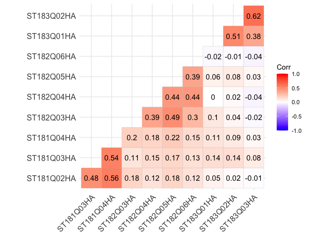
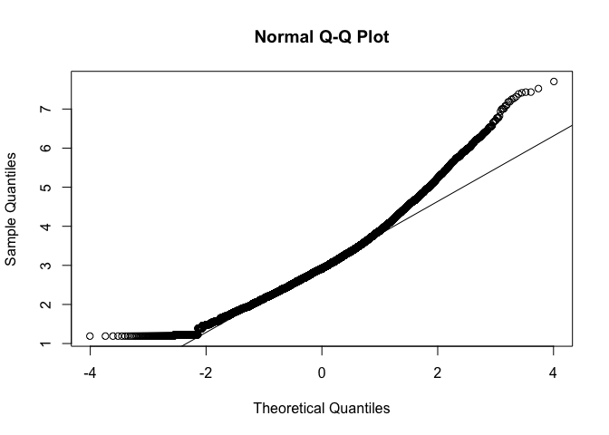
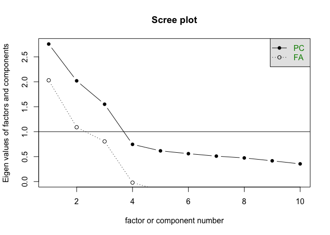
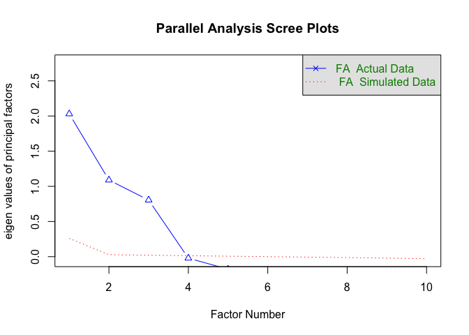
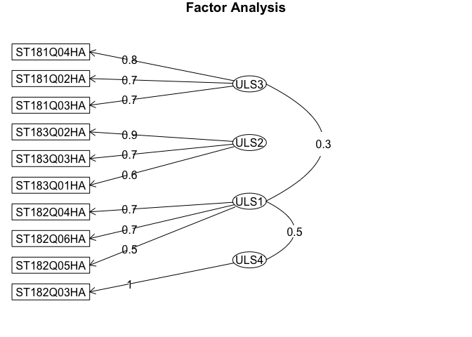
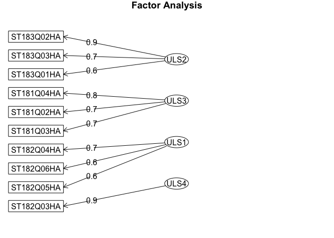
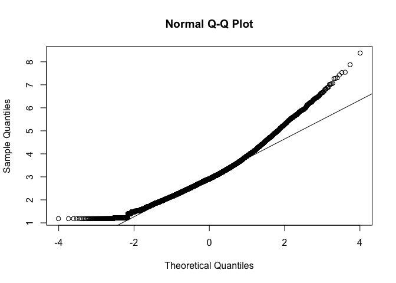
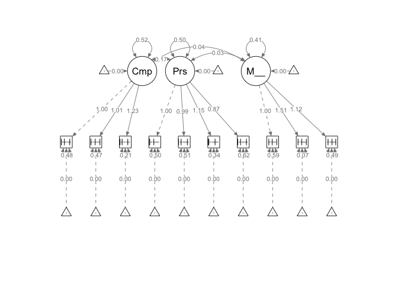
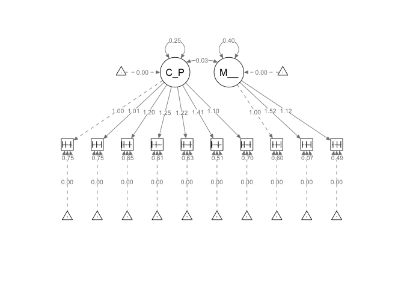

# Introducción

## dataset

En este cuaderno vamos a analizar el dataset llamado
[*pisa_factorial.xlsx*](https://github.com/davidperezros/ine_sg_difusion_explica_datasets/blob/0319c548ee2651c6e4ca569c16c4698694e6a385/Datasets/pisa_factorial.xlsx).
Este dataset presenta un conjunto de datos relativos a la la prueba PISA
del año 2018. El objetivo es realizar un Análisis Factorial a partir de
los microdatos.

Concretamente en este dataset tenemos las siguientes variables (La
escala de respuesta para estas son 1 - Totalmente en desacuerdo, 2 - En
desacuerdo, 3 - De acuerdo y 4 - Totalmente de acuerdo):

1.  **¿Hasta qué punto estás de acuerdo con las siguientes afirmaciones
    sobre ti mismo?**

-   ST181Q02HA: Disfruto trabajando en situaciones que requieren
    competir con los demás.
-   ST181Q03HA: Es importante para mí hacerlo mejor que los demás al
    realizar una tarea.
-   ST181Q04HA: Me esfuerzo mucho cuando estoy compitiendo contra los
    demás.

1.  **¿Hasta qué punto estás de acuerdo con las siguientes afirmaciones
    sobre ti mismo?**

-   ST182Q03HA: Me siento satisfecho cuando me esfuerzo todo lo que
    puedo.
-   ST182Q04HA: Cuando inicio una tarea continúo hasta terminarla.
-   ST182Q05HA: Cuando hago algo, parte de mi satisfacción se debe a que
    he mejorado mis resultados anteriores.
-   ST182Q06HA: Si algo no se me da bien, prefiero seguir esforzándome
    para mejorar, en lugar de hacer otra cosa que sí se me da bien.

1.  **¿Hasta qué punto estás de acuerdo con las siguientes
    afirmaciones?**

-   ST183Q01HA: Cuando me he equivocado, me preocupa lo que otras
    personas piesen de mí.
-   ST183Q02HA: Cuando me he equivocado, me preocupa no tener el talento
    suficiente.
-   ST183Q03HA: Cuando me he equivocado, dudo sobre mis planes para el
    futuro.

``` r
# Librerias
library(readxl) # Para leer los excels
library(dplyr) # Para tratamiento de dataframes
library(skimr) # Para funcion skim

 # Para llevar a cabo la división de la muestra en dos mitades mediante muestreo de las observaciones
library(caret)

 # Para realizar el AFE, el Análisis Paralelo y otras operaciones como el test de Mardia o el KMO
library(psych)

# Para graficar las correlaciones obtenidas mediante un mapa de calor
library(ggcorrplot)

 # Para poder rotar los factores
library(GPArotation)

 # Para realizar el CFA
library(lavaan)

# Para realizar el diagrama de los CFA
library(semPlot)
```

Cargamos entonces el conjunto de datos:

``` r
datos <- read_excel("/Users/davpero/ine_sg_difusion_explica_datasets/Datasets/pisa_factorial.xlsx", sheet = "Datos")
```

## Descripción del trabajo a realizar

**(Esto irá en la web de explica)** Se pretende hacer un Análisis de
Reducción de la Dimensionalidad empleando el procedimiento de Análisis
Factorial.

-   Hacer un análisis exploratorio.

-   Dividir datos en dos partes (una para el análisis exploratorio y
    otra para el confirmatorio).

-   Análisis Factorial Exploratorio (EFA)

    -   Estimación matriz correlaciones.
    -   Verificar que la matriz sea factorizable.
    -   Método de extracción de factores.
    -   Número de factores a extraer.
    -   Extracción factores + rotación.

-   Análisis Factorial Confirmatorio (CFA)

    -   Método de extracción de factores.
    -   Probar una o varias estructuras factoriales.

# Análisis Exploratorio (EDA[1])

En primer lugar, cargamos los datos que vamos a utilizar. En este caso,
se trata de un conjunto de datos compuesto por 35943 filas y 11
columnas. Las filas corresponden a individuos concertos y las 11
columnas a variables mencionadas previamente.

Antes de comenzar a aplicar la técnica, comprobamos si hay valores
perdidos, por si fuera necesario realizar algún preproceso. En este
caso, y como vemos a continuación vemos que si hay valores NA, y por
ello los imputaremos con el algoritmo que usemos después.

``` r
sum(is.na(datos))
```

    ## [1] 20958

Por otra parte, para tener una noción general que nos permita describir
el conjunto con el que vamos a trabajar, podemos extraer su dimensión,
el tipo de variables que contiene o qué valores toma cada una.

``` r
# Dimensión del conjunto de datos
dim(datos)
```

    ## [1] 35943    11

``` r
# Tipo de variables que contiene
str(datos)
```

    ## tibble [35,943 × 11] (S3: tbl_df/tbl/data.frame)
    ##  $ CNTSTUID  : num [1:35943] 72400490 72401482 72402362 72402959 72403316 ...
    ##  $ ST181Q02HA: num [1:35943] 3 3 4 4 3 3 3 3 4 4 ...
    ##  $ ST181Q03HA: num [1:35943] 3 2 2 2 1 2 3 4 2 2 ...
    ##  $ ST181Q04HA: num [1:35943] 3 3 3 4 2 3 4 3 3 3 ...
    ##  $ ST182Q03HA: num [1:35943] 3 4 4 3 4 4 4 4 4 3 ...
    ##  $ ST182Q04HA: num [1:35943] 3 4 4 3 3 3 3 3 3 2 ...
    ##  $ ST182Q05HA: num [1:35943] 3 4 4 2 3 3 4 4 4 3 ...
    ##  $ ST182Q06HA: num [1:35943] 3 3 3 3 3 3 4 3 3 3 ...
    ##  $ ST183Q01HA: num [1:35943] 2 2 3 4 3 2 3 3 2 3 ...
    ##  $ ST183Q02HA: num [1:35943] 2 2 3 3 2 3 4 2 2 3 ...
    ##  $ ST183Q03HA: num [1:35943] 3 2 3 4 2 2 3 1 2 2 ...

``` r
# Descripción de las variables
skim(datos)
```

|                                                  |       |
|:-------------------------------------------------|:------|
| Name                                             | datos |
| Number of rows                                   | 35943 |
| Number of columns                                | 11    |
| \_\_\_\_\_\_\_\_\_\_\_\_\_\_\_\_\_\_\_\_\_\_\_   |       |
| Column type frequency:                           |       |
| numeric                                          | 11    |
| \_\_\_\_\_\_\_\_\_\_\_\_\_\_\_\_\_\_\_\_\_\_\_\_ |       |
| Group variables                                  | None  |

Data summary

**Variable type: numeric**

| skim_variable | n_missing | complete_rate |        mean |       sd |       p0 |      p25 |      p50 |      p75 |     p100 | hist  |
|:--------|------:|--------:|-------:|-----:|-----:|-----:|-----:|-----:|-----:|:----|
| CNTSTUID      |         0 |          1.00 | 72423132.50 | 13336.85 | 72400001 | 72411570 | 72423133 | 72434686 | 72446162 | ▇▇▇▇▇ |
| ST181Q02HA    |      1835 |          0.95 |        2.79 |     0.87 |        1 |        2 |        3 |        3 |        4 | ▂▅▁▇▃ |
| ST181Q03HA    |      1884 |          0.95 |        2.61 |     0.85 |        1 |        2 |        3 |        3 |        4 | ▂▇▁▇▃ |
| ST181Q04HA    |      1961 |          0.95 |        3.00 |     0.84 |        1 |        3 |        3 |        4 |        4 | ▁▃▁▇▅ |
| ST182Q03HA    |      2033 |          0.94 |        3.47 |     0.73 |        1 |        3 |        4 |        4 |        4 | ▁▁▁▅▇ |
| ST182Q04HA    |      2123 |          0.94 |        2.97 |     0.74 |        1 |        3 |        3 |        3 |        4 | ▁▃▁▇▃ |
| ST182Q05HA    |      2208 |          0.94 |        3.27 |     0.68 |        1 |        3 |        3 |        4 |        4 | ▁▁▁▇▆ |
| ST182Q06HA    |      2247 |          0.94 |        2.91 |     0.80 |        1 |        2 |        3 |        3 |        4 | ▁▃▁▇▃ |
| ST183Q01HA    |      2148 |          0.94 |        2.52 |     0.95 |        1 |        2 |        3 |        3 |        4 | ▃▆▁▇▃ |
| ST183Q02HA    |      2205 |          0.94 |        2.52 |     0.92 |        1 |        2 |        3 |        3 |        4 | ▃▇▁▇▃ |
| ST183Q03HA    |      2314 |          0.94 |        2.43 |     0.97 |        1 |        2 |        2 |        3 |        4 | ▅▇▁▇▃ |

Como vamos a hacer un doble Análisis Factorial - Exploratorio y
Confirmatorio - vamos a **dividir la muestra en aproximadamente el
50%**, realizando el Exploratorio sobre una mitad, y el Confirmatorio
sobre la otra, para ver si los resultados concuerdan.

``` r
#Vamos a extraer simplemente las columnas de identificador del alumno y las de los items que nos interesan (los que miden la competitividad, la perseverancia y el miedo al fracaso):
subconjunto <- datos[,c("CNTSTUID", "ST181Q02HA", "ST181Q03HA", "ST181Q04HA", "ST182Q03HA", "ST182Q04HA", "ST182Q05HA", "ST182Q06HA", "ST183Q01HA", "ST183Q02HA", "ST183Q03HA")]
set.seed(2021) #Establecemos una semilla para facilitar la reproductibilidad de los resultados
subconjunto.ids <- createDataPartition(subconjunto$CNTSTUID, p=0.5, list=F)
#Obtenemos mediante muestreo aleatorio el 50% de las observaciones (identificadas mediante la columna de ID del alumno)
datos_AFE <- subconjunto[subconjunto.ids, ] #Para el Exploratorio solo conservamos las observaciones cuyos IDs han sido muestreados
dim(datos_AFE) #17972 observaciones
```

    ## [1] 17972    11

``` r
datos_AFC <- subconjunto[-subconjunto.ids, ] #Para el Confirmatorio solo conservamos las observaciones cuyos IDs no han sido muestreados
dim(datos_AFC) #17971 observaciones
```

    ## [1] 17971    11

``` r
#Eliminamos la columna de IDs, ya que no nos hace falta:
datos_AFE$CNTSTUID <- NULL
datos_AFC$CNTSTUID <- NULL
```

# Análisis Factorial Exploratorio (EFA)

## Introducción

El objetivo de la **Reducción de la dimensionalidad** es reducir la
complejidad de conjuntos de datos con múltiples variables. Su objetivo
es transformar variables correlacionadas en un conjunto menor de
dimensiones sin perder la mayor parte de la información original.

El **Análisis Factorial Exploratorio (Exploratory Factorial Analysis)**
es un método para reducir la dimensionalidad de un conjunto de
variables/indicadores, es decir, es un método para resumir la
información. En este sentido, puede confundirse con el Análisis de
Componentes Principales (PCA).

El **PCA** parte de la varianza total para encontrar combinaciones
lineales entre las variables originales que expliquen la mayor parte de
dicha varianza total. Así, el primer componente principal sería aquella
combinación lineal de variables que explica un mayor porcentaje de
varianza total; el segundo componente principal sería aquel que explica
la mayor proporción de varianza no explicada por el primero, y así
sucesivamente. Al aplicar PCA a un conjunto de datos conseguimos pues
resumir la información en unas pocas componentes principales. Dichas
componentes principales, al ser combinaciones lineales de variables,
resultan, muchas veces, difíciles de interpretar.

Por su parte, el **EFA** distingue entre varianza común y varianza
específica. La **varianza común** o compartida es aquella parte de la
variabilidad total de los datos que está compartida entre las variables;
mientras, la varianza no compartida es la específica de cada variable.
Los factores comunes son, por tanto, variables subyacentes - no
observadas - que explican la asociación entre las variables.

Asimismo, desde el punto de vista de las variables, decimos que la
**comunalidad** de una variable es la parte de su varianza explicada por
los factores comunes. Por ello, interesa que este dato sea alto. Por el
contrario, la **especificidad** es la parte de variabilidad de una
variable específica de dicha variable. Esta última conviene pues que sea
baja.

Los factores sí suelen tener una interpretación más sencilla que los
componentes principales. Asimismo, mientras los componentes principales,
por definición, no están correlacionados, los factores pueden estarlo.

El EFA suele utilizarse con datos procendentes de encuestas sociales,
psicológicas o sanitarias, sin embargo, también puede aplicarse a otros
tipos de datos. En nuestro caso tenemos datos procedentes de una
encuesta de carácter sociodemográfico.

Los pasos generales son:

## Paso 1: Estimación de la matriz de correlaciones.

Dependiendo del tipo de datos que tengamos, debemos utilizar un tipo de
correlación u otro:

-   **Datos continuos**: La matriz de correlaciones de Pearson y la de
    Spearman son las más apropiadas ante continuos o ante datos
    ordinales (categóricos) con más de 7 categorías de respuesta
    (tienden a la continuidad).

-   **Datos categóricos/ordinales**: la matriz de correlaciones
    policórica es la más recomendada ante datos ordinales de 7 o menos
    categorías de respuesta. Si tuviéramos datos dicotómicos, la matriz
    a emplear sería la matriz tetracórica (similar a la policórica pero
    con datos dicotómicos).

En nuestro caso, como tenemos datos ordinales con 11 opciones de
respuesta (del 0 al 10), usaremos la matriz de correlaciones de Pearson.

``` r
matriz_correlaciones <- cor(datos_AFE, method = "pearson", use = "complete.obs")
ggcorrplot(matriz_correlaciones, lab = T, type = "lower")
```



Vemos que las correlaciones son más altas entre los ítems que conforman
cada uno de los subgrupos teóricos.

## Paso 2: Verificar que la matriz sea factorizable (es decir, que tiene sentido hacer un AFE con nuestros datos):

Si la matriz no fuese factorizable, la relación entre las variables
sería tan baja que no se formarían factores.

Entre los métodos para comprobar si la matriz es factorizable destacan:

-   **Test de esfericidad de Bartlett**: se pregunta si la matriz de
    correlaciones es o no la matriz identidad. Si la matriz de
    correlaciones es la matriz identidad, las variables no estarían
    correlacionadas y no habría varianza compartida de la que extraer
    los factores (no habría factores comunes). Si rechazamos la
    hipótesis nula (la matriz de correlaciones es la matriz identidad),
    la matriz será factorizable.

-   **Medida KMO (Kaiser-Meyer-Olkin)**: expresa el grado de predicción
    de las variables a partir de las demás. Su valor oscila entre 0 y 1.
    Cuanto mayor sea, mejor. Valores a partir de 0,5 se consideran
    aceptables.

-   **Calcular el determinante de la matriz de correlaciones**: valores
    cercanos a cero indican que la matriz es factorizable.

``` r
#Test de esfericidad de Bartlett:
p_esf <- cortest.bartlett(matriz_correlaciones, n=nrow(datos_AFE))
cat("El p-valor del test de esfiricidad de Bartlett es: ", p_esf$p.value)
```

    ## El p-valor del test de esfiricidad de Bartlett es:  0

``` r
#KMO:
KMO(matriz_correlaciones)
```

    ## Kaiser-Meyer-Olkin factor adequacy
    ## Call: KMO(r = matriz_correlaciones)
    ## Overall MSA =  0.73
    ## MSA for each item = 
    ## ST181Q02HA ST181Q03HA ST181Q04HA ST182Q03HA ST182Q04HA ST182Q05HA ST182Q06HA 
    ##       0.74       0.76       0.72       0.76       0.77       0.77       0.79 
    ## ST183Q01HA ST183Q02HA ST183Q03HA 
    ##       0.74       0.62       0.65

``` r
#Determinante de la matriz:
cat("El valor del determinante de la matriz es: ", det(matriz_correlaciones))
```

    ## El valor del determinante de la matriz es:  0.07879726

1 . El p-valor es menor a los niveles de significación habituales(10%,
5% y 1%) por lo que rechazamos la hipótesis nula: la matriz de
correlaciones no es la matriz identidad.

1.  El resultado del KMO es bueno: 0,73.
2.  El determinante tiene un valor bastante bajo.

Los test muestran que la matriz es factorizable.

## Paso 3: Determinar un método de extracción de factores:

La ecuación del modelo factorial es la siguiente:

*X*<sub>*j*</sub> = *a*<sub>*j*1</sub>*F*<sub>1</sub> + *a*<sub>*j*2</sub>*F*<sub>2</sub> + ... + *a*<sub>*j**n*</sub>*F*<sub>*n*</sub> + *u*<sub>*j*</sub>

Donde *X*<sub>*j*</sub> (variable j) es una combinación lineal de
factores comunes y del factor único (especificidad). Los
*a*<sub>*j**h*</sub> son los pesos factoriales, que representan la
importancia que cada factor común tiene en explicar la variable
*X*<sub>*j*</sub>.

El objetivo de los métodos de extracción de factores es reproducir, con
el mínimo error, la matriz de correlaciones a partir de la matriz de
pesos factoriales.

Existen varios métodos de extracción de factores. Los más comunes son:

-   **Máxima Verosimilitud** (Maximum Likelihood, ML). Para utilizarlo,
    nuestros datos deben seguir una normal multivariante (lo que podemos
    comprobar realizando el test de Mardia, por ejemplo).
    Estadísticamente es el más adecuado, pues es asintóticamente
    insesgado, eficiente y consistente.

-   **Mínimos Cuadrados No Ponderados** (Unweighted Least Squares, ULS)
    (También llamado Residuos Mínimos, MinRes). No requiere de la
    existencia de normalidad multivariante.

-   **Ejes principales**. Tampoco requiere de datos que sigan una normal
    multivariante.

-   **Componentes principales.** Como hemos dicho en la introducción, no
    es método de ánalisis factorial propiamente dicho, ya que su
    objetivo es intentar explicar toda la varianza, y no solo la
    varianza común o compartida. Sin embargo, su uso, aunque no se
    recomiende, está bastante extendido, pues es la opción por defecto
    de muchos programas estadísticos.

``` r
# Test de Mardia:
mardia(datos_AFE, na.rm = TRUE)
```



    ## Call: mardia(x = datos_AFE, na.rm = TRUE)
    ## 
    ## Mardia tests of multivariate skew and kurtosis
    ## Use describe(x) the to get univariate tests
    ## n.obs = 16232   num.vars =  10 
    ## b1p =  3.92   skew =  10595.01  with probability  <=  0
    ##  small sample skew =  10597.33  with probability <=  0
    ## b2p =  140.16   kurtosis =  82.89  with probability <=  0

``` r
ks.test(datos_AFE, pnorm)
```

    ## 
    ##  Asymptotic one-sample Kolmogorov-Smirnov test
    ## 
    ## data:  datos_AFE
    ## D = 0.88912, p-value < 2.2e-16
    ## alternative hypothesis: two-sided

Como los p-valores son inferiores a los niveles de significación
habituales (10%, 5% y 1%) se rechaza la hipótesis nula, es decir, se
rechaza la normalidad de los datos.

También podemos comprobar este hecho haciendo uso del Q-Q plot, ya que
la línea de puntos está bastante alejada de la recta que refleja la
normal.

Como no existe normalidad, debemos emplear un método de extracción de
factores robusto la inexistencia de la misma, como es ULS (Mínimos
Cuadrados No Ponderados).

## Paso 4: Determinamos el número de factores a extraer:

Existen cuatro métodos principales:

-   **Regla de Kaiser**: se deben aceptar todos aquellos factores con un
    autovalor mayor a 1.
-   **Gráfico de sedimentación** (scree plot): gráfico donde podemos ver
    cómo disminuye la varianza explicada o el autovalor a medida que
    vamos aumentando el número de factores a extraer. Se complementa muy
    bien con la regla de Kaiser.
-   **Establecimiento de un porcentaje de varianza explicada mínimo (por
    ejemplo, el 75%)**: cogeríamos todos los factores necesarios para
    explicar ese porcentaje mínimo de varianza.
-   **Análisis paralelo (AP, método recomendado)**: el AP parte de
    generar nuevas muestras aleatorias (mínimo 100) con el mismo número
    de variables y observaciones que la muestra original y, a partir de
    ello, se queda con aquellos factores cuyo autovalor es superior a
    los generados por azar.

Emplearemos el Análisis Paralelo al ser el método más recomendado.

``` r
#Gráfico de sedimentación con la regla de Kaiser marcada:
scree(matriz_correlaciones)
```



``` r
#Análisis paralelo:

fa.parallel(matriz_correlaciones, n.obs = nrow(datos_AFE), n.iter = 500, fa = "fa", fm = "uls")
```



    ## Parallel analysis suggests that the number of factors =  3  and the number of components =  NA

``` r
# uls lleva a cabo un método de minimal residuals
# fa = "fa" show the eigen values for  a principal axis factor analysis 
```

El Análisis Paralelo sugiere la extracción de tres factores, la regla de
Kaiser, de 2, y el gráfico de sedimentación podríamos decir que de 3.

Haremos caso al Análisis Paralelo, por ser la técnica más recomendada
actualmente.

## Paso 5: Extracción de factores + rotación:

Vamos a extraer tres factores, siguiendo lo recomendado por el Análisis
Paralelo.

Asimismo, debemos decidir si vamos a rotar los factores y qué tipo de
rotación vamos a emplear. Los métodos de rotación facilitan la
interpretación de los factores, ya que sin rotarlos, suele ser muy
difíciles de interpretar, por lo que se recomienda el uso de dichas
técnicas de rotación.

Existen dos tipos de rotación:

-   **Rotación oblicua**: permite que los factores puedan tener
    correlación entre ellos. Tipo recomendado, ya que es el más cercano
    a la estructura real que deseamos explorar. Un ejemplo es el método
    oblimin.
-   **Rotación ortogonal**: fuerza a los factores a que no puedan tener
    correlación entre ellos. Un ejemplo es el método varimax.

Probaremos los dos y nos quedaremos con la solución que mejor resultado
arroje. Pero, ¿cómo determinamos qué solución factorial ajusta mejor?

-   **Fijándonos en los pesos factoriales**: Cuanto mayor sea el peso
    factorial de un ítem en un factor mejor. Se aceptan pesos
    factoriales por encima de 0,4. En general, una buena solución
    presentará variables que pesan mucho en un factor y poco en el
    resto.
-   **Índices de bondad del ajuste**. Existen unos cuantos, pero nos
    podemos fijar en RMSEA, SRMR, TLI y CFI. RMSEA y SRMR cuantos más
    bajos mejor (se aceptan valores por debajo de 0,08), y TLI y CFI
    cuantos más altos mejor (valores por encima de 0,95 se consideran
    muy buenos).

``` r
# Rotación oblicua oblimin:
AFE_oblimin <- fa(matriz_correlaciones, nfactors = 4, n.obs = nrow(datos_AFE), rotate = "oblimin", fm = "uls", alpha = 0.05)
AFE_oblimin
```

    ## Factor Analysis using method =  uls
    ## Call: fa(r = matriz_correlaciones, nfactors = 4, n.obs = nrow(datos_AFE), 
    ##     rotate = "oblimin", fm = "uls", alpha = 0.05)
    ## Standardized loadings (pattern matrix) based upon correlation matrix
    ##             ULS3  ULS2  ULS1  ULS4   h2     u2 com
    ## ST181Q02HA  0.72 -0.07 -0.04  0.04 0.51 0.4940 1.0
    ## ST181Q03HA  0.68  0.08  0.04 -0.06 0.47 0.5275 1.0
    ## ST181Q04HA  0.79  0.00  0.02  0.01 0.64 0.3636 1.0
    ## ST182Q03HA  0.00  0.00  0.01  0.99 1.00 0.0048 1.0
    ## ST182Q04HA  0.00 -0.01  0.68  0.01 0.48 0.5224 1.0
    ## ST182Q05HA  0.05  0.06  0.51  0.19 0.44 0.5609 1.3
    ## ST182Q06HA  0.00 -0.03  0.67 -0.06 0.41 0.5948 1.0
    ## ST183Q01HA  0.07  0.56 -0.07  0.10 0.34 0.6615 1.1
    ## ST183Q02HA  0.00  0.90  0.02 -0.01 0.81 0.1859 1.0
    ## ST183Q03HA -0.03  0.69 -0.03 -0.02 0.47 0.5324 1.0
    ## 
    ##                       ULS3 ULS2 ULS1 ULS4
    ## SS loadings           1.62 1.62 1.23 1.08
    ## Proportion Var        0.16 0.16 0.12 0.11
    ## Cumulative Var        0.16 0.32 0.45 0.56
    ## Proportion Explained  0.29 0.29 0.22 0.19
    ## Cumulative Proportion 0.29 0.58 0.81 1.00
    ## 
    ##  With factor correlations of 
    ##      ULS3 ULS2 ULS1 ULS4
    ## ULS3 1.00 0.12 0.30 0.23
    ## ULS2 0.12 1.00 0.02 0.04
    ## ULS1 0.30 0.02 1.00 0.54
    ## ULS4 0.23 0.04 0.54 1.00
    ## 
    ## Mean item complexity =  1.1
    ## Test of the hypothesis that 4 factors are sufficient.
    ## 
    ## df null model =  45  with the objective function =  2.54 with Chi Square =  45651.51
    ## df of  the model are 11  and the objective function was  0 
    ## 
    ## The root mean square of the residuals (RMSR) is  0 
    ## The df corrected root mean square of the residuals is  0.01 
    ## 
    ## The harmonic n.obs is  17972 with the empirical chi square  29.63  with prob <  0.0018 
    ## The total n.obs was  17972  with Likelihood Chi Square =  57.84  with prob <  2.3e-08 
    ## 
    ## Tucker Lewis Index of factoring reliability =  0.996
    ## RMSEA index =  0.015  and the 95 % confidence intervals are  0.011 0.02
    ## BIC =  -49.93
    ## Fit based upon off diagonal values = 1
    ## Measures of factor score adequacy             
    ##                                                   ULS3 ULS2 ULS1 ULS4
    ## Correlation of (regression) scores with factors   0.89 0.92 0.85 1.00
    ## Multiple R square of scores with factors          0.79 0.85 0.72 1.00
    ## Minimum correlation of possible factor scores     0.58 0.71 0.45 0.99

``` r
fa.diagram(AFE_oblimin)
```



-   Vemos que los items que más pesan en el factor 1 son los
    correspondientes a la variable Perseverancia - los que comienzan por
    ST182.

-   Los items que más pesan en el factor 2 son los correspondientes a la
    variable Miedo al fracaso - los que comienzan por ST183.

-   Los ítems que más pesan en el factor 3 son los correspondientes a la
    variable Competitividad - los que comienzan por ST181.

-   Los índices de bondad del ajuste son muy buenos: RMSEA y RMSR
    inferiores a 0,08 y TLI mayor a 0,95

-   En el gráfico vemos que los factores 1 y 3 (perseverancia y
    competitividad) están ligeramente correlacionados.

``` r
# Rotación ortogonal varimax:
AFE_varimax <- fa(matriz_correlaciones, nfactors = 4, n.obs = nrow(datos_AFE), rotate = "varimax", fm = "uls", alpha = 0.05)
AFE_varimax
```

    ## Factor Analysis using method =  uls
    ## Call: fa(r = matriz_correlaciones, nfactors = 4, n.obs = nrow(datos_AFE), 
    ##     rotate = "varimax", fm = "uls", alpha = 0.05)
    ## Standardized loadings (pattern matrix) based upon correlation matrix
    ##             ULS2 ULS3  ULS1  ULS4   h2     u2 com
    ## ST181Q02HA -0.01 0.70  0.08  0.08 0.51 0.4940 1.1
    ## ST181Q03HA  0.12 0.67  0.12 -0.01 0.47 0.5275 1.1
    ## ST181Q04HA  0.06 0.78  0.14  0.06 0.64 0.3636 1.1
    ## ST182Q03HA  0.04 0.10  0.41  0.90 1.00 0.0048 1.4
    ## ST182Q04HA -0.01 0.10  0.68  0.11 0.48 0.5224 1.1
    ## ST182Q05HA  0.06 0.15  0.59  0.25 0.44 0.5609 1.5
    ## ST182Q06HA -0.04 0.09  0.63  0.04 0.41 0.5948 1.1
    ## ST183Q01HA  0.57 0.09 -0.01  0.08 0.34 0.6615 1.1
    ## ST183Q02HA  0.90 0.04  0.04 -0.02 0.81 0.1859 1.0
    ## ST183Q03HA  0.68 0.00 -0.02 -0.03 0.47 0.5324 1.0
    ## 
    ##                       ULS2 ULS3 ULS1 ULS4
    ## SS loadings           1.62 1.61 1.41 0.91
    ## Proportion Var        0.16 0.16 0.14 0.09
    ## Cumulative Var        0.16 0.32 0.46 0.56
    ## Proportion Explained  0.29 0.29 0.25 0.16
    ## Cumulative Proportion 0.29 0.58 0.84 1.00
    ## 
    ## Mean item complexity =  1.1
    ## Test of the hypothesis that 4 factors are sufficient.
    ## 
    ## df null model =  45  with the objective function =  2.54 with Chi Square =  45651.51
    ## df of  the model are 11  and the objective function was  0 
    ## 
    ## The root mean square of the residuals (RMSR) is  0 
    ## The df corrected root mean square of the residuals is  0.01 
    ## 
    ## The harmonic n.obs is  17972 with the empirical chi square  29.63  with prob <  0.0018 
    ## The total n.obs was  17972  with Likelihood Chi Square =  57.84  with prob <  2.3e-08 
    ## 
    ## Tucker Lewis Index of factoring reliability =  0.996
    ## RMSEA index =  0.015  and the 95 % confidence intervals are  0.011 0.02
    ## BIC =  -49.93
    ## Fit based upon off diagonal values = 1
    ## Measures of factor score adequacy             
    ##                                                   ULS2 ULS3 ULS1 ULS4
    ## Correlation of (regression) scores with factors   0.92 0.88 0.81 0.96
    ## Multiple R square of scores with factors          0.85 0.77 0.66 0.93
    ## Minimum correlation of possible factor scores     0.70 0.54 0.32 0.85

``` r
fa.diagram(AFE_varimax)
```



Los resultados son muy similares a los obtenidos con la rotación
oblicua:

-   Vemos que los items que más pesan en el factor 1 son los
    correspondientes a la variable Perseverancia - los que comienzan por
    ST182.
-   Los items que más pesan en el factor 2 son los correspondientes a la
    variable Miedo al fracaso - los que comienzan por ST183.
-   Los ítems que más pesan en el factor 3 son los correspondientes a la
    variable Competitividad - los que comienzan por ST181.
-   Los índices de bondad del ajuste son muy buenos: RMSEA y RMSR
    inferiores a 0,08 y TLI mayor a 0,95
-   En el gráfico vemos que los factores 1 y 3 ya no están
    correlacionados.

## Resultados AFE:

La estructura factorial obtenida concuerda con la estructura factorial
teórica de tres factores

# Análisis Factorial Confirmatorio (CFA):

La diferencia fundamental entre el EFA y el CFA, es que el EFA, como su
propio nombre indica, es una técnica exploratoria: con ella queremos
conocer la estructura de factores o variables latentes subyacente a los
datos. Sin embargo, con el CFA, nosotros testamos si una determinada
estructura factorial ajusta bien o no a los datos. Esto es, en este
segundo caso, nosotros debemos imponer una estructura fatorial de
antemano. Recurriendo a los índices de bondad del ajusto comprobaremos
si dicha estructura es o no correcta.

## Paso 1: determinar un método de extracción de factores:

Al igual que hacíamos con el EFA, con el CFA también debemos determinar
un método concreto para extraer los factores. Con el fin de establecer
un método u otro, llevaremos a cabo un test de Mardia: si existiera
normalidad multivariante, podríamos utilizar Máxima Verosimilitud. Si
nuestros datos no fuesen normales, Mínimo Cuadrados No Ponderados sería
una buena opción.

``` r
mardia(datos_AFC, na.rm = TRUE)
```



    ## Call: mardia(x = datos_AFC, na.rm = TRUE)
    ## 
    ## Mardia tests of multivariate skew and kurtosis
    ## Use describe(x) the to get univariate tests
    ## n.obs = 16255   num.vars =  10 
    ## b1p =  3.68   skew =  9980.25  with probability  <=  0
    ##  small sample skew =  9982.43  with probability <=  0
    ## b2p =  140.86   kurtosis =  85.84  with probability <=  0

``` r
ks.test(datos_AFC, pnorm)
```

    ## 
    ##  Asymptotic one-sample Kolmogorov-Smirnov test
    ## 
    ## data:  datos_AFC
    ## D = 0.88958, p-value < 2.2e-16
    ## alternative hypothesis: two-sided

Como podíamos esperar los resultados son idénticos a los obtenidos con
la mitad de la muestra destinada al AFE: rechazamos la hipótesis nula de
normalidad multivariante (al ser los p-valores inferiores a los niveles
de significación habituales). Por ello, tampoco podemos usar Máxima
Verosimilitud para el AFC, y usaremos, de nuevo, Mínimos Cuadrados No
Ponderados (ULS).

## Paso 2: Probar una o varias estructuras factoriales:

Vamos a plantear 3 modelos diferentes: uno que replique la estructura
factorial planteada en el EFA, otro de un solo factor y otro de dos
factores.

Para comparar modelos nos vamos a fijar en los índices de bondad del
ajuste. Al igual que comentamos con el EFA: la situación óptima es
aquella en la que los índices SRMR y RMSEA son inferiores a 0,08 -
cuanto más bajos mejor -, y los índices TLI y CFI son superiores a
0,95 - cuanto más altos mejor.

## Modelo con tres factores teóricos:

``` r
#Especificamos el modelo: en este modelo se respetan los tres factores teóricos:
modelo3F <- 'Competitividad =~ ST181Q02HA + ST181Q03HA + ST181Q04HA
             Perseverancia =~ ST182Q03HA + ST182Q04HA + ST182Q05HA + ST182Q06HA
             Miedo_al_fracaso =~ ST183Q01HA + ST183Q02HA + ST183Q03HA'
#Realizamos el factorial:
factorial3F <- cfa(modelo3F, datos_AFC, estimator="ULS", ordered=TRUE, orthogonal=FALSE)
#Al usar la opción ordered=TRUE usamos la matriz policórica
#Al usar la opción orthogonal=FALSE estamos diciendo que puede haber correlación entre factores
summary(factorial3F, fit.measures=TRUE, standardized=TRUE)
```

    ## lavaan 0.6.17 ended normally after 30 iterations
    ## 
    ##   Estimator                                        ULS
    ##   Optimization method                           NLMINB
    ##   Number of model parameters                        43
    ## 
    ##                                                   Used       Total
    ##   Number of observations                         16255       17971
    ## 
    ## Model Test User Model:
    ##                                                       
    ##   Test statistic                              1347.860
    ##   Degrees of freedom                                32
    ##   P-value (Unknown)                                 NA
    ## 
    ## Model Test Baseline Model:
    ## 
    ##   Test statistic                             69227.035
    ##   Degrees of freedom                                45
    ##   P-value                                           NA
    ## 
    ## User Model versus Baseline Model:
    ## 
    ##   Comparative Fit Index (CFI)                    0.981
    ##   Tucker-Lewis Index (TLI)                       0.973
    ## 
    ## Root Mean Square Error of Approximation:
    ## 
    ##   RMSEA                                          0.050
    ##   90 Percent confidence interval - lower         0.048
    ##   90 Percent confidence interval - upper         0.053
    ##   P-value H_0: RMSEA <= 0.050                    0.410
    ##   P-value H_0: RMSEA >= 0.080                    0.000
    ## 
    ## Standardized Root Mean Square Residual:
    ## 
    ##   SRMR                                           0.039
    ## 
    ## Parameter Estimates:
    ## 
    ##   Parameterization                               Delta
    ##   Standard errors                             Standard
    ##   Information                                 Expected
    ##   Information saturated (h1) model        Unstructured
    ## 
    ## Latent Variables:
    ##                       Estimate  Std.Err  z-value  P(>|z|)   Std.lv  Std.all
    ##   Competitividad =~                                                        
    ##     ST181Q02HA           1.000                               0.722    0.722
    ##     ST181Q03HA           1.007    0.015   66.764    0.000    0.727    0.727
    ##     ST181Q04HA           1.234    0.019   63.552    0.000    0.890    0.890
    ##   Perseverancia =~                                                         
    ##     ST182Q03HA           1.000                               0.707    0.707
    ##     ST182Q04HA           0.993    0.014   71.418    0.000    0.702    0.702
    ##     ST182Q05HA           1.151    0.016   71.457    0.000    0.814    0.814
    ##     ST182Q06HA           0.875    0.013   69.780    0.000    0.618    0.618
    ##   Miedo_al_fracaso =~                                                      
    ##     ST183Q01HA           1.000                               0.639    0.639
    ##     ST183Q02HA           1.507    0.030   49.642    0.000    0.962    0.962
    ##     ST183Q03HA           1.115    0.019   59.088    0.000    0.712    0.712
    ## 
    ## Covariances:
    ##                     Estimate  Std.Err  z-value  P(>|z|)   Std.lv  Std.all
    ##   Competitividad ~~                                                      
    ##     Perseverancia      0.174    0.003   56.878    0.000    0.340    0.340
    ##     Miedo_al_fracs     0.044    0.002   21.025    0.000    0.095    0.095
    ##   Perseverancia ~~                                                       
    ##     Miedo_al_fracs     0.027    0.002   14.295    0.000    0.059    0.059
    ## 
    ## Thresholds:
    ##                    Estimate  Std.Err  z-value  P(>|z|)   Std.lv  Std.all
    ##     ST181Q02HA|t1    -1.396    0.008 -177.950    0.000   -1.396   -1.396
    ##     ST181Q02HA|t2    -0.434    0.008  -55.353    0.000   -0.434   -0.434
    ##     ST181Q02HA|t3     0.797    0.008  101.552    0.000    0.797    0.797
    ##     ST181Q03HA|t1    -1.322    0.008 -168.547    0.000   -1.322   -1.322
    ##     ST181Q03HA|t2    -0.130    0.008  -16.551    0.000   -0.130   -0.130
    ##     ST181Q03HA|t3     1.024    0.008  130.573    0.000    1.024    1.024
    ##     ST181Q04HA|t1    -1.582    0.008 -201.738    0.000   -1.582   -1.582
    ##     ST181Q04HA|t2    -0.728    0.008  -92.850    0.000   -0.728   -0.728
    ##     ST181Q04HA|t3     0.549    0.008   70.001    0.000    0.549    0.549
    ##     ST182Q03HA|t1    -1.960    0.008 -249.928    0.000   -1.960   -1.960
    ##     ST182Q03HA|t2    -1.423    0.008 -181.399    0.000   -1.423   -1.423
    ##     ST182Q03HA|t3    -0.206    0.008  -26.304    0.000   -0.206   -0.206
    ##     ST182Q04HA|t1    -1.953    0.008 -248.995    0.000   -1.953   -1.953
    ##     ST182Q04HA|t2    -0.714    0.008  -91.039    0.000   -0.714   -0.714
    ##     ST182Q04HA|t3     0.712    0.008   90.760    0.000    0.712    0.712
    ##     ST182Q05HA|t1    -2.073    0.008 -264.331    0.000   -2.073   -2.073
    ##     ST182Q05HA|t2    -1.367    0.008 -174.275    0.000   -1.367   -1.367
    ##     ST182Q05HA|t3     0.281    0.008   35.824    0.000    0.281    0.281
    ##     ST182Q06HA|t1    -1.705    0.008 -217.356    0.000   -1.705   -1.705
    ##     ST182Q06HA|t2    -0.587    0.008  -74.830    0.000   -0.587   -0.587
    ##     ST182Q06HA|t3     0.734    0.008   93.594    0.000    0.734    0.734
    ##     ST183Q01HA|t1    -0.944    0.008 -120.363    0.000   -0.944   -0.944
    ##     ST183Q01HA|t2    -0.098    0.008  -12.494    0.000   -0.098   -0.098
    ##     ST183Q01HA|t3     1.015    0.008  129.350    0.000    1.015    1.015
    ##     ST183Q02HA|t1    -1.026    0.008 -130.806    0.000   -1.026   -1.026
    ##     ST183Q02HA|t2    -0.081    0.008  -10.362    0.000   -0.081   -0.081
    ##     ST183Q02HA|t3     1.032    0.008  131.540    0.000    1.032    1.032
    ##     ST183Q03HA|t1    -0.854    0.008 -108.820    0.000   -0.854   -0.854
    ##     ST183Q03HA|t2     0.075    0.008    9.613    0.000    0.075    0.075
    ##     ST183Q03HA|t3     1.001    0.008  127.651    0.000    1.001    1.001
    ## 
    ## Variances:
    ##                    Estimate  Std.Err  z-value  P(>|z|)   Std.lv  Std.all
    ##    .ST181Q02HA        0.479                               0.479    0.479
    ##    .ST181Q03HA        0.472                               0.472    0.472
    ##    .ST181Q04HA        0.207                               0.207    0.207
    ##    .ST182Q03HA        0.500                               0.500    0.500
    ##    .ST182Q04HA        0.507                               0.507    0.507
    ##    .ST182Q05HA        0.338                               0.338    0.338
    ##    .ST182Q06HA        0.618                               0.618    0.618
    ##    .ST183Q01HA        0.592                               0.592    0.592
    ##    .ST183Q02HA        0.074                               0.074    0.074
    ##    .ST183Q03HA        0.493                               0.493    0.493
    ##     Competitividad    0.521    0.010   50.703    0.000    1.000    1.000
    ##     Perseverancia     0.500    0.009   54.441    0.000    1.000    1.000
    ##     Miedo_al_fracs    0.408    0.010   41.805    0.000    1.000    1.000

``` r
#Nos despliega una gran cantidad de información, pero lo esencial es fijarse en los índices de bondad del ajuste:

semPlot::semPaths(factorial3F, whatLabels="est",
        sizeMan = 3.25,
        node.width = 1,
        edge.label.cex = .75,
        style = "ram",
        mar = c(10, 5, 10, 5))
```



El ajuste es muy bueno: RMSEA y SRMR \< 0,08, y TLI y CFI \> 0,95

## Modelo con un solo factor:

``` r
#Especificamos el modelo: todos los items en un único factor:
modelo1F <- 'Factor =~ ST181Q02HA + ST181Q03HA + ST181Q04HA + ST182Q03HA + ST182Q04HA + ST182Q05HA + ST182Q06HA + ST183Q01HA + ST183Q02HA + ST183Q03HA'
#Realizamos el factorial:
factorial1F <- cfa(modelo1F, datos_AFC, estimator="ULS", ordered=TRUE, orthogonal=FALSE)
summary(factorial1F, fit.measures=TRUE, standardized=TRUE)
```

    ## lavaan 0.6.17 ended normally after 24 iterations
    ## 
    ##   Estimator                                        ULS
    ##   Optimization method                           NLMINB
    ##   Number of model parameters                        40
    ## 
    ##                                                   Used       Total
    ##   Number of observations                         16255       17971
    ## 
    ## Model Test User Model:
    ##                                                        
    ##   Test statistic                              28114.459
    ##   Degrees of freedom                                 35
    ##   P-value (Unknown)                                  NA
    ## 
    ## Model Test Baseline Model:
    ## 
    ##   Test statistic                             69227.035
    ##   Degrees of freedom                                45
    ##   P-value                                           NA
    ## 
    ## User Model versus Baseline Model:
    ## 
    ##   Comparative Fit Index (CFI)                    0.594
    ##   Tucker-Lewis Index (TLI)                       0.478
    ## 
    ## Root Mean Square Error of Approximation:
    ## 
    ##   RMSEA                                          0.222
    ##   90 Percent confidence interval - lower         0.220
    ##   90 Percent confidence interval - upper         0.224
    ##   P-value H_0: RMSEA <= 0.050                    0.000
    ##   P-value H_0: RMSEA >= 0.080                    1.000
    ## 
    ## Standardized Root Mean Square Residual:
    ## 
    ##   SRMR                                           0.177
    ## 
    ## Parameter Estimates:
    ## 
    ##   Parameterization                               Delta
    ##   Standard errors                             Standard
    ##   Information                                 Expected
    ##   Information saturated (h1) model        Unstructured
    ## 
    ## Latent Variables:
    ##                    Estimate  Std.Err  z-value  P(>|z|)   Std.lv  Std.all
    ##   Factor =~                                                             
    ##     ST181Q02HA        1.000                               0.496    0.496
    ##     ST181Q03HA        1.034    0.016   62.943    0.000    0.512    0.512
    ##     ST181Q04HA        1.207    0.018   66.005    0.000    0.598    0.598
    ##     ST182Q03HA        1.244    0.019   66.499    0.000    0.617    0.617
    ##     ST182Q04HA        1.195    0.018   65.831    0.000    0.592    0.592
    ##     ST182Q05HA        1.392    0.020   68.013    0.000    0.690    0.690
    ##     ST182Q06HA        1.078    0.017   63.849    0.000    0.534    0.534
    ##     ST183Q01HA        0.375    0.011   33.667    0.000    0.186    0.186
    ##     ST183Q02HA        0.342    0.011   31.163    0.000    0.170    0.170
    ##     ST183Q03HA        0.142    0.010   13.782    0.000    0.070    0.070
    ## 
    ## Thresholds:
    ##                    Estimate  Std.Err  z-value  P(>|z|)   Std.lv  Std.all
    ##     ST181Q02HA|t1    -1.396    0.008 -177.950    0.000   -1.396   -1.396
    ##     ST181Q02HA|t2    -0.434    0.008  -55.353    0.000   -0.434   -0.434
    ##     ST181Q02HA|t3     0.797    0.008  101.552    0.000    0.797    0.797
    ##     ST181Q03HA|t1    -1.322    0.008 -168.547    0.000   -1.322   -1.322
    ##     ST181Q03HA|t2    -0.130    0.008  -16.551    0.000   -0.130   -0.130
    ##     ST181Q03HA|t3     1.024    0.008  130.573    0.000    1.024    1.024
    ##     ST181Q04HA|t1    -1.582    0.008 -201.738    0.000   -1.582   -1.582
    ##     ST181Q04HA|t2    -0.728    0.008  -92.850    0.000   -0.728   -0.728
    ##     ST181Q04HA|t3     0.549    0.008   70.001    0.000    0.549    0.549
    ##     ST182Q03HA|t1    -1.960    0.008 -249.928    0.000   -1.960   -1.960
    ##     ST182Q03HA|t2    -1.423    0.008 -181.399    0.000   -1.423   -1.423
    ##     ST182Q03HA|t3    -0.206    0.008  -26.304    0.000   -0.206   -0.206
    ##     ST182Q04HA|t1    -1.953    0.008 -248.995    0.000   -1.953   -1.953
    ##     ST182Q04HA|t2    -0.714    0.008  -91.039    0.000   -0.714   -0.714
    ##     ST182Q04HA|t3     0.712    0.008   90.760    0.000    0.712    0.712
    ##     ST182Q05HA|t1    -2.073    0.008 -264.331    0.000   -2.073   -2.073
    ##     ST182Q05HA|t2    -1.367    0.008 -174.275    0.000   -1.367   -1.367
    ##     ST182Q05HA|t3     0.281    0.008   35.824    0.000    0.281    0.281
    ##     ST182Q06HA|t1    -1.705    0.008 -217.356    0.000   -1.705   -1.705
    ##     ST182Q06HA|t2    -0.587    0.008  -74.830    0.000   -0.587   -0.587
    ##     ST182Q06HA|t3     0.734    0.008   93.594    0.000    0.734    0.734
    ##     ST183Q01HA|t1    -0.944    0.008 -120.363    0.000   -0.944   -0.944
    ##     ST183Q01HA|t2    -0.098    0.008  -12.494    0.000   -0.098   -0.098
    ##     ST183Q01HA|t3     1.015    0.008  129.350    0.000    1.015    1.015
    ##     ST183Q02HA|t1    -1.026    0.008 -130.806    0.000   -1.026   -1.026
    ##     ST183Q02HA|t2    -0.081    0.008  -10.362    0.000   -0.081   -0.081
    ##     ST183Q02HA|t3     1.032    0.008  131.540    0.000    1.032    1.032
    ##     ST183Q03HA|t1    -0.854    0.008 -108.820    0.000   -0.854   -0.854
    ##     ST183Q03HA|t2     0.075    0.008    9.613    0.000    0.075    0.075
    ##     ST183Q03HA|t3     1.001    0.008  127.651    0.000    1.001    1.001
    ## 
    ## Variances:
    ##                    Estimate  Std.Err  z-value  P(>|z|)   Std.lv  Std.all
    ##    .ST181Q02HA        0.754                               0.754    0.754
    ##    .ST181Q03HA        0.737                               0.737    0.737
    ##    .ST181Q04HA        0.642                               0.642    0.642
    ##    .ST182Q03HA        0.620                               0.620    0.620
    ##    .ST182Q04HA        0.649                               0.649    0.649
    ##    .ST182Q05HA        0.524                               0.524    0.524
    ##    .ST182Q06HA        0.714                               0.714    0.714
    ##    .ST183Q01HA        0.965                               0.965    0.965
    ##    .ST183Q02HA        0.971                               0.971    0.971
    ##    .ST183Q03HA        0.995                               0.995    0.995
    ##     Factor            0.246    0.005   45.181    0.000    1.000    1.000

El ajuste no es bueno: RMSEA y SRMR \> 0,08, y TLI y CFI \< 0,95 (de
hecho, es peor que en el modelo con dos factores).

## Modelo con dos factores:

Planteamos un modelo con dos factores: uno que englobe los tres items
relacionados con la vivienda, y otro que englobe el resto de ítems.

``` r
#Especificamos el modelo: en este modelo Competitividad y Perseverancia los introducimos en el mismo factor, ya que con el AFE vimos que tenían correlación:
modelo2F <- 'Competitividad_Perseverancia =~ ST181Q02HA + ST181Q03HA + ST181Q04HA + ST182Q03HA + ST182Q04HA + ST182Q05HA + ST182Q06HA
             Miedo_al_fracaso =~ ST183Q01HA + ST183Q02HA + ST183Q03HA'
#Realizamos el factorial:
factorial2F <- cfa(modelo2F, datos_AFC, estimator="ULS", ordered=TRUE, orthogonal=FALSE)
summary(factorial2F, fit.measures=TRUE, standardized=TRUE)
```

    ## lavaan 0.6.17 ended normally after 29 iterations
    ## 
    ##   Estimator                                        ULS
    ##   Optimization method                           NLMINB
    ##   Number of model parameters                        41
    ## 
    ##                                                   Used       Total
    ##   Number of observations                         16255       17971
    ## 
    ## Model Test User Model:
    ##                                                        
    ##   Test statistic                              11937.402
    ##   Degrees of freedom                                 34
    ##   P-value (Unknown)                                  NA
    ## 
    ## Model Test Baseline Model:
    ## 
    ##   Test statistic                             69227.035
    ##   Degrees of freedom                                45
    ##   P-value                                           NA
    ## 
    ## User Model versus Baseline Model:
    ## 
    ##   Comparative Fit Index (CFI)                    0.828
    ##   Tucker-Lewis Index (TLI)                       0.772
    ## 
    ## Root Mean Square Error of Approximation:
    ## 
    ##   RMSEA                                          0.147
    ##   90 Percent confidence interval - lower         0.145
    ##   90 Percent confidence interval - upper         0.149
    ##   P-value H_0: RMSEA <= 0.050                    0.000
    ##   P-value H_0: RMSEA >= 0.080                    1.000
    ## 
    ## Standardized Root Mean Square Residual:
    ## 
    ##   SRMR                                           0.116
    ## 
    ## Parameter Estimates:
    ## 
    ##   Parameterization                               Delta
    ##   Standard errors                             Standard
    ##   Information                                 Expected
    ##   Information saturated (h1) model        Unstructured
    ## 
    ## Latent Variables:
    ##                                   Estimate  Std.Err  z-value  P(>|z|)   Std.lv
    ##   Competitividad_Perseverancia =~                                             
    ##     ST181Q02HA                       1.000                               0.497
    ##     ST181Q03HA                       1.013    0.016   62.248    0.000    0.503
    ##     ST181Q04HA                       1.195    0.018   65.562    0.000    0.593
    ##     ST182Q03HA                       1.250    0.019   66.294    0.000    0.621
    ##     ST182Q04HA                       1.221    0.019   65.925    0.000    0.606
    ##     ST182Q05HA                       1.407    0.021   67.816    0.000    0.699
    ##     ST182Q06HA                       1.102    0.017   64.056    0.000    0.547
    ##   Miedo_al_fracaso =~                                                         
    ##     ST183Q01HA                       1.000                               0.636
    ##     ST183Q02HA                       1.517    0.031   49.416    0.000    0.964
    ##     ST183Q03HA                       1.121    0.019   59.013    0.000    0.713
    ##   Std.all
    ##          
    ##     0.497
    ##     0.503
    ##     0.593
    ##     0.621
    ##     0.606
    ##     0.699
    ##     0.547
    ##          
    ##     0.636
    ##     0.964
    ##     0.713
    ## 
    ## Covariances:
    ##                                   Estimate  Std.Err  z-value  P(>|z|)   Std.lv
    ##   Competitividad_Perseverancia ~~                                             
    ##     Miedo_al_fracs                   0.029    0.001   23.065    0.000    0.093
    ##   Std.all
    ##          
    ##     0.093
    ## 
    ## Thresholds:
    ##                    Estimate  Std.Err  z-value  P(>|z|)   Std.lv  Std.all
    ##     ST181Q02HA|t1    -1.396    0.008 -177.950    0.000   -1.396   -1.396
    ##     ST181Q02HA|t2    -0.434    0.008  -55.353    0.000   -0.434   -0.434
    ##     ST181Q02HA|t3     0.797    0.008  101.552    0.000    0.797    0.797
    ##     ST181Q03HA|t1    -1.322    0.008 -168.547    0.000   -1.322   -1.322
    ##     ST181Q03HA|t2    -0.130    0.008  -16.551    0.000   -0.130   -0.130
    ##     ST181Q03HA|t3     1.024    0.008  130.573    0.000    1.024    1.024
    ##     ST181Q04HA|t1    -1.582    0.008 -201.738    0.000   -1.582   -1.582
    ##     ST181Q04HA|t2    -0.728    0.008  -92.850    0.000   -0.728   -0.728
    ##     ST181Q04HA|t3     0.549    0.008   70.001    0.000    0.549    0.549
    ##     ST182Q03HA|t1    -1.960    0.008 -249.928    0.000   -1.960   -1.960
    ##     ST182Q03HA|t2    -1.423    0.008 -181.399    0.000   -1.423   -1.423
    ##     ST182Q03HA|t3    -0.206    0.008  -26.304    0.000   -0.206   -0.206
    ##     ST182Q04HA|t1    -1.953    0.008 -248.995    0.000   -1.953   -1.953
    ##     ST182Q04HA|t2    -0.714    0.008  -91.039    0.000   -0.714   -0.714
    ##     ST182Q04HA|t3     0.712    0.008   90.760    0.000    0.712    0.712
    ##     ST182Q05HA|t1    -2.073    0.008 -264.331    0.000   -2.073   -2.073
    ##     ST182Q05HA|t2    -1.367    0.008 -174.275    0.000   -1.367   -1.367
    ##     ST182Q05HA|t3     0.281    0.008   35.824    0.000    0.281    0.281
    ##     ST182Q06HA|t1    -1.705    0.008 -217.356    0.000   -1.705   -1.705
    ##     ST182Q06HA|t2    -0.587    0.008  -74.830    0.000   -0.587   -0.587
    ##     ST182Q06HA|t3     0.734    0.008   93.594    0.000    0.734    0.734
    ##     ST183Q01HA|t1    -0.944    0.008 -120.363    0.000   -0.944   -0.944
    ##     ST183Q01HA|t2    -0.098    0.008  -12.494    0.000   -0.098   -0.098
    ##     ST183Q01HA|t3     1.015    0.008  129.350    0.000    1.015    1.015
    ##     ST183Q02HA|t1    -1.026    0.008 -130.806    0.000   -1.026   -1.026
    ##     ST183Q02HA|t2    -0.081    0.008  -10.362    0.000   -0.081   -0.081
    ##     ST183Q02HA|t3     1.032    0.008  131.540    0.000    1.032    1.032
    ##     ST183Q03HA|t1    -0.854    0.008 -108.820    0.000   -0.854   -0.854
    ##     ST183Q03HA|t2     0.075    0.008    9.613    0.000    0.075    0.075
    ##     ST183Q03HA|t3     1.001    0.008  127.651    0.000    1.001    1.001
    ## 
    ## Variances:
    ##                    Estimate  Std.Err  z-value  P(>|z|)   Std.lv  Std.all
    ##    .ST181Q02HA        0.753                               0.753    0.753
    ##    .ST181Q03HA        0.747                               0.747    0.747
    ##    .ST181Q04HA        0.648                               0.648    0.648
    ##    .ST182Q03HA        0.615                               0.615    0.615
    ##    .ST182Q04HA        0.632                               0.632    0.632
    ##    .ST182Q05HA        0.512                               0.512    0.512
    ##    .ST182Q06HA        0.700                               0.700    0.700
    ##    .ST183Q01HA        0.596                               0.596    0.596
    ##    .ST183Q02HA        0.070                               0.070    0.070
    ##    .ST183Q03HA        0.492                               0.492    0.492
    ##     Cmpttvdd_Prsvr    0.247    0.005   45.016    0.000    1.000    1.000
    ##     Miedo_al_fracs    0.404    0.010   41.656    0.000    1.000    1.000

``` r
semPlot::semPaths(factorial2F, whatLabels="est",
        sizeMan = 3.25,
        node.width = 1,
        edge.label.cex = .75,
        style = "ram",
        mar = c(10, 5, 10, 5))
```



El ajuste no es bueno: RMSEA y SRMR \> 0,08, y TLI y CFI \< 0,95

## Resultados CFA:

Los índices de bondad del ajuste muestran que el modelo que refleja la
estructura de los tres factores teóricos es el que mejor ajusta ajusta.
Su ajuste a los datos es muy bueno.

# Conclusiones: Interpretamos los factores obtenidos tanto con el EFA como con el CFA:

ntentamos darle nombre a los factores, facilitando la interpretación de
los resultados.

Con respecto a nuestro ejemplo, en primer lugar, debemos decir que la
estructura factorial obtenida concuerda con la estructura factorial
teórica de tres factores: las tres subescalas (los tres conjuntos de
ítems) miden variables distinguibles.

Los tres factores serían:

-   **Factor 1**: variables ST181Q02HA (“Disfruto trabajando en
    situaciones que requieren competir con los demás.”), ST181Q03HA (“Es
    importante para mí hacerlo mejor que los demás al realizar una
    tarea.”) y ST181Q04HA (“Me esfuerzo mucho cuando estoy compitiendo
    contra los demás.”). **Factor “competitividad**”.

-   **Factor 2**: variables ST182Q03HA (“Me siento satisfecho cuando me
    esfuerzo todo lo que puedo.”), ST182Q04HA (“Cuando inicio una tarea
    continúo hasta terminarla.”), ST182Q05HA (“Cuando hago algo, parte
    de mi satisfacción se debe a que he mejorado mis resultados
    anteriores.”) y ST182Q06HA (“Si algo no se me da bien, prefiero
    seguir esforzándome para mejorar, en lugar de hacer otra cosa que sí
    se me da bien.”). **Factor “perseverancia”**.

-   **Factor 3**: variables ST183Q01HA (“Cuando me he equivocado, me
    preocupa lo que otras personas piesen de mí.”), ST183Q02HA (“Cuando
    me he equivocado, me preocupa no tener el talento suficiente.”) y
    ST183Q03HA (“Cuando me he equivocado, dudo sobre mis planes para el
    futuro.”). **Factor “miedo al fracaso”**.

[1] EDA viene del Inglés *Exploratory Data Analysis* y son los pasos
relativos en los que se exploran las variables para tener una idea de
que forma toma el dataset.
