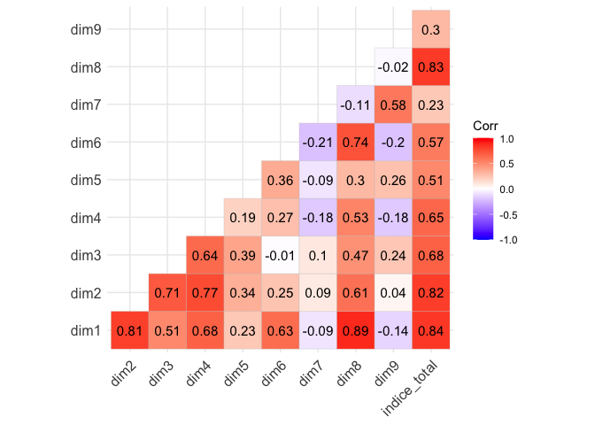
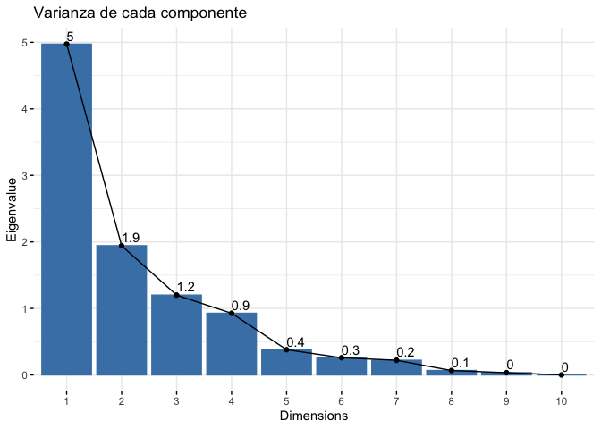
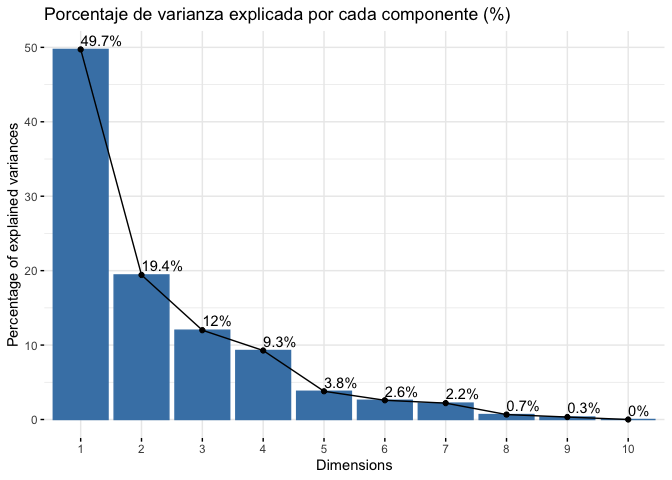
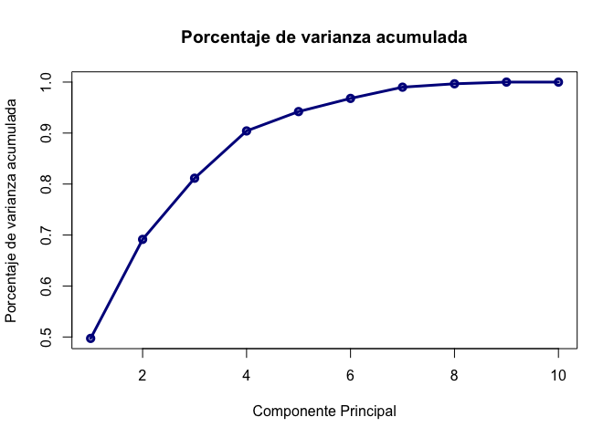
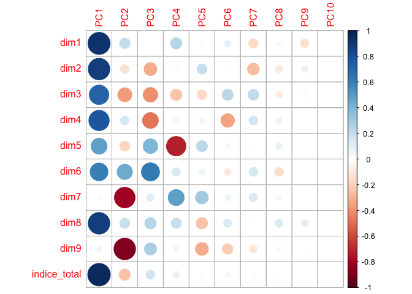
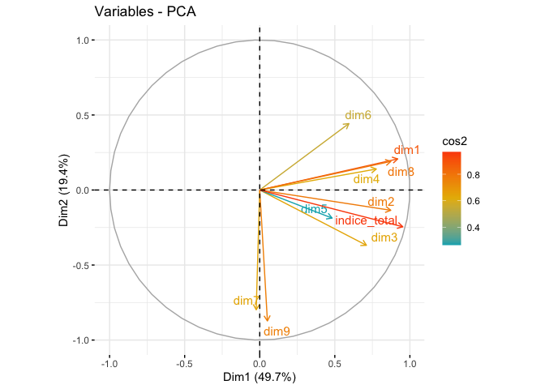
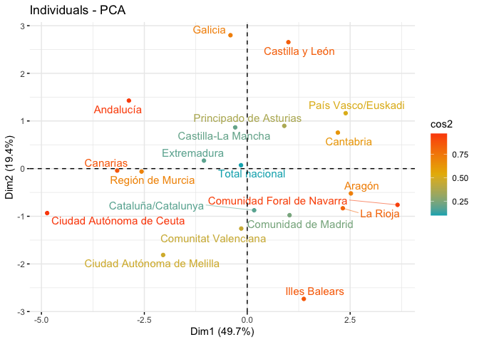

# Introducción

## dataset

En este cuaderno vamos a analizar el dataset llamado
[*IMCV_pca.xlsx*](https://github.com/davidperezros/ine_sg_difusion_explica_datasets/blob/ebf8222527aa2f412419c70e97ec31b6733c100d/Datasets/IMCV_pca.xlsx).

En el siguiente dataset disponemos de datos por Comunidades Autónomas de
las nueve **dimensiones relativas a la calidad de vida que componen el
Índice Multidimensional de Calidad de Vida (IMCV)**, una estadística con
carácter experimental. Datos correspondientes al año 2020.

Concretamente tenemos las siguietnes variables:

-   **indice_total**: Índice multidimensional de calidad de vida
    teniendo en cuenta las nueve dimensiones.
-   **dim1** : Indicador sobre las condiciones materiales de vida.
-   **dim2** : Indicador sobre el trabajo.
-   **dim3** : Indicador sobre la salud.
-   **dim4** : Indicador sobre la eduación.
-   **dim5** : Indicador sobre el ocio y relaciones sociales.  
-   **dim6** : Indicador sobre la seguridad física y personal.  
-   **dim7** : Indicador sobre la gobernanza y los derechos básicos.  
-   **dim8** : Indicador sobre el entorno y el medioambiente.
-   **dim9** : Indicador sobre experiencia general de la vida.
-   **CCAA**: Comunidades Autónomas.

Los datos relativos a este estudio corresponden, como ya se ha
comentado, a la estadística experimental sobre el
**ÍndiceMultidimensional de Calidad de Vida (IMCV)**. Se construye a
partir de los indicadores de calidad del INE, que ofrecen una visión
panorámica (multidimensional) de la calidad de vida en España, mediante
la elección de un conjunto amplio pero limitado de indicadores
(actualmente 60) que cubren nueve dimensiones usadas para describir la
calidad de vida.

Nuestro **objetivo** es aplicar un procedimiento de PCA para hacer toda
esta información más manejable es a través de un análisis de componentes
principales, el cual nos permite reducir el número de variables
correlacionadas entre sí a otro número igual de componentes no
correlacionados.

Esta técnica de análisis tiene muchas aplicaciones y en esta ocasión la
utilizaremos para poder simplificar la tarea de clasificación
territorios españoles en base a sus características de calidad vida. El
objetivo es reducir el número de variables con las que trabajar
sufriendo la menor pérdida posible de información. La agrupación de
comunidades autónomas en grupos que compartan unas características
similares la realizaremos mediante una técnica de análisis de
conglomerados denominada K-medias. El objetivo es agrupar nuestras 17
comunidades y dos ciudades autónomas en un puñado de grupos homogéneos.

``` r
# Librerias
library(readxl) # Para leer los excels
library(dplyr) # Para tratamiento de dataframes
library(ggplot2) # Nice plots
library(factoextra) # fviz_cluster function
library(skimr)  # Para funcion skim
library(ggcorrplot) #Para funcion ggcorrplot
library(corrplot) #Para corrplot
```

Cargamos entonces el conjunto de datos:

``` r
datos <- read_excel("/Users/davpero/ine_sg_difusion_explica_datasets/Datasets/IMCV_pca.xlsx", sheet = "Datos")
```

## Descripción del trabajo a realizar

**(Esto irá en la web de explica)** Se pretende hacer un Análisis de
Reducción de la Dimensionalidad empleando el procedimiento de
Componentes Principales. El objetivo es reducir el número de variables
de los 9 indicadores globales de calidad de vida sin perder mucha
información.

-   Hacer un análisis exploratorio explorando matriz de correlaciones.
-   Ver si es necesario escalar/centrar los datos antes de aplicar pca y
    decidir si hacerlo con matriz de correlaciones o covarianzas.
-   Seleccionar un determinado número de componentes y ver como influyen
    las variables en estas.
-   Interpretar componentes y resultados.

# Análisis Exploratorio (EDA[1])

En primer lugar, cargamos los datos que vamos a utilizar. En este caso,
se trata de un conjunto de datos compuesto por 20 filas y 14 columnas.
Las filas corresponden a las 19 Comunidades Autónomas de España (17
CCAA, Ceuta y Melilla) y el Total Nacional y las 11 columnas al nombre
de dichas CCAA, los 9 indices y el indice total (la media de los
anteriores).

Antes de comenzar a aplicar la técnica, comprobamos si hay valores
perdidos, por si fuera necesario realizar algún preproceso. En este
caso, y como vemos a continuación, no hay ningún NA en los datos que
vamos a utilizar.

``` r
sum(is.na(datos))
```

    ## [1] 0

Por otra parte, para tener una noción general que nos permita describir
el conjunto con el que vamos a trabajar, podemos extraer su dimensión,
el tipo de variables que contiene o qué valores toma cada una.

``` r
# Dimensión del conjunto de datos
dim(datos)
```

    ## [1] 20 11

``` r
# Tipo de variables que contiene
str(datos)
```

    ## tibble [20 × 11] (S3: tbl_df/tbl/data.frame)
    ##  $ CCAA        : chr [1:20] "Total nacional" "Andalucía" "Aragón" "Principado de Asturias" ...
    ##  $ dim1        : num [1:20] 100.1 97.1 105.2 102.2 101.8 ...
    ##  $ dim2        : num [1:20] 100.2 95.4 103.3 99.7 102.6 ...
    ##  $ dim3        : num [1:20] 101.3 99.2 102.1 99.7 102.5 ...
    ##  $ dim4        : num [1:20] 106 101 107 109 103 ...
    ##  $ dim5        : num [1:20] 99.1 96.5 104.9 98 103.9 ...
    ##  $ dim6        : num [1:20] 102 102 106 109 103 ...
    ##  $ dim7        : num [1:20] 100 94.9 97.4 100.2 109.4 ...
    ##  $ dim8        : num [1:20] 102.1 98.9 106.3 105.9 104.1 ...
    ##  $ dim9        : num [1:20] 104 102 111 105 112 ...
    ##  $ indice_total: num [1:20] 101.7 98.5 104.8 103.2 104.7 ...

``` r
# Descripción de las variables
skim(datos)
```

|                                                  |       |
|:-------------------------------------------------|:------|
| Name                                             | datos |
| Number of rows                                   | 20    |
| Number of columns                                | 11    |
| \_\_\_\_\_\_\_\_\_\_\_\_\_\_\_\_\_\_\_\_\_\_\_   |       |
| Column type frequency:                           |       |
| character                                        | 1     |
| numeric                                          | 10    |
| \_\_\_\_\_\_\_\_\_\_\_\_\_\_\_\_\_\_\_\_\_\_\_\_ |       |
| Group variables                                  | None  |

Data summary

**Variable type: character**

| skim_variable | n_missing | complete_rate | min | max | empty | n_unique | whitespace |
|:-------------|---------:|-------------:|----:|----:|------:|--------:|----------:|
| CCAA          |         0 |             1 |   6 |  26 |     0 |       20 |          0 |

**Variable type: numeric**

| skim_variable | n_missing | complete_rate |   mean |   sd |    p0 |    p25 |    p50 |    p75 |   p100 | hist  |
|:----------|-------:|----------:|-----:|----:|-----:|-----:|-----:|-----:|-----:|:-----|
| dim1          |         0 |             1 | 100.16 | 4.24 | 91.12 |  97.49 | 100.79 | 103.41 | 105.31 | ▃▁▅▇▇ |
| dim2          |         0 |             1 |  99.80 | 2.95 | 94.60 |  97.60 | 100.17 | 102.54 | 103.42 | ▅▂▃▅▇ |
| dim3          |         0 |             1 | 101.20 | 1.91 | 98.20 |  99.74 | 101.03 | 102.39 | 104.65 | ▆▇▅▇▅ |
| dim4          |         0 |             1 | 105.95 | 4.49 | 97.35 | 103.09 | 106.18 | 108.14 | 115.15 | ▂▇▇▂▃ |
| dim5          |         0 |             1 | 100.38 | 3.42 | 95.45 |  97.56 |  99.77 | 102.53 | 107.28 | ▇▇▅▃▂ |
| dim6          |         0 |             1 | 102.94 | 4.40 | 93.32 | 100.15 | 102.76 | 106.55 | 109.48 | ▁▅▇▃▇ |
| dim7          |         0 |             1 |  99.97 | 4.90 | 91.22 |  97.03 | 100.12 | 102.49 | 109.35 | ▃▅▇▇▂ |
| dim8          |         0 |             1 | 102.51 | 4.68 | 93.17 |  99.04 | 103.31 | 105.97 | 109.42 | ▅▅▆▇▇ |
| dim9          |         0 |             1 | 105.26 | 4.33 | 93.81 | 103.09 | 106.50 | 107.67 | 112.49 | ▁▁▇▇▃ |
| indice_total  |         0 |             1 | 102.02 | 2.31 | 97.37 | 100.35 | 101.95 | 103.48 | 105.92 | ▅▅▇▆▇ |

Vemos que estas variables (a excepción de las CCAA) son todas de tipo
numérico, y además, podemos obtener información como la media,
desviación típica, los cuartiles y el histograma de cada una.

**Correlación:** El que existan correlaciones muy elevadas en el
conjunto de datos nos permitirá resumir la información en un menor
número de componentes principales, pues éstas explicarán una mayor
cantidad de información.

``` r
ggcorrplot(cor(datos[,2:11]),type="lower",  lab = T, show.legend = T)
```



En este caso, se ha generado un gráfico entre variables, sin tener en
cuenta la correlación de la variable consigo misma, pues siempre será
del 100%, o 1 en tanto por uno.

En términos absolutos, vemos lo siguiente:

-   **dim1** : Indicador sobre las condiciones materiales de vida.
-   **dim2** : Indicador sobre el trabajo.
-   **dim3** : Indicador sobre la salud.
-   **dim4** : Indicador sobre la eduación.

-Hay varias **correlaciones moderadas/altas**. En general la variable
*indice_total* esta muy correlacionada con todas las demas. Esto parece
razonable puesto que sabemos que es la media artimética de las otras
nueve dimenesiones. Es por ello que no aporta nada de información extra.
Además destaca la correlación entre *dim1* (materiales), *dim2*
(trabajo), *dim3*(salud) y *dim4* (educacion) entre todas ellas. Esto
también podria parecer razonable puesto que una mejor educación suele
llevar más satisfacción en los estudios, en el trabajo y en las
condiciones materiales (puesto que se suele ganar más dinero) y esto
puede derivar en menos problemas de salud debido a una vida “más
tranquila. También hay correlaciones altas entre *dim1* y *dim8*, y
entre *dim7* y *dim8*.

-   Hay **correlaciones muy bajas** entre *dim8* (entorno y el
    medioambiente) y *dim9* (satisfacción general).

En resumen, vemos que hay varias variables con una alta correlación
absoluta(tanto postivia como negativa), luego esto nos va a permitir
resumir la información en un núemro de componentes principales menor al
número de variables que tenemos.

# Reducción Dimensionalidad: Componentes Principales

## Introducción

El **Análisis de Componentes Principales (PCA)** es una técnica para
reducir la complejidad de conjuntos de datos con múltiples variables. Su
objetivo es transformar variables correlacionadas en un conjunto menor
de dimensiones sin perder la mayor parte de la información original.

Se busca encontrar **nuevas variables (componentes)** que estén
incorrelacionadas y que capturen la máxima variabilidad de los datos.
Esto se logra mediante combinaciones lineales de las variables
originales. PCA es útil para entender relaciones, reducir dimensiones y
manejar la alta correlación entre variables.

Para aplicar PCA, se necesitan **datos cuantitativos** y es crucial
*escalar las variables* (estandarizar = media cero y varianza uno). Esto
garantiza que ninguna variable domine el análisis. Además, se puede
trabajar con la matriz de correlaciones para abordar fuertes
correlaciones entre variables, manteniendo así la información más
relevante del conjunto de datos.

Los pasos generales son:

1.  **Estandarización de las variables**: Es importante estandarizar las
    variables numéricas para que tengan media cero y desviación estándar
    uno. Esto es crucial para que ninguna variable domine el análisis
    debido a su escala.

2.  **Cálculo de la matriz de correlaciones o covarianzas**: Dependiendo
    del enfoque, se puede trabajar con la matriz de correlaciones si se
    busca abordar fuertes correlaciones entre variables, o con la matriz
    de covarianzas si se busca la varianza total de las variables.

-   **NOTA**: Aconsejable trabajar siempre con la matriz de
    correlaciones (a no ser que todas variables estén en las mismas
    unidades, que se podrá usar la matriz de covarianzas). De no seguir
    esta nota y usar la matriz de covarianzas, las variables que tienen
    mayores unidades dominarán la estructura de covarianza, lo que
    llevará a una representación inexacta de la variabilidad real de los
    datos.

1.  **Descomposición de la matriz**: Se descompone la matriz de
    correlaciones en sus vectores y valores propios. Los valores propios
    representan la cantidad de varianza explicada por cada componente
    principal, mientras que los vectores propios (autovectores)
    determinan la dirección de cada componente en el espacio
    multidimensional original.

2.  **Selección de componentes**: Los componentes se ordenan de manera
    descendente según la cantidad de varianza que explican. Los primeros
    componentes capturan la mayor variabilidad de los datos y se
    seleccionan para reducir la dimensionalidad manteniendo la
    información más relevante.

3.  **Transformación de datos**: Proyectar los datos originales en el
    espacio de los componentes principales para obtener las nuevas
    variables. Estas son combinaciones lineales de las variables
    originales y son ortogonales entre sí. Esta transformación lineal
    **conserva la mayor parte de la información en un espacio de menor
    dimensión, lo que facilita el análisis y la visualización de los
    datos**.

4.  **Interpretación y visualización**: Explorar la importancia de cada
    componente en términos de la variabilidad explicada. Se pueden
    interpretar los componentes para comprender qué aspectos de los
    datos capturan. Si es posible, representar gráficamente los datos en
    el espacio reducido de los componentes principales para obtener una
    mejor comprensión de las relaciones entre las observaciones.

## Modelo

En las siguientes lineas haremos que la variable `CCAA` se ponga como
nombre de filas y posteriormente eliminaremos esa variable ya que ya la
tendremos como nombre de filas.

``` r
CCAA<-datos$CCAA
datos<-datos[,-1]         # Eliminamos ahora 
rownames(datos)<-CCAA # Como nombres de filas las CCAA
```

Escalamos los datos y calculamos la matriz de varianzas covarianzas,
mostramos solo la diagonal (debería ser 1).

``` r
datos2<-scale(datos)
summary(datos2)
```

    ##       dim1              dim2              dim3               dim4        
    ##  Min.   :-2.1326   Min.   :-1.7625   Min.   :-1.56842   Min.   :-1.9141  
    ##  1st Qu.:-0.6318   1st Qu.:-0.7483   1st Qu.:-0.76011   1st Qu.:-0.6366  
    ##  Median : 0.1484   Median : 0.1242   Median :-0.08763   Median : 0.0510  
    ##  Mean   : 0.0000   Mean   : 0.0000   Mean   : 0.00000   Mean   : 0.0000  
    ##  3rd Qu.: 0.7658   3rd Qu.: 0.9280   3rd Qu.: 0.62421   3rd Qu.: 0.4868  
    ##  Max.   : 1.2135   Max.   : 1.2268   Max.   : 1.80469   Max.   : 2.0459  
    ##       dim5              dim6               dim7               dim8        
    ##  Min.   :-1.4419   Min.   :-2.18929   Min.   :-1.78315   Min.   :-1.9962  
    ##  1st Qu.:-0.8263   1st Qu.:-0.63634   1st Qu.:-0.59890   1st Qu.:-0.7407  
    ##  Median :-0.1781   Median :-0.04166   Median : 0.03022   Median : 0.1713  
    ##  Mean   : 0.0000   Mean   : 0.00000   Mean   : 0.00000   Mean   : 0.0000  
    ##  3rd Qu.: 0.6283   3rd Qu.: 0.81996   3rd Qu.: 0.51421   3rd Qu.: 0.7402  
    ##  Max.   : 2.0179   Max.   : 1.48572   Max.   : 1.91434   Max.   : 1.4768  
    ##       dim9          indice_total     
    ##  Min.   :-2.6466   Min.   :-2.01845  
    ##  1st Qu.:-0.5007   1st Qu.:-0.72184  
    ##  Median : 0.2878   Median :-0.02952  
    ##  Mean   : 0.0000   Mean   : 0.00000  
    ##  3rd Qu.: 0.5582   3rd Qu.: 0.63501  
    ##  Max.   : 1.6719   Max.   : 1.69368

``` r
diag(var(datos2))
```

    ##         dim1         dim2         dim3         dim4         dim5         dim6 
    ##            1            1            1            1            1            1 
    ##         dim7         dim8         dim9 indice_total 
    ##            1            1            1            1

Aplicamos funcion PCA, notar que en este caso no haría falta los
argumentos `SCALE=TRUE` y `CENTER=TRUE` puesto que ya hemos escalado dos
datos en un paso previo. Por defecto en la función viene el valor de
`SCALE=FALSE` y `CENTER=TRUE`.

``` r
pca <- prcomp(datos2,center= TRUE,scale = TRUE)  # Scale=T 
```

**Calculamos los coeficientes de la ecuación para cada componente
principal**

``` r
pca$rotation
```

    ##                      PC1         PC2          PC3         PC4         PC5
    ## dim1          0.41217280  0.14877833 -0.007886089  0.25040422 -0.03495987
    ## dim2          0.39138679 -0.09690754 -0.285268440  0.02374485  0.30937355
    ## dim3          0.31866055 -0.26428112 -0.366226773 -0.25600015 -0.27286698
    ## dim4          0.34816197  0.10046074 -0.432653154 -0.04246203  0.09300467
    ## dim5          0.21612679 -0.13421375  0.369533348 -0.74071758  0.37307852
    ## dim6          0.26627260  0.31778339  0.561890598  0.13651894  0.10130691
    ## dim7         -0.01055075 -0.57258219  0.099090101  0.50180042  0.49810262
    ## dim8          0.39164780  0.13691741  0.227414824  0.20210276 -0.40340929
    ## dim9          0.02291434 -0.62614481  0.253810202 -0.05251280 -0.50833075
    ## indice_total  0.42723809 -0.17573666  0.137902202  0.08178066  0.03554529
    ##                      PC6         PC7         PC8           PC9       PC10
    ## dim1          0.15986625 -0.35400851  0.14448659 -7.355855e-01  0.1764945
    ## dim2          0.02687191 -0.56236950 -0.38092875  4.272942e-01  0.1228933
    ## dim3          0.45622979  0.46654349 -0.32990432 -1.162118e-01  0.0796614
    ## dim4         -0.68323743  0.32389336  0.25348956 -8.518163e-03  0.1870813
    ## dim5          0.07972391 -0.03791973  0.28252371 -5.465610e-02  0.1423732
    ## dim6         -0.17814501  0.31489323 -0.56481902 -8.173809e-03  0.1830583
    ## dim7          0.13181815  0.27778546  0.16153493  3.579959e-05  0.2041452
    ## dim8          0.24817365  0.04247789  0.46564230  5.043772e-01  0.1948073
    ## dim9         -0.41586550 -0.23231717 -0.13180172 -7.148902e-02  0.1801180
    ## indice_total -0.09359397  0.04809077  0.04236672 -1.395427e-02 -0.8640333

Podemos observar aquí nuestras variables en el nuevo sistema de
cordenadas (las componentes principales), dando lugar a ecuaciones de
cada eje como combinación lineal del total de variables. Analizar el
vector que crea cada componente y cuáles son los pesos que tienen las
variables en cada componente, ayuda a interpretar qué tipo de
información recoge cada una de ellas.

Por ejemplo, la primera componente principal (PC1), presenta la
siguiente ecuación, como combinación lineal de las 10 variables
originales (los 9 indices y el total):

$ PC_1 = 0.41 {dim1} + 0.39 {dim2} + 0.31dim3 + 0.34 dim4 + 0.21 dim5 +
0.26 dim6 -0.01 dim7 +0.39dim8 +0.02dim9 +0.42indice_total $

**Extraemos las nuevas coordenadas de los individuos (puntuaciones)**

Además, podemos ver las puntuaciones, que son las coordenadas de cada
observación original (Comunidad Autónoma) sobre los nuevos ejes
construidos (componentes principales). Esto corresponde a un cambio de
coordenadas bajo el paradigma del Álgebra Lineal.

``` r
 pca$x
```

    ##                                   PC1         PC2         PC3        PC4
    ## Total nacional             -0.1520461  0.07182026 -0.45989066  0.1972086
    ## Andalucía                  -2.8750017  1.42744067  0.03518304  0.1280892
    ## Aragón                      2.5189323 -0.52042496  0.93792815 -0.7452448
    ## Principado de Asturias      0.8999964  0.89724658  0.68192085  1.2083129
    ## Illes Balears               1.3747946 -2.73400720  0.95711048  0.2369471
    ## Canarias                   -3.1596066 -0.04090058 -0.09918370  0.3649717
    ## Cantabria                   2.2014164  0.75598285  1.42109419 -0.8263169
    ## Castilla y León             0.9996922  2.65361220  0.52989434 -0.6582007
    ## Castilla-La Mancha         -0.2922882  0.86529256  0.53813056  1.2402982
    ## Cataluña/Catalunya          0.1681743 -0.87429121 -1.52725547  0.8279649
    ## Comunitat Valenciana       -0.1458826 -1.25747939  0.61481441  0.9489872
    ## Extremadura                -1.0519197  0.16786627  1.68926034 -0.4259641
    ## Galicia                    -0.4075932  2.79976605 -0.32800120 -0.6218279
    ## Comunidad de Madrid         1.0281924 -0.97693037 -2.43036654 -0.1553581
    ## Región de Murcia           -2.5673690 -0.06088548 -0.25201844  1.3020744
    ## Comunidad Foral de Navarra  3.6514886 -0.76057338 -0.38861291  0.2272912
    ## País Vasco/Euskadi          2.3914014  1.16327326 -2.33194237 -0.6865915
    ## La Rioja                    2.3224637 -0.83141897  0.63878955  0.5481555
    ## Ciudad Autónoma de Ceuta   -4.8615062 -0.93309263 -0.28920898 -0.2972782
    ## Ciudad Autónoma de Melilla -2.0433389 -1.81229652  0.06235434 -2.8135186
    ##                                     PC5         PC6         PC7         PC8
    ## Total nacional             -0.004590525  0.07740386 -0.03500474 -0.03286903
    ## Andalucía                  -0.617579706  0.16919700 -0.06676935 -0.10573402
    ## Aragón                     -0.377371489 -0.23123596 -0.92964071 -0.27460172
    ## Principado de Asturias     -0.090833979 -0.90107665  0.27340119 -0.05512076
    ## Illes Balears               0.429253728  0.44404518 -0.41284040 -0.04953438
    ## Canarias                   -0.620175044 -0.75909198  0.29915397 -0.54095905
    ## Cantabria                  -0.005966101 -0.70417837 -0.05752270  0.23598297
    ## Castilla y León             0.161603996  0.46660593 -0.60032019  0.30539596
    ## Castilla-La Mancha         -0.258461708  1.19428695  0.25999657 -0.08984701
    ## Cataluña/Catalunya         -0.229653846  0.13187983 -0.56300688 -0.25232420
    ## Comunitat Valenciana        0.505122343 -0.53013775  0.04048603  0.36603262
    ## Extremadura                -1.078612886  0.47481509  0.77326877  0.23250910
    ## Galicia                     1.557454194  0.06616103  0.24900479 -0.33491570
    ## Comunidad de Madrid         0.247821195  0.33060935  0.55630084  0.22530929
    ## Región de Murcia            0.861302303 -0.37552323 -0.05444533  0.34920723
    ## Comunidad Foral de Navarra -0.332575416 -0.13910414  0.70942125  0.02558768
    ## País Vasco/Euskadi         -0.851410145 -0.26279579 -0.25757341  0.15864443
    ## La Rioja                    0.483996053  0.46552566  0.05023515 -0.30388831
    ## Ciudad Autónoma de Ceuta   -0.223110508  0.11977479 -0.69124440  0.23765210
    ## Ciudad Autónoma de Melilla  0.443787541 -0.03716081  0.45709952 -0.09652721
    ##                                     PC9          PC10
    ## Total nacional              0.053670256 -6.163308e-16
    ## Andalucía                  -0.233555298  1.949452e-15
    ## Aragón                     -0.202175835  2.415114e-15
    ## Principado de Asturias      0.097410314  2.751194e-15
    ## Illes Balears               0.021978584  6.180728e-16
    ## Canarias                    0.025967087 -7.207331e-16
    ## Cantabria                  -0.021604695 -4.645421e-15
    ## Castilla y León             0.243709000  1.107497e-15
    ## Castilla-La Mancha          0.090401694  2.468569e-15
    ## Cataluña/Catalunya          0.438693342 -2.722684e-15
    ## Comunitat Valenciana        0.131431585  1.095459e-15
    ## Extremadura                 0.004275745 -8.669414e-16
    ## Galicia                     0.009359994 -2.267613e-15
    ## Comunidad de Madrid        -0.177270792 -1.277013e-15
    ## Región de Murcia           -0.185842836  1.708892e-15
    ## Comunidad Foral de Navarra  0.102240565 -1.330261e-15
    ## País Vasco/Euskadi         -0.138765629  2.732009e-15
    ## La Rioja                   -0.342414149 -1.545634e-15
    ## Ciudad Autónoma de Ceuta   -0.078644487 -3.738991e-15
    ## Ciudad Autónoma de Melilla  0.161135554  3.404121e-15

**Varianza explicada por cada componente principal**

Una vez calculadas las componentes principales, es de interés conocer la
varianza explicada por cada una, ya que el principal objetivo que se
sigue con PCA es maximizar la cantidad de información explicada por las
componentes.

``` r
summary(pca)
```

    ## Importance of components:
    ##                           PC1    PC2    PC3     PC4     PC5     PC6     PC7
    ## Standard deviation     2.2299 1.3937 1.0954 0.96289 0.61604 0.50849 0.46937
    ## Proportion of Variance 0.4972 0.1942 0.1200 0.09272 0.03795 0.02586 0.02203
    ## Cumulative Proportion  0.4972 0.6915 0.8115 0.90419 0.94214 0.96799 0.99002
    ##                            PC8     PC9      PC10
    ## Standard deviation     0.25786 0.18237 2.309e-15
    ## Proportion of Variance 0.00665 0.00333 0.000e+00
    ## Cumulative Proportion  0.99667 1.00000 1.000e+00

-   **Standard deviation**: muestra las desviaciones estándar de cada
    componente principal. Si elevamos al cuadrado estas desviaciones,
    tenemos la varianza (**el autovalor correspondiente**). Es decir, la
    varianza explicada por cada componente corresponde con los
    autovalores de la matriz de covarianzas de los datos estandarizados.

-   **Proportion of Variance**: es la proporción de la varianza total
    que explica cada componente principal y quizá, es la fila más
    importante de nuestros resultados. Como los autovalores están
    ordenados de mayor a menor y así son construidas las componentes
    principales, la primera componente principal es la que mayor
    porcentaje de variabilidad explica, un 49%. Así, la varianza
    explicada por la componentes van en orden decreciente, teniendo que
    la segunda componente explica un 19% y la tercera, un 12%.

-   **Cumulative proportion**: es la varianza acumulada y se calcula
    progresivamente sumando la Proportion of Variance anterior. En vista
    de estos resultados, vemos que la primera componente agrupa el 49%
    de la variación, y que necesitamos 3 componentes para alcanzar el
    80%.

## Selección de componentes

Graficando el valor de la varianza de cada componente principal, podemos
observar los resultados comentados anteriormente, que las primeras
componentes son las que más varianza explican y que a medida que se
añaden más, la varianza explicada por cada una es menor.

``` r
fviz_eig(pca, main="Varianza de cada componente", choice = "eigenvalue", addlabels = T)
```


o como el porcentaje de varianza explicada por cada componente sobre el
total.

``` r
fviz_screeplot(pca, addlabels = TRUE, main="Porcentaje de varianza explicada por cada componente (%)")
```


A continuación, representamos las varianzas acumuladas:

``` r
plot(summary(pca)$importance[3, ], type="o", col="darkblue", lwd=3, main = "Porcentaje de varianza acumulada", xlab = "Componente Principal", ylab = "Porcentaje de varianza acumulada")
```


Determinar el número de componentes que elegir para continuar con el
análisis no tiene unas normas determinadas a seguir. Respecto a ello,
existen varios criterios con sus respectivas propuestas.

1.  Una opción para determinar el número de componentes principales que
    seleccionar, es coger aquellas tal que expliquemos un %
    **determinado de la variabilidad de los datos que nosotros
    prefijemos**. Generalmente se pone como umbral mínimo un 80%,
    entonces necesitaríamos elegir 3 componentes.

2.  Otra posibilidad es seguir el **criterio de Kaisser**, que escoge
    aquellas componentes cuyo autovalor sea superior a 1 (cuando las
    variables han sido generadas a partir de la matriz de
    correlaciones). Según este criterio y mirando el gráfico anterior de
    la varianza (igual a eigenvalues), eligiríamos las 3 primeras
    componentes. Este criterio, cuando p \< 20, tiende a ser estricto e
    incluir pocas componentes.

3.  Para relajar el criterio de Kaisser, existe la **modificación de
    Jollife**, que elige aquellas componentes cuyo autovalor sea
    superior a 0.7. Esta modificación, nos permite elegir igualmente 4
    componentes.

En este caso, nos podríamos quedar con las 3 primeras componentes
principales, ya que es el número en el que coincide el mayor número de
criterios. Por tanto, en lugar de trabajar con las 13 variables
originales, trabajaremos con 3 variables nuevas, que son combinaciones
de ellas.

## Interpretación

Hemos decidido quedarnos con 3 componentes principales, que explican el
81% de la variabilidad total. Para realizar su interpretación, volvemos
a ver los coeficientes de las ecuaciones de los componentes, observando
cuáles son los valores más altos (en valor absoluto), para así poder dar
una interpretación a cada eje.

Gráficamente, también podemos ver la contribución de las variables a los
3 primeros ejes, señalando en color azul las variables que puntúan
positivamente en el eje, y en rojo, las que lo hacen de forma negativa.

``` r
pca$rotation[,1:3]
```

    ##                      PC1         PC2          PC3
    ## dim1          0.41217280  0.14877833 -0.007886089
    ## dim2          0.39138679 -0.09690754 -0.285268440
    ## dim3          0.31866055 -0.26428112 -0.366226773
    ## dim4          0.34816197  0.10046074 -0.432653154
    ## dim5          0.21612679 -0.13421375  0.369533348
    ## dim6          0.26627260  0.31778339  0.561890598
    ## dim7         -0.01055075 -0.57258219  0.099090101
    ## dim8          0.39164780  0.13691741  0.227414824
    ## dim9          0.02291434 -0.62614481  0.253810202
    ## indice_total  0.42723809 -0.17573666  0.137902202

``` r
corr_var <- pca$rotation %*% diag(pca$sdev)
colnames(corr_var) <- c("PC1", "PC2", "PC3", "PC4", "PC5", "PC6", "PC7", "PC8", "PC9", "PC10")
corrplot(corr_var)
```


Si nos fijamos en los pesos más altos, podemos darle una interpretación
a cada eje. Por ejemplo:

-   La **primera componente** explica un 49% de la variación. Hay
    valores absolutos bastante similares y elevados, que son los
    correspondientes con todas las dimensiones excepto la 7 y la 9. Esto
    parece razonable puesto que antes habíamos visto que todas variables
    a excepción de la 7 y la 9 estaban bastante correlacionadas entre
    ellas.

-   En la **segunda componente**, los pesos más elevados corresponden
    con las dimensiones 7 y 9, que son las que no habían influido en la
    primera componente.

-   Para la **tercera componente**, influyen las dimensiones de la 3 a
    la 6.

-   En la **cuarta componente**

## Representación gráfica

**Gráfico de las variables**

Representamos sobre las dos primeras componentes principales las
variables originales. En el eje de abscisas se representa la PC1 y en el
eje de ordenadas, la PC2. Para interpretar correctamente las variables
tenemos que fijarnos en la longitud de la flecha y en el ángulo que
forman respecto a los ejes y entre ellos mismos.

-   **Ángulo vector - eje**: cuanto más paralelo es un vector al eje,
    más ha contribuido a dicha componente principal.

-   **Ángulo entre dos vectores**: si es pequeño representa una alta
    correlación entre las variables implicadas (y por tanto,
    observaciones con valores altos en una variable, tendrá valores
    altos en la otra). Si el ángulo es cercano a 90º indica que las
    variables están incorreladas y los ángulos opuestos indican
    correlación negativa entre ellas.

-   **Longitud**: cuanto mayor es la longitud de un vector, mayor
    varianza de la variable está contenida en el biplot, es decir, mejor
    representada está en el gráfico.

En el gráfico, diferenciamos por colores las variables según su calidad
de representación en las dos primeras componentes. Cuanto más cerca esté
una variable del círculo de correlaciones, mejor será su representación,
por lo que las variables que estén muy cerca del centro de la gráfica
son las menos importantes para las dos primeras componentes.

``` r
fviz_pca_var(pca,axes=c(1,2), col.var = "cos2", gradient.cols = c("#00AFBB", "#E7B800", "#FC4E07"), repel = TRUE)
```



**RESUMEN DE RESULTADOS**

Los gráficos obtenidos muestran una visualización de las variables en
función de las componentes principales 1 y 2, y 3 y 4. Las variables que
tienen una correlación alta con la primera componente principal, que son
todas menos las 7 y la 9, están más cerca del eje horizontal y las
variables que tienen una alta correlación con la segunda componente
principal están más cerca del eje vertical,. Las variables que se
encuentran cerca del centro del gráfico tienen una correlación baja con
ambas componentes principales, aún así nos guiaremos con la tabla para
decidir qué variables están mejor explicadas por cada una de las
componentes. En resumen, estos gráficos proporcionan una representación
visual de las relaciones entre las variables en función de las dos
primeras componentes principales y las dos segundas, lo que puede ayudar
a identificar patrones y tendencias en los datos.

**COMPONENTE 1**

De los gráficos extraemos la siguiente conclusión. La componente 1 está
muy correlacionada con las condiciones materiales de vida, el medio
ambiente y el trabajo. Además está correlación es positiva , por lo que
las comunidades que puntúen alto en la componente podremos decir que
tendrán altos niveles de bienestar material, satisfacción con el medio
ambiente y sus condiciones de trabajo.

**COMPONENTE 2**

La segunda componente correlaciona principalmente con las dimensiones de
experiencie general con la vida y la gobernanza y derechos básicos.

En el siguiente gráfico podemos ver las correlaciones de dichas
variables con las componentes principales, como ya hemos comentado.

``` r
corr_var <- pca$rotation %*% diag(pca$sdev)
colnames(corr_var) <- c("PC1", "PC2", "PC3", "PC4", "PC5", "PC6", "PC7", "PC8", "PC9", "PC10")
corrplot(corr_var)
```


**Gráfico de los individuos**

Tras observar la representación de las variables, en este apartado vemos
la representación de los individuos sobre los nuevos ejes, con la idea
de que aquellos con características similares, se agrupan cerca al tener
puntuaciones parecidas. Las comunidades con valores cercanos a la media
se situarán cerca del centro del gráfico (0,0).

Representando los individuos sobre PC1 y PC2, vemos que Comunidades como
Ceuta y Melilla, o Cataluña y el Madrid están muy próximas entre sí,
indicando que tienden a tener un nivel de Mercado de Hipotécas similar.

``` r
# Sobre PC1 y PC2
fviz_pca_ind(pca, col.ind = "cos2", gradient.cols = c("#00AFBB", "#E7B800", "#FC4E07"), repel = TRUE, axes = c(1, 2))
```



# Conclusiones

Las nuevas componentes han permitido analizar las características más
destacadas de las comunidades autónomas en términos de las 9 dimensiones
indicadoras de la calidad de vida.

[1] EDA viene del Inglés *Exploratory Data Analysis* y son los pasos
relativos en los que se exploran las variables para tener una idea de
que forma toma el dataset.
