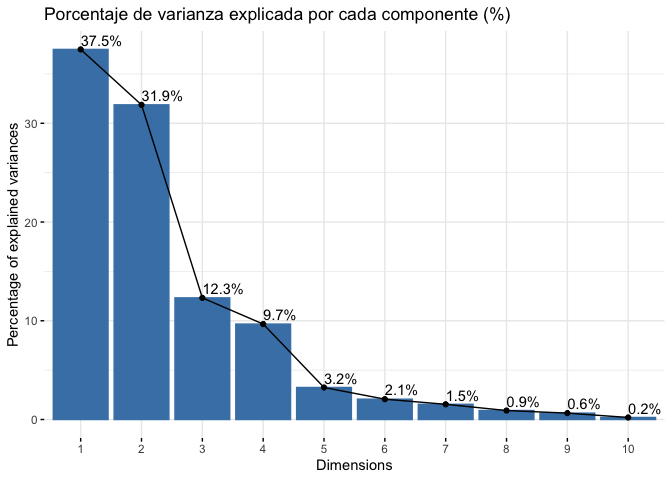
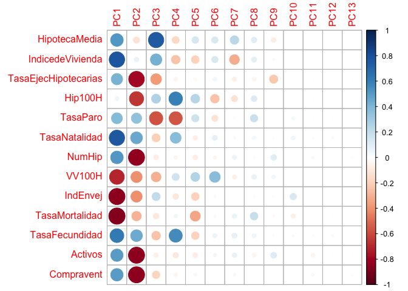

# Introducción

## dataset

En este cuaderno vamos a analizar el dataset llamado
[*MercadoHipotecas*](https://github.com/davidperezros/ine_sg_difusion_explica_datasets/blob/aa4094c2592ae20139130220c6658c8ab58b1037/Datasets/MercadoHipotecas.xlsx).
Este dataset presenta los datos de estudio del mercado de adquisición de
viviendas en propiedad en todas las comunidades autónomas durante el
ejercicio 2021, relacionando las transmisiones inmobiliarias con las
hipotecas constituidas, los índices de precio de vivienda y otras
variables económicas y sociodemográficas. Orientado a escalamiento
multidimensional, técnicas de clusterización y análisis de componentes
principales. Nuestro **objetivo** es conocer que variables
independientes son de interés para estudiar el mercado inmobiliario y
ver qué comunidades autónomas son las más parecidas y las más diferentes
en términos de variables hipotecarias y sociodemográficas. Concretamente
en este dataset tenemos las siguientes variables:

-   **CCAA**: Comunidades Autónomas.
-   **HipotecaMedia**: Importe de la hipoteca por cada comunidad
    autonoma promediadas por su tanaño.
-   **IndicedeVivienda**: Índice del precio de la vivienda (IPV).
-   **TasaEjecHipotecarias**: Número de Hipotecas Ejecutadas.
-   **Hip100H**: Número de hipotecas por cada cien mil habitantes en la
    comunidad autónoma.
-   **TasaParo**: Tasas de paro por distintos grupos de edad, sexo y
    comunidad autónoma.
-   **TasaNatalidad**: Tasa Bruta de Natalidad.
-   **NumHip**: Cantidad de hipótecas en la comunidad autónoma.
-   **VV100H**: Número de viviendas vacias por cada cien mil habitantes.
-   **IndEnvej**: Porcentaje de personas mayores a 65 años.
-   **TasaMortalidad**: Porcentaje de fallecidos por comunidad autónoma.
-   **TasaFecundidad**: Tasa Global de Fecundidad por comunidad
    autónoma, según nacionalidad (española/extranjera) de la madre.
-   **Activos**: Persona mayor de 16 años en búsqueda activa de trabajo
    .
-   **Compravent**: Número de compraventas por comunidad autónoma.

Si tomamos demasiadas variables es difícil visualizar relaciones entre
ellas. Otro problema que se presenta es la fuerte correlación. Se hace
necesario, pues, reducir el número de variables sin perder información.
Es importante resaltar el hecho de que el concepto de mayor información
se relaciona con el de mayor variabilidad o varianza.

``` r
# Librerias
library(readxl) # Para leer los excels
library(dplyr) # Para tratamiento de dataframes
library(ggplot2) # Nice plots
library(factoextra) # fviz_cluster function
library(skimr)  # Para funcion skim
library(ggcorrplot) #Para funcion ggcorrplot
library(corrplot) #Para corrplot
```

Cargamos entonces el conjunto de datos:

``` r
datos <- read_excel("/Users/davpero/ine_sg_difusion_explica_datasets/Datasets/MercadoHipotecas.xlsx", sheet = "Datos")
```

## Descripción del trabajo a realizar

**(Esto irá en la web de explica)** Se pretende hacer un Análisis de
Reducción de la Dimensionalidad empleando el procedimiento de
Componentes Principales. El objetivo es conocer que variables
independientes son de interés para estudiar el mercado inmobiliario y
ver qué comunidades autónomas son las más parecidas y las más diferentes
en términos de variables hipotecarias y sociodemográficas.

-   Hacer un análisis exploratorio.
-   Ver si hay NA’s y si es necesario escalar los datos.
-   Emplear algoritmo kmeans().
-   Interpretar resultados.

# Análisis Exploratorio (EDA[1])

En primer lugar, cargamos los datos que vamos a utilizar. En este caso,
se trata de un conjunto de datos compuesto por 19 filas y 14 columnas.
Las filas corresponden a las 19 Comunidades Autónomas de España y las 14
columnas a variables que se han medido para cada una de ellas.

Antes de comenzar a aplicar la técnica, comprobamos si hay valores
perdidos, por si fuera necesario realizar algún preproceso. En este
caso, y como vemos a continuación, no hay ningún NA en los datos que
vamos a utilizar.

``` r
sum(is.na(datos))
```

    ## [1] 0

Por otra parte, para tener una noción general que nos permita describir
el conjunto con el que vamos a trabajar, podemos extraer su dimensión,
el tipo de variables que contiene o qué valores toma cada una.

``` r
# Dimensión del conjunto de datos
dim(datos)
```

    ## [1] 19 14

``` r
# Tipo de variables que contiene
str(datos)
```

    ## tibble [19 × 14] (S3: tbl_df/tbl/data.frame)
    ##  $ CCAA                : chr [1:19] "Andalucía" "Aragón" "Asturias" "Baleares" ...
    ##  $ HipotecaMedia       : num [1:19] 125016 124092 104138 249109 137260 ...
    ##  $ IndicedeVivienda    : num [1:19] 0.952 0.94 0.901 1.09 0.953 ...
    ##  $ TasaEjecHipotecarias: num [1:19] 0.2299 0.0195 0.0163 0.0108 0.044 ...
    ##  $ Hip100H             : num [1:19] 1297 1167 1087 1109 808 ...
    ##  $ TasaParo            : num [1:19] 21.7 10.2 12.5 14.9 23.2 ...
    ##  $ TasaNatalidad       : num [1:19] 7.72 7.21 4.74 7.81 5.67 5.63 5.5 7.1 7.52 7.06 ...
    ##  $ NumHip              : num [1:19] 109869 15475 10994 13013 17547 ...
    ##  $ VV100H              : num [1:19] 7521 7565 8189 6075 6363 ...
    ##  $ IndEnvej            : num [1:19] 108 148 231 106 126 ...
    ##  $ TasaMortalidad      : num [1:19] 9.33 11.06 13.25 7.22 7.63 ...
    ##  $ TasaFecundidad      : num [1:19] 34.4 34.8 24.7 32.7 23.9 ...
    ##  $ Activos             : num [1:19] 4023 645 447 649 1121 ...
    ##  $ Compravent          : num [1:19] 117987 14935 9406 14168 20801 ...

``` r
# Descripción de las variables
skim(datos)
```

|                                                  |       |
|:-------------------------------------------------|:------|
| Name                                             | datos |
| Number of rows                                   | 19    |
| Number of columns                                | 14    |
| \_\_\_\_\_\_\_\_\_\_\_\_\_\_\_\_\_\_\_\_\_\_\_   |       |
| Column type frequency:                           |       |
| character                                        | 1     |
| numeric                                          | 13    |
| \_\_\_\_\_\_\_\_\_\_\_\_\_\_\_\_\_\_\_\_\_\_\_\_ |       |
| Group variables                                  | None  |

Data summary

**Variable type: character**

| skim_variable | n_missing | complete_rate | min | max | empty | n_unique | whitespace |
|:-------------|---------:|-------------:|----:|----:|------:|--------:|----------:|
| CCAA          |         0 |             1 |   5 |  18 |     0 |       19 |          0 |

**Variable type: numeric**

| skim_variable        | n_missing | complete_rate |      mean |       sd |       p0 |       p25 |       p50 |       p75 |      p100 | hist  |
|:-----------|------:|--------:|------:|-----:|-----:|------:|------:|------:|------:|:----|
| HipotecaMedia        |         0 |             1 | 133388.65 | 42665.06 | 91787.81 | 105374.29 | 120524.54 | 144500.61 | 249109.28 | ▇▃▂▁▁ |
| IndicedeVivienda     |         0 |             1 |      0.96 |     0.09 |     0.82 |      0.90 |      0.94 |      1.01 |      1.12 | ▂▇▂▁▅ |
| TasaEjecHipotecarias |         0 |             1 |      0.05 |     0.07 |     0.00 |      0.01 |      0.02 |      0.05 |      0.23 | ▇▂▁▁▁ |
| Hip100H              |         0 |             1 |   1073.97 |   234.29 |   393.93 |    993.02 |   1109.37 |   1231.59 |   1407.47 | ▁▁▂▇▅ |
| TasaParo             |         0 |             1 |     14.94 |     4.96 |     9.84 |     11.49 |     12.52 |     17.74 |     26.66 | ▇▃▂▂▁ |
| TasaNatalidad        |         0 |             1 |      7.17 |     1.49 |     4.74 |      6.12 |      7.10 |      7.75 |     11.17 | ▇▇▇▂▁ |
| NumHip               |         0 |             1 |  29379.47 | 33716.23 |   329.00 |   8910.00 |  17126.00 |  26166.00 | 109869.00 | ▇▂▁▁▂ |
| VV100H               |         0 |             1 |   7214.38 |  3019.69 |  1584.73 |   5568.22 |   7565.40 |   9907.24 |  11177.44 | ▂▃▃▇▇ |
| IndEnvej             |         0 |             1 |    134.11 |    46.60 |    46.23 |    110.60 |    126.11 |    153.13 |    231.07 | ▂▆▇▂▃ |
| TasaMortalidad       |         0 |             1 |      9.72 |     1.89 |     6.76 |      8.25 |      9.83 |     10.93 |     13.25 | ▆▇▆▅▅ |
| TasaFecundidad       |         0 |             1 |     32.89 |     5.33 |    23.90 |     30.72 |     32.91 |     34.61 |     47.19 | ▃▇▅▁▁ |
| Activos              |         0 |             1 |   1221.23 |  1283.45 |    36.30 |    381.95 |    748.30 |   1174.60 |   4022.90 | ▇▃▁▁▂ |
| Compravent           |         0 |             1 |  29815.00 | 34610.46 |   308.00 |   8529.50 |  19785.00 |  24230.50 | 117987.00 | ▇▁▁▂▁ |

Vemos que estas variables (a excepción de las CCAA) son todas de tipo
numérico, y además, podemos obtener información como la media,
desviación típica, los cuartiles y el histograma de cada una.

**Correlación:** El que existan correlaciones muy elevadas en el
conjunto de datos nos permitirá resumir la información en un menor
número de componentes principales, pues éstas explicarán una mayor
cantidad de información.

``` r
ggcorrplot(cor(datos[,2:14]), type = "lower", lab = T, show.legend = T)
```


En este caso, se ha generado un gráfico entre variables, sin tener en
cuenta la correlación de la variable consigo misma, pues siempre será
del 100%.

En términos absolutos, vemos que hay varias **correlaciones
moderadas/altas** como entre las variables *Activos* y *Compravent* (del
98%) o entre **IndEnvej\* y **TasaMortalidad\* (del 74%). En ambos
casos, la correlación es positiva, es decir, que crecen
proporcionalmente. Respecto a la correlación negativa, encontramos
valores muy altos para *TasaNatalidad* e *IndEnvej*. Las correlaciones
más **bajas** corresponden a los pares *TasaNatalidad* y *Compravent*
(2%) o *HipotecaMedia* y *TasaFecundidad* (-1%).

En resumen, vemos que hay varias variables con una alta correlación
absoluta(tanto postivia como negativa), luego esto nos va a permitir
resumir la información en un núemro de componentes principales menor al
número de variables que aquí tenemos.

# Reducción Dimensionalidad: Componentes Principales

## Introducción

El **Análisis de Componentes Principales (PCA)** es una técnica para
reducir la complejidad de conjuntos de datos con múltiples variables. Su
objetivo es transformar variables correlacionadas en un conjunto menor
de dimensiones sin perder la mayor parte de la información original.

Se busca encontrar **nuevas variables (componentes)** que estén
incorrelacionadas y que capturen la máxima variabilidad de los datos.
Esto se logra mediante combinaciones lineales de las variables
originales. PCA es útil para entender relaciones, reducir dimensiones y
manejar la alta correlación entre variables.

Para aplicar PCA, se necesitan **datos cuantitativos** y es crucial
*estandarizar* las variables para que tengan media cero y varianza uno.
Esto garantiza que ninguna variable domine el análisis. Además, se puede
trabajar con la matriz de correlaciones para abordar fuertes
correlaciones entre variables, manteniendo así la información más
relevante del conjunto de datos.

Los pasos generales son:

1.  **Estandarización de las variables**: Es importante estandarizar las
    variables numéricas para que tengan media cero y desviación estándar
    uno. Esto es crucial para que ninguna variable domine el análisis
    debido a su escala.

2.  **Cálculo de la matriz de correlaciones o covarianzas**: Dependiendo
    del enfoque, se puede trabajar con la matriz de correlaciones si se
    busca abordar fuertes correlaciones entre variables, o con la matriz
    de covarianzas si se busca la varianza total de las variables.

3.  **Descomposición de la matriz**: Utiliza rmétodos matemáticos como
    la descomposición de valores propios (eigenvalues) y vectores
    propios (eigenvectors) para obtener los componentes principales.
    Esto se puede realizar mediante técnicas como la descomposición en
    valores singulares (SVD) o métodos específicos de librerías.

4.  **Selección de componentes**: Examinar los valores propios para
    decidir cuántos componentes principales retendrás. Los valores
    propios más grandes indican una mayor variabilidad explicada por
    esos componentes.

5.  **Transformación de datos**: Proyectar los datos originales en el
    espacio de los componentes principales para obtener las nuevas
    variables. Estas son combinaciones lineales de las variables
    originales y son ortogonales entre sí.

6.  **Interpretación y visualización**: Explorar la importancia de cada
    componente en términos de la variabilidad explicada. Se pueden
    interpretar los componentes para comprender qué aspectos de los
    datos capturan. Si es posible, representar gráficamente los datos en
    el espacio reducido de los componentes principales para obtener una
    mejor comprensión de las relaciones entre las observaciones.

## Modelo

En las siguientes lineas haremos que la variable `CCAA` se ponga como
nombre de filas y posteriormente eliminaremos esa variable ya que ya la
tendremos como nombre de filas.

``` r
CCAA<-datos$CCAA
datos<-datos[,-1]         # Eliminamos ahora 
rownames(datos)<-CCAA # Como nombres de filas las CCAA
```

``` r
pca <- prcomp(datos, scale=TRUE)  # Scale=T 
```

1-3) **Calculamos los coeficientes de la ecuación para cada componente
principal**

``` r
pca$rotation # Para ver coeficientes de la ecuación para cada componente principal
```

    ##                              PC1         PC2         PC3         PC4
    ## HipotecaMedia         0.23447260 -0.06310254  0.60036701 -0.14352759
    ## IndicedeVivienda      0.35056462  0.03492200  0.33265184 -0.21595433
    ## TasaEjecHipotecarias  0.18895585 -0.38696171 -0.29859399 -0.04395518
    ## Hip100H               0.02384814 -0.32139415  0.21029632  0.52700520
    ## TasaParo              0.17638635  0.16978548 -0.45544384 -0.50048376
    ## TasaNatalidad         0.34697038  0.22377034 -0.16525154  0.33885102
    ## NumHip                0.23253409 -0.41264772 -0.06210480 -0.03592632
    ## VV100H               -0.31862705 -0.19954134 -0.24466170  0.14612450
    ## IndEnvej             -0.38398575 -0.20108861  0.16993058 -0.09362279
    ## TasaMortalidad       -0.39081025 -0.14283197 -0.08256307  0.03905432
    ## TasaFecundidad        0.27908332  0.21917010 -0.19293982  0.49563579
    ## Activos               0.22264109 -0.41490535 -0.05417093 -0.08779747
    ## Compravent            0.22610583 -0.41442757 -0.14564495 -0.03868128
    ##                              PC5         PC6         PC7         PC8
    ## HipotecaMedia         0.22721287  0.25793850  0.52980535  0.30139664
    ## IndicedeVivienda     -0.29883955  0.25484457 -0.69422079  0.26266824
    ## TasaEjecHipotecarias -0.04578494  0.09016705 -0.14237630 -0.14450223
    ## Hip100H               0.38422611 -0.46625149 -0.28074363  0.33169721
    ## TasaParo              0.26991529 -0.24907203  0.02930616  0.52896695
    ## TasaNatalidad        -0.10947984  0.16047629  0.05441172  0.12043767
    ## NumHip               -0.11719298 -0.06702702  0.13681214  0.03619294
    ## VV100H                0.39357805  0.72591201 -0.13624112  0.21415518
    ## IndEnvej             -0.29873692 -0.04475899 -0.01138938  0.04181744
    ## TasaMortalidad       -0.51193330 -0.04229536  0.15474088  0.56363472
    ## TasaFecundidad       -0.29559220  0.11660486  0.20014738  0.16672803
    ## Activos              -0.12111322  0.07773141  0.16598060 -0.14274555
    ## Compravent           -0.05002690 -0.01843676  0.07412227  0.01306008
    ##                               PC9          PC10        PC11          PC12
    ## HipotecaMedia        -0.262791756  0.0251241391 -0.01163925 -0.0004333459
    ## IndicedeVivienda      0.070224200 -0.0399012682  0.01986345 -0.0797306119
    ## TasaEjecHipotecarias -0.775723474 -0.0024548350 -0.13676702  0.0096868413
    ## Hip100H              -0.009941869  0.0447484933 -0.12820466 -0.0421913182
    ## TasaParo              0.030071820  0.2166825934 -0.06628922 -0.1170645772
    ## TasaNatalidad         0.036325847  0.3089459905 -0.21757169  0.6953808523
    ## NumHip                0.366200530 -0.0152004504  0.42093030  0.1793240415
    ## VV100H                0.153187336  0.0443334585  0.05124612 -0.0468669300
    ## IndEnvej             -0.054795835  0.8212580823  0.03498288 -0.0514083908
    ## TasaMortalidad       -0.085630316 -0.4010667812 -0.13596976  0.1584267923
    ## TasaFecundidad       -0.050617589  0.1249734888  0.15590775 -0.6136362733
    ## Activos               0.389029556  0.0153261020 -0.69630375 -0.2279291148
    ## Compravent            0.011356353  0.0002626747  0.45158656  0.0625588127
    ##                               PC13
    ## HipotecaMedia         0.0219537496
    ## IndicedeVivienda     -0.0113296319
    ## TasaEjecHipotecarias  0.2270146192
    ## Hip100H              -0.0002262752
    ## TasaParo              0.0252507795
    ## TasaNatalidad        -0.0674299774
    ## NumHip                0.6233573899
    ## VV100H                0.0302959223
    ## IndEnvej              0.0041371857
    ## TasaMortalidad       -0.0354555546
    ## TasaFecundidad        0.0577103822
    ## Activos              -0.1031295200
    ## Compravent           -0.7334418197

Podemos observar aquí nuestras variables en el nuevo sistema de
cordenadas (las componentes principales), dando lugar a ecuaciones de
cada eje como combinación lineal del total de variables. Analizar el
vector que crea cada componente y cuáles son los pesos que tienen las
variables en cada componente, ayuda a interpretar qué tipo de
información recoge cada una de ellas.

Por ejemplo, la primera componente principal (PC1), presenta la
siguiente ecuación, como combinación lineal de las siete variables
originales:

*P**C*<sub>1</sub> = 0.23*H**i**p**o**t**e**c**a**M**e**d**i**a* + 0.35*I**n**d**i**c**e**d**e**V**i**v**i**e**n**d**a* + 0.18*T**a**s**a**E**j**e**c**H**i**p**o**t**e**c**a**r**i**a**s* + 0.023*H**i**p*100*H* + 0.17*T**a**s**a**P**a**r**o* + 0.34*T**a**s**a**N**a**t**a**l**i**d**a**d* + 0.23*N**u**m**H**i**p* − 0.31*V**V*100*H* − 0.38*I**n**d**E**n**v**e**j* − 0.39*T**a**s**a**M**o**r**t**a**l**i**d**a**d* + 0.27*T**a**s**a**F**e**c**u**n**d**i**d**a**d* + 0.22*A**c**t**i**v**o**s* + 0.22*C**o**m**p**r**a**v**e**n**t*

**Extraemos las nuevas coordenadas de los individuos (puntuaciones)**

Además, podemos ver las puntuaciones, que son las coordenadas de cada
observación original (Comunidad Autónoma) sobre los nuevos ejes
construidos (componentes principales).

``` r
 pca$x
```

    ##                           PC1         PC2         PC3         PC4          PC5
    ## Andalucía           2.7455023 -3.67317229 -2.12660745 -0.29682024  0.110706075
    ## Aragón             -0.9699327  0.32725095  0.46486382  1.06149710 -0.472663618
    ## Asturias           -3.5869740 -0.61984654  0.59178552 -0.75737644 -0.703643431
    ## Baleares            1.7825614  1.10268112  2.51261640 -0.46389719  1.035908384
    ## Canarias           -0.1301632  0.62843489 -0.23431304 -2.65430954  1.230373539
    ## Cantabria          -1.9979724 -0.01197302  0.82267569  0.26001624  0.450369088
    ## Castilla León      -2.7026848 -1.01136738 -0.11497356 -0.16914178 -0.536890298
    ## Castilla La Mancha -0.9290027  0.21256139 -0.74011673  0.53011163  0.848851231
    ## Cataluña            2.7389745 -2.91486340  0.52836881 -0.26063991 -0.837474574
    ## Cvalenciana         0.6478324 -2.73565870 -1.70915179  0.36886681  0.314182432
    ## Extremadura        -1.9681281  0.80998146 -1.49001512 -0.04715111  0.276129920
    ## Galicia            -2.8544978 -0.59320383 -0.13237242 -0.89058464 -0.786696609
    ## Madrid              3.3662356 -2.41685601  2.02910270  0.02964115 -0.009936487
    ## Murcia              0.6578774  1.18636724 -1.21821799  1.72054150  0.373052356
    ## Navarra            -0.1447226  1.41272907  0.68283945  0.99630793  0.118156816
    ## PaisVasco          -0.3644187 -0.15990677  1.81164513  0.51836980 -0.407434600
    ## La Rioja           -1.8046126  0.53640665 -0.04130292  1.11905222  0.441014002
    ## Ceuta               2.1698869  3.93962047 -0.87475999 -2.28618673 -0.795605090
    ## Melilla             3.3442391  3.98081471 -0.76206651  1.22170320 -0.648399135
    ##                             PC6         PC7         PC8         PC9        PC10
    ## Andalucía          -0.464167091  0.27301087  0.39570536  0.03036640  0.10008293
    ## Aragón              0.000578174 -0.05973468  0.11517510 -0.04716968 -0.17316784
    ## Asturias           -0.667474209 -0.26393758  0.26901900 -0.14543133  0.18368390
    ## Baleares            0.863799139  0.07742047  0.58825882 -0.41385644  0.15314700
    ## Canarias           -0.366682515 -0.15143184 -0.55567081  0.07533031  0.09050859
    ## Cantabria          -0.657556125 -0.93524427 -0.13942883  0.05217030 -0.13731336
    ## Castilla León       0.432311346 -0.07605104  0.01978793  0.02206576  0.14977190
    ## Castilla La Mancha  0.104829825  0.59710033  0.01973866  0.32991103 -0.18684983
    ## Cataluña            0.570424085  0.03427750 -0.30040647 -0.10886475 -0.19763763
    ## Cvalenciana         0.076833291 -0.42483946 -0.13046479 -0.67979305 -0.02854897
    ## Extremadura        -0.127527331  0.63183605  0.55695797  0.18377774  0.01817693
    ## Galicia             0.974657578  0.15586395 -0.28482319  0.23684134  0.15868031
    ## Madrid             -0.201133176 -0.16638968  0.00496925  0.68770653  0.05211501
    ## Murcia              0.284400425 -0.17269157 -0.35486145  0.14631769  0.08309741
    ## Navarra            -0.145413390  0.82387546 -0.70187692 -0.27220149  0.05649532
    ## PaisVasco          -0.941793203  0.63362573  0.04668404 -0.22152370 -0.09684373
    ## La Rioja            0.492628649 -0.52220202  0.26539476  0.12958325 -0.21612799
    ## Ceuta               0.047827143 -0.03390410  0.13400159 -0.05399996 -0.29299263
    ## Melilla            -0.276542616 -0.42058411  0.05183999  0.04877006  0.28372268
    ##                            PC11          PC12         PC13
    ## Andalucía           0.073488769 -0.0079224783 -0.029748511
    ## Aragón             -0.011186846 -0.0039848793 -0.025819489
    ## Asturias           -0.037865075  0.0905049079 -0.004029230
    ## Baleares            0.002150701  0.0066804364 -0.010156402
    ## Canarias           -0.075883351 -0.0244823013 -0.001124104
    ## Cantabria           0.020726590 -0.0290358175 -0.015005169
    ## Castilla León       0.069655256 -0.1046768332  0.010952963
    ## Castilla La Mancha -0.007564225  0.0149590302 -0.033822596
    ## Cataluña           -0.166811234 -0.0099003952 -0.002594989
    ## Cvalenciana         0.037928332  0.0171151462  0.023516428
    ## Extremadura        -0.098492637 -0.0145216149  0.038712801
    ## Galicia             0.027262055  0.0230609545 -0.015291536
    ## Madrid              0.068182987  0.0235482170  0.028696809
    ## Murcia             -0.025861394  0.0501499420  0.013033339
    ## Navarra             0.092609193  0.0121100316  0.005740842
    ## PaisVasco          -0.022083454 -0.0305590536  0.007893858
    ## La Rioja            0.019684769  0.0004476988  0.013228807
    ## Ceuta               0.092598574  0.0187605584  0.009238707
    ## Melilla            -0.058539011 -0.0322535498 -0.013422528

**Varianza explicada por cada componente principal**

Una vez calculadas las componentes principales, es de interés conocer la
varianza explicada por cada una, ya que el principal objetivo que se
sigue con PCA es maximizar la cantidad de información explicada por las
componentes.

``` r
summary(pca)
```

    ## Importance of components:
    ##                           PC1    PC2    PC3     PC4     PC5    PC6     PC7
    ## Standard deviation     2.2074 2.0355 1.2656 1.12100 0.64943 0.5175 0.44767
    ## Proportion of Variance 0.3748 0.3187 0.1232 0.09667 0.03244 0.0206 0.01542
    ## Cumulative Proportion  0.3748 0.6935 0.8167 0.91340 0.94584 0.9664 0.98186
    ##                            PC8     PC9    PC10    PC11    PC12    PC13
    ## Standard deviation     0.34381 0.29028 0.16368 0.06853 0.03917 0.01970
    ## Proportion of Variance 0.00909 0.00648 0.00206 0.00036 0.00012 0.00003
    ## Cumulative Proportion  0.99095 0.99743 0.99949 0.99985 0.99997 1.00000

-   **Standard deviation**: muestra las desviaciones estándar de cada
    componente principal. Si elevamos al cuadrado estas desviaciones,
    tenemos la varianza (**el autovalor correspondiente**). Es decir, la
    varianza explicada por cada componente corresponde con los
    autovalores de la matriz de covarianzas de los datos estandarizados.

-   **Proportion of Variance**: es la proporción de la varianza total
    que explica cada componente principal y quizá, es la fila más
    importante de nuestros resultados. Como los autovalores están
    ordenados de mayor a menor y así son construidas las componentes
    principales, la primera componente principal es la que mayor
    porcentaje de variabilidad explica, un 37%. Así, la varianza
    explicada por la componentes van en orden decreciente, teniendo que
    la segunda componente explica un 31% y la tercera, un 12%.

-   **Cumulative proportion**: es la varianza acumulada y se calcula
    progresivamente sumando la Proportion of Variance anterior. En vista
    de estos resultados, vemos que la primera componente agrupa el 37%
    de la variación, y que necesitamos 3 componentes para alcanzar el
    80%.

## Selección de componentes

Graficando el valor de la varianza de cada componente principal, podemos
observar los resultados comentados anteriormente, que las primeras
componentes son las que más varianza explican y que a medida que se
añaden más, la varianza explicada por cada una es menor.

``` r
fviz_eig(pca, main="Varianza de cada componente", choice = "eigenvalue", addlabels = T)
```


o como el porcentaje de varianza explicada por cada componente sobre el
total.

``` r
fviz_screeplot(pca, addlabels = TRUE, main="Porcentaje de varianza explicada por cada componente (%)")
```


A continuación, representamos las varianzas acumuladas:

``` r
plot(summary(pca)$importance[3, ], type="o", col="darkblue", lwd=3, main = "Porcentaje de varianza acumulada", xlab = "Componente Principal", ylab = "Porcentaje de varianza acumulada")
```


Determinar el número de componentes que elegir para continuar con el
análisis no tiene unas normas determinadas a seguir. Respecto a ello,
existen varios criterios con sus respectivas propuestas.

1.  Una opción para determinar el número de componentes principales que
    seleccionar, es coger aquellas tal que expliquemos un %
    **determinado de la variabilidad de los datos que nosotros
    prefijemos**. Generalmente se pone como umbral mínimo un 80%,
    entonces necesitaríamos elegir 3 componentes.

2.  Otra posibilidad es seguir el **criterio de Kaisser**, que escoge
    aquellas componentes cuyo autovalor sea superior a 1 (cuando las
    variables han sido generadas a partir de la matriz de
    correlaciones). Según este criterio y mirando el gráfico anterior de
    la varianza (igual a eigenvalues), eligiríamos las cuatro primeras
    componentes. Este criterio, cuando p \< 20, tiende a ser estricto e
    incluir pocas componentes.

3.  Para relajar el criterio de Kaisser, existe la **modificación de
    Jollife**, que elige aquellas componentes cuyo autovalor sea
    superior a 0.7. Esta modificación, nos permite elegir igualmente 4
    componentes.

En este caso, nos podríamos quedar con las 4 primeras componentes
principales, ya que es el número en el que coincide el mayor número de
criterios. Por tanto, en lugar de trabajar con las 13 variables
originales, trabajaremos con 4 variables nuevas, que son combinaciones
de ellas.

## Interpretación

Hemos decidido quedarnos con 4 componentes principales, que explican el
91% de la variabilidad total. Para realizar su interpretación, volvemos
a ver los coeficientes de las ecuaciones de los componentes, observando
cuáles son los valores más altos (en valor absoluto), para así poder dar
una interpretación a cada eje.

``` r
# Autovectores de las primeras 3 componentes
pca$rotation [,1:4]
```

    ##                              PC1         PC2         PC3         PC4
    ## HipotecaMedia         0.23447260 -0.06310254  0.60036701 -0.14352759
    ## IndicedeVivienda      0.35056462  0.03492200  0.33265184 -0.21595433
    ## TasaEjecHipotecarias  0.18895585 -0.38696171 -0.29859399 -0.04395518
    ## Hip100H               0.02384814 -0.32139415  0.21029632  0.52700520
    ## TasaParo              0.17638635  0.16978548 -0.45544384 -0.50048376
    ## TasaNatalidad         0.34697038  0.22377034 -0.16525154  0.33885102
    ## NumHip                0.23253409 -0.41264772 -0.06210480 -0.03592632
    ## VV100H               -0.31862705 -0.19954134 -0.24466170  0.14612450
    ## IndEnvej             -0.38398575 -0.20108861  0.16993058 -0.09362279
    ## TasaMortalidad       -0.39081025 -0.14283197 -0.08256307  0.03905432
    ## TasaFecundidad        0.27908332  0.21917010 -0.19293982  0.49563579
    ## Activos               0.22264109 -0.41490535 -0.05417093 -0.08779747
    ## Compravent            0.22610583 -0.41442757 -0.14564495 -0.03868128

Gráficamente, también podemos ver la contribución de las variables a los
3 primeros ejes, señalando en color azul las variables que puntúan
positivamente en el eje, y en rojo, las que lo hacen de forma negativa.

``` r
corrplot(pca$rotation[,1:4])
```


Si nos fijamos en los pesos más altos, podemos darle una interpretación
a cada eje. Por ejemplo:

-   La **primera componente** explica un 50% de la variación. Hay
    valores absolutos bastante similares y elevados, que son los
    correspondientes con las variables Ind_envej, T_mort, T_nat y
    Tasa_enf. Por lo tanto, parece que la primera componente recoge
    información demográfica. Teniendo en cuenta los signos podemos
    concluir que las CC.AA. que se sitúen a la derecha del eje serán
    aquellas con mayor Tasa de mortalidad, mayor Índice de
    envejecimiento, mayor Tasa de incidencia de enfermedades en la
    población, y en contraposición, menor Tasa de natalidad.

-   En la **segunda componente**, los pesos más elevados corresponden
    con las variables Médicos y Enfermeros, representando de alguna
    forma, los recursos sanitarios de las CCAA. Ambas variables
    contribuyen de forma positiva al eje, por lo que cuanto más a la
    derecha del eje se sitúe una CC.AA., mayores recursos de personal
    sanitario posee.

-   Para la **tercera componente**, el peso más elevado y con gran
    diferencia sobre el resto, corresponde a la variable medidora de la
    inaccesibilidad de la población a los medicamentos recetados. La
    variable puntúa negativamente en el eje, de forma que las
    Comunidades con mayor valor en esta componente, son aquellas con
    menor inaccesibilidad a los medicamentos.

-   En la **cuarta componente**

## Representación gráfica

**Gráfico de las variables**

Representamos sobre las dos primeras componentes principales las
variables originales. En el eje de abscisas se representa la PC1 y en el
eje de ordenadas, la PC2. Para interpretar correctamente las variables
tenemos que fijarnos en la longitud de la flecha y en el ángulo que
forman respecto a los ejes y entre ellos mismos.

-   **Ángulo vector - eje**: cuanto más paralelo es un vector al eje,
    más ha contribuido a dicha componente principal.

-   **Ángulo entre dos vectores**: si es pequeño representa una alta
    correlación entre las variables implicadas (y por tanto,
    observaciones con valores altos en una variable, tendrá valores
    altos en la otra). Si el ángulo es cercano a 90º indica que las
    variables están incorreladas y los ángulos opuestos indican
    correlación negativa entre ellas.

-   **Longitud**: cuanto mayor es la longitud de un vector, mayor
    varianza de la variable está contenida en el biplot, es decir, mejor
    representada está en el gráfico.

En el gráfico, diferenciamos por colores las variables según su calidad
de representación en las dos primeras componentes. Cuanto más cerca esté
una variable del círculo de correlaciones, mejor será su representación,
por lo que las variables que estén muy cerca del centro de la gráfica
son las menos importantes para las dos primeras componentes.

Observamos que todas las variables poseen una tonalidad cálida,
indicando una buena calidad representativa en la PC1 y PC2. Sin embargo,
TasaParo e HipotecaMedia tienen un color azul, y es debido a que son las
úncias variables recogidas con un mayor peso en la PC3, por lo que no
las tenemos en cuenta a la hora de interpretar este gráfico.

``` r
fviz_pca_var(pca,axes=c(1,2), col.var = "cos2", gradient.cols = c("#00AFBB", "#E7B800", "#FC4E07"), repel = TRUE)
```


En este gráfico, observamos de forma visual las conclusiones ya
extraídas previamente de forma numérica.

-   Si nos fijamos en el eje de abscisas, vemos como T_mort, Ind_envej,
    Tasa_enf y T_nat son las variables con menor ángulo respecto a él,
    indicando que han contribuído a la formación de la PC1. Las tres
    primeras variables se sitúan a la derecha del eje (contribución
    positiva), mientras que T_nat lo hace a la izquierda (contribución
    negativa). Es llamativo el pequeño ángulo formado por T_mort e
    Ind_envej, y es debido a la alta correlación entre ambas, que
    recordamos que era del 92%).

-   En cuanto al eje de ordenadas, vemos que las variables que forman un
    menor ángulo respecto a él, son Médicos y Enfermeros, siendo las que
    más contribuían a la formación de la PC2, ambas de forma positiva.

Además, podemos calcular la **correlación de las variables con cada
componente principal**, que indican las coordenadas de la variable en el
gráfico anterior.

Por tanto, las coordenadas de las variables pueden ir de -1 a 1. Cuanto
más cercanas a -1 o 1, la variable afecta considerablemente al
componente. Cuando están cercanas a 0 indican que la variable tiene poca
influencia en el componente.

``` r
corr_var <- pca$rotation %*% diag(pca$sdev)
colnames(corr_var) <- c("PC1", "PC2", "PC3", "PC4", "PC5", "PC6", "PC7", "PC8", "PC9", "PC10", "PC11", "PC12", "PC13")
corrplot(corr_var)
```


En cuanto a este gráfico, es llamativo como las tres o cuatro primeras
componentes son las más importantes en el PCA, sobre todo, la PC1.

**Gráfico de los individuos**

Tras observar la representación de las variables, en este apartado vemos
la representación de los individuos sobre los nuevos ejes, con la idea
de que aquellos con características similares, se agrupan cerca al tener
puntuaciones parecidas. Las comunidades con valores cercanos a la media
se situarán cerca del centro del gráfico (0,0).

Representando los individuos sobre PC1 y PC2, vemos que Comunidades como
Ceuta y Melilla, o Cataluña y el Madrid están muy próximas entre sí,
indicando que tienden a tener un nivel de Mercado de Hipotécas similar.

``` r
# Sobre PC1 y PC2
fviz_pca_ind(pca, col.ind = "cos2", gradient.cols = c("#00AFBB", "#E7B800", "#FC4E07"), repel = TRUE, axes = c(1, 2))
```


Del mismo modo, podemos representar las Comunidades sobre PC1 y PC3.

En este caso, las CC.AA. con menor porcentaje de población con
inaccesibilidad a los medicamentos son Cantabria, Madrid y Castilla-La
Macha, mientras que las Comunidades en las que un mayor porcentaje de
población sufre estos problemas son Galicia, la Comunidad Valenciana o
Murcia.

``` r
fviz_pca_ind(pca, col.ind = "cos2", gradient.cols = c("#00AFBB", "#E7B800", "#FC4E07"), repel = TRUE, axes = c(3, 4))
```


Para poder extraer fácilmente los perfiles, podemos combinar las
variables e individuos en un solo gráfico que nos permita identificar
qué Comunidades se encuentran en una situación parecida y además, que
nos permita identificar sus características.

**Biplot**

El biplot permite la representación conjunta de los individuos y las
variables sobre los nuevos ejes. Para que el resultado sea fácilmente
interpretable, debemos tener pocas variables e individuos en el conjunto
de datos.

``` r
fviz_pca_biplot(pca, repel = TRUE, col.var = "deeppink", col.ind = "#696969")
```


# Conclusiones

Aquí se han explicado los supuestos del hierarchical clustering.

[1] EDA viene del Inglés *Exploratory Data Analysis* y son los pasos
relativos en los que se exploran las variables para tener una idea de
que forma toma el dataset.
