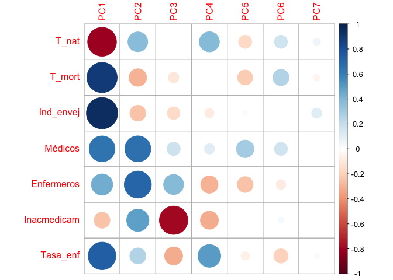

# Introducción

## dataset

En este cuaderno vamos a analizar el dataset llamado
[*Situacion_sanitaria.xlsx*](https://github.com/davidperezros/ine_sg_difusion_explica_datasets/blob/980abf1f7e54f9ec28a4da9a7162d1d51071254c/Datasets/Situacion_sanitaria.xlsx).
Este dataset presenta datos para las Comunidades Autónomas, abordando
sobre aspectos demográficos y de salud. Contiene variables como la tasa
de natalidad y mortalidad, el índice de envejecimiento, tasas de
profesionales de la salud (médicos y enfermeros) por cada 100,000
habitantes, el porcentaje de inaccesibilidad a medicamentos recetados
por razones económicas y la tasa media de morbilidad hospitalaria debido
a enfermedades. Concretamente en este dataset tenemos las siguientes
variables:

-   **CCAA**: Comunidad Autónoma
-   **T_nat**: Tasa de natalidad
-   **T_mort**: Tasa de mortalidad
-   **Ind_envej**: Índice de envejecimiento
-   **Médicos**: Tasa de médicos por cada 100.000 habitantes
-   **Enfermeros**: Tasa de enfermeros por cada 100.000 habitantes
-   **Inacmedicam**: Inaccesibilidad a los medicamentos recetados por
    motivos económicos (%)
-   **Tasa_enf**: Tasa de Morbilidad Hospitalaria por 100.000 habitantes
    debido a enfermedades, que he construido como una media
    (equiponderada) de las tasas de morbilidad hospitalaria debido a
    enfermedades endocrinas, circulatorias, digestivas, respiratorias…

Si tomamos demasiadas variables es difícil visualizar relaciones entre
ellas. Otro problema que se presenta es la fuerte correlación. Se hace
necesario, pues, reducir el número de variables sin perder información.
Es importante resaltar el hecho de que el concepto de mayor información
se relaciona con el de mayor variabilidad o varianza.

``` r
# Librerias
library(readxl) # Para leer los excels
library(dplyr) # Para tratamiento de dataframes
library(ggplot2) # Nice plots
library(factoextra) # fviz_cluster function
library(skimr)  # Para funcion skim
library(ggcorrplot) #Para funcion ggcorrplot
library(corrplot) #Para corrplot
```

Cargamos entonces el conjunto de datos:

``` r
datos <- read_excel("/Users/davpero/ine_sg_difusion_explica_datasets/Datasets/Situacion_sanitaria.xlsx", sheet = "Datos")
```

## Descripción del trabajo a realizar

**(Esto irá en la web de explica)** Se pretende hacer un Análisis de
Reducción de la Dimensionalidad empleando el procedimiento de
Componentes Principales. El objetivo es conocer que variables
independientes son de interés para estudiar la situación sanitaria y ver
qué comunidades autónomas son las más parecidas y las más diferentes.

-   Hacer un análisis exploratorio explorando matriz de correlaciones.
-   Ver si es necesario escalar/centrar los datos antes de aplicar pca y
    decidir si hacerlo con matriz de correlaciones o covarianzas.
-   Seleccionar un determinado número de componentes y ver como influyen
    las variables en estas.
-   Interpretar componentes y resultados.

# Análisis Exploratorio (EDA[1])

En primer lugar, cargamos los datos que vamos a utilizar. En este caso,
se trata de un conjunto de datos compuesto por 17 filas y 38 columnas.
Las filas corresponden a las 17 Comunidades Autónomas de España.

Antes de comenzar a aplicar la técnica, comprobamos si hay valores
perdidos, por si fuera necesario realizar algún preproceso. En este
caso, y como vemos a continuación, no hay ningún NA en los datos que
vamos a utilizar.

``` r
sum(is.na(datos))
```

    ## [1] 0

Por otra parte, para tener una noción general que nos permita describir
el conjunto con el que vamos a trabajar, podemos extraer su dimensión,
el tipo de variables que contiene o qué valores toma cada una.

``` r
# Dimensión del conjunto de datos
dim(datos)
```

    ## [1] 17  8

``` r
# Tipo de variables que contiene
str(datos)
```

    ## tibble [17 × 8] (S3: tbl_df/tbl/data.frame)
    ##  $ CCAA       : chr [1:17] "Andalucía" "Aragón" "Asturias, Principado de" "Baleares, Islas" ...
    ##  $ T_nat      : num [1:17] 8.21 7.28 5.05 8.08 6.37 6.1 5.96 7.51 8.09 7.47 ...
    ##  $ T_mort     : num [1:17] 8.35 10.28 12.64 6.67 7.1 ...
    ##  $ Ind_envej  : num [1:17] 101.1 143.5 218.7 99.7 114.1 ...
    ##  $ Médicos    : num [1:17] 492 689 654 484 506 ...
    ##  $ Enfermeros : num [1:17] 565 682 735 545 653 ...
    ##  $ Inacmedicam: num [1:17] 0.63 1.23 0.18 0.93 1.77 0.17 1.22 0.23 0.89 1.92 ...
    ##  $ Tasa_enf   : num [1:17] 545 748 834 702 538 ...

``` r
# Descripción de las variables
skim(datos)
```

|                                                  |       |
|:-------------------------------------------------|:------|
| Name                                             | datos |
| Number of rows                                   | 17    |
| Number of columns                                | 8     |
| \_\_\_\_\_\_\_\_\_\_\_\_\_\_\_\_\_\_\_\_\_\_\_   |       |
| Column type frequency:                           |       |
| character                                        | 1     |
| numeric                                          | 7     |
| \_\_\_\_\_\_\_\_\_\_\_\_\_\_\_\_\_\_\_\_\_\_\_\_ |       |
| Group variables                                  | None  |

Data summary

**Variable type: character**

| skim_variable | n_missing | complete_rate | min | max | empty | n_unique | whitespace |
|:-------------|---------:|-------------:|----:|----:|------:|--------:|----------:|
| CCAA          |         0 |             1 |   6 |  27 |     0 |       17 |          0 |

**Variable type: numeric**

| skim_variable | n_missing | complete_rate |   mean |     sd |     p0 |    p25 |    p50 |    p75 |    p100 | hist  |
|:---------|-------:|---------:|-----:|-----:|-----:|-----:|-----:|-----:|------:|:----|
| T_nat         |         0 |             1 |   7.29 |   1.14 |   5.05 |   6.37 |   7.47 |   8.09 |    9.54 | ▂▃▇▇▁ |
| T_mort        |         0 |             1 |   9.39 |   1.76 |   6.67 |   8.35 |   9.55 |  10.33 |   12.64 | ▇▇▆▆▆ |
| Ind_envej     |         0 |             1 | 136.60 |  37.54 |  85.98 | 114.07 | 122.57 | 150.49 |  218.65 | ▅▇▅▁▃ |
| Médicos       |         0 |             1 | 574.07 |  77.11 | 446.89 | 511.41 | 554.04 | 649.27 |  689.29 | ▅▇▃▃▇ |
| Enfermeros    |         0 |             1 | 688.02 | 140.73 | 458.66 | 584.09 | 681.63 | 767.79 | 1047.93 | ▅▇▇▁▁ |
| Inacmedicam   |         0 |             1 |   1.12 |   0.62 |   0.17 |   0.73 |   1.22 |   1.53 |    2.24 | ▅▇▅▆▃ |
| Tasa_enf      |         0 |             1 | 705.85 |  86.01 | 537.50 | 654.12 | 712.38 | 776.25 |  833.75 | ▃▅▆▅▇ |

Vemos que estas variables (a excepción de las CCAA) son todas de tipo
numérico, y además, podemos obtener información como la media,
desviación típica, los cuartiles y el histograma de cada una.

**Correlación:** El que existan correlaciones muy elevadas en el
conjunto de datos nos permitirá resumir la información en un menor
número de componentes principales, pues éstas explicarán una mayor
cantidad de información.

``` r
ggcorrplot(cor(datos[,2:8]), type = "lower", lab = T, show.legend = T)
```


En este caso, se ha generado un gráfico entre variables, sin tener en
cuenta la correlación de la variable consigo misma, pues siempre será
del 100%. En términos absolutos, vemos lo siguiente:

-   Hay varias **correlaciones moderadas/altas** como entre las
    variables *T_nat* y *T_mort* con 74% y *T_nat* e *Ind_envej* con
    88%. Por otro lado con signo contrario, *Medicos* y *Enfermeros*
    0.7%.

-   Hay varias **corrlaciones medias** como puede ser entre *Medicos* y
    *Tasa_enf* con un 59%, *Indice_envej* y *Tasa_enf* con 64% o
    *T_mort* y *Tasa_enf* con 58%.

# Reducción Dimensionalidad: Componentes Principales

## Introducción

El **Análisis de Componentes Principales (PCA)** es una técnica para
reducir la complejidad de conjuntos de datos con múltiples variables. Su
objetivo es transformar variables correlacionadas en un conjunto menor
de dimensiones sin perder la mayor parte de la información original.

Se busca encontrar **nuevas variables (componentes)** que estén
incorrelacionadas y que capturen la máxima variabilidad de los datos.
Esto se logra mediante combinaciones lineales de las variables
originales. PCA es útil para entender relaciones, reducir dimensiones y
manejar la alta correlación entre variables.

Para aplicar PCA, se necesitan **datos cuantitativos** y es crucial
*escalar las variables* (estandarizar = media cero y varianza uno). Esto
garantiza que ninguna variable domine el análisis. Además, se puede
trabajar con la matriz de correlaciones para abordar fuertes
correlaciones entre variables, manteniendo así la información más
relevante del conjunto de datos.

Los pasos generales son:

1.  **Estandarización de las variables**: Es importante estandarizar las
    variables numéricas para que tengan media cero y desviación estándar
    uno. Esto es crucial para que ninguna variable domine el análisis
    debido a su escala.

2.  **Cálculo de la matriz de correlaciones o covarianzas**: Dependiendo
    del enfoque, se puede trabajar con la matriz de correlaciones si se
    busca abordar fuertes correlaciones entre variables, o con la matriz
    de covarianzas si se busca la varianza total de las variables.

-   **NOTA**: Aconsejable trabajar siempre con la matriz de
    correlaciones (a no ser que todas variables estén en las mismas
    unidades, que se podrá usar la matriz de covarianzas). De no seguir
    esta nota y usar la matriz de covarianzas, las variables que tienen
    mayores unidades dominarán la estructura de covarianza, lo que
    llevará a una representación inexacta de la variabilidad real de los
    datos.

1.  **Descomposición de la matriz**: Se descompone la matriz de
    correlaciones en sus vectores y valores propios. Los valores propios
    representan la cantidad de varianza explicada por cada componente
    principal, mientras que los vectores propios (autovectores)
    determinan la dirección de cada componente en el espacio
    multidimensional original.

2.  **Selección de componentes**: Los componentes se ordenan de manera
    descendente según la cantidad de varianza que explican. Los primeros
    componentes capturan la mayor variabilidad de los datos y se
    seleccionan para reducir la dimensionalidad manteniendo la
    información más relevante.

3.  **Transformación de datos**: Proyectar los datos originales en el
    espacio de los componentes principales para obtener las nuevas
    variables. Estas son combinaciones lineales de las variables
    originales y son ortogonales entre sí. Esta transformación lineal
    **conserva la mayor parte de la información en un espacio de menor
    dimensión, lo que facilita el análisis y la visualización de los
    datos**.

4.  **Interpretación y visualización**: Explorar la importancia de cada
    componente en términos de la variabilidad explicada. Se pueden
    interpretar los componentes para comprender qué aspectos de los
    datos capturan. Si es posible, representar gráficamente los datos en
    el espacio reducido de los componentes principales para obtener una
    mejor comprensión de las relaciones entre las observaciones.

## Modelo

En las siguientes lineas haremos que la variable `CCAA` se ponga como
nombre de filas y posteriormente eliminaremos esa variable ya que ya la
tendremos como nombre de filas.

``` r
CCAA<-datos$CCAA
datos<-datos[,-1]         # Eliminamos ahora 
rownames(datos)<-CCAA # Como nombres de filas las CCAA
```

Escalamos los datos y calculamos la matriz de varianzas covarianzas,
mostramos solo la diagonal (debería ser 1).

``` r
datos2<-scale(datos)
summary(datos2)
```

    ##      T_nat             T_mort           Ind_envej          Médicos       
    ##  Min.   :-1.9754   Min.   :-1.54244   Min.   :-1.3485   Min.   :-1.6493  
    ##  1st Qu.:-0.8131   1st Qu.:-0.58810   1st Qu.:-0.6002   1st Qu.:-0.8126  
    ##  Median : 0.1554   Median : 0.09356   Median :-0.3737   Median :-0.2598  
    ##  Mean   : 0.0000   Mean   : 0.00000   Mean   : 0.0000   Mean   : 0.0000  
    ##  3rd Qu.: 0.7013   3rd Qu.: 0.53665   3rd Qu.: 0.3701   3rd Qu.: 0.9752  
    ##  Max.   : 1.9780   Max.   : 1.84885   Max.   : 2.1860   Max.   : 1.4942  
    ##    Enfermeros        Inacmedicam         Tasa_enf       
    ##  Min.   :-1.62982   Min.   :-1.5146   Min.   :-1.95741  
    ##  1st Qu.:-0.73853   1st Qu.:-0.6173   1st Qu.:-0.60143  
    ##  Median :-0.04542   Median : 0.1678   Median : 0.07583  
    ##  Mean   : 0.00000   Mean   : 0.0000   Mean   : 0.00000  
    ##  3rd Qu.: 0.56682   3rd Qu.: 0.6645   3rd Qu.: 0.81849  
    ##  Max.   : 2.55746   Max.   : 1.8020   Max.   : 1.48703

``` r
diag(var(datos2))
```

    ##       T_nat      T_mort   Ind_envej     Médicos  Enfermeros Inacmedicam 
    ##           1           1           1           1           1           1 
    ##    Tasa_enf 
    ##           1

Aplicamos funcion PCA, notar que en este caso no haría falta los
argumentos `SCALE=TRUE` y `CENTER=TRUE` puesto que ya hemos escalado dos
datos en un paso previo. Por defecto en la función viene el valor de
`SCALE=FALSE` y `CENTER=TRUE`.

``` r
pca <- prcomp(datos2,center= TRUE,scale = TRUE)  # Scale=T 
```

**Calculamos los coeficientes de la ecuación para cada componente
principal**

``` r
pca$rotation
```

    ##                    PC1        PC2          PC3         PC4          PC5
    ## T_nat       -0.4270118  0.3083847 -0.008988199  0.50247373 -0.348115698
    ## T_mort       0.4701640 -0.2430823 -0.113411927  0.01113627 -0.455987748
    ## Ind_envej    0.5036940 -0.1972515 -0.163033713 -0.10631657  0.049561195
    ## Médicos      0.3435595  0.5298832  0.176924105  0.13246428  0.623322284
    ## Enfermeros   0.2330590  0.5761666  0.404540649 -0.37517212 -0.510098955
    ## Inacmedicam -0.1295046  0.3910394 -0.811238715 -0.40406462 -0.004102112
    ## Tasa_enf     0.3921454  0.2030906 -0.327739876  0.64383523 -0.140306382
    ##                     PC6         PC7
    ## T_nat        0.40168978  0.43296643
    ## T_mort       0.62648091 -0.32629331
    ## Ind_envej   -0.02085919  0.81646163
    ## Médicos      0.40041787 -0.05896305
    ## Enfermeros  -0.21521711  0.05281068
    ## Inacmedicam  0.08658092 -0.03777880
    ## Tasa_enf    -0.48123047 -0.17824227

Podemos observar aquí nuestras variables en el nuevo sistema de
cordenadas (las componentes principales), dando lugar a ecuaciones de
cada eje como combinación lineal del total de variables. Analizar el
vector que crea cada componente y cuáles son los pesos que tienen las
variables en cada componente, ayuda a interpretar qué tipo de
información recoge cada una de ellas.

Por ejemplo, la primera componente principal (PC1), presenta la
siguiente ecuación, como combinación lineal de las siete variables
originales:

$ PC_1 = -0.42 {T_nat} + 0.47 {T_mort} + 0.50Ind_envej + 0.34 Médicos +
0.23 Enfermeros -0.12 Inacmedicam + 0.39 Tasa_enf $

**Extraemos las nuevas coordenadas de los individuos (puntuaciones)**

Además, podemos ver las puntuaciones, que son las coordenadas de cada
observación original (Comunidad Autónoma) sobre los nuevos ejes
construidos (componentes principales). Esto corresponde a un cambio de
coordenadas bajo el paradigma del Álgebra Lineal.

``` r
 pca$x
```

    ##                                     PC1         PC2         PC3         PC4
    ## Andalucía                   -2.29780864 -1.17108641  0.91626309 -0.20305801
    ## Aragón                       1.00976268  0.77424874 -0.15274606  0.43908296
    ## Asturias, Principado de      4.02433299 -1.03317546  0.49808668  0.37042340
    ## Baleares, Islas             -2.13246462 -0.54804063 -0.03645048  0.75801563
    ## Canarias                    -1.83025928 -0.41486990 -0.21320240 -2.06824011
    ## Cantabria                    1.41475192 -0.21256737  1.88652836 -0.65976823
    ## Castilla y León              2.70411492 -0.18487892 -0.62652953 -0.18199384
    ## Castilla-La Mancha          -1.32760977 -1.94021471  1.06434279 -0.04561078
    ## Cataluña                    -0.33553404  0.70136546  0.27442715  1.02159787
    ## Comunidad Valenciana        -1.04717225 -0.08800225 -1.28286604 -0.35378816
    ## Extremadura                  0.51098330 -0.31670565  0.56679839 -0.05840686
    ## Galicia                      1.79132178 -1.49115973 -1.75060101 -0.19506453
    ## Madrid, Comunidad de        -0.61827496  1.70803736  1.25152616  0.76867280
    ## Murcia, Región de           -2.97739482 -0.02854523 -1.04491055  0.87136976
    ## Navarra, Comunidad Foral de -0.08425661  3.17323869 -0.15708545 -1.05193105
    ## País Vasco                   1.12618630  1.06177566 -0.42329241  0.08245285
    ## Rioja, La                    0.06932110  0.01058035 -0.77028869  0.50624630
    ##                                      PC5          PC6         PC7
    ## Andalucía                   -0.006424862  0.573688653  0.14890360
    ## Aragón                       0.665940100  0.695838881 -0.20598823
    ## Asturias, Principado de      0.225286205 -0.183607951  0.07438375
    ## Baleares, Islas              0.211985810 -0.922992167  0.03286732
    ## Canarias                     0.689522809 -0.396000896 -0.07004163
    ## Cantabria                    0.177812778  0.155155518 -0.07658536
    ## Castilla y León             -0.038962514  0.146942499  0.11730269
    ## Castilla-La Mancha          -0.632263777  0.112965899 -0.02533346
    ## Cataluña                    -0.328778916 -0.570291134 -0.12593594
    ## Comunidad Valenciana         0.100452783 -0.005465301 -0.14143116
    ## Extremadura                 -0.863974957  0.020484318 -0.09478002
    ## Galicia                     -0.001413730 -0.153263421  0.16331588
    ## Madrid, Comunidad de         0.724845530 -0.162259381  0.16899413
    ## Murcia, Región de            0.076244013  0.631672722  0.09459935
    ## Navarra, Comunidad Foral de -0.802968126 -0.003989889  0.13676882
    ## País Vasco                   0.184217821  0.035413303 -0.06901077
    ## Rioja, La                   -0.381520967  0.025708347 -0.12802897

**Varianza explicada por cada componente principal**

Una vez calculadas las componentes principales, es de interés conocer la
varianza explicada por cada una, ya que el principal objetivo que se
sigue con PCA es maximizar la cantidad de información explicada por las
componentes.

``` r
summary(pca)
```

    ## Importance of components:
    ##                          PC1    PC2    PC3     PC4     PC5     PC6     PC7
    ## Standard deviation     1.882 1.2322 0.9619 0.77556 0.47878 0.41008 0.12381
    ## Proportion of Variance 0.506 0.2169 0.1322 0.08593 0.03275 0.02402 0.00219
    ## Cumulative Proportion  0.506 0.7229 0.8551 0.94104 0.97379 0.99781 1.00000

-   **Standard deviation**: muestra las desviaciones estándar de cada
    componente principal. Si elevamos al cuadrado estas desviaciones,
    tenemos la varianza (**el autovalor correspondiente**). Es decir, la
    varianza explicada por cada componente corresponde con los
    autovalores de la matriz de covarianzas de los datos estandarizados.

-   **Proportion of Variance**: es la proporción de la varianza total
    que explica cada componente principal y quizá, es la fila más
    importante de nuestros resultados. Como los autovalores están
    ordenados de mayor a menor y así son construidas las componentes
    principales, la primera componente principal es la que mayor
    porcentaje de variabilidad explica, un 37%. Así, la varianza
    explicada por la componentes van en orden decreciente, teniendo que
    la segunda componente explica un 31% y la tercera, un 12%.

-   **Cumulative proportion**: es la varianza acumulada y se calcula
    progresivamente sumando la Proportion of Variance anterior. En vista
    de estos resultados, vemos que la primera componente agrupa el 37%
    de la variación, y que necesitamos 3 componentes para alcanzar el
    80%.

## Selección de componentes

Graficando el valor de la varianza de cada componente principal, podemos
observar los resultados comentados anteriormente, que las primeras
componentes son las que más varianza explican y que a medida que se
añaden más, la varianza explicada por cada una es menor.

``` r
fviz_eig(pca, main="Varianza de cada componente", choice = "eigenvalue", addlabels = T)
```


o como el porcentaje de varianza explicada por cada componente sobre el
total.

``` r
fviz_screeplot(pca, addlabels = TRUE, main="Porcentaje de varianza explicada por cada componente (%)")
```


A continuación, representamos las varianzas acumuladas:

``` r
plot(summary(pca)$importance[3, ], type="o", col="darkblue", lwd=3, main = "Porcentaje de varianza acumulada", xlab = "Componente Principal", ylab = "Porcentaje de varianza acumulada")
```


Determinar el número de componentes que elegir para continuar con el
análisis no tiene unas normas determinadas a seguir. Respecto a ello,
existen varios criterios con sus respectivas propuestas.

1.  Una opción para determinar el número de componentes principales que
    seleccionar, es coger aquellas tal que expliquemos un %
    **determinado de la variabilidad de los datos que nosotros
    prefijemos**. Generalmente se pone como umbral mínimo un 80%,
    entonces necesitaríamos elegir 3 componentes.

2.  Otra posibilidad es seguir el **criterio de Kaisser**, que escoge
    aquellas componentes cuyo autovalor sea superior a 1 (cuando las
    variables han sido generadas a partir de la matriz de
    correlaciones). Según este criterio y mirando el gráfico anterior de
    la varianza (igual a eigenvalues), eligiríamos las dos primeras
    componentes.

3.  Para relajar el criterio de Kaisser, existe la **modificación de
    Jollife**, que elige aquellas componentes cuyo autovalor sea
    superior a 0.7. Esta modificación, nos permite elegir igualmente 3
    componentes.

En este caso, nos podríamos quedar con las 3 primeras componentes
principales, ya que es el número en el que coincide el mayor número de
criterios. Por tanto, en lugar de trabajar con las 7 variables
originales, trabajaremos con 3 variables nuevas, que son combinaciones
de ellas.

## Interpretación

Hemos decidido quedarnos con 3 componentes principales, que explican el
85% de la variabilidad total. Para realizar su interpretación, volvemos
a ver los coeficientes de las ecuaciones de los componentes, observando
cuáles son los valores más altos (en valor absoluto), para así poder dar
una interpretación a cada eje.

``` r
pca$rotation[,1:4]
```

    ##                    PC1        PC2          PC3         PC4
    ## T_nat       -0.4270118  0.3083847 -0.008988199  0.50247373
    ## T_mort       0.4701640 -0.2430823 -0.113411927  0.01113627
    ## Ind_envej    0.5036940 -0.1972515 -0.163033713 -0.10631657
    ## Médicos      0.3435595  0.5298832  0.176924105  0.13246428
    ## Enfermeros   0.2330590  0.5761666  0.404540649 -0.37517212
    ## Inacmedicam -0.1295046  0.3910394 -0.811238715 -0.40406462
    ## Tasa_enf     0.3921454  0.2030906 -0.327739876  0.64383523

``` r
corr_var <- pca$rotation %*% diag(pca$sdev)
colnames(corr_var) <- c("PC1", "PC2", "PC3", "PC4", "PC5", "PC6", "PC7")
corrplot(corr_var)
```


Si nos fijamos en los pesos más altos, podemos darle una interpretación
a cada eje. Por ejemplo:

-   La **primera componente** explica un 50% de la variación. Hay
    valores absolutos bastante similares y elevados, que son los
    correspondientes con las variables Ind_envej, T_mort, T_nat y
    Tasa_enf. Por lo tanto, parece que la primera componente recoge
    información demográfica. Teniendo en cuenta los signos podemos
    concluir que las CC.AA. que se sitúen a la derecha del eje serán
    aquellas con mayor Tasa de mortalidad, mayor Índice de
    envejecimiento, mayor Tasa de incidencia de enfermedades en la
    población, y en contraposición, menor Tasa de natalidad.

-   En la **segunda componente** explica un 21% de variación adicional.
    Los pesos más elevados corresponden con las variables Médicos y
    Enfermeros, representando de alguna forma, los recursos sanitarios
    de las CCAA. Ambas variables contribuyen de forma positiva al eje,
    por lo que cuanto más a la derecha del eje se sitúe una CC.AA.,
    mayores recursos de personal sanitario posee.

-   Para la **tercera componente** explica un 13% de variación adicional
    sobre las anteriores componentes. El peso más elevado y con gran
    diferencia sobre el resto, corresponde a la variable medidora de la
    inaccesibilidad de la población a los medicamentos recetados. La
    variable puntúa negativamente en el eje, de forma que las
    Comunidades con mayor valor en esta componente, son aquellas con
    menor inaccesibilidad a los medicamentos.

-   En la **cuarta componente**

## Representación gráfica

**Gráfico de las variables**

Representamos sobre las dos primeras componentes principales las
variables originales. En el eje de abscisas se representa la PC1 y en el
eje de ordenadas, la PC2. Para interpretar correctamente las variables
tenemos que fijarnos en la longitud de la flecha y en el ángulo que
forman respecto a los ejes y entre ellos mismos.

-   **Ángulo vector - eje**: cuanto más paralelo es un vector al eje,
    más ha contribuido a dicha componente principal.

-   **Ángulo entre dos vectores**: si es pequeño representa una alta
    correlación entre las variables implicadas (y por tanto,
    observaciones con valores altos en una variable, tendrá valores
    altos en la otra). Si el ángulo es cercano a 90º indica que las
    variables están incorreladas y los ángulos opuestos indican
    correlación negativa entre ellas.

-   **Longitud**: cuanto mayor es la longitud de un vector, mayor
    varianza de la variable está contenida en el biplot, es decir, mejor
    representada está en el gráfico.

En el gráfico, diferenciamos por colores las variables según su calidad
de representación en las dos primeras componentes. Cuanto más cerca esté
una variable del círculo de correlaciones, mejor será su representación,
por lo que las variables que estén muy cerca del centro de la gráfica
son las menos importantes para las dos primeras componentes.

``` r
fviz_pca_var(pca,axes=c(1,2), col.var = "cos2", gradient.cols = c("#00AFBB", "#E7B800", "#FC4E07"), repel = TRUE)
```



``` r
fviz_pca_var(pca,axes=c(1,3), col.var = "cos2", gradient.cols = c("#00AFBB", "#E7B800", "#FC4E07"), repel = TRUE)
```


**RESUMEN DE RESULTADOS**

Los gráficos obtenidos muestran una visualización de las variables en
función de las componentes principales 1 y 2, y 1 y 3. Las variables que
tienen una correlación alta con la primera componente principal están
más cerca del eje horizontal y las variables que tienen una alta
correlación con la segunda componente principal están más cerca del eje
vertical. Las variables que se encuentran cerca del centro del gráfico
tienen una correlación baja con ambas componentes principales, aún así
nos guiaremos con la tabla para decidir qué variables están mejor
explicadas por cada una de las componentes. En resumen, estos gráficos
proporcionan una representación visual de las relaciones entre las
variables en función de las dos primeras componentes principales y las
dos segundas, lo que puede ayudar a identificar patrones y tendencias en
los datos.

En el siguiente gráfico podemos ver las correlaciones de dichas
variables con las componentes principales, como ya hemos comentado.

``` r
corr_var <- pca$rotation %*% diag(pca$sdev)
colnames(corr_var) <- c("PC1", "PC2", "PC3", "PC4", "PC5", "PC6", "PC7")
corrplot(corr_var)
```


En cuanto a este gráfico, es llamativo como las dos o tres primeras
componentes son las más importantes en el PCA, sobre todo, la PC1.

En resumen, las nuevas componentes han permitido identificar patrones y
características de las comunidades autónomas en términos de la situación
sanitaria y indicadores relativos a esta.

**Gráfico de los individuos**

Tras observar la representación de las variables, en este apartado vemos
la representación de los individuos sobre los nuevos ejes, con la idea
de que aquellos con características similares, se agrupan cerca al tener
puntuaciones parecidas. Las comunidades con valores cercanos a la media
se situarán cerca del centro del gráfico (0,0).

Representando los individuos sobre PC1 y PC2, vemos que Comunidades como
Aragón y País Vasco, o Canarias y Baleares están muy próximas entre sí,
indicando que tienen una situación sanitaria muy parecida

``` r
# Sobre PC1 y PC2
fviz_pca_ind(pca, col.ind = "cos2", gradient.cols = c("#00AFBB", "#E7B800", "#FC4E07"), repel = TRUE, axes = c(1, 2))
```


``` r
fviz_pca_ind(pca, col.ind = "cos2", gradient.cols = c("#00AFBB", "#E7B800", "#FC4E07"), repel = TRUE, axes = c(1, 3))
```


Para poder extraer fácilmente los perfiles, podemos combinar las
variables e individuos en un solo gráfico que nos permita identificar
qué Comunidades se encuentran en una situación parecida y además, que
nos permita identificar sus características.

**Biplot**

El biplot permite la representación conjunta de los individuos y las
variables sobre los nuevos ejes. Para que el resultado sea fácilmente
interpretable, debemos tener pocas variables e individuos en el conjunto
de datos.

# Conclusiones

En resumen, las nuevas componentes han permitido identificar patrones y
características de las comunidades autónomas en términos de la situación
sanitaria. Este análisis proporciona información valiosa para comprender
mejor las diferencias y similitudes entre las comunidades autónomas y
puede ser útil para tomar decisiones en términos de políticas públicas y
estrategias sanitarias.

[1] EDA viene del Inglés *Exploratory Data Analysis* y son los pasos
relativos en los que se exploran las variables para tener una idea de
que forma toma el dataset.
