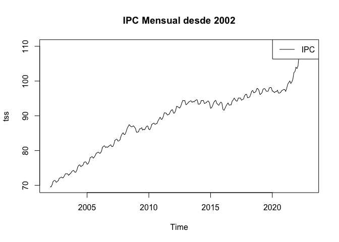
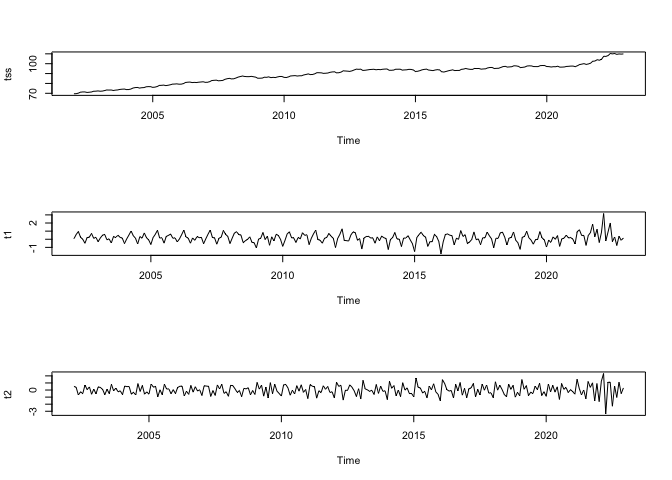
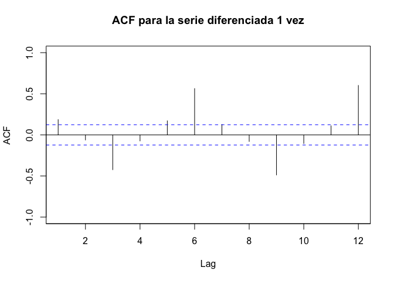
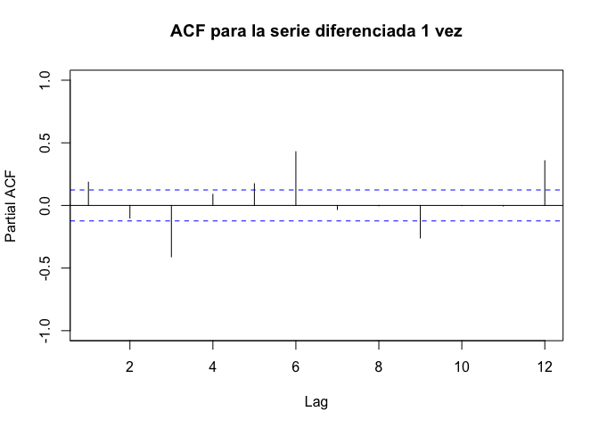
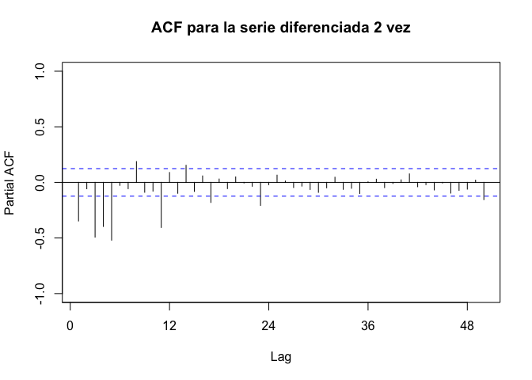
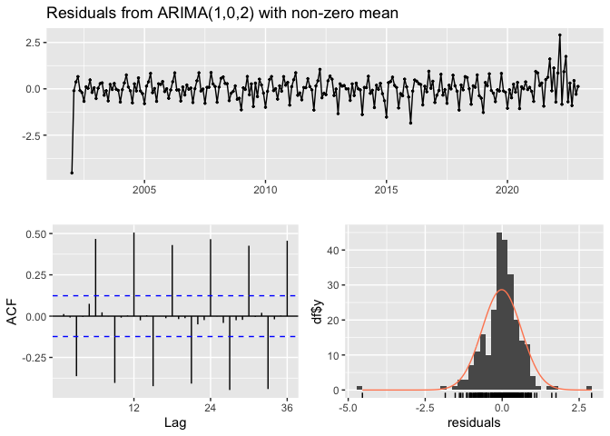
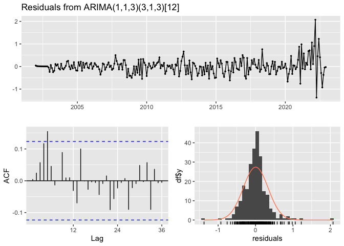
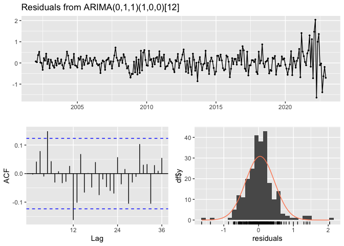

# Introducción

## dataset

En este cuaderno vamos a analizar el dataset llamado
[*ipc_series.xlsx*](https://github.com/davidperezros/ine_sg_difusion_explica_datasets/blob/17128da1a47fa443f3fd7b6c8e4007651d17142b/Datasets/ipc_series.xlsx).
Este dataset presenta el IPC Español desde el año 2002 hasta el 2022 con
una periodiciadad mensual. El objetivo será analizar dicha serie
temporal mediante un modelo ARIMA.

Concretamente en este dataset tenemos las siguientes variables:

-   **IPC**: Índice de Precios al conusmo.
-   **fecha**: Fecha correspondiente.

``` r
# Librerias
```

Cargamos entonces el conjunto de datos:

``` r
data <- readxl::read_excel("/Users/davpero/ine_sg_difusion_explica_datasets/Datasets/ipc_series.xlsx", sheet = "Datos")

data$ipc<-data$`Pobl. Total`
```

## Descripción del trabajo a realizar

**(Esto irá en la web de explica)** Se pretende ajustar una serie
temporal que contiene la población de Madrid mediante un modelo ARIMA.

-   Explorar patrones en la serie temporal.
-   Ver que la serie sea estacionaria.
-   Aplicar diferenciación si es necesario para estacionarizar la serie.
-   Identificar modelos ARIMA utilizando información de la exploración y
    funciones ACF y PACF.
-   Ajustar varios modelos ARIMA y seleccionar el mejor según métricas
    de ajuste.
-   Evaluar la significancia estadística de los coeficientes del modelo
    ARIMA.
-   Interpretar los coeficientes para comprender su influencia en la
    serie temporal.

# Análisis Exploratorio (EDA[1])

``` r
sum(is.na(data))
```

    ## [1] 0

Por otra parte, para tener una noción general que nos permita describir
el conjunto con el que vamos a trabajar, podemos extraer su dimensión,
el tipo de variables que contiene o qué valores toma cada una.

``` r
# Dimensión del conjunto de datos
dim(data)
```

    ## [1] 252   2

``` r
# Tipo de variables que contiene
str(data)
```

    ## tibble [252 × 2] (S3: tbl_df/tbl/data.frame)
    ##  $ Fecha: POSIXct[1:252], format: "2022-12-01" "2022-11-01" ...
    ##  $ IPC  : num [1:252] 110 110 110 109 110 ...

# ARIMA (AutoRegressive Integrated Moving Average)

## Introducción

El modelo ARIMA es uno de los modelos más comunes y poderosos para el
análisis de series temporales. Se utiliza para modelar y predecir datos
que exhiben comportamientos de tendencia y estacionalidad.

-   **Componentes del modelo ARIMA:**
    -   **AR (Auto-regresivo):** Representa la relación entre una
        observación actual y un número determinado de observaciones
        anteriores (retardos). **p** es el componente autoregresivo, que
        indica cuántas observaciones pasadas influyen en la observación
        actual. Para determinar el valor de p, se puede utilizar el
        gráfico de la función de autocorrelación parcial (PACF) de la
        serie diferenciada. Las barras que se salen significativamente
        del intervalo de confianza pueden indicar el orden de P que
        debería considerarse. Se recomienda ser conservador y elegir un
        número reducido de los valores más prominentes.

    -   **I (Integrated):**. Representa el número de diferencias
        necesarias para hacer estacionaria la serie temporal. **d** es
        el número de diferenciaciones necesarias para hacer que la serie
        sea estacionaria. Esto se determina mediante pruebas
        estadísticas como el test de Dickey-Fuller aumentado (ADF test).
        Es importante tener cuidado de no sobrediferenciar la serie, lo
        que se puede observar en el gráfico de la función de
        autocorrelación (ACF) si los valores comienzan a ser negativos
        rápidamente.

    -   **MA (Media Móvil):** Representa la relación entre una
        observación actual y un error de predicción residual de
        observaciones anteriores. **q** es el componente de media móvil,
        que indica cuántos términos de los residuos anteriores influyen
        en la observación actual. Para determinar el valor de q, se
        utiliza el gráfico de la función de autocorrelación (ACF) de la
        serie diferenciada. Los términos MA son esencialmente errores de
        pronóstico retrasados, y el ACF muestra cuántos términos MA se
        necesitan para eliminar la autocorrelación en la serie
        estacionaria. Se sugiere seleccionar tantos términos MA como los
        lags que estén significativamente por encima del intervalo de
        confianza.

Si la serie está ligeramente por debajo del nivel de diferenciación
adecuado (subdiferenciada), se pueden agregar uno o más términos de AR
adicionales. Por otro lado, si la serie está sobrediferenciada, se puede
considerar agregar términos MA adicionales para mejorar el modelo.

Hasta ahora, hemos restringido nuestra atención a datos no estacionales
y modelos ARIMA no estacionales. Sin embargo, los modelos **ARIMA**
también son capaces de modelar una amplia gama de **datos
estacionales**.

Un modelo ARIMA estacional se forma incluyendo términos estacionales
adicionales en los modelos ARIMA que hemos visto hasta ahora. Está
escrito de la siguiente manera:

**ARIMA(p,d,q)(P,D,Q)\[period\]**

donde `(p,d,q)` es la parte no estacional y `(P,D,Q)` la parte
estacional de del modelo del modelo dónde `period` es el número de
observaciones por año. Es decir, **notación en mayúsculas para las
partes estacionales del modelo y notación en minúsculas para las partes
no estacionales del modelo**.

Vamos a cargar los datos en un obejto adecuado para su análisis

``` r
# Convertir el vector en una serie temporal

# IPC
tss <- stats::ts(rev(data$IPC), start = 2002, frequency = 12)
```

**Análisis Descriptivo:** Podemos realizar un análisis descriptivo
básico para comprender mejor la serie temporal.

R

``` r
summary(tss)
```

    ##    Min. 1st Qu.  Median    Mean 3rd Qu.    Max. 
    ##   69.53   82.48   92.14   89.24   95.15  110.27

``` r
# Poblacion de ambos sexos
plot(tss, main = "IPC Mensual desde 2002")
legend("topright", legend = c("IPC"), col = "black", lty = 1)
```


A primera vista ya se parece ver que la serie tiene una componente
estacional puesto que hay picos de alta frecuencia dentro del año. Por
otro lado la serie no es estacionaria ya que no la vemos centrada
alrededor del 0, luego el primer paso será ajustar la componente
estacional.

## Modelo

Para ajustar un modelo ARIMA a los datos, primero necesitamos
identificar los parámetros del modelo (p, d, q).

Se dice que una serie es estacionaria cuando su media, varianza y
autocovarianza son invariantes en el tiempo. Para realizar un modelo
ARIMA, la serie temporal debe ser estacionaria. Para conseguir esta
estacionariedad, la diferenciaremos.

``` r
# Serie de  diferencias
#tss # 0 diferencias
t1 <- diff(tss, differences = 1) #1
t2 <- diff(tss, differences = 2) #2
 

par(mfrow = c(3, 1))
plot(tss)
plot(t1) # Esta ya estacionaria
plot(t2)


# TEST para ver estacionaridad
# H0= NO es estacionaria
tseries::adf.test(tss, alternative = "stationary") # No pasa el test
```



    ## 
    ##  Augmented Dickey-Fuller Test
    ## 
    ## data:  tss
    ## Dickey-Fuller = -2.8054, Lag order = 6, p-value = 0.2367
    ## alternative hypothesis: stationary

``` r
tseries::adf.test(t1, alternative = "stationary") # Ya pasa el test
```

    ## 
    ##  Augmented Dickey-Fuller Test
    ## 
    ## data:  t1
    ## Dickey-Fuller = -3.8246, Lag order = 6, p-value = 0.01827
    ## alternative hypothesis: stationary

Al trazar la serie diferenciada de orden 1, ya vemos un patron oscilante
alrededor de 0, sin una tendencia fuerte visible. Esto sugiere que la
diferenciacion es suficiente y debe incluirse en el modelo. Además el
test de estacionaridad ya lo pasa. Luego nos quedaremos con **d=1**

A continuación, los picos en rezagos particulares de la serie
diferenciada pueden ayudar a informar la elección de p o q para nuestro
modelo. Nos interesan los de orden 3 ya que son los del orden de
diferenciación que vamos a tomar.

``` r
forecast::Acf(t1, main = "ACF para la serie diferenciada 1 vez", lag.max = 12, ylim = c(-1, 1))
```



En el gráfico de ACF vemos que hay 2 o 3 barras que se salen
notablemente del límite deseado, luego tomariamos como q= 2, o 3.

``` r
forecast::Pacf(t1, main = "ACF para la serie diferenciada 1 vez", lag.max = 12, ylim = c(-1, 1))
```



``` r
forecast::Pacf(t2, main = "ACF para la serie diferenciada 2 vez", lag.max = 50, ylim = c(-1, 1))
```



En el gráfico de PACF vemos que hay 1 o 2 barras que se salen del límite
deseado, luego tomariamos como p= 1.

``` r
library(forecast)

# Ajustar el modelo ARIMA

# p, d,  q
arima_model1 <- arima(tss, order = c(1, 0, 2))
#arima_model_h <- arima(tss_h, order = c(1, 3, 2))
#arima_model_m <- arima(tss_m, order = c(1, 3, 2))

summary(arima_model1)
```

    ## 
    ## Call:
    ## arima(x = tss, order = c(1, 0, 2))
    ## 
    ## Coefficients:
    ##          ar1     ma1     ma2  intercept
    ##       0.9965  0.1870  0.0082   134.5484
    ## s.e.     NaN  0.0649  0.0734        NaN
    ## 
    ## sigma^2 estimated as 0.4041:  log likelihood = -246.08,  aic = 502.16
    ## 
    ## Training set error measures:
    ##                       ME      RMSE       MAE         MPE      MAPE      MASE
    ## Training set -0.01545516 0.6356716 0.4315872 -0.02771852 0.4832929 0.9602133
    ##                    ACF1
    ## Training set 0.01265259

``` r
# Diagnóstico del modelo
checkresiduals(arima_model1)
```



    ## 
    ##  Ljung-Box test
    ## 
    ## data:  Residuals from ARIMA(1,0,2) with non-zero mean
    ## Q* = 411.3, df = 21, p-value < 2.2e-16
    ## 
    ## Model df: 3.   Total lags used: 24

``` r
# H0: no hay autocorrelación residual en los residuos del model 
# Queremos ver que se prueba H0
Box.test(residuals(arima_model1), type = "Ljung-Box")
```

    ## 
    ##  Box-Ljung test
    ## 
    ## data:  residuals(arima_model1)
    ## X-squared = 0.040824, df = 1, p-value = 0.8399

``` r
# Aceptamos H0 puesto que es >0.05
```

La media de los residuos es cercana a cero y no existe correlación
significativa en las series de residuos. La serie temporal de los
residuos muestra que la variación de los residuos se mantiene
prácticamente igual en todos los datos históricos, quitando los últimos
años y por lo tanto la varianza residual podría tratarse como constante.
Esto también se puede ver en el histograma de residuos. El histograma
sugiere que los residuos pueden no ser normales: la cola derecha parece
demasiado larga, incluso cuando ignoramos el valor atípico. En
consecuencia, los pronósticos de este método probablemente serán
bastante buenos, pero los intervalos de predicción que se calculan
suponiendo una distribución normal pueden ser inexactos.

Ahora vamos a probar otro modelo con los siguientes parámetros (1, 1, 0)
y posteriormente los compararemos.

``` r
arima_model2 <- arima(tss, order=c(1, 1, 3),seasonal=list(order=c(3,1,3),period=12))
summary(arima_model2)
```

    ## 
    ## Call:
    ## arima(x = tss, order = c(1, 1, 3), seasonal = list(order = c(3, 1, 3), period = 12))
    ## 
    ## Coefficients:
    ##           ar1     ma1     ma2     ma3     sar1     sar2     sar3    sma1
    ##       -0.5387  0.8189  0.1695  0.1939  -1.4228  -0.9044  -0.0818  0.7466
    ## s.e.   0.1570  0.1659  0.0975  0.0637   0.1245   0.1923   0.1301  0.1340
    ##          sma2     sma3
    ##       -0.2049  -0.7861
    ## s.e.   0.1885   0.1258
    ## 
    ## sigma^2 estimated as 0.1163:  log likelihood = -98.12,  aic = 218.24
    ## 
    ## Training set error measures:
    ##                       ME      RMSE       MAE          MPE      MAPE      MASE
    ## Training set 0.003369627 0.3324559 0.2217661 0.0005496823 0.2389002 0.4933946
    ##                     ACF1
    ## Training set 0.005071905

``` r
checkresiduals(arima_model2)
```



    ## 
    ##  Ljung-Box test
    ## 
    ## data:  Residuals from ARIMA(1,1,3)(3,1,3)[12]
    ## Q* = 22.338, df = 14, p-value = 0.07194
    ## 
    ## Model df: 10.   Total lags used: 24

Existe una función que permite identificar los parámetros de manera
automática.

``` r
# Identificar los parámetros del modelo ARIMA de manera automática
jaja<-auto.arima(tss)
summary(jaja)
```

    ## Series: tss 
    ## ARIMA(0,1,1)(1,0,0)[12] 
    ## 
    ## Coefficients:
    ##          ma1    sar1
    ##       0.2830  0.7506
    ## s.e.  0.0619  0.0458
    ## 
    ## sigma^2 = 0.1741:  log likelihood = -140.79
    ## AIC=287.58   AICc=287.68   BIC=298.16
    ## 
    ## Training set error measures:
    ##                      ME      RMSE       MAE        MPE     MAPE      MASE
    ## Training set 0.04178455 0.4148127 0.2936567 0.04664791 0.319684 0.1420576
    ##                      ACF1
    ## Training set -0.003052798

``` r
checkresiduals(jaja)
```



    ## 
    ##  Ljung-Box test
    ## 
    ## data:  Residuals from ARIMA(0,1,1)(1,0,0)[12]
    ## Q* = 28.217, df = 22, p-value = 0.1686
    ## 
    ## Model df: 2.   Total lags used: 24

``` r
jaja<-auto.arima(tss)
checkresiduals(jaja)
```


    ## 
    ##  Ljung-Box test
    ## 
    ## data:  Residuals from ARIMA(0,1,1)(1,0,0)[12]
    ## Q* = 28.217, df = 22, p-value = 0.1686
    ## 
    ## Model df: 2.   Total lags used: 24

``` r
#Dibujamos las predicciones ahora
tss_m <- stats::ts(rev(data$Total), start = 1971, frequency = 2, end = 2018)

arima_model1b <- arima(tss_m, order = c(2, 3, 1))
arima_model2b <- arima(tss_m, order = c(1, 1, 0))
# Predicciones utilizando arima_model1
pred1 <- predict(arima_model1b, n.ahead = 6)

# Predicciones utilizando arima_model2
pred2 <- predict(arima_model2b, n.ahead = 6)

upper1 <- pred1$pred + 1.96 * pred1$se
lower1 <- pred1$pred - 1.96 * pred1$se
upper2 <- pred2$pred + 1.96 * pred2$se
lower2 <- pred2$pred - 1.96 * pred2$se
# Gráfico con los datos originales y las predicciones de los modelos
plot(tss,
  xlim = c(1971, 2021 + 5), ylim = c(min(tss, pred1$pred, pred2$pred), max(tss, pred1$pred, pred2$pred)),
  xlab = "Fecha", ylab = "Valor", main = "Comparación de Predicciones ARIMA"
)
lines(tss, col = "blue", lwd = 2) # Serie original en azul
points(pred1$pred, col = "red", pch = 16, cex = 0.5) # Predicciones con arima_model1 en rojo
points(pred2$pred, col = "green", pch = 16, cex = 0.5) # Predicciones con arima_model2 en verde
legend("bottomright", legend = c("Original", "ARIMA Modelo 1", "ARIMA Modelo 2"), col = c("blue", "red", "green"), lty = 1)

lines(upper1, col = "red", lty = "solid")
lines(lower1, col = "red", lty = "solid")
lines(upper2, col = "green", lty = "solid")
lines(lower2, col = "green", lty = "solid")
```

``` r
# Función automática autoplot()
autoplot(forecast(arima_model1b))
```

Vemos que el primer modelo propuesto tiene menor AIC y menor MRSE luego
lo podríamos considerar como mejor.

``` r
summary(arima_model1)
summary(arima_model2)
```

# Conclusiones

Las nuevas componentes han permitido analizar las características más
destacadas de las comunidades autónomas en términos del mercado
hipotecario, el riesgo hipotecario, la estabilidad financiera y la
demanda futura.

[1] EDA viene del Inglés *Exploratory Data Analysis* y son los pasos
relativos en los que se exploran las variables para tener una idea de
que forma toma el dataset.
